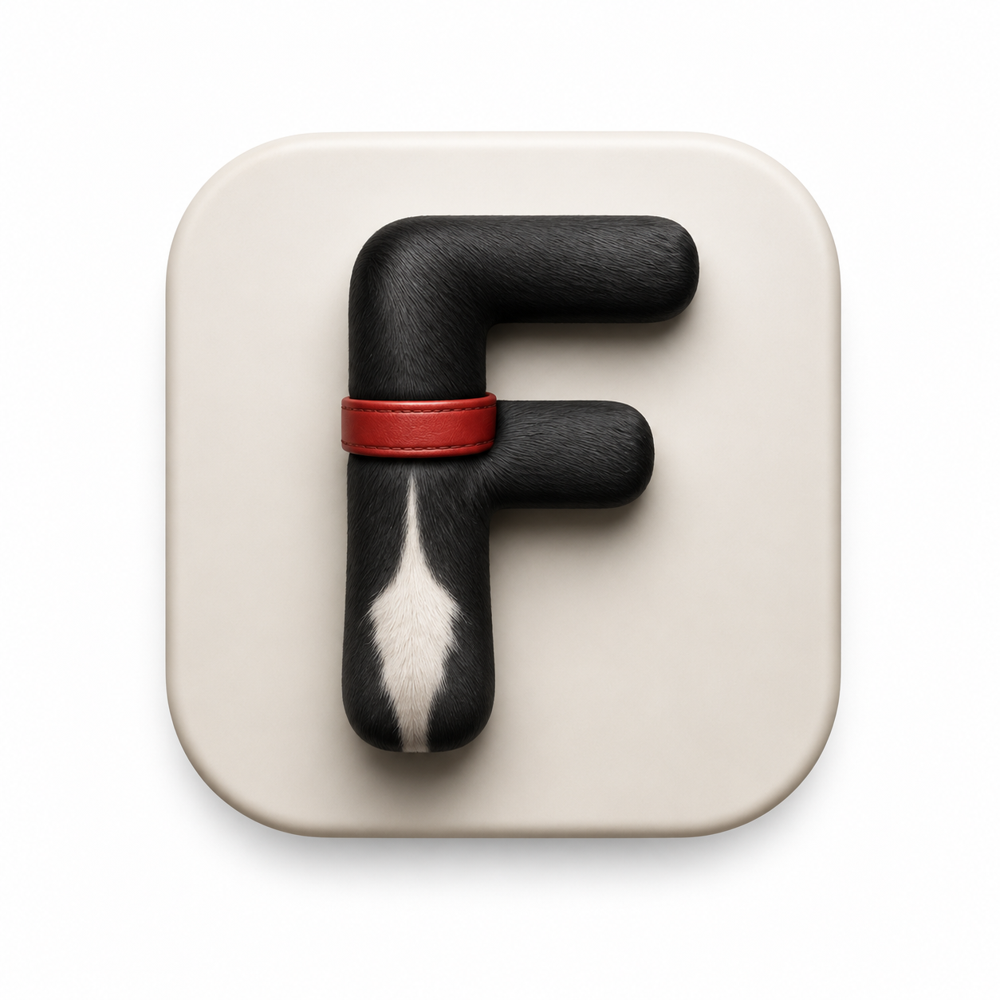

<p align="center">
  
</p>

<h1 align="center">figaro</h1>

<p align="center">
  A local-first Markdown workspace for notes, tasks, diagrams, and beautiful printable documents.
</p>

<p align="center">
  Your knowledge stays in ordinary files, in a folder you control. No account, cloud service, or proprietary database required.
</p>

> **Figaro** is a desktop personal knowledge manager designed to make a plain-folder vault feel focused, capable, and pleasant to use.

## Why figaro?

figaro combines the durability of plain Markdown with a desktop workspace that helps you write, navigate, plan, and publish without putting your notes behind a service.

- **Own your data.** Notes, images, source files, editable diagrams, settings, and history live in your local vault.
- **Write without leaving the flow.** Markdown is rendered live, while the active line remains ordinary source text for precise editing.
- **Turn notes into action.** Hashtags become a drag-and-drop Kanban board; date links feed a calendar; links produce backlinks.
- **Ship polished documents.** Frontmatter can add a cover page, table of contents, and a note-specific print stylesheet before an interactive PDF export that preserves links and references.

## Highlights

| Write | Organize | Visualize and share |
| --- | --- | --- |
| Live Markdown preview with tables, task lists, callouts, footnotes, math, images, and internal links | Vault file tree, tabs, global search, backlinks, date-aware calendar, and persistent sessions | Mermaid, Vega, Vega-Lite, editable Draw.io SVGs, and interactive PDF export |
| CodeMirror-powered editing for Markdown and supported source files such as CSS, JavaScript, JSON, Go, Python, Rust, SQL, YAML, and more | Quick notes in a real Inbox, hashtag-driven Kanban, and local Git history with automatic or explicit commits | Cover pages, depth-limited tables of contents, and vault-local print stylesheets |
| Optional Vim mode, language-aware syntax highlighting, folding, completion, and theme-aware indent guides | Drag-reorderable and pinnable tabs, recent notes, and a Welcome workspace when no editor tab remains | Seventeen built-in themes, including Figaro Light and Figaro Dark, plus separate prose/code font pickers, font size and reading-width controls |

## A workspace built around plain files

Every vault is an ordinary directory. Markdown remains Markdown, images remain image files, code remains code, and Draw.io diagrams are saved as editable `.drawio.svg` files. figaro stores vault-specific settings and workspace state in `.config/` inside the vault, rather than converting your notes into a database. Device-specific window state and the selected PDF-browser executable are kept separately in the operating system's per-user local application-data directory, so syncing or moving a vault cannot carry one computer's window geometry or installed-software paths to another.

Paste a screenshot or other raster image from the clipboard directly into an open Markdown note. Figaro saves it beside the note as `image1.png`, `image2.png`, and so on, inserts portable Markdown such as ``, and renders it immediately. Existing files are never overwritten, and the same action is available through Ctrl/Cmd+V or the editor context menu.

The file tree supports internal Copy/Paste for files and complete folders through its context menu or Ctrl/Cmd+C and Ctrl/Cmd+V while the tree is focused. Paste saves dirty source tabs first, and repeated or same-folder pastes never overwrite content: Figaro creates `Folder copy`, `Folder copy 2`, or `note copy.md`. Links inside copied Markdown are adjusted so internal links follow copied counterparts and links leaving the copied tree still reach their original vault targets; incoming links elsewhere continue to point at the source. A folder cannot be pasted into itself or one of its descendants, and the refusal dialog directs you to select its parent for a sibling copy. When an internal move or native filesystem drop meets an existing same-named directory, Figaro asks whether to merge the contents instead of replacing anything. A confirmed merge keeps both trees and names file collisions `note (copy).md`, `note (copy 2).md`, and so on; cancelling leaves both directories untouched. Renaming uses a contextual dialog that shows the current folder, selects only a file's editable stem, validates the name in place, and explains that affected links are updated automatically.

Right-click an editable file or folder and choose **Customize appearance…** to assign a searchable Lucide icon and one of the Kanban accent colors. The picker keeps the ten most recently used icons close at hand and includes **Reset** to restore Figaro's defaults. Appearance is stored with the vault and follows rename, move, copy, merge, and delete operations. The active file has the strongest tree marker; other open files retain a quieter marker. The top-level `Inbox` uses a Mail icon until you customize it.

The default vault is `./vault`. Point figaro at another location with the `VAULT_PATH` environment variable:

~~~bash
VAULT_PATH="$HOME/Documents/notes" make dev
~~~

On first launch, an empty vault receives a welcome note with examples and a short getting-started guide.

### Desktop window state

figaro remembers the window's last normal width and height and whether it was maximized. It deliberately does not remember screen coordinates: every launch is centered by the native Wails window backend, avoiding an unreachable frameless window after a monitor is disconnected or its layout changes. Minimized, fullscreen, and incomplete transition states are never restored; closing while minimized retains the last meaningful normal or maximized state.

The custom frameless window uses a quiet one-pixel outline around all four edges, with a slightly stronger top highlight. The outline follows the rounded application corners and adapts to the active theme without interfering with native edge resizing.

The default normal size is `1280 × 800`, and restored dimensions are clamped to the application's `800 × 500` minimum. A missing, malformed, unsupported, zero/negative, or implausibly large state record falls back to the safe default. Window state is stored outside the vault at:

- Linux: `$XDG_CONFIG_HOME/figaro/window-state.json`, or `$HOME/.config/figaro/window-state.json` when `XDG_CONFIG_HOME` is unset.
- macOS: `$HOME/Library/Application Support/figaro/window-state.json`.
- Windows: `%LocalAppData%\figaro\window-state.json`.

If the platform cannot provide or write its local application-data directory, figaro remains usable with the safe defaults but cannot persist the changes for the next launch.

### Machine-local browser selection

PDF export normally discovers an installed Chrome/Chromium-family browser automatically. If needed, choose a specific executable under **Settings → PDF Export → Browser engine**. figaro verifies the choice by starting its real headless PDF engine with an isolated temporary profile; a matching filename or version response alone is not accepted. If a configured browser is later moved, removed, or cannot start, export falls back to automatic discovery.

The selected executable is device-specific and is stored outside the vault in `machine-settings.json`: beside `window-state.json` under `$XDG_CONFIG_HOME/figaro` (or `$HOME/.config/figaro`) on Linux, `$HOME/Library/Application Support/figaro` on macOS, and `%LocalAppData%\figaro` on Windows. Existing vault-scoped browser selections are migrated once; an existing machine-local choice takes precedence.

### Search, planning, and history

**Quick note** creates an empty, collision-safe timestamped Markdown file in a real `Inbox` folder, opens it, and places focus in the editor. The action sits above the file tree and remains available as an icon in the collapsed sidebar rail, making it suitable for an ad-hoc thought without first choosing a title or location.

The sidebar search finds both note names and Markdown body text. It supports title-only, recent-notes, and case-sensitive filters, plus keyboard navigation. Use Ctrl/Cmd+F for fast in-document find, including case-sensitive, whole-word, and regular-expression matching. Search, backlinks, Kanban, and Calendar share an in-memory vault index, so normal saves and single-file external edits replace only that note's source and planning contributions instead of rebuilding unrelated vault data. Unsaved Kanban changes update directly from the editor buffer, and collapsed folders defer building their descendants until you open them. Calendar and Kanban stay in a fixed footer below the file tree: Calendar expands inside the sidebar, while Kanban opens or returns to its single workspace tab. Clicking an already active Kanban button closes that view with a short exit transition. When the sidebar is collapsed those controls and Quick note remain available in a narrow tool rail. Settings is the gear beside the window controls and follows the same animated open, focus, and close behavior. The Calendar highlights daily notes named `YYYY-MM-DD.md` and notes that link to them; date links open a workspace results tab. The Home tab keeps the last eight opened notes and up to six unfinished Kanban cards close at hand.

**Auto-Save** writes the active dirty file on the interval you choose. **Auto-Commit** defaults to one hour and can instead run **On Save** or be turned off. The status bar shows **Git clean** or a highlighted **Uncommitted** state for the active file; clicking **Uncommitted** safely saves pending editor text and commits only that file without disturbing unrelated staged changes. The adjacent **Changes** count opens file history. Selecting an older revision shows it read-only, and **Revert to this version** first preserves the current content in Git history before restoring the selected revision.

## Markdown, diagrams, and PDFs

### Markdown and code

figaro has a source-first live preview: move onto a line to edit its Markdown exactly as written; move away to read the rendered result. It supports headings, emphasis, strikethrough, highlights, task checkboxes, links, callouts, tables, images, KaTeX math, footnotes, blockquotes, and fenced code blocks. Large notes remain responsive because normal cursor movement preserves unaffected preview decorations and interactive widgets are limited to the visible editor region. The optional editor gutter is controlled by **Settings → Show line numbers** and is off by default. Standalone CSS hex colors display a theme-aware swatch and native picker; valid hex-shaped tokens take precedence over hashtags while the source and PDF text remain unchanged. Markdown tables use `codemirror-markdown-tables` for interactive cell editing, formatting, Arrow-key movement, Tab/Shift+Tab navigation, and row/column controls. Their alignment and structure are preserved in the live PDF preview and generated PDF.

Under **Settings → Links style**, choose Markdown links such as `[Welcome](Welcome.md)` (the default) or conventional target-first Wikilinks such as `[[Welcome.md|Welcome]]`. Note autocomplete follows that preference. Changing it always asks whether to rewrite links, keep existing syntax, or cancel; a rewrite touches only links that resolve to existing Markdown files in the vault, reloads affected open notes, and leaves external URLs, email addresses, images, code, and unresolved links unchanged.

#### Tables

Type `|` on an empty line and choose a 2×2, 3×3, or 4×4 table. Existing GFM
pipe tables become interactive automatically when opened. To convert existing
CSV, TSV, or consistently pipe-delimited text, select it, right-click, and
choose **Convert selection to table…**; Figaro previews the detected delimiter,
dimensions, header choice, and resulting Markdown before replacing anything.

Normal paste also recognizes clear tabular clipboard data. Content copied from
a spreadsheet or HTML table, tab-separated rows, pipe-delimited rows, and
unambiguous CSV is inserted directly as a Markdown table through Ctrl/Cmd+V or
the existing **Paste** context-menu action. There is no separate paste mode;
ordinary prose and inconsistent rows remain ordinary text, while existing GFM
tables keep their separator and alignment with safe surrounding boundaries.

Click a cell to edit it. Arrow keys move within the table, Tab and Shift+Tab
move between cells, Enter moves down a column and adds a row at the bottom, and
Shift+Enter creates a line break inside a cell. Click or drag the row, column,
and table-edge handles to sort, align, add, move, duplicate, clear, delete, or
resize table content.

Files recognised by CodeMirror's language registry open in the same editor as proper code files, with syntax highlighting, folding, completions, Vim support, and indentation guides. Unsupported or binary files stay safely non-editable in the file tree.

### Diagrams

Use fenced blocks for live Mermaid, Vega, and Vega-Lite output:

~~~~markdown
~~~mermaid
flowchart TD
  Idea --> Draft --> Publish
~~~

~~~vega-lite
{
  "data": { "values": [{ "month": "Jul", "notes": 12 }] },
  "mark": "bar",
  "encoding": {
    "x": { "field": "month", "type": "nominal" },
    "y": { "field": "notes", "type": "quantitative" }
  }
}
~~~
~~~~

Create a Draw.io diagram from the File Tree context menu. figaro opens diagrams.net for editing and saves a self-contained `.drawio.svg` file. Once saved, that SVG continues to render normally in notes even when you are offline; only opening the Draw.io editor needs a connection to diagrams.net.

### Properties and interactive PDF export

Leading YAML frontmatter is presented as a compact Properties card. It can control document metadata and the printable layout without changing your Markdown body:

~~~yaml
---
title: "Quarterly review"
subtitle: "What changed and what comes next"
author: "Ada Lovelace"
date: 2026-07-12
cover-page: true
toc-depth: 2
# Optional: choose Create starter in PDF layout first.
print-stylesheet: "pdf.css"
---
~~~

- `cover-page: true` creates one title page.
- `toc-depth` accepts `0` through `6`; `0` disables the table of contents.
- `print-stylesheet` selects a vault-local CSS file relative to the note and takes precedence over a sibling `_print.css`.
- Footnotes such as `[^source]` print as numbered links to a final Footnotes section, with links back to each reference.
- Mermaid, Vega, and Vega-Lite blocks are rendered to inline SVG for the printed document.

PDF exports use a polished built-in style by default. To customize one, choose **Create starter** in the Properties panel's **PDF layout** section. Figaro proposes a note-local `pdf.css`, copies its comprehensive editable example only after you confirm, selects it for the note, and opens it. It never creates stylesheets during startup or export, and it never overwrites an existing CSS file. See [PDF styling](docs/PDF_STYLING.md) for the stable selectors, page-layout guidance, and the distinction between document headings and unsupported repeated page headers/footers.

Choose **Preview PDF** from a Markdown file's context menu, editor context menu, or the Properties panel. Figaro opens a live, isolated preview in the right pane and refreshes it shortly after Markdown or the selected CSS stylesheet changes. The code icon in its toolbar opens **Figaro PDF style reference**, listing every class and ID in the current printable document alongside the generated body HTML, with a one-click copy action. Drag the splitter to make the preview pane wider: it can grow until the editor reaches a 320 px working width, while the paper remains centered and capped to its `@page size` instead of stretching with the pane. Named A3/A4/A5, B5, Letter, Legal, Ledger/Tabloid, and Executive sizes, portrait/landscape orientation, and explicit CSS lengths are reflected in the preview; A4 is the fallback. The editor's decorative side padding contracts when space is tight. Editor/preview line synchronization is paused during the drag and aligned once after release, preventing resize jitter while preserving synchronized reading position.

Choose **Generate PDF** in that pane when the result is ready. figaro then looks for an installed Chrome/Chromium-family browser, including Ungoogled Chromium and its Flatpak launcher, then Edge; on macOS it can use the system Safari/WebKit engine. Chromium candidates are accepted only after the same isolated headless DevTools startup used by a real export succeeds. It writes `<note>.pdf` beside the Markdown file (safely replacing the previous export) and opens it with your default viewer. The export deliberately aborts if no viable browser engine is found rather than creating a PDF with dead links, TOC entries, or footnote references.

An export of the active dirty note uses the current editor content without forcing a save first. A `print-stylesheet` must be a vault-local relative CSS path; it overrides a sibling `_print.css` for that note. Leave it blank or omit it to retain the built-in style.

## Getting started

### Prerequisites

- Go 1.25 or newer
- Node.js 20 or newer for JavaScript tooling and tests
- Wails v2 CLI
- The platform dependencies required by Wails. On Linux, Figaro uses GTK3 with WebKitGTK 4.1 when available (WebKitGTK 4.0 is also supported).
- A locally installed Chrome, Chromium (including Ungoogled Chromium and Flatpak installs), Brave, or Edge browser for interactive PDF export. macOS can fall back to its built-in Safari/WebKit engine.
- ImageMagick 6 or 7 for the generated application icons; `make dev` and package builds create them automatically when absent.

Install the Wails CLI version that matches this project's Go dependency:

~~~bash
go install github.com/wailsapp/wails/v2/cmd/wails@v2.12.0
~~~

On Linux, run `make doctor` before your first build. It checks the actual
`pkg-config` libraries and prints a package-manager-specific command if
anything is missing. For example, Fedora needs
`gcc pkgconf-pkg-config gtk3-devel webkit2gtk4.1-devel ImageMagick`; current
Debian/Ubuntu uses `build-essential pkg-config libgtk-3-dev
libwebkit2gtk-4.1-dev imagemagick` (or `libwebkit2gtk-4.0-dev` on older
releases).

### Run in development

~~~bash
git clone https://github.com/grilo/figaro.git
cd figaro

make bootstrap
make dev
~~~

For browser DevTools alongside the Wails app:

~~~bash
./scripts/debug.sh
~~~

The development file server is then available at `http://localhost:34115`.
The script also enables the loopback-only WebKit inspector for that development
session. Normal launches leave it disabled; to opt in manually, run
`FIGARO_WEBKIT_INSPECTOR=1 make dev`.

### Build a desktop binary

~~~bash
make linux
make windows
make darwin
make icons          # regenerate all icon variants from figaro.appicon.png
~~~

### Publish a GitHub release

After the release commit is on `main`, push a stable semantic-version tag:

~~~bash
git tag -a v1.0.0 -m "Figaro v1.0.0"
git push origin v1.0.0
~~~

The `v1.0.0` release tag must match the versions in `package.json`,
`package-lock.json`, and `wails.json`; the workflow refuses inconsistent
metadata or a tag that is not on `main`. The tag-triggered release workflow
verifies the complete test suite, builds a
Linux amd64 archive, a Windows amd64 archive, and one universal Intel/Apple
Silicon macOS archive, then publishes them with `SHA256SUMS` and generated
release notes. Each archive includes the README, changelog, and GPL license.
Release builds are currently unsigned, so Windows SmartScreen
or macOS Gatekeeper may ask the user to confirm the first launch.

The Makefile prepares a clean checkout itself: it downloads Go modules, runs
`npm ci` when the locked frontend dependencies are absent or changed, and
regenerates vendored browser assets when their inputs or outputs require it.
It also generates missing icon variants and prints actionable native-package
hints through `make doctor`. It automatically selects Wails' WebKitGTK 4.1
support on distributions such as current Fedora; WebKitGTK 4.0 is also
supported. The current Windows target uses Wails' pure-Go WebView2 path, so it
cross-builds from Linux without MinGW-w64. Wails v2 builds Linux only on Linux
and macOS only on macOS; `make all` selects the targets supported by the
current host. `./scripts/build-fedora.sh` is a convenience wrapper around
`make linux`.

For contributor setup, verification commands, and the platform build notes in one place, see [CONTRIBUTING.md](CONTRIBUTING.md).

## Test the project

The test suite covers the Go vault backend, CodeMirror behaviour, tab/session state, diagram rendering, and the printable-document pipeline.

~~~bash
# Prepare ignored browser assets before testing a fresh checkout.
make bootstrap

# Go backend
go vet . ./internal/... ./cmd/...
go test . ./internal/... ./cmd/...
go test -race . ./internal/... ./cmd/...

# JavaScript unit and integration tests
npm run lint
npm run test:unit

# Real-browser PDF/diagram integration test
npx playwright install chromium    # first time only
npm run test:pdf
~~~

The PDF tests verify the full application-controlled contract: frontmatter, cover/TOC structure, CSS selection, inline Mermaid/Vega SVG, browser-discovery order, and actual PDF link/destination annotations.

## Architecture

`figaro` is deliberately small and direct:

- **Go + Wails v2** provides the desktop shell, vault-safe filesystem operations, configurable local Git auto-commit history, settings, and browser-backed interactive PDF export. Reusable backend modules live under `internal/`; the Wails bootstrap remains at the repository root by convention.
- **Vanilla JavaScript + CodeMirror 6** provides the editor, live Markdown experience, workspace UI, and on-demand language support.
- **Browser dependencies** keep the editor, Markdown renderer, KaTeX, Mermaid, Vega, Vega-Lite, Vim mode, and language grammars available without a runtime package install. The Makefile recreates generated modules before desktop builds (or on demand with `make vendor`); KaTeX ships only its production JavaScript, CSS, and font assets. Python and Rust grammar support does not add a Python or Rust runtime to Figaro.
- **The vault** is the source of truth. Configuration lives under `.config/`; content remains portable files.

For the complete behaviour contract and implementation notes, see [the product specification](docs/PROMPT.md). Non-obvious implementation decisions are collected in [the architecture notes](ARCHITECTURE.md), and the test layout and commands are documented in [the testing guide](docs/TESTING.md).

## Repository layout

```
cmd/devserver/       Small static server used by browser-level tests and debugging
docs/                Product notes and contributor-facing testing guidance
internal/vault/      Root-scoped vault filesystem primitives
internal/links/      Pure Markdown link rewriting used by file moves
internal/history/    Local Git history and auto-commit service
frontend/            Wails webview, CodeMirror modules, themes, fonts, and vendored assets
scripts/             Optional build, debug, and vendor-maintenance helpers
assets/branding/     Generated square icon master used by application packages
tests/frontend/      Jest unit, UI-integration, and stale-response tests
tests/e2e/           Playwright browser tests
main.go              Wails entry point and embedded frontend assets
*.go / *_test.go     Wails-facing backend facade and co-located integration tests
```

Local vault data, generated binaries, test reports, and machine-specific helper
scripts are ignored for new work. Keep personal notes and build outputs outside
commits when contributing.

## Current limitations

- figaro is a desktop, single-vault application; it does not provide cloud sync, encryption, mobile clients, or a plugin system yet.
- The Draw.io editor is intentionally lightweight and uses the hosted diagrams.net editor. Saved SVG output remains local and offline-readable.
- PDF output uses a browser already installed on the machine. If none can be found, figaro explains how to install Chrome or Chromium instead of generating a degraded PDF.

## Contributing

Issues and pull requests are welcome. Please read [CONTRIBUTING.md](CONTRIBUTING.md) for development setup, supported build targets, verification commands, and repository conventions.

## License

Figaro is free software distributed under the [GNU General Public License
version 3 or later](LICENSE). You may use, study, share, and modify it under
those terms. Distributed builds include the license and changelog; dependency
licenses remain with their corresponding vendored assets.
