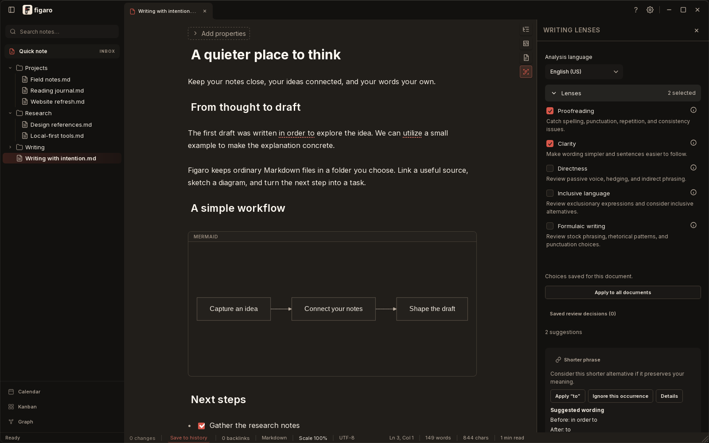
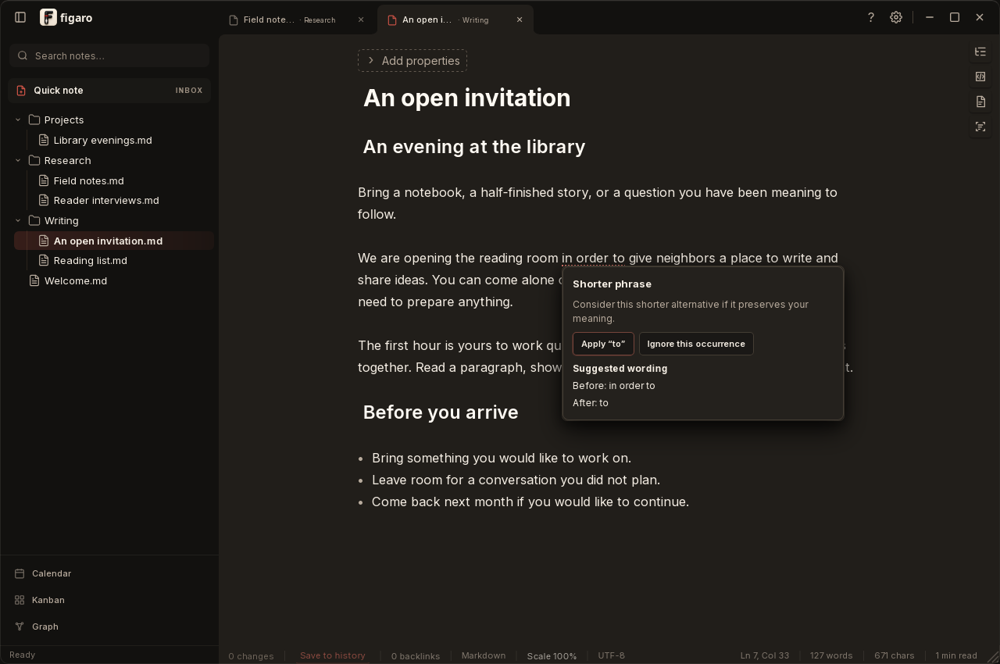
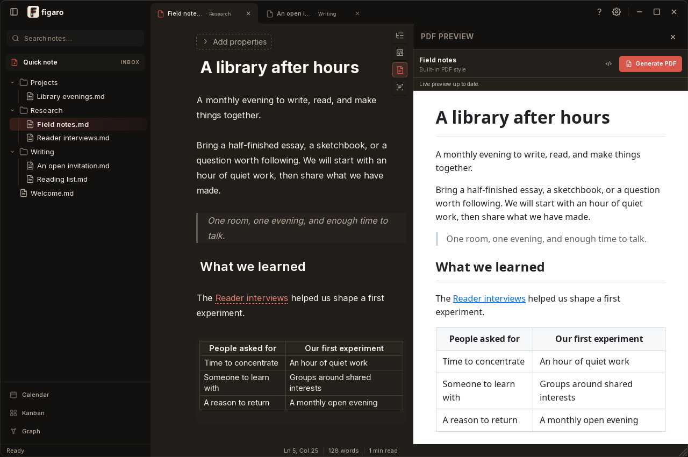

  

<h1 align="center">Figaro</h1>

<strong>From your first note to a finished document.</strong>

  Write in Markdown, connect your ideas, organize your work, and export polished PDFs.
  Your files stay on your computer.

  <a href="https://github.com/grilo/figaro/releases/latest"><strong>Download for Linux, Windows, or macOS</strong></a>
  · <a href="docs/README.md">User guides</a>
  · <a href="CHANGELOG.md">What's new</a>

Figaro is a free desktop workspace for people who write, research, and plan in
Markdown. Keep a reading journal, develop an essay, or work through a project
with its notes and tasks together. Start with a few files and add structure as
you need it. You don't need an account.

## A workspace you can make your own

- **Keep control of your notes.** Your writing, images, and diagrams live in
  ordinary files. Open them in another editor, back up the folder, or keep it
  under version control.
- **Find room to write.** Markdown renders around the line you are editing.
  Collapse the sidebar for Pure mode, with optional typewriter scrolling and
  paragraph focus.
- **Revise with local feedback.** Choose writing lenses for spelling, clarity,
  directness, inclusive language, or formulaic phrasing. Review suggestions
  beside your words and decide what to keep.
- **Connect ideas to action.** Link related notes, follow backlinks, and turn
  tasks in your notes into a Kanban board or calendar plan.
- **Finish something worth sharing.** Add tables, diagrams, charts, or math,
  then export a PDF with your choice of page styling.

## Capture an idea and follow it

Use **Quick note** to catch a thought before it disappears. Link it to an
existing note as you write, or create a new one from the link completion menu.
Search helps you return to a phrase, a topic, or a half-remembered title.
Backlinks show which notes mention the current one. The graph gives you
another way to explore those connections.

Keep several notes open in tabs, and middle-click a tab to close it. Figaro asks
before discarding unsaved changes.

When a note becomes a project, its tasks can stay beside the thinking that
produced them. Add a hashtag such as `#todo` to put a task on the board. Use
Calendar for dates or Gantt for a longer schedule. Open a card to return to its
source note.

Return to a project note and see when its passages changed. Enable **Activity
dates** in **Settings → Editor → Navigation**, then click a margin date such as
**7 Sep 26** to review the recorded changes. Dates and block controls stay clear
of the text when you switch line numbers or block guides on or off. Adding a new
meeting at the top preserves the older text's dates. New writing shows today's
date immediately while waiting for history to record it. Use explicit date links
for the meeting's scheduled day. Activity works for notes inside folders too,
and follows renames and moves made in Figaro on every supported platform.

[Explore notes and planning →](docs/NOTES_AND_PLANNING.md)

## Refine a draft in your own voice

Writing lenses underline words and phrases for review. Hover a suggestion to
see its explanation and, where available, a replacement you can apply in
place. Choose any combination of **Proofreading**, **Clarity**,
**Directness**, **Inclusive language**, and **Formulaic writing** for each
document.

Checks run locally in the background. Vale is built into Figaro and reuses its
rules in memory, without extracting or launching a separate executable. Your restored note is available while
writing lenses and vault indexing get ready, with Auto-Save and close protection
already active. Saves write your text to disk first; Git history and index
updates follow. You can ignore a suggestion, add a word
to your dictionary, or return to a saved review decision later. Your choices
survive restarts. Repeated suggestions share a card, and suitable replacements
offer an action to apply the same change throughout the document.

The advice is optional. Grammar checks cover selected issues, and readability
hints need judgment. Formulaic writing cannot tell you who wrote a text.
English US and UK support spelling and prose checks; Spanish supports spelling only.

[Learn about writing and lenses →](docs/WRITING.md)

If a launch is slow, **Settings → Vault care → Open startup logs** opens local
timings for troubleshooting. If the controls do not respond, the
[startup troubleshooting guide](docs/GETTING_STARTED.md#troubleshoot-a-slow-launch)
also lists the log folders you can open directly.

## Turn a draft into a document

Build a table, sketch a Mermaid diagram, or turn a table into a chart without
leaving your note. Figaro renders these alongside your writing and carries them
into PDF output.

Preview the document while you edit. Add a cover, a table of contents, page
numbers, and a local stylesheet when you need more control. Generate the PDF
beside the source note, ready to share while the editable original stays yours.

[Explore diagrams and export →](docs/DIAGRAMS_AND_EXPORT.md)

## Download and get started

Get the latest build from [GitHub Releases](https://github.com/grilo/figaro/releases/latest).
Figaro is free software under the GNU General Public License (GPL) version 3 or later.

| Platform | Download |
| --- | --- |
| Linux | x86-64 `.tar.gz` |
| Windows | x86-64 `.zip` |
| macOS | Universal Intel and Apple Silicon `.zip` |

1. Download and extract the archive for your platform.
2. Start Figaro. It uses a folder called `vault` in its working directory by default.
3. Open the welcome note or choose **Quick note** to start writing.

To use another notes folder, set `VAULT_PATH` before launching. The
[setup guide](docs/GETTING_STARTED.md) includes examples and explains how to
import existing notes.

Builds are unsigned; Windows or macOS may ask you to confirm the
first launch. Linux needs GTK 3 and WebKitGTK 4.1 or 4.0. PDF generation needs
Chrome, Chromium, Brave, or Edge; macOS can also use its built-in WebKit engine.

## Your files and privacy

Editing, search, planning, local history, and writing review run on your
computer. Figaro does not require an account, analytics service, or proprietary
storage format. Optional Draw.io editing opens the hosted diagrams.net editor;
the saved diagram stays in your notes folder.

Figaro works with one vault at a time. It has no built-in cloud sync,
encryption, mobile app, or plugin system. Local history helps recover changes
and deleted notes; keep a separate backup of your folder as well.

## Learn more or contribute

The [user guides](docs/README.md) cover setup, writing, planning, diagrams, and
export. For deeper reference, see the [product specification](docs/PROMPT.md)
and [PDF styling guide](docs/PDF_STYLING.md).

Found a problem or have an idea? [Open an issue](https://github.com/grilo/figaro/issues).
Code contributions are welcome; the [contributor guide](CONTRIBUTING.md) covers
development and testing. See [LICENSE](LICENSE) for the GPL terms and
[third-party notices](THIRD_PARTY_NOTICES.md) for dependency and theme credits.
