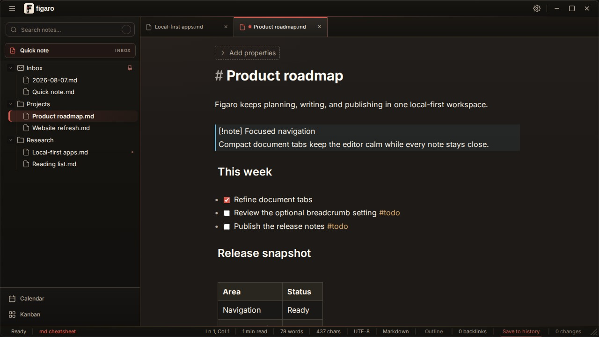

<p align="center">
  
</p>

<h1 align="center">Figaro</h1>

<p align="center">
  A local-first Markdown workspace for notes, planning, diagrams, and printable documents.
</p>

<p align="center">
  <a href="https://github.com/grilo/figaro/releases/latest">Download</a>
  ·
  <a href="CHANGELOG.md">Changelog</a>
  ·
  <a href="docs/PROMPT.md">Documentation</a>
  ·
  <a href="CONTRIBUTING.md">Contributing</a>
</p>



Figaro is a desktop knowledge workspace built around ordinary files. It combines
a source-first Markdown editor with search, backlinks, daily notes, Kanban,
calendar planning, diagrams, local history, and browser-quality PDF export.
There is no account, hosted database, or required cloud service.

## Features

- **Plain-file vaults.** Notes, images, code, stylesheets, and editable
  `.drawio.svg` diagrams remain normal files in a directory you control.
- **Source-first Markdown editing.** The active line stays editable Markdown
  while surrounding content renders headings, tables, tasks, callouts,
  footnotes, math, images, links, and fenced code. Editor-sized gutter guides
  fold headings, fenced code, and tables without changing the saved source;
  each guide stays aligned to its block and under the pointer while toggling.
  Rendered fences and tables contract to one native fold row, typed fences use
  their language name, and interactive tables have a one-click undoable delete.
- **Fast navigation.** Use compact drag-reorderable document tabs, optional
  path breadcrumbs, full-width editor-sized sticky heading hierarchies that
  add each active ancestor as its source row reaches the visible stack,
  full-vault search,
  backlinks, unlinked mentions, a top-right document-outline launcher that
  stays beneath the sticky hierarchy, recent notes, pins, and file-tree
  customization. Long tabs preserve their differentiating filename ending and
  show their parent path; repeated arrow presses continue through the tab list.
  Search results expose their selected option to assistive technology and put
  a tail-preserving parent path on its own readable line so even deeply nested
  repeated filenames remain distinguishable. The active document leads the
  browser and native window title, and custom context menus support Shift+F10,
  arrows, Home/End, and Escape. Tab enters one current file-tree row; standard
  tree arrows then traverse, expand, collapse, and return to parent folders.
  Tab dragging remains selection-free even when the pointer crosses the file
  tree or another workspace region.
- **Capture and planning.** Quick notes and daily notes live in a real `Inbox`;
  hashtags form a Kanban board, and portable due-date links feed the Today
  dashboard and calendar.
- **Diagrams and data graphics.** Render Mermaid, Vega, and Vega-Lite blocks,
  or edit Draw.io diagrams while keeping the saved SVG readable outside Figaro.
- **Source and publishing tools.** Preview the exact raw Markdown or paginated
  output, preserve fenced-code syntax colors, add cover pages and tables of
  contents, apply vault-local print CSS, and generate linked PDFs.
- **Local history.** Optional per-file Auto-Commit, explicit history saves,
  comparisons, and restoration keep unrelated vault changes separate.
- **Configurable workspace.** Choose from seventeen themes, prose and code
  fonts, Vim editing, line numbers, sticky headings, block guides, document
  outline, diagnostics, and fully local spellcheck dictionaries.

## Download

Download the latest build from
[GitHub Releases](https://github.com/grilo/figaro/releases/latest).

| Platform | Package |
| --- | --- |
| Linux | x86-64 `.tar.gz` |
| Windows | x86-64 `.zip` |
| macOS | Universal Intel and Apple Silicon `.zip` |

Release archives include Figaro, the changelog, and the GPL license. Each
GitHub release page reproduces the curated Added, Changed, and Fixed sections
for that exact version from the Keep a Changelog source. Builds are currently
unsigned, so Windows SmartScreen or macOS Gatekeeper may ask you to confirm the
first launch.

Linux requires GTK 3 and WebKitGTK 4.1 or 4.0 at runtime. PDF generation uses an
installed Chrome, Chromium, Brave, or Edge browser. Linux discovery includes
supported commands under `/snap/bin`, and macOS can also use its built-in
WebKit engine.

## Getting started

1. Download and extract the archive for your platform.
2. Start Figaro.
3. Open or create notes in the vault shown in the file tree.

Figaro uses `./vault` by default. Set the `VAULT_PATH` environment variable
before launch to use another directory. An empty vault receives a welcome note
with examples and a short introduction.

The Today dashboard is shown whenever no file tab is open. From there you can
create `Inbox/YYYY-MM-DD.md`, capture a timestamped quick note, review due and
overdue tasks, reopen recent notes, and rediscover older material.

## Working with files

The vault is the source of truth. Markdown stays Markdown, images remain image
files, Markdown heading sections can be folded in the editor, and code files
open with language-aware syntax highlighting, folding, completion, and
indentation guides. Vault-specific settings and workspace state live in
`.config/` inside the vault.

Machine-specific settings, such as window geometry and a selected PDF browser,
are stored in the operating system's per-user application-data directory
instead of the vault.

Opening a Markdown file from outside the vault offers two safe choices:

- **Import** creates a collision-safe vault copy and opens it.
- **Keep outside vault** edits the original through a temporary file-tree
  shortcut without adding it to search, planning, history, or saved sessions.

Files and folders can also be copied or dropped into the tree. Figaro asks
before importing, preserves directory structure, and never silently overwrites
existing content. A long internal move is announced in the live status bar;
while it is running, Figaro ignores duplicate drag attempts instead of starting
the same move twice.

When a new or renamed Markdown note resembles another note in the same folder
after ignoring spacing, punctuation, and capitalization, Figaro offers to open
the existing note first. It never merges notes automatically. The on-demand
**Settings → Vault care** scan lists repeated filenames separately and only
shows them as informational; it only suggests cross-folder name variants when
their content also strongly overlaps.

The same guard applies when activating a missing conventional Markdown link.
Choosing **Use existing note** changes only its destination—for example,
`[Inner Source](Inner%20Source.md)` becomes
`[Inner Source](InnerSource.md)`—then opens the existing note. The visible label
stays intact, while **Create anyway** deliberately keeps the original target.
While authoring a link, autocomplete also offers **Create note** when there is
no exact target in the current folder; it creates the note there and inserts
the configured portable link syntax. A bare `[label]` stays ordinary text
unless the document contains a matching Markdown reference definition. A
same-document link such as `[Jump](#writing-and-planning)` moves directly to
that heading whether the link is currently rendered or showing raw source.

## Writing and planning

Markdown diagnostics identify structural problems without changing source.
Offline spellcheck is disabled by default; choose **Settings → Spellcheck →
Language** to select English (US), English (UK), Spanish (Spain), or **None**.
The setting separates the vault default from per-note frontmatter controls, and
spellcheck text never leaves the device.

Optional Vim editing keeps wrapped-row motion and Visual selections compatible
with rendered Markdown, and vertical motions stop at the exact first and last
document positions instead of wrapping on a backwards native geometry result.
Vim `p`/`P` use the operating-system clipboard while retaining the unnamed
register as a fallback, and ordinary yanks and deletes are available to other
desktop applications. Figaro leaves Windows keyboard-layout and dead-key
composition to WebView2 and CodeMirror in regular editing and Vim Insert mode.
It does not reinterpret Spanish physical key codes: the ordinary backtick key
inserts one character, while AltGr+4 remains available for native composition
with a following character such as `a` → `ã`. The desktop dependency is Wails
v2.14 with a pinned Windows-host fix that prevents AltGr input from being
reposted to the native window before WebView2 processes it.

Quick notes create collision-safe timestamped files in `Inbox`. The Today
action creates the dated note in the same folder and continues to open legacy
root daily notes. A top-level Inbox is pinned by default but can be unpinned or
restyled like any other folder.

Kanban cards are ordinary Markdown task lines. Hashtags define columns, and due
dates remain portable links:

```markdown
- [ ] Submit report #todo [due 2026-08-14](2026-08-14.md)
```

Typing a standalone hashtag suggests saved Kanban columns even at the end of
ordinary prose. On an unfinished checkbox task with no existing due date, an
exact tag also offers **Add due date…**, **Due today**, and **Due tomorrow**;
paragraphs, completed tasks, and already dated tasks remain tag-only.

The board is fully keyboard-operable. Tab advances through every card in
column order; Up/Down persists a card's vertical position, Left/Right moves it
to the adjacent column, Enter opens its note, D changes its due date, and
Delete removes that column tag. Pointer drag remains available.

The same dates appear in the Today dashboard and calendar. Figaro keeps
reminders inside the application and does not request operating-system
notification access. A Kanban column with a chosen color shows that color as a
small header swatch; an uncolored column keeps the neutral palette icon. At
normal window heights, the calendar keeps its monthly grid visible when large
vaults make the neighboring file tree scroll, and empty dates use compact,
muted guidance below the grid.

## Diagrams and PDFs

Mermaid, Vega, and Vega-Lite blocks render directly in notes and printable
documents. Draw.io editing uses the hosted diagrams.net editor, but the
resulting `.drawio.svg` file stays in the vault and remains readable offline.
Mermaid source is checked before parsing; oversized diagrams and unsafe YAML
ordered maps remain editable source instead of blocking the editor or PDF
renderer.

Raw Text Preview shows the exact Markdown source, including frontmatter, while
PDF Preview adds pagination, cover pages, a depth-limited table of contents,
footnotes, internal links, fenced-code syntax colors, and optional vault-local
CSS. Generated PDFs are written beside their source note.
See [PDF styling](docs/PDF_STYLING.md) for the supported print contract.

## Data and privacy

Figaro does not require an account, analytics service, or proprietary storage
format. Search, backlinks, planning, history, Markdown rendering, and
spellcheck run locally. The only hosted editing surface is the optional Draw.io
editor; saved diagram output remains local.

Local Git history is file-oriented. Auto-Commit records only a file that Figaro
successfully saved, and the **Save to history** action never sweeps unrelated
staged work into the note's history. Deleting from the file tree bypasses the
system Trash, but first saves affected open editors and records the file—or
every file in a folder—in local history. If that archive cannot be recorded,
Figaro leaves the item untouched. A failed document save keeps the buffer dirty
and announces its concrete cause in the status bar so the text can be recovered
or saved again.

## Current limitations

- Figaro is a desktop, single-vault application.
- It does not include cloud synchronization, encryption, mobile clients, or a
  plugin system.
- Draw.io editing requires access to the hosted diagrams.net editor.
- PDF generation requires a supported browser engine installed on the machine.

## Documentation

- [Product and behavior reference](docs/PROMPT.md)
- [PDF styling guide](docs/PDF_STYLING.md)
- [Live-preview and editor contract](docs/LIVEPREVIEW.md)
- [Architecture](ARCHITECTURE.md)
- [Testing strategy](docs/TESTING.md)
- [Changelog](CHANGELOG.md)

## Contributing

Issues and pull requests are welcome. Development setup, build targets, test
commands, release procedures, design-system rules, and repository conventions
are documented in [CONTRIBUTING.md](CONTRIBUTING.md).

## License

Figaro is free software distributed under the
[GNU General Public License version 3 or later](LICENSE). You may use, study,
share, and modify it under those terms.
