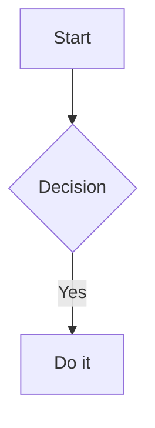

# figaro — Product & Behavior Specification

## Overview

This document is the product and behaviour contract for figaro. It describes the user-facing experience and the rules that preserve the local-first, file-portable model.

figaro is a desktop Markdown workspace with vault-based file management, a hashtag-driven Kanban board, a date-aware calendar, backlinks, session-persistent tabs, local Git history, sixteen themes, sixteen bundled fonts, optional Vim mode, KaTeX math, live diagrams, editable Draw.io SVGs, and interactive browser-backed PDF export. All content lives in a folder chosen by the user: no accounts, cloud service, sync engine, or proprietary note database.

Tech stack: Go backend (Wails v2, using WebKitGTK on Linux), vanilla JavaScript frontend (CodeMirror 6, codemirror-live-markdown, KaTeX, markdown-it, Mermaid, Vega, and Vega-Lite), with browser dependencies vendored in the frontend bundle.

---

## 1. UI Layout

### 1.1 Shell
- Three horizontal zones: **left sidebar**, **workspace**, and an on-demand **right sidebar**. Both sidebars have independent resize handles.
- **Top bar**: sidebar toggle and app title/Home control on the left; Calendar, Kanban, and Settings controls in the center; native-style minimize/maximize/close controls on the right.
- Calendar toggles the right sidebar. Kanban and Settings toggle their corresponding workspace tabs. Clicking the Figaro name opens the Welcome/Home tab.
- **Status bar** fixed at the bottom: left shows status text ("Ready") and "md cheatsheet" trigger; right shows cursor position, reading time estimate (words ÷ 200 wpm, minimum 1 min), word/line/char count, file encoding, markdown file type, and backlink count. Backlinks show as dimmed when 0 and accent-colored/underlined/clickable when >0.

### 1.2 Left Sidebar
- The top of the sidebar is the **global note search** field; its keyboard-navigable result list opens below the field.
- The remaining space is the **Vault** file tree. Markdown and files recognised by CodeMirror's language registry are clickable; unsupported/binary assets are greyed out at 55% opacity.
- The sidebar can be collapsed with the top-bar toggle and resized from **225px to 500px**. Expanded folders, selected file, recent files, and search filters are stored locally for the current webview profile.

### 1.3 Right Sidebar
- The right sidebar is closed by default and is shared by two views: **Calendar** and **History**. Opening one replaces the other.
- The Calendar control opens a monthly grid, month navigation, and notes linked to the selected date.
- Clicking a committed-history count in the status bar opens the History view for the active file.
- Its width can be resized from **240px to 480px** for the current session.

### 1.4 Workspace
- A horizontal **tab bar** across the top. Compact tabs use a responsive 104–200px width, truncate long titles, and keep their close controls accessible. The visual scrollbar is hidden; an all-tabs dropdown provides a reliable route to every open tab.
- Below it, **view containers** — only one is visible at a time:
  - **Editor view** — for Markdown and CodeMirror-supported code files. Shows file content immediately once loaded.
  - **Calendar results view** — for date searches and backlink listings.
  - **Kanban board view** — the full kanban board.
  - **Welcome view** — a lightweight home tab with Momentum (unfinished tasks) on the left and recent notes on the right.
  - **Settings view** — typography, editor, and automation preferences.
  - **Draw.io view** — the embedded diagrams.net editor for `.drawio.svg` files.

### 1.5 Theming
- **Theme engine**: 17 built-in themes selectable from the Settings tab (Figaro Dark, Figaro Light, GitHub Light/Dark, Catppuccin Mocha/Macchiato, Zenburn, Gruvbox Dark/Light, Nord, One Dark/Vivid, Night Owl, Cobalt2, Ayu Dark/Mirage/Light). All colors are defined as CSS custom properties on `:root`.
- Built-in theme CSS is bundled under `frontend/themes/`. The selected theme is persisted in `vault/.config/settings.json` and restored on startup.
- Switching themes applies instantly without page reload — the theme CSS is injected into `<style id="theme-style">` via the Go backend API.
- **Fonts**: 16 locally bundled choices, including Inter, Figtree, Atkinson Hyperlegible, IBM Plex Sans, Fira Sans, EB Garamond, Crimson Pro, JetBrains Mono, and Work Sans. Font selection is persisted and never requires a runtime network request.

### 1.6 CSS Custom Properties (Theme Variables)
Each theme defines these properties (with theme-specific colors):

| Category | Variables |
|----------|-----------|
| **Core colors** | `--bg-color`, `--sidebar-bg`, `--panel-bg`, `--text-color`, `--text-muted`, `--text-dim` |
| **Accent** | `--accent-color`, `--accent-hover` |
| **State backgrounds** | `--active-bg`, `--hover-bg` |
| **Borders** | `--border-color`, `--border-light` |
| **Semantic** | `--danger-color`, `--danger-hover`, `--success-color`, `--warning-color` |
| **Scrollbar** | `--scrollbar-track`, `--scrollbar-thumb`, `--scrollbar-thumb-hover` |
| **Selection/Focus** | `--selection-bg`, `--focus-ring` |
| **Shadows** | `--shadow-sm`, `--shadow-md`, `--shadow-lg` |
| **Typography** | `--font-sans`, `--font-mono`, `--font-size`, `--font-size-sm`, `--line-height` |
| **Cursor** | `--cursor-color`, `--cursor-bg`, `--cursor-text` |
| **Markdown syntax** | `--heading-color`, `--bold-color`, `--italic-color`, `--link-color`, `--link-hover-color`, `--url-color`, `--hashtag-color`, `--code-bg`, `--quote-color`, `--quote-border`, `--highlight-bg` |
| **Callouts** | `--callout-note-color`, `--callout-warning-color`, `--callout-info-color`, `--callout-tip-color`, `--callout-danger-color`, `--callout-example-color` |
| **Code highlighting** | `--code-keyword-color`, `--code-string-color`, `--code-number-color`, `--code-function-color`, `--code-comment-color`, `--code-type-color`, `--code-variable-color`, `--code-operator-color`, `--code-builtin-color` |
| **Layout** | `--sidebar-width`, `--top-bar-height`, `--status-bar-height`, `--tab-height` |
| **Transitions** | `--transition-fast`, `--transition-normal`, `--transition-slow` |

---

## 2. Tab System

### 2.1 Tab Types

| Type | ID pattern | Purpose |
|------|-----------|---------|
| **File** | `path/to/note.md` | Opens a Markdown or CodeMirror-supported source file for editing |
| **Draw.io** | `path/to/diagram.drawio.svg` | Opens an editable Draw.io SVG diagram |
| **Calendar** | `calendar-YYYY-MM-DD` | Shows Markdown notes that mention a specific date |
| **Backlinks** | `backlinks-path/to/note.md` | Shows notes that link to a given note |
| **Kanban** | `kanban` / `kanban-board` | The top-bar board and a hashtag-focused board respectively; each ID is deduplicated while open |
| **Welcome** | `home` | Workspace overview with Momentum and recent notes |
| **Settings** | `settings` | Application settings for theme, fonts, editor layout, and automation |

### 2.2 Tab Behavior
- **Deduplication**: Opening a resource that already has a tab simply switches to it.
- **Dirty indicator**: A pulsing dot appears on unsaved file tabs as soon as any edit is made.
- **Auto-save on switch**: When the user switches away from a dirty file tab, Figaro caches its current content and queues a save. The destination can open immediately; a failed save leaves the source tab recoverable from its cache.
- **Save conflict**: If a file's modification timestamp changed externally, Figaro asks whether to overwrite it with the local version. Cancelling preserves the dirty tab and its in-memory snapshot; Figaro never silently discards the local edit.
- **Cursor memory**: Each file tab remembers the last cursor/scroll position; restored when switching back.
- **Close button (✕)**: Every tab has a close button, always visible even when tabs are narrow. Closing a dirty file tab prompts for confirmation.
- **Middle-click**: Middle-clicking any tab closes it immediately.
- **Pin tab**: Right-click a tab and choose "Pin Tab" to pin it. Pinned tabs stay at the leftmost position and have a visual accent border on top. Pinning persists across restarts.
- **Drag reorder**: Tabs can be dragged to reorder them. Pinned and unpinned tabs remain separate groups so a drag cannot accidentally unpin or pin a tab. The resulting order persists with the session.
- **Safe empty state**: Closing the final editor tab opens the Welcome tab automatically instead of leaving the workspace blank.
- **Welcome close rule**: The Welcome tab's close control is disabled when it is the only tab. It becomes closable as soon as another tab is open.
- **Session persistence**: Open tabs, active tab, cursor positions, expanded directories, pinned tabs, and selected file are persisted to `vault/.config/session.json`. The webview also keeps UI-only preferences such as recent files, search filters, and a local tab snapshot in `localStorage`; the vault session is the portable workspace record.
- **Exit protection**: Closing the native window with dirty file tabs offers **Save & Exit**, **Exit without saving**, or cancellation.
- **Overflow**: Tabs keep their compact responsive width, with the visual scrollbar hidden and the all-tabs dropdown available whenever the strip is crowded.

### 2.3 Opening and Switching
- Opening a tab checks if it already exists; if so, it switches to it. A `forceNew` override allows creating a duplicate.
- File clicks from the sidebar or links open in the "main" file slot (replacing the current file tab rather than stacking).
- Switching tabs hides the previous view, shows the appropriate view for the new tab, and restores state (editor cursor, scroll position, etc.).

---

## 3. File Operations

### 3.1 Vault
- A single root folder (created on first run if missing).
- All file paths are normalized to forward slashes and validated to prevent escaping the vault root.
- **Dot-files hidden**: Files and directories starting with `.` (such as `.config/`) are excluded from the file tree UI and from kanban/calendar scans.
- **Configuration**: Application state that requires persistence (e.g., kanban column colors, theme selection, vim mode) is stored in `vault/.config/` as JSON files.
- A new empty vault receives a welcome note; existing vault contents are never replaced.

### 3.2 Supported Operations

| Operation | Behavior |
|-----------|----------|
| **Read file** | Returns file content and last-modified timestamp. |
| **Save file** | Writes content to disk. Accepts expected last-modified timestamp for conflict detection. Triggers kanban column rescan. |
| **Create file** | Creates a `.md` file with a `# Title` header. Triggers kanban column rescan. |
| **Create directory** | Creates a new folder. |
| **Delete** | Deletes a file or directory (recursive). Triggers kanban column rescan. |
| **Move** | Moves a file or folder to a target directory. Prevents moving a folder into itself, rewrites affected Markdown and wiki links across the vault, refreshes affected open tabs, and rolls the move back if its link rewrite cannot complete. |
| **Rename** | Moves the file to a new name within the same directory with the same link-rewrite and open-tab protections. |

### 3.3 File Tree (Sidebar)
- Displays folders before files, both sorted alphabetically.
- Folders expand/collapse on click; the icon toggles between open/closed states.
- Clicking a file opens it in the editor (replacing the current file tab).
- CodeMirror-supported source files (for example CSS, HTML, JavaScript/TypeScript, JSON, Go, Python, Rust, SQL, YAML, Dockerfiles, and maintained legacy modes) open in the same editor with their language parser loaded on demand.
- Editable Draw.io diagrams use the .drawio.svg suffix. They open in the Draw.io editor while remaining normal SVG assets when embedded in Markdown.
- **Ctrl/Cmd+Click** adds/removes a Markdown file to the multi-selection (highlighted with an accent-tinted background and outline).
- The currently open file is highlighted. The Vault tree automatically expands ancestor directories and highlights the active file when switching tabs or following links.

### 3.4 Multi-Select and Merge
- Multiple files can be selected with Ctrl/Cmd+Click.
- **Right-click** a Markdown file builds merge candidates from the context file, active note, and Ctrl/Cmd multi-selection. The option is disabled unless at least two candidates are available.
- **Merge behavior**: The active note is normally the master (destination); if the context-clicked note is not already among the active or selected notes, it becomes the master. The remaining candidates appear as source checkboxes. Checked sources are appended in that candidate order, with `---` between non-empty notes.
- A styled confirmation dialog shows the destination note, a checkbox list of source notes, and a warning about permanent deletion.
- After merging, source files are deleted (with a fade-out animation), open tabs for deleted files are closed, and the file tree refreshes.

### 3.5 Drag & Drop (File Tree)
- Any file or folder label can be dragged.
- Drop targets are folder labels or the empty area of the tree (which means vault root).
- Visual feedback: the dragged item fades, the drop target highlights.
- On drop, the item is moved and the tree refreshes. If any open tab referenced the moved path, its ID is updated.

### 3.6 Context Menu (Right-Click in File Tree)
| Menu item | Available on | Behavior |
|-----------|-------------|----------|
| Open in New Tab | Markdown or CodeMirror-supported source file | Opens file in a new tab (doesn't replace current file tab) |
| Merge Notes | File (2+ candidate notes) | Appends checked source notes to the active/context-selected master with an interactive checkbox list. Disabled when fewer than 2 candidates are available. |
| Preview PDF | Markdown file | Opens a live right-pane preview using the frontmatter-driven layout; **Generate PDF** runs the detected local browser engine export. |
| New Draw.io Diagram | File, folder, or vault root | Creates an editable .drawio.svg diagram in the selected location. |
| Reveal in File Explorer | File or Directory | Opens the containing folder with the native Linux, macOS, or Windows file manager |
| New Note | File or Directory | Prompts for name, creates `.md` file in that directory, opens it |
| New Folder | File or Directory | Prompts for name, creates folder |
| Delete | File or Directory (not root) | Confirms, then deletes. Closes any tabs that pointed to deleted paths |

- Context menus are clamped to the visible viewport so all actions remain reachable near the bottom or edge of the file tree.

---

## 4. Markdown Editor

### 4.1 Capabilities
- Syntax-highlighted markdown editing powered by CodeMirror 6 with `codemirror-live-markdown`.
- CodeMirror's official language registry is vendored locally. Recognised code files use their syntax parser, a monospace unwrapped layout, normal CodeMirror completion/folding behavior, theme-aware indentation guides, and no Markdown live-preview widgets. Tab / Shift+Tab and the guides share CodeMirror's same two-space indentation unit. Vim mode, tabs, cursor restoration, autosave, conflict handling, and history work the same way as for notes.
- **Frontmatter / Properties**: a complete leading YAML frontmatter block is rendered as a compact, collapsed Properties card. Activating it opens a structured Properties panel with PDF-layout controls: cover page, contents depth, and a vault-relative print stylesheet picker. Enabling a cover also exposes title, subtitle, author, and date fields. Other YAML remains visible as chips and **Add property** opens the source editor with completion; **Edit YAML** always exposes the original portable frontmatter. Notes without frontmatter get a subtle **+ Add properties** affordance above the editor; it inserts an editable YAML skeleton with the first H1 as `title`, the OS username as `author`, today's local date, an empty-string `subtitle`, and the PDF defaults `cover-page: false` and `toc-depth: 0`, then keeps that source open. Custom PDF CSS is opt-in: **Create starter** proposes `pdf.css` beside the active note, copies the bundled comprehensive example only after confirmation, selects it, refreshes the tree, and opens it. Existing CSS is never overwritten; startup and export never create stylesheets. The panel makes targeted scalar edits only, preserving unrelated YAML and comments. Completion in YAML suggests `title`, `subtitle`, `author`, `date`, `aliases`, `tags`, `description`, `created`, `updated`, `status`, `cover-page`, `toc-depth`, and `print-stylesheet`; it also offers status values and vault-relative CSS paths for `print-stylesheet`.
- **PDF preview and export**: **Preview PDF** opens an isolated live preview in the right pane. It uses the same printable document structure as the export, waits briefly after Markdown or selected CSS edits to avoid flicker, and refreshes external saved CSS when the file tree updates. Its **Generate PDF** action saves dirty preview buffers, then renders Markdown into an interactive PDF with a detected local browser engine. Figaro tries Chrome/Chromium-family engines before Edge, and uses Safari/WebKit on macOS if needed; it aborts with an installable-browser error if no viable engine is present instead of generating a PDF with dead links. Export writes `<note>.pdf` beside the Markdown file, safely replacing a previous export, and opens it in the default PDF viewer. A scalar frontmatter property, `print-stylesheet: path/to/print.css`, selects a vault-local CSS file relative to the note and takes precedence over a sibling `_print.css`; omitting it keeps the built-in style. `cover-page: true` generates a title page using `title`, `subtitle`/`description`, `author`, and `date`/`created`; `toc-depth: 0` disables the table of contents, while 1–6 includes headings through that Markdown level. Generated cover and table-of-contents sections automatically end with a page break. The print DOM has stable cover, table-of-contents, document-body, task, diagram, and footnote classes documented in `docs/PDF_STYLING.md`; body headings are separate from the cover and table-of-contents titles. Repeated running page headers and footers are not supported. Footnote references render as numbered internal links to a final Footnotes section, with return links for repeated references. Frontmatter itself is not printed.
- **Live preview**: Formatting markers (`#`, `**`, `*`, `~~`, backticks, link brackets/parens) are hidden on non-active lines while preserving layout width. Move the cursor to a line to reveal its raw markdown for editing. Bullet points render as styled bullets. Task checkboxes (`- [ ]` / `- [x]`) render as interactive HTML checkboxes that toggle on click. Links render as clickable widgets.
- **Printable diagrams**: Mermaid, Vega, and Vega-Lite fences are rendered to inline SVG before the print document reaches the native dialog. If a renderer is unavailable or a diagram is invalid, the source fence stays visible rather than being dropped.
- Line numbers, bracket matching, code folding, undo/redo history, autocompletion.
- Inline rendering of hashtags and markdown links with distinct styling.
- **Fenced code blocks**: triple-backtick blocks with optional language tag, rendered with monospace font, subtle background, syntax highlighting (via highlight.js classes themed with `--code-*-color` variables), copy button, and line numbers.
- **Blockquotes**: `>` lines rendered with a left `::before` pseudo-element border (4px `var(--quote-border)`) and italic styling.
- **Horizontal rules**: `---`, `***`, or `___` render as a full-width separator line via `Decoration.line` with active-line cursor reveal.
- **Strikethrough**: `~~text~~` renders with a line-through style.
- **Highlight**: `==text==` renders with a warm amber background highlight.
- **Footnotes**: `[^1]` references render as superscript accent-colored links.
- **Callouts**: `> [!note]`, `> [!warning]`, `> [!info]`, `> [!tip]`, `> [!danger]`, `> [!example]` blocks render with colored left borders and tinted backgrounds matching the callout type (via `--callout-*-color` variables).
- **Images**: `` renders inline images via `imageField`.
- **Tables**: Markdown tables render as styled widgets with editing support via `tableField` + `tableEditorPlugin`.
- **Math**: `$inline$` and `$$block$$` LaTeX math renders via KaTeX (StateField-based plugin).
- In-note search with match highlighting and navigation.
- **Auto-save**: the active dirty file tab is saved on the configured interval (5 seconds, 10 seconds, 30 seconds, 1 minute, 5 minutes, or Off), when switching away, and when choosing **Save & Exit**. It writes content only; Git commits are controlled separately by Auto-Commit.
- **PDF source**: exporting the active dirty Markdown tab uses its current editor content without requiring a save first. A file-tree export otherwise reads the version on disk.
- All CodeMirror 6 modules and `codemirror-live-markdown` are vendored locally.

### 4.2 Hashtags in the Editor
- Hashtags follow the rule: must start with a letter, can contain letters, digits, underscores, and hyphens. They must be preceded by a non-word, non-hash character and end at a word boundary.
- Styled distinctly (accent color, pointer cursor on hover, subtle background highlight on hover).
- **Clicking a hashtag** opens the kanban board scrolled to the column matching that tag, with a brief highlight animation.

### 4.3 Markdown Links
In **live preview** mode (cursor not on the link line), links render as styled widgets:
- `[` — hidden (inline formatting mark)
- `text` — visible, styled with dotted accent underline and pointer cursor
- `](url)` — hidden (inline formatting mark)

In **edit mode** (cursor on the link line or intersecting the link's range), raw markdown is revealed.

**Click behavior**:
- Clicking the **visible link text** navigates to the link target
- Date links (`YYYY-MM-DD.md`) open the calendar search tab
- Broken links prompt to create the missing note
- `http(s)://` links open in external browser

**Link autocomplete**: Typing `[` followed by text triggers a dropdown of matching `.md` files. Pressing Enter inserts `[filename](path)` and places the cursor after the closing `)`.

### 4.4 Empty-Link Autofill
- Typing `[link text]()` and pressing `)` automatically fills the URL with `(link text.md)`, using the current file's directory as the parent path.
- Spaces in the generated filename are encoded as `%20`.

### 4.5 Link Click Behavior
| Click | Tab exists? | Action |
|-------|------------|--------|
| **Left** | Yes | Switch to it |
| **Left** | No | Save the current dirty file if necessary, then replace its tab; if that save cannot complete, preserve it and open the destination in a new tab |
| **Middle** | Yes | Switch to it |
| **Middle** | No | Open in new tab alongside |

### 4.6 Date Shortcuts
Typing `@today`, `@tomorrow`, or `@yesterday` and pressing Space auto-replaces with `[YYYY-MM-DD](YYYY-MM-DD.md)`.

---

## 5. CodeMirror 6 Extensions

### 5.1 Core Extensions
`lineNumbers()`, `highlightActiveLineGutter()`, `history()`, `foldGutter()`, `bracketMatching()`, `autocompletion()`. `lineWrapping` and the live-preview extensions are installed only for Markdown; source-code files load a language support extension through a CodeMirror `Compartment`.

### 5.2 codemirror-live-markdown Extensions
| Extension | Purpose |
|-----------|---------|
| `livePreviewPlugin` | Hides formatting markers on non-active lines, shows rendered widgets |
| `markdownStylePlugin` | Applies markdown syntax styling classes |
| `editorTheme` | Base editor theme (overridden by custom CSS variables) |
| `linkPlugin()` | Renders `[text](url)` as clickable link widgets |
| `codeBlockField({ lineNumbers: true })` | Fenced code blocks with syntax highlighting, line numbers, copy button |
| `imageField({})` | Renders `` as inline images |
| `tableField` | Renders markdown tables as styled widgets |
| `tableEditorPlugin()` | Interactive table editing (source/widget toggle, add/delete rows/cols) |
| `collapseOnSelectionFacet` | Collapses live-preview widgets when cursor enters the line |
| `mouseSelectingField` | Tracks mouse-drag state so live preview doesn't collapse during selection |

### 5.3 Custom Extensions
| Extension | Type | Purpose |
|-----------|------|---------|
| `hashtagPlugin` | ViewPlugin | Detects `#tag` via regex, wraps in `cm-hashtag` class |
| `widgetPlugin` | ViewPlugin | Bullet list markers → Unicode glyphs; `[ ]`/`[x]` → interactive checkboxes |
| `extrasPlugin` | ViewPlugin | `==highlight==`, `[^footnote]`, HRs (`cm-hr-passive`/`cm-hr-active`), callouts |
| `wikilinkPlugin` | ViewPlugin | `@today`/`@tomorrow`/`@yesterday` auto-replace; empty link autofill |
| `hrPlugin` | ViewPlugin (extrasPlugin) | Horizontal rules with active-line toggle via `Decoration.line` |
| `mathField` | StateField | `$inline$` and `$$block$$` LaTeX rendering via KaTeX |
| `vimCompartment` | Compartment | Dynamic vim mode (on/off via `reconfigure`) |
| `@codemirror/search` | CodeMirror extension | Native in-document find panel, match navigation, and match decorations |

### 5.4 Custom EditorView.theme() Overrides
The custom `EditorView.theme()` block overrides the library's hardcoded colors with theme CSS variables for: cursor, headings, bold, italic, strikethrough, links (source + widgets), code, horizontal rules, quotes, highlights, footnotes, callouts (6 types), code block syntax highlighting (hljs classes), table widgets, codeblock widgets, formatting marks.

---

## 6. Kanban Board

### 6.1 Column System
- Three **system columns** always present and shown last: `todo`, `wip`, `done`.
- Custom columns discovered from `#tag` anywhere in vault files, sorted alphabetically.
- Columns are rescanned after every file save, create, delete, tag rename, and tag deletion.
- The kanban board always fetches fresh columns from the backend every time it is rendered.
- A custom column disappears on the next rescan once its final matching hashtag is gone; the three system columns remain.

### 6.2 Task Discovery
- The board scans every line of every `.md` file in the vault.
- **Any line** that contains a hashtag matching a known column name has its task placed in that column.
- Display text: line with checkbox markers, list markers, and matching tag stripped in order.
- The same line can appear in multiple columns if it contains multiple known hashtags.

### 6.3 Board Layout
- **Header**: Title ("Kanban Task Board") plus instruction text.
- **Board area**: horizontally scrollable row of columns.
- Each column has a header showing `#column-name`, color picker, and (for non-system) rename/delete buttons.
- Each card shows cleaned task text, source file name with icon, and remove-tag button.
- **Focus highlight**: when board is opened by clicking a hashtag in the editor, the matching column gets a brief highlight animation (~2.5s) and is scrolled into view.

### 6.4 Drag & Drop (Kanban)
- Cards are draggable between columns.
- Dropping onto a different column triggers tag replacement in the source file.
- The board re-renders immediately; the editor reloads if the modified file is currently open.

### 6.5 Column Management
- **Add column**: Not available via UI (columns auto-discovered from hashtags).
- **Set color**: 12-color palette picker + "no color" option; persisted to `vault/.config/kanban-colors.json`.
- **Rename column**: Prompts for new name; all occurrences of old `#tag` replaced across vault.
- **Delete column**: Confirms, then removes `#tag` from every line in vault. System columns protected.

### 6.6 Task Actions
- **Click a card**: opens the source file in the editor, scrolled to the line containing the tag.
- **Click ✕ (remove tag)**: strips that specific `#tag` from the line in the file.

---

## 7. Discovery Views

### 7.1 Backlinks Panel
- Scans every `.md` file for matching Markdown links to a given note (by path or basename), case-insensitive.
- Returns each match with source file path, line number, snippet, and modification time, sorted newest first.
- Status bar shows backlink count; clickable link opens backlinks tab when >0.
- Backlinks tab renders in same view as calendar results.

### 7.2 Global Search
- The left-sidebar search field searches Markdown note bodies and note filenames. It waits briefly while the user types and ignores stale responses from earlier queries.
- Results show a filename, vault-relative path, first matching line, line number, and additional-match count. Filename matches rank ahead of body-only matches; otherwise newer files rank first.
- **Titles** limits results to filenames, **Recent** limits them to the eight recently opened notes, and **Aa** enables case-sensitive matching. Filters persist locally in the webview.
- Use ↑/↓ to select a result, Enter to open the selected result, or Escape to clear and close search. Opening a result positions the editor at its first matching line.

### 7.3 Calendar and Daily Notes
- The top-bar Calendar control opens the right sidebar's monthly grid. A day is marked when a vault note is named `YYYY-MM-DD.md` or another Markdown note links to that daily note.
- Selecting a marked day lists notes that link to its daily note; selecting a listed note opens it in a file tab. Today is always selectable.
- `@today`, `@tomorrow`, and `@yesterday` expand to date links. Clicking `[YYYY-MM-DD](YYYY-MM-DD.md)` or a date-form empty link opens a workspace results tab listing every Markdown note that mentions that date.
- The selected date is stored locally for the webview; the calendar scans only Markdown content and ignores dot-directories and symlinks like the rest of the vault scanner.

### 7.4 Welcome/Home Workspace
- The Home tab has **Momentum**, the first six Kanban cards outside the `done` column, and **Recent**, the last eight file tabs opened by the user.
- Clicking a task returns to its source note and line; **Open board** opens the Kanban tab. Recent notes are local UI history, not a separate vault index.

---

## 8. Vim Mode

### 8.1 Activation
- Toggle via the Settings tab's "Enable Vim keybindings" checkbox.
- Uses `@replit/codemirror-vim` (vendored at `frontend/vendored/@replit/codemirror-vim/`).
- Loaded dynamically via CodeMirror `Compartment` — no page reload required.
- Preference persisted to `vault/.config/settings.json` (`"vim": true/false`).

### 8.2 Custom Ex Commands
| Command | Action |
|---------|--------|
| `:w` / `:write` | Save current file |
| `:e <file>` / `:edit` | Open/create file relative to current file's directory |
| `:q` / `:quit` | Close current tab |
| `:wq` | Save and close |
| `:x` / `:xit` | Save and close |

### 8.3 Built-in Vim Features
- `/pattern` — search forward
- `?pattern` — search backward
- `:s/old/new/g` — substitute
- `n` / `N` — next/previous match
- All standard vim motions, operators, and visual mode

---

## 9. Math Plugin (KaTeX)

### 9.1 Architecture
- `StateField`-based plugin at `frontend/js/mathPlugin.js` (safe for block decorations).
- KaTeX v0.17.0 is generated as a slim browser runtime at `frontend/vendored/katex/` by `npm run vendor`; `index.html` loads its global minified script and CSS. The generated directory contains only the license, manifest, minified JS/CSS, and their required fonts—no KaTeX source, CLI, tests, or Python build helpers.

### 9.2 Syntax
| Type | Syntax | Rendering |
|------|--------|-----------|
| Inline | `$x^2$` | Renders inline via KaTeX |
| Block | `$$...$$` | Renders as display math via KaTeX |

### 9.3 Behavior
- Cursor on math = raw LaTeX shown for editing.
- Falls back to raw text if KaTeX unavailable.
- `block: true` decoration for multi-line block math.

---

## 10. Markdown Cheatsheet

- Click "md cheatsheet" in status bar to open popup.
- Reference table: headings, emphasis, strikethrough/highlight, links, images, lists, tasks, blockquotes/callouts, code blocks, Mermaid, Vega, Vega-Lite, Draw.io SVGs, math, HRs, hashtags, wikilinks, footnotes, and tables.
- PDF-specific controls remain discoverable in the frontmatter Properties panel rather than crowding the cheatsheet.
- Close button (✕) at top-right; closes on outside click.

---

## 11. Dialogs

### 11.1 Confirm Dialog
- Modal overlay (dark backdrop, centered card).
- Title, message (plain text or HTML if `html=true`), Cancel button, and Confirm button.
- Returns: confirmed (true) or cancelled/dismissed (false).
- Dismiss on: overlay click, Escape, or Cancel button.

### 11.2 Prompt Dialog
- Modal overlay with a title, message, text input (pre-filled with a default value, auto-focused, text selected), Cancel and OK buttons.
- Returns: the entered string, or null if cancelled/dismissed.
- Enter submits; Escape cancels.

---

## 12. State & Data Flow

### 12.1 Reactive State
The frontend holds a shared state object that tracks:
- The active file path.
- The calendar's current month and selected date.
- All open tabs and which one is active.
- Context menu target (type: file/directory/root, and path).
- Kanban board data and columns.
- Theme state, pinned tabs, and recent files.
- Search query, filters, and result set.
- Left and right sidebar width plus collapsed/open state.

The application uses two persistence layers deliberately:
- `vault/.config/session.json` carries the portable workspace session (tabs, active tab, cursor positions, expanded folders, pinned tabs, and selected file).
- Browser `localStorage` keeps webview-local presentation state (selected date, recent files, search filters, font size, text width, and a recovery copy of tabs). A missing or malformed session is ignored safely.

Async file-tree, search, calendar, backlink, history, and diagram requests carry request IDs or connected-DOM checks so an older response cannot overwrite a newer view.

### 12.2 Initialization Sequence
1. Restore any webview-local UI state, then initialize the left-sidebar resizer, top-bar controls, calendar navigation, and keyboard shortcuts.
2. Wait for the Wails compatibility bridge, then load the portable vault session.
3. Initialize CodeMirror and the tab manager, load the file tree, attach tree handlers, and begin the three-second tree refresh.
4. Restore persisted tabs after the tree is available; otherwise open the first Markdown note or the Welcome tab.
5. Initialize Calendar, Kanban, global search, backlinks, and the History panel.
6. Load the saved theme, prose font, and code-font settings. A Settings tab initializes its own controls when opened.
7. Load the Auto-Save interval and start its active-tab timer. The Go backend starts Auto-Commit only if its separate interval is enabled.
8. Install the native-window close guard and `beforeunload` handler, which preserve dirty content and save the session.

---

## 13. Data Formats & Conventions

### 13.1 Markdown Links
- Standard: `[Display Text](relative/path/to/file.md)`
- Date links: `[YYYY-MM-DD](YYYY-MM-DD.md)` — treated specially by the calendar system.
- Links are relative to the vault root.

### 13.2 Hashtags
- Format: `#tagname` (letters + optional digits/underscores/hyphens).
- Placement: anywhere in a line (end of a task, inline in prose, etc.).
- Case-insensitive: normalized to lowercase.
- Kanban mapping: each `#tagname` found in vault files becomes a kanban column.

### 13.3 Tasks
- Common format: `- [ ] Task description #tag` (incomplete) or `- [x] Task description #tag` (complete).
- Any line with a recognized `#tag` becomes a kanban card, even without a checkbox.
- A single line can carry multiple tags and will appear in multiple kanban columns.

---

## 14. Keyboard & Mouse Shortcuts

| Input | Context | Action |
|-------|---------|--------|
| `@today` / `@tomorrow` / `@yesterday` | Editor | Insert date link |
| `[` + text | Editor | Trigger link autocomplete |
| ↑ / ↓ / Tab | Autocomplete | Navigate suggestions |
| Enter | Autocomplete | Accept suggestion |
| Escape | Autocomplete / Search / Dialog | Close / cancel |
| Enter / Shift+Enter | In-note search | Next / Previous match |
| Click hashtag | Editor | Open kanban board, focus column |
| Left-click link | Editor | Switch to existing tab or replace current file tab |
| Middle-click link | Editor | Open in new tab |
| Click broken link | Editor | Prompt to create missing note |
| Type `[text]()` | Editor | Auto-fill URL with `text.md` in current directory |
| Drag card | Kanban | Move task to another column (rewrites tag) |
| Click card | Kanban | Open source file at task line |
| Click ✕ on card | Kanban | Remove tag from that line |
| Drag file/folder | File tree | Move to target directory |
| Right-click | File tree | Context menu |
| Ctrl/Cmd+Click file | File tree | Multi-select for merging |
| Middle-click tab | Tab bar | Close tab |
| Right-click tab | Tab bar | Pin/Unpin tab |
| Right-click editor | Editor | Context menu (Cut, Copy, Paste, Select All, Preview PDF) |
| Tab / Shift-Tab | Editor list | Indent / dedent list item |
| Ctrl+S / Cmd+S | Editor | Save file |
| Ctrl+F / Cmd+F | Editor / active file | Open and focus in-document find |
| F3 / Ctrl+G / Cmd+G | In-document find | Next match |
| Shift+F3 / Shift+Ctrl+G / Shift+Cmd+G | In-document find | Previous match |
| Ctrl+Shift+N | App | New daily note |
| Ctrl+B | App | Toggle sidebar |
| Ctrl+Shift+F | App | Focus global search |
| Ctrl+W / Cmd+W | App | Close current tab |
| Drag resizer | Sidebar edge | Resize sidebar width |

---

## 15. Known Limitations

1. No command palette / quick switcher.
2. No graph view for note connections.
3. No plugin system.
4. Desktop-only (no mobile/responsive layout).
5. Settings UI includes theme, separate prose and code-font pickers, font size, text width, Auto-Save and Auto-Commit intervals, and vim toggle.
6. No encryption or password protection.
7. No sync or cloud backup.
8. Single vault only.
9. PDF export requires a supported browser engine already installed on the machine. Chrome/Chromium discovery includes Ungoogled Chromium and Flatpak launchers. This is intentional: annotated links and footnote destinations are more valuable than a degraded native-print fallback.
10. No image paste/upload handling.
11. No formatting toolbar (keyboard-only).
12. No split editor / multiple panes.
13. No vim/emacs keybindings (except optional vim mode).
14. Session persistence uses `vault/.config/session.json`.
15. Frameless/custom window decorations use Wails native `--wails-draggable` CSS regions and custom titlebar controls (minimize/maximize/close).
16. Block math (`$$...$$`) may cause cursor navigation issues within the containing document.
17. Draw.io editing uses the hosted diagrams.net editor, so opening an editable diagram requires network access; saved .drawio.svg files still render offline.

---

## 16. Behavioral Contract (Cross-Cutting Rules)

### 16.1 Data Integrity
- File saves carry an expected last-modified version. If the file changed externally between read and save, the save is rejected; the user may overwrite explicitly or cancel while retaining the dirty in-memory copy.
- All file paths are validated to stay within the vault root. Path traversal and symlink escapes are rejected, and vault walks omit symlinks.
- Writes use root-scoped, atomic file helpers. A rename/move collects link rewrites before changing paths, applies them after the move, and attempts rollback if the rewrite phase fails.

### 16.2 Kanban Column Consistency
- Columns are always derived from actual hashtags in vault files. No separate column registry.
- When a column is renamed, every file in the vault that uses the old tag is rewritten.
- When a column is deleted, every occurrence of that tag is stripped from every file.
- Moving a card between columns rewrites the tag in the source file.
- Custom columns disappear after a rescan when no vault note contains their hashtag; `todo`, `wip`, and `done` remain available.

### 16.3 Tag Rewrite on Drag
- Dragging a card from column A to column B causes the underlying file to be modified: `#A` on that line is replaced with `#B`.
- The editor showing that file reloads to reflect the change.

### 16.4 Editor-Kanban Bidirectional Sync
- Editor → Kanban: typing a new `#tag` and saving makes it a column. Clicking a `#tag` opens kanban focused on that column.
- Kanban → Editor: moving a card rewrites the tag in the file; the editor reloads from disk.
- **Important tradeoff**: Editor reloads after kanban mutations discard the editor's undo history and any unsaved local edits.

---

## 17. Sidebar Resizer

### 17.1 Implementation
- A **6px-wide drag handle** is nested inside `<aside id="sidebar">` as its last child (`#sidebar-resizer`).
- The handle uses `position: absolute; right: -3px` to project past the right edge of the sidebar.
- WebKitGTK hit-test fix: `background-color: rgba(0,0,0,0.01)` — invisible to the eye but registers mouse events.
- `cursor: col-resize` and `z-index: 999999` to outrank CodeMirror's stacking context.
- `-webkit-app-region: no-drag` prevents the Wails window drag region from swallowing the cursor.

### 17.2 Drag Behavior
- **mousedown** on the handle starts the drag.
- **mousemove** uses `clientX` directly as the sidebar width (sidebar is flush-left, so `clientX == width`).
- **mouseup** cleans up the drag listeners and restores normal cursor/text-selection behavior.
- Drag range: **225px minimum**, **500px maximum**.
- During drag: `document.body.style.cursor = 'col-resize'` and `userSelect = 'none'`.
- `--sidebar-width` CSS variable is updated live on `documentElement`.

### 17.3 Collapse Handling
- The toggle-sidebar button adds `.collapsed` class to sidebar and sets `width: 0`.
- The resizer is hidden via `display: none` when the sidebar is collapsed.
- The sidebar contains a `.sidebar-content` wrapper with `overflow-y: auto` for internal scrolling.
- `.sidebar` itself uses `overflow: visible` to allow the resizer to project past the edge.

### 17.4 Sidebar Content Scrolling
- `.sidebar-content` is an internal scroll wrapper that clips overflow locally.
- The global search remains at the top while the file tree consumes the remaining vertical space.
- The file tree scrolls independently enough to keep its lower items reachable without clipping.

---

## 18. Window Appearance

### 18.1 Rounded Corners
- `html, body` have `background: transparent !important` — the webview itself is transparent.
- `#app` carries the visual surface: `border-radius: 10px; overflow: hidden; background: var(--bg-color)`.
- The native window canvas (Wails `BackgroundColour`) is set to `RGB(21,21,21,255)` — matches `--sidebar-bg` (#151515).
- Corner bleed artifacts are eliminated because the native canvas color matches the webview background, and `#app` clips all content to rounded corners.

### 18.2 Anti-Flash Layers
Multiple layers prevent a white flash before CSS loads:
1. **Native canvas**: `BackgroundColour: RGB(21,21,21,255)` in `main.go`
2. **Inline `<style>`**: `html, body { background: #151515 !important }` in `index.html`
3. **Bridge CSS**: `html, body { background: #151515 }` in `wails-compat-bridge.js`
4. **Go domReady CSS**: injects `html, body { background: #151515 }` via `runtime.WindowExecJS`
5. **External styles.css**: overrides with `transparent !important` for the rounded corner effect

---

## 19. Typography & Editor Layout

### 19.1 Font Variables
- `--font-size: 16px` — sidebar and UI element base (120% scaled from original 13px).
- `--font-size-editor: 18px` — premium long-form reading base (120% scaled from original 15px).
- `--line-height-editor: 1.65` — comfortable reading line height.
- `--line-height-ui: 1.3` — compact UI line height.

### 19.2 Editor Column Constraints
- Content is centered with `max-width: 700px` via standard block `margin: 0 auto` on `.cm-content` and `.cm-line`.
- `.cm-scroller` lets CodeMirror handle scrolling natively — no flexbox interference.
- `.cm-content` has `padding: 1em 24px 40px 24px` for comfortable vertical breathing room.
- Flexbox is used for the container chain (not the scroller): `flex: 1; min-height: 0` throughout.

### 19.3 Header Styling
- Headers use **asymmetric margins**: larger top, tighter bottom — headers visually belong to the content below.
- H1: `1.85em`, `margin-top: 36px`, `margin-bottom: 14px`
- H2: `1.45em`, `margin-top: 28px`, `margin-bottom: 12px`
- H3: `1.25em`, `margin-top: 22px`, `margin-bottom: 10px`
- H4: `1.1em`, `margin-top: 18px`, `margin-bottom: 8px`

### 19.4 Code Blocks
- Fenced code blocks: `padding: 14px 18px`, `margin: 20px 0`, `border-radius: 6px`, `font-size: 13.5px`, `line-height: 1.5`.
- Inline code: `padding: 0.15em 0.4em`, `border-radius: 4px`, `background: var(--hover-bg)`.
- Tables: `margin: 20px 0`.

---

## 20. Tab Bar & Tabs

### 20.1 Tab Bar
- Background: `var(--sidebar-bg)` — dark, matching the sidebar.
- The 54px container uses the same visual family as the title bar, with a subtle divider that separates navigation from the editor without creating a heavy second header.
- `.tab-strip` hides its visual scrollbar while retaining horizontal overflow as a fallback; the all-tabs control remains available at the right edge.

### 20.2 Tab Styling
- Width: `clamp(104px, 18vw, 200px)`; height: 30px; compact padding and icon spacing.
- Inactive tabs are intentionally quiet. Hover and active states use theme variables, with the active tab identified by an accent underline rather than a heavy pane border.
- Titles truncate with ellipsis; the icon and close target remain fixed-width.
- Dirty tabs display a warning-colored dot. Keyboard focus has a visible focus ring.
- During a drag, the source tab fades and the destination displays a precise before/after accent indicator.

### 20.3 Tab Behavior
- Deduplication: opening an existing resource switches to its tab.
- Auto-save on switch, cursor memory, middle-click close, right-click context menu, and drag reorder.
- Pin tab: right-click → "Pin Tab". Pinned tabs stay leftmost with a visual accent.
- Reordering persists with the session and is restricted to the current pin group.
- Closing the last active editor tab returns the user to Welcome.
- Session persistence: tabs, cursor positions, expanded dirs saved to `vault/.config/session.json`.

### 20.4 All-Tabs Dropdown
- Chevron button (`#all-tabs-btn`) at the right edge of the tab bar.
- Clicking opens a scrollable dropdown (`270px wide, max 380px tall`) listing every open tab.
- Active tab highlighted with accent color, dirty tabs marked with a warning dot.
- Clicking an item calls `switchTab()` and closes the dropdown.
- Outside click dismisses the dropdown.
- Live-updates if the dropdown is open and tabs change.

---

## 21. Settings Tab

### 21.1 Layout
- Section headers with **icons** and descriptive text.
- **Theme picker**: a dropdown combo box showing the current theme, with a scrollable menu of all 16 themes.
- **Font picker**: dropdown with 16 available fonts (Inter, Figtree, Atkinson Hyperlegible, IBM Plex Sans, Fira Sans, EB Garamond, Crimson Pro, Exo 2, Dancing Script, Overpass, Alegreya, Alegreya Sans, JetBrains Mono, Work Sans, ETbb, Reforma 1918). Font files are vendored locally as woff2. The prose font is persisted to `settings.json` and applied in real time.
- **Code Font**: a separate font-family preference for supported source-code files. It is stored as `code_font`; Markdown prose and rendered Markdown code blocks retain their normal typography.
- **Font Size**: −/+ buttons adjusting editor font size from 70% to 150% in 10% steps. Base is 18px (120% of original 15px default).
- **Text Width**: −/+ buttons adjusting editor max-width from 50% (350px) to 200% (1400px) in 10% steps. Base is 700px. Persisted to localStorage.
- **Auto-Save**: content-only save interval for the active dirty file (Off / 5s / 10s / 30s / 1min / 5min). Persisted as `auto_save_seconds`.
- **Auto-Commit**: independent Git-history interval (Off / 1h / 2h / 4h / 8h). Persisted as `auto_commit_seconds`; it is off by default.
- **Vim toggle**: an iOS-style toggle switch with smooth sliding animation.
- Sections separated by a subtle `1px divider`.

### 21.2 Theme Engine
- 16 built-in themes bundled in `frontend/themes/` as CSS files.
- Selected theme persisted to `vault/.config/settings.json` and restored on startup.
- Themes apply instantly via injected `<style id="theme-style">` without page reload.
- Theme list fetched via backend API, dropdown populated dynamically.

### 21.3 Vim Mode
- Toggle via the Settings tab switch.
- Uses `@replit/codemirror-vim` (vendored).
- Loaded dynamically via CodeMirror `Compartment` — no page reload.
- Custom Ex commands: `:w`, `:e`, `:q`, `:wq`, `:x`.

---

## 22. File Tree Density
- Row height: `24px` for a compact, VS Code/Obsidian-like density.
- Node padding: `padding: 0 9px; margin: 1px 6px`.
- Node name: `font-size: 13px; line-height: 1.25` — text stays centered with its 16px icon, without clipping.
- Folders before files, both sorted alphabetically.
- Dot-files hidden; unsupported/binary files are greyed at 55% opacity, while CodeMirror-supported source files remain editable.

---

## 23. Dev / Debug Mode

### 23.1 Browser DevTools
- Run `./scripts/debug.sh` to start the Go file server (`cmd/devserver`) on `:34115` and `wails dev` simultaneously.
- Open `http://localhost:34115` in a regular browser for full DevTools (Elements, Console, Styles, Computed).
- When no Wails backend is detected (after ~2 seconds), the UI boots in debug mode with **mock API responses**:
  - Returns a sample `Welcome.md` file, empty kanban board, default theme, etc.
  - All API methods return sensible defaults so the full UI renders for CSS inspection.
- `go run ./cmd/devserver` starts a Go `http.FileServer` from the project root.
- `wails.json` `frontend:dev:url` points to `http://localhost:34115`.

### 23.2 WebKit Inspector
- Disabled by default in normal builds. Set `FIGARO_WEBKIT_INSPECTOR=1` before launch to opt into the loopback-only inspector at `http://127.0.0.1:29222`.
- `./scripts/debug.sh` enables that development-only flag automatically.
- Note: WebKitGTK 2.52 may use WebSocket protocol — browser DevTools via `./scripts/debug.sh` is more reliable.

---

## 24. Window Management
- Frameless window with native `--wails-draggable` CSS on the top bar for OS-level drag.
- Window controls (minimize, maximize, close) in the top bar, routed through the Wails compat bridge.
- Resize grip in the status bar corner: drag to resize, calls `WindowSetSize` via the Go backend.
- `WindowStartResize(direction)` for programmatic edge resizing (N/S/E/W/NE/NW/SE/SW).

---

## 25. Git-Based File History

### 25.1 Overview
Figaro initializes a local Git repository in the vault, but saving and committing are intentionally separate. **Auto-Save** writes the active dirty file; **Auto-Commit** is an opt-in background scheduler that records changed vault files in Git. This preserves ordinary-file workflows while allowing local version history with no network service.

### 25.2 Repository
- Initialized automatically on first launch in the vault root directory.
- A `.gitignore` is created excluding `.config/` from versioning.
- All commits use author "figaro <figaro@local>".
- Auto-Commit is disabled by default and starts only when `auto_commit_seconds` is set to a positive interval.

### 25.3 Commit Sources
| Source | Trigger | Behavior |
|--------|---------|----------|
| **Explicit save** | Ctrl+S / Cmd+S | Writes the active file to disk after its optimistic timestamp check. It does not create a Git commit. |
| **Auto-Save timer** | Configurable interval (default 5 min, 5s–5min, or Off) | Writes the active dirty file to disk. It does not create a Git commit. |
| **Auto-Commit scheduler** | Separate Settings interval (1h, 2h, 4h, or 8h) | Stages modified, added, and deleted vault files and creates one commit with message `auto-save: <count> file(s) — <timestamp>`. |
| **Backend commit APIs** | `CommitCurrentFile` / `CommitAllFiles` | Available through the Wails bridge for integration use; the standard UI relies on the Auto-Commit scheduler. |

### 25.4 API Methods (Go Backend → Frontend)
| Method | Returns | Purpose |
|--------|---------|---------|
| `GetFileHistory(path)` | `[{hash, timestamp, message}]` | List all commits touching a file |
| `GetFileVersion(path, hash)` | file content as string | Retrieve file content at a specific commit |
| `GetCommitCount(path)` | `int` | Number of commits for a file |
| `AutoSaveLoad()` | `int` (seconds) | Read auto-save interval from `settings.json` |
| `AutoSaveSave(seconds)` | — | Persist auto-save interval to `settings.json` |
| `AutoCommitLoad()` | `int` (seconds) | Read auto-commit interval from `settings.json` |
| `AutoCommitSave(seconds)` | — | Persist and reconfigure the auto-commit scheduler |

### 25.5 Status Bar
- Shows the committed-history count for the active file: "0 changes" (dimmed, not clickable) or "12 changes" (bright, clickable). Unsaved and uncommitted disk changes are not counted.
- Clicking opens the right sidebar history panel.

### 25.6 Right Sidebar — History Panel
- Toggleable panel on the right side of the workspace (resizable via drag handle, 240–480px).
- Header: "History" title + × close button.
- Lists commits for the active file: date/time (primary color) and short hash (muted mono).
- Sorted by modification time, most recent first.
- **Click a version** → loads historical content into the editor in **read-only mode**:
  - Editor gets amber tint (`.history-mode` CSS class).
  - Banner at top: "Read-only — close history view to make changes."
  - Clipboard works (text can be selected and copied).
- **Click the latest version** (top entry) → exits history mode (no need for read-only on current version).
- Closing the panel (× button, status bar click, or tab switch) restores the live editor content instantly.
- Panel auto-closes when switching to a different file tab.

### 25.7 Conflict Detection
- Each save carries the modification version returned when the file was read.
- If the file changed externally before the write, the backend rejects the compare-and-swap save and returns the current version.
- The editor offers to overwrite with the local content. Cancelling leaves the tab dirty and preserves its in-memory snapshot; it does not reload or discard content automatically.
- The backend keeps a monotonic per-file version when filesystem timestamps are too coarse to distinguish rapid successive writes.

---

## 26. Image Serving

### 26.1 Vault Image Serving
- Images referenced in markdown (``) are served from the vault directory via a Wails `AssetServer.Handler`.
- `imageField` plugin is configured with `basePath: '/vault/'` — all local image paths are prefixed with `/vault/`.
- The Go `vaultFileHandler` opens the vault with `os.OpenRoot` and serves its scoped filesystem through `http.FileServerFS`, behind `http.StripPrefix("/vault/", ...)`.
- The open root keeps served paths contained within the vault; path traversal and symlink escapes are not exposed through the handler.

### 26.2 Image Path Resolution
- **Relative paths** (`../attachments/photo.png`) — combined with basePath, browser normalizes `..`.
- **Absolute paths** (`/attachments/photo.png`) — served from vault root via `/vault/attachments/photo.png`.
- **Same-directory** (`photo.png`) — resolved relative to the current note's directory via CodeMirror `Compartment` that dynamically reconfigures `imageField`'s `basePath` when switching files.
- External URLs (`http://`/`https://`) and data URIs pass through unchanged.

### 26.3 Image Autocomplete
- Typing ``
  - Otherwise → relative path from current note's directory: ``
- Same logic applies to `[` link autocomplete for `.md` files.

---

## 27. Editor Width & Font Scaling

### 27.1 Text Width
- CSS variable `--editor-width` (default 700px) controls `.cm-content` and `.cm-line` max-width.
- Settings tab buttons adjust from 50% (350px) to 200% (1400px) in 10% steps.
- Persisted to `localStorage` key `editor-text-width`.
- CodeMirror `requestMeasure()` called on change for live reflow.

### 27.2 Font Size
- CSS variable `--font-size-editor` (default 18px, 120% of original 15px design).
- Settings tab buttons adjust from 70% to 150% in 10% steps.
- `--line-height-editor` scales proportionally for visual balance.
- Persisted to `localStorage` key `editor-font-size`.
- All 16 theme CSS files also use scaled base sizes (`--font-size: 16px`, `--font-size-sm: 14px`).

---

## 28. Link Hover Preview

### 28.1 Overview
Hovering over a markdown link shows a tooltip with link information: external links show the URL, internal file links show the file path and an existence check (✓ Exists / ✗ Not found).

### 28.2 Implementation
- Custom `ViewPlugin` with `mouseover`/`mouseout` on `view.contentDOM` — bypasses `Decoration.replace` widget conflicts from `codemirror-live-markdown`'s `linkPlugin`.
- Uses `view.posAtCoords` → `syntaxTree.resolveInner` → parent walk to find the link node.
- Supports standard `[text](url)`, `URL` autolinks, `Image` links, `Autolink` nodes, and `[[WikiLink]]` patterns.
- Tooltip DOM appended to `document.body` with fixed positioning near the mouse cursor.
- File links call the Wails compatibility bridge's `read_file` API to check existence.
- Relative paths (`../../Projects/x.md`) are resolved against the current file's directory before backend lookup.
- Percent-encoded URLs (`%20`) are decoded before display and backend calls.

### 28.3 CSS Classes
- `.link-hover-preview` — the tooltip container
- `.lh-type` — "External link" or "File link" label
- `.lh-url`, `.lh-path` — the URL/path display
- `.lh-status` — existence indicator: `.lh-checking` (…), `.lh-exists` (✓), `.lh-missing` (✗)

---

## 29. Content Preservation (In-Memory Cache)

### 29.1 Problem
The editor uses a single shared CodeMirror instance for all file tabs. When switching tabs, content was auto-saved to disk — but if the save failed (permission error, network issue), the unsaved content was permanently lost.

### 29.2 Fix
- **Cache on switch-away**: Before switching tabs, the current editor content is cached as `tab._content`.
- **Restore from cache**: When switching back to a dirty tab, cached content is restored directly to the editor — no disk read needed.
- **Cache cleared on save**: `tab._content` is set to `null` when `save_file` succeeds.
- Both `tabManager.js` (auto-save on switch) and `app.js` (Ctrl+S save) clear the cache on success.

### 29.3 Data Flow
```
User types in file A → tab.dirty=true
User switches to file B → cache A's content → auto-save A to disk
  (if save fails, cache survives in memory)
User switches back to A → check tab._content
  (if dirty && cached → restore from cache, skip disk read)
```

---

## 30. Diagram Support (Mermaid, Vega, and Vega-Lite)

### 30.1 Overview
Fenced code blocks tagged `mermaid`, `vega`, or `vega-lite` are automatically rendered as live diagrams in the editor.

### 30.2 Libraries
- **Mermaid.js** v11 — `frontend/vendored/mermaid/mermaid.min.js` (3.4MB)
- **Vega** v5 — `frontend/vendored/vega/vega.min.js` (504KB)
- **Vega-Lite** v5 — `frontend/vendored/vega/vega-lite.min.js` (247KB)
- **Vega-Embed** v6 — `frontend/vendored/vega/vega-embed.min.js` (60KB)

### 30.3 Implementation
- A `StateField` scans diagram fences directly from the document. Block replacement decorations come from the field so CodeMirror can safely include their height in layout.
- Language tag extracted from the info string (e.g., `mermaid`, `vega`, `vega-lite`).
- Code block replaced with a `DiagramWidget` — renders SVG via `mermaid.render()` or `vegaEmbed()`.
- The regular fenced-code renderer skips these three languages, so it cannot compete with the diagram replacement decoration.
- Mermaid initialized once on first use with `securityLevel: 'loose'`.
- Vega specs parsed as JSON, rendered via `vegaEmbed`, SVG extracted via `view.toSVG()`.
- A diagram-only recovery path tolerates an accidental longer opening fence followed by a normal closing fence, so one malformed diagram cannot swallow later diagrams.
- The editor and PDF pipeline share the same SVG renderer. Exports use the rendered SVG while preserving a failed source fence for recovery.

### 30.4 CSS
- `.cm-live-diagram` — bordered container with rounded corners, white background
- `.cm-live-diagram-label` — subtle uppercase language tag header
- `.cm-live-diagram-view` — centered, scrollable SVG container

### 30.5 Example Usage
````markdown


```vega-lite
{"data": {"values": [{"x":1,"y":3}]}, "mark": "line", "encoding": {"x":{"field":"x"},"y":{"field":"y"}}}
```
````

---

### 30.6 Draw.io SVG diagrams

- A File Tree context action creates an editable .drawio.svg diagram.
- Selecting the file opens the lightweight embedded diagrams.net editor and saves its exported, self-contained SVG back into the vault.
- The double extension keeps editable Draw.io files distinct from ordinary SVG assets while allowing normal Markdown image rendering.
- Editing requires the hosted diagrams.net editor; already-saved SVG diagrams remain renderable offline.

### 30.7 Print output

- Mermaid, Vega, and Vega-Lite blocks are rendered as inline SVG in printable HTML.
- The printable document keeps a source fence when a diagram renderer is unavailable or the diagram source is invalid.
- The browser integration suite exercises actual vendored Mermaid, Vega, and Vega-Lite libraries before Chromium generates a PDF with link annotations.

## 31. Cross-Platform Build System

### 31.1 Makefile Targets

| Target | Output | Requirements |
|--------|--------|-------------|
| `make linux` | `build/bin/figaro` (amd64) | gcc |
| `make windows` | `build/bin/figaro.exe` (amd64) | Go + Wails CLI |
| `make darwin` | `build/bin/figaro-darwin` (amd64+arm64) | macOS host |
| `make dev` | Dev server | — |
| `make icons` | Regenerate application icon assets | ImageMagick 7 |
| `make clean` | Remove artifacts | — |

### 31.2 Windows Cross-Compilation from Linux
- Uses `wails build -platform windows/amd64` with Wails' pure-Go WebView2 path; the current project does not require MinGW-w64.
- Wails' `go-winres` (pure Go) reads `build/appicon.png` (1024×1024) and embeds it as the Windows `.exe` icon resource.
- The build produces a native Windows `.exe` with embedded WebView2 loader — no Edge installation required.
- Output includes `build/bin/figaro.exe` (single binary, ~30MB).

### 31.3 Application Icon
- Source artwork: `figaro.appicon.png`. Run `make icons` to derive the square 1024px master at `appicon.png`, `build/appicon.png`, and `assets/branding/figaro.fullsize.png`.
- Generated sizes: `frontend/icon-{16,22,24,32,48,64,128,256}.png`, `frontend/favicon.ico` (multi-res), and `build/windows/icon.ico` (multi-res).
- Wails reads `build/appicon.png` for platform packaging during `wails build`.
- Linux desktop integration refreshes XDG launcher metadata and hicolor icons on startup via direct FS copy + `gtk-update-icon-cache`.
- Windows/macOS: Wails embeds automatically from `build/appicon.png` → `.ico`/`.icns`.

---

## 32. Desktop Integration (Linux)

### 32.1 Startup Setup
`ensureDesktopIntegration()` runs in a goroutine on startup:
1. Refreshes `~/.local/share/applications/figaro.desktop` so upgrades correct stale launcher metadata.
2. Copies icon PNGs to `~/.local/share/icons/hicolor/{size}x{size}/apps/io.github.figaro.Figaro.png` for sizes 16–256.
3. Copies a scalable icon to `hicolor/scalable/apps/io.github.figaro.Figaro.png`.
4. Runs `gtk-update-icon-cache -f -t` on the hicolor directory.
5. Writes `.desktop` file with absolute executable path, `StartupWMClass=figaro`, and proper categories.
6. Runs `update-desktop-database`.

### 32.2 .desktop File
```ini
[Desktop Entry]
Type=Application
Name=figaro
Exec=/absolute/path/to/figaro %U
Icon=/absolute/path/to/io.github.figaro.Figaro.png
Terminal=false
Categories=Office;TextEditor;Utility;
StartupWMClass=figaro
```

### 32.3 Platform Notes
- **Linux**: `.desktop` + hicolor icons required for GNOME dash/dock visibility.
- **Windows**: Icon embedded via Wails `go-winres` during build.
- **macOS**: Icon embedded via Wails `.icns` generation in `.app` bundle.

---

## 33. Welcome Note (Auto-Creation)

### 33.1 Behavior
If the vault directory contains no `.md` files on startup, `ensureWelcomeNote()` creates `Welcome.md` with:
- A short introduction to Figaro's local-first, portable vault model
- Repository link: `github.com/grilo/figaro`
- Feature showcase: headings, formatting, links, wikilinks, code blocks, tables, lists, blockquotes, callouts, horizontal rules, math (KaTeX), footnotes, hashtags
- "Getting Started" quickstart guide
- Attribution: "Vibecoded with Reasonix"

### 33.2 Implementation
- `ensureWelcomeNote()` called in `startup()` (not `NewApp()` — avoids interfering with tests).
- Reads vault directory, checks for any `*.md` files, creates only if empty.
- Content stored as a Go `const welcomeContent` compiled into the binary.

---

## 34. Embedded Filesystem (go:embed)

### 34.1 Assets Embedded at Build Time
All frontend assets present at package time are embedded into the Go binary via `//go:embed`:
```
all:frontend
```

Generated browser modules and icon derivatives are intentionally absent from a
clean checkout. `make dev` and package targets regenerate them before Wails
builds the embedded filesystem.

### 34.2 Embedded FS vs Disk Reads
- **Asset server**: Serves embedded files via Wails `AssetServer` — all CSS/JS/images loaded by the frontend come from the embedded FS.
- **Backend methods**: `GetThemes()` and `GetThemeCSS()` read from `assets.ReadFile` first, falling back to `os.ReadFile` for dev mode.
- **Dev mode**: `go run ./cmd/devserver` serves from `frontend/` directory on disk for browser DevTools access.

---

## 35. Building & Running

### 35.1 Development
```bash
make dev          # Starts Wails dev server with hot-reload
./scripts/debug.sh # Starts Go file server + wails dev (for browser DevTools)
```

### 35.2 Production Builds
```bash
make linux        # Native Linux build
make windows      # Cross-compile Windows .exe
make darwin       # macOS builds (macOS host required)
make all          # Targets supported by the current host
make icons        # Regenerate icon assets from figaro.appicon.png
```

On Linux, `make all` runs the Linux and Windows targets; on macOS it runs the
Darwin target. The Makefile checks for Wails and the host-specific native
dependencies before it starts a package build.

### 35.3 Test Suite
```bash
go vet . ./internal/... ./cmd/...  # Static checks for application packages
go test . ./internal/... ./cmd/...     # Go tests (backend logic, file ops, kanban, hashtags, session)
go test -race . ./internal/... ./cmd/... # Concurrency regression pass
npm run lint                         # JavaScript lint
npm run test:unit                    # JS tests (editor, tabs, state, rendering, PDF pipeline)
npx playwright install chromium # First browser-test setup only
npm run test:pdf  # Playwright browser test using vendored Mermaid, Vega, and Vega-Lite
```
