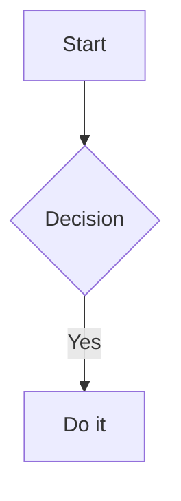

# figaro — Product & Behavior Specification

## Overview

This document is the product and behaviour contract for figaro. It describes the user-facing experience and the rules that preserve the local-first, file-portable model.

figaro is a desktop Markdown workspace with vault-based file management, quick-note capture, a hashtag-driven Kanban board, a date-aware calendar, backlinks, session-persistent tabs, local Git history, seventeen themes, sixteen bundled fonts, optional Vim mode, KaTeX math, live diagrams, editable Draw.io SVGs, and interactive browser-backed PDF export. All content lives in a folder chosen by the user: no accounts, cloud service, sync engine, or proprietary note database.

Tech stack: Go backend (Wails v2, using WebKitGTK on Linux), vanilla JavaScript frontend (CodeMirror 6, codemirror-live-markdown, KaTeX, markdown-it, Mermaid, Vega, and Vega-Lite), with browser dependencies vendored in the frontend bundle.

---

## 1. UI Layout

### 1.1 Shell
- Three horizontal zones: **left sidebar**, **workspace**, and an on-demand **right sidebar**. Both sidebars have independent resize handles.
- **Top bar**: sidebar toggle and app title/Home control on the left; a clear draggable center region; Settings followed by native-style minimize/maximize/close controls on the right.
- Calendar and Kanban live in a fixed footer below the file tree. Calendar expands inside the left sidebar; Kanban and Settings open or return to their single corresponding workspace tabs when inactive, and play a short reduced-motion-aware exit transition before closing that tab when clicked while already active. Clicking the Figaro name opens the un-tabbed workspace overview.
- **Status bar** fixed at the bottom: left shows status text ("Ready") and "md cheatsheet" trigger; right shows cursor position, reading time estimate (words ÷ 200 wpm, minimum 1 min), word/line/char count, file encoding, markdown file type, backlink count, and committed **Changes** count. Backlinks show as dimmed when 0 and accent-colored/underlined/clickable when >0. A plain-language **Save to history** action appears only while the active file has a version waiting to be recorded; it safely saves pending text and records only that file, then hides again.

### 1.2 Left Sidebar
- The top of the sidebar is the **global note search** field; its keyboard-navigable result list opens below the field.
- A compact **Quick note** action directly below search creates and opens a collision-safe timestamped Markdown file in the real `Inbox` folder. Its icon remains available in the collapsed rail.
- The remaining space is the **Vault** file tree. Markdown and files recognised by CodeMirror's language registry are clickable; unsupported/binary assets are greyed out at 55% opacity.
- A fixed tool footer keeps Calendar and Kanban reachable beneath the tree. Calendar expands a monthly panel between the tree and footer without taking ownership of the right pane.
- The sidebar can be resized from **225px to 500px**. Collapsing it leaves a **44px tool rail** rather than removing navigation; Quick note remains directly usable there, while selecting Calendar expands the sidebar and opens the panel. Expanded folders, selected file, recent files, and search filters are stored locally for the current webview profile.

### 1.3 Right Sidebar
- The right sidebar is closed by default and is reserved for **History** and **PDF Preview**. Opening one replaces the other; the left-sidebar Calendar can remain open independently.
- Clicking a committed-history count in the status bar opens the History view for the active file.
- Its width can be resized from **240px to 480px** for the current session.

### 1.4 Workspace
- A horizontal **tab bar** across the top. Compact tabs use a responsive 104–200px width, truncate long titles, and keep their close controls accessible. The visual scrollbar is hidden; an all-tabs dropdown provides a reliable route to every open tab. A dirty tab uses a compact accent dot, while the file tree mirrors active and background-open files with strong and subtle markers respectively; tab switches and dirty transitions patch those mounted markers without rebuilding the tree.
- Below it, **view containers** — only one is visible at a time:
  - **Editor view** — for Markdown and CodeMirror-supported code files. Shows file content immediately once loaded.
  - **Calendar results view** — for date searches and backlink listings.
  - **Kanban board view** — the full kanban board.
  - **Workspace overview** — a centered, un-tabbed dashboard with Momentum (unfinished tasks) on the left and recent notes on the right.
  - **Settings view** — typography, editor, and automation preferences.
  - **Draw.io view** — the embedded diagrams.net editor for `.drawio.svg` files.

### 1.5 Theming
- **Theme engine**: 17 built-in themes selectable from the Settings tab (Figaro Dark, Figaro Light, GitHub Light/Dark, Catppuccin Mocha/Macchiato, Zenburn, Gruvbox Dark/Light, Nord, One Dark/Vivid, Night Owl, Cobalt2, Ayu Dark/Mirage/Light). All colors are defined as CSS custom properties on `:root`.
- **Figaro theme philosophy**: Figaro Dark and Figaro Light are a matched, dog-inspired pair. They use quiet midnight-fur and ivory-paper surfaces, frame navigation separately from the raised reading surface, reserve collar red for intentional actions and focus, use brass for tags and highlights, and share semantic success, information, warning, and error roles. A fine brass-and-red collar stitch runs through the title and status bars.
- Built-in theme CSS is bundled under `frontend/themes/`. The selected theme is persisted in `vault/.config/settings.json` and restored on startup.
- Switching themes applies instantly without page reload — the theme CSS is injected into `<style id="theme-style">` via the Go backend API.
- **Fonts**: 16 locally bundled choices, including Inter, Figtree, Atkinson Hyperlegible, IBM Plex Sans, Fira Sans, EB Garamond, Crimson Pro, JetBrains Mono, and Work Sans. Font selection is persisted and never requires a runtime network request.

### 1.6 CSS Custom Properties (Theme Variables)
Each theme defines these properties (with theme-specific colors):

| Category | Variables |
|----------|-----------|
| **Core colors** | `--bg-color`, `--sidebar-bg`, `--panel-bg`, `--text-color`, `--text-muted`, `--text-dim` |
| **Accent** | `--accent-color`, `--accent-hover` |
| **State backgrounds** | `--active-bg`, `--hover-bg` |
| **Borders** | `--border-color`, `--border-light` |
| **Semantic** | `--danger-color`, `--danger-hover`, `--success-color`, `--warning-color` |
| **Scrollbar** | `--scrollbar-track`, `--scrollbar-thumb`, `--scrollbar-thumb-hover` |
| **Selection/Focus** | `--selection-bg`, `--focus-ring` |
| **Shadows** | `--shadow-sm`, `--shadow-md`, `--shadow-lg` |
| **Typography** | `--font-sans`, `--font-mono`, `--font-size`, `--font-size-sm`, `--line-height` |
| **Cursor** | `--cursor-color`, `--cursor-bg`, `--cursor-text` |
| **Markdown syntax** | `--heading-color`, `--bold-color`, `--italic-color`, `--link-color`, `--link-hover-color`, `--url-color`, `--hashtag-color`, `--code-bg`, `--quote-color`, `--quote-border`, `--highlight-bg` |
| **Callouts** | `--callout-note-color`, `--callout-warning-color`, `--callout-info-color`, `--callout-tip-color`, `--callout-danger-color`, `--callout-example-color` |
| **Code highlighting** | `--code-keyword-color`, `--code-string-color`, `--code-number-color`, `--code-function-color`, `--code-comment-color`, `--code-type-color`, `--code-variable-color`, `--code-operator-color`, `--code-builtin-color` |
| **Layout** | `--sidebar-width`, `--top-bar-height`, `--status-bar-height`, `--tab-height` |
| **Transitions** | `--transition-fast`, `--transition-normal`, `--transition-slow` (shared 140–180 ms timings) |

---

## 2. Tab System

### 2.1 Tab Types

| Type | ID pattern | Purpose |
|------|-----------|---------|
| **File** | `path/to/note.md` | Opens a Markdown or CodeMirror-supported source file for editing |
| **Draw.io** | `path/to/diagram.drawio.svg` | Opens an editable Draw.io SVG diagram |
| **Calendar** | `calendar-YYYY-MM-DD` | Shows Markdown notes that mention a specific date |
| **Backlinks** | `backlinks-path/to/note.md` | Shows notes that link to a given note |
| **Kanban** | `kanban` / `kanban-board` | The top-bar board and a hashtag-focused board respectively; each ID is deduplicated while open |
| **Workspace overview** | No tab ID | Centered dashboard with Momentum and recent notes |
| **Settings** | `settings` | Application settings for theme, fonts, editor layout, and automation |

### 2.2 Tab Behavior
- **Deduplication**: Opening a resource that already has a tab simply switches to it.
- **Dirty indicator**: A compact accent dot appears on unsaved file tabs as soon as any edit is made.
- **Auto-save on switch**: When the user switches away from a dirty file tab, Figaro caches its current content and queues a save. The destination can open immediately; a failed save leaves the source tab recoverable from its cache.
- **Save conflict**: If a file's modification timestamp changed externally, Figaro asks whether to overwrite it with the local version. Cancelling preserves the dirty tab and its in-memory snapshot; Figaro never silently discards the local edit.
- **Cursor memory**: Each file tab remembers the last cursor/scroll position; restored when switching back.
- **Close button (✕)**: Every tab has a close button, always visible even when tabs are narrow. Closing a dirty file tab prompts for confirmation.
- **Middle-click**: Middle-clicking any tab closes it immediately.
- **Pin tab**: Right-click a tab and choose "Pin Tab" to pin it. Pinned tabs stay at the leftmost position and have a visual accent border on top. Pinning persists across restarts.
- **Drag reorder**: Tabs can be dragged to reorder them. Pinned and unpinned tabs remain separate groups so a drag cannot accidentally unpin or pin a tab. The resulting order persists with the session.
- **Safe empty state**: Closing the final tab keeps the centered workspace overview visible instead of leaving the workspace blank or creating a synthetic tab.
- **Session persistence**: Open tabs, active tab, cursor positions, expanded directories, pinned tabs, and selected file are persisted to `vault/.config/session.json`. The webview also keeps UI-only preferences such as recent files, search filters, Kanban density and flow, and a local tab snapshot in `localStorage`; the vault session is the portable workspace record.
- **Exit protection**: Closing the native window with dirty file tabs offers **Save & Exit**, **Exit without saving**, or cancellation.
- **Overflow**: Tabs keep their compact responsive width, with the visual scrollbar hidden and the all-tabs dropdown available whenever the strip is crowded.

### 2.3 Opening and Switching
- Opening a tab checks if it already exists; if so, it switches to it. A `forceNew` override allows creating a duplicate.
- File clicks from the sidebar or links open in the "main" file slot (replacing the current file tab rather than stacking).
- Switching tabs hides the previous view, shows the appropriate view for the new tab, and restores state (editor cursor, scroll position, etc.).

---

## 3. File Operations

### 3.1 Vault
- A single root folder (created on first run if missing).
- All file paths are normalized to forward slashes and validated to prevent escaping the vault root.
- **Dot-files hidden**: Files and directories starting with `.` (such as `.config/`) are excluded from the file tree UI and from kanban/calendar scans.
- **Vault configuration**: Portable, vault-specific state that requires persistence (e.g., kanban column colors, theme selection, vim mode, and workspace session) is stored in `vault/.config/` as JSON files. Host-specific window state and the selected PDF-browser executable are exceptions and follow the machine-local contract in section 24.
- A new empty vault receives a welcome note; existing vault contents are never replaced.

### 3.2 Supported Operations

| Operation | Behavior |
|-----------|----------|
| **Read file** | Returns file content and last-modified timestamp. |
| **Save file** | Writes content to disk. Accepts expected last-modified timestamp for conflict detection, incrementally replaces only that note's search, Kanban, tag, and Calendar contributions, and projects its final Kanban cards locally instead of reloading the complete board when the native watcher acknowledges the same save. |
| **Create file** | Creates a `.md` file with a `# Title` header and incrementally adds it to discovery data. |
| **Create directory** | Creates a new folder. |
| **Delete** | Deletes a file or directory (recursive) and refreshes discovery data without leaving stale cards, search results, backlinks, or dates. |
| **Move** | Moves a file or folder to a target directory. Prevents moving a folder into itself, rewrites affected Markdown and wiki links across the vault, refreshes affected open tabs, and rolls the move back if its link rewrite cannot complete. If a same-named destination directory exists, it warns and offers a non-destructive recursive merge; cancellation writes nothing, while confirmation keeps existing files and names collisions `name (copy).ext`, `name (copy 2).ext`, and so on. |
| **Copy** | Saves dirty open source tabs, then copies a file or complete folder tree to an existing vault directory without changing the source. Existing entries are never overwritten: collisions become `Folder copy`, `Folder copy 2`, or `note copy.md`. Relative, root-relative, and wiki links inside copied Markdown are rewritten to preserve their resolved targets; incoming links elsewhere remain attached to the original. Copying a folder into itself or one of its descendants is refused because it would recurse. |
| **Rename** | Opens a contextual rename dialog showing the current folder. For files it initially selects the stem but leaves the extension editable; it validates unsafe names inline, disables an unchanged rename, and then moves the item within the same directory with the same link-rewrite and open-tab protections. |

### 3.3 File Tree (Sidebar)
- Displays folders before files, both sorted alphabetically.
- Folders expand/collapse on click; the icon toggles between open/closed states.
- Clicking a file opens it in the editor (replacing the current file tab).
- CodeMirror-supported source files (for example CSS, HTML, JavaScript/TypeScript, JSON, Go, Python, Rust, SQL, YAML, Dockerfiles, and maintained legacy modes) open in the same editor with their language parser loaded on demand.
- Editable Draw.io diagrams use the .drawio.svg suffix. They open in the Draw.io editor while remaining normal SVG assets when embedded in Markdown.
- **Ctrl/Cmd+Click** adds/removes a Markdown file to the multi-selection (highlighted with an accent-tinted background and outline).
- **Ctrl/Cmd+C** copies the selected tree file or folder to Figaro's internal file clipboard. **Ctrl/Cmd+V** pastes it into the selected folder, or beside the selected file. The same commands are available from the tree context menu; the clipboard remains available for repeated pastes during the current application session. Paste first saves dirty open files inside the copied source so the duplicate matches the visible editor content. A dirty Draw.io SVG must finish its own explicit save before copying because its editor has an independent save protocol.
- Pasting into the source's parent creates a sibling copy. Names use a descriptive suffix before a file extension: `Projects` becomes `Projects copy`, then `Projects copy 2`; `report.md` becomes `report copy.md`. Draw.io copies retain the complete `.drawio.svg` suffix.
- Links are rewritten only within copied Markdown. A link to another copied item follows that new counterpart; a relative link leaving the copied tree is recalculated so it still reaches the original external vault item. Root-relative Markdown links and wiki links receive the copied path when their target is inside the copied tree. External URLs, fragments, fenced code, source files, and incoming links elsewhere in the vault remain unchanged.
- Pasting a copied folder onto itself or any descendant shows an **Operation refused** dialog explaining that the user should select its parent folder to create a sibling copy. No filesystem write occurs.
- Folder expansion is explicit user-owned state. The exact expanded-directory set is stored in the vault session and restored on startup; restoring or switching tabs never opens additional ancestors. The active-file highlight follows tab changes when that file is visible, without rewriting the folder configuration.
- Collapsed folders do not mount their descendant rows. Expanding a folder renders its existing tree data on demand, preserving the same sorting, styling, keyboard, and context-menu behavior.
- Any non-greyed-out file or directory can be right-clicked and assigned a searchable Lucide icon plus a shared Kanban-palette color. The picker shows up to ten recently used icons and a **Reset** action. The top-level `Inbox` has a default Mail icon, which an explicit custom icon can replace. Appearance is persisted in the vault and follows rename, move, copy, merge, and delete operations.

### 3.4 Multi-Select and Merge
- Multiple files can be selected with Ctrl/Cmd+Click.
- **Right-click** a Markdown file builds merge candidates from the context file, active note, and Ctrl/Cmd multi-selection. The option is disabled unless at least two candidates are available.
- **Merge behavior**: The active note is normally the master (destination); if the context-clicked note is not already among the active or selected notes, it becomes the master. The remaining candidates appear as source checkboxes. Checked sources are appended in that candidate order, with `---` between non-empty notes.
- A styled confirmation dialog shows the destination note, a checkbox list of source notes, and a warning about permanent deletion.
- After merging, source files are deleted (with a fade-out animation), open tabs for deleted files are closed, and the file tree refreshes.

### 3.5 Drag & Drop (File Tree)
- Any file or folder label can be dragged.
- Drop targets are folder labels or the empty area of the tree (which means vault root).
- Visual feedback: the dragged item fades, the drop target highlights.
- On drop, the item is moved and the tree refreshes. If any open tab referenced the moved path, its ID is updated. A same-named existing destination directory is never silently replaced: Figaro offers to merge it, preserves both trees, and applies parenthesized copy names to file collisions. Native filesystem directory drops use the same warning and merge rule while leaving their external sources intact.

### 3.6 Context Menu (Right-Click in File Tree)
| Menu item | Available on | Behavior |
|-----------|-------------|----------|
| Open in New Tab | Markdown or CodeMirror-supported source file | Opens file in a new tab (doesn't replace current file tab) |
| Merge Notes | File (2+ candidate notes) | Appends checked source notes to the active/context-selected master with an interactive checkbox list. Disabled when fewer than 2 candidates are available. |
| Preview PDF | Markdown file | Opens a live right-pane preview using the frontmatter-driven layout; **Generate PDF** runs the detected local browser engine export. |
| Copy | File or Directory | Places the selected item on Figaro's internal file clipboard without changing it. |
| Paste | File, Directory, or vault root (after Copy) | Saves dirty source tabs, then copies into a selected directory, beside a selected file, or into the vault root. Collisions receive a `copy` suffix and never overwrite existing content; copied Markdown links preserve their resolved targets. |
| New Draw.io Diagram | File, folder, or vault root | Creates an editable .drawio.svg diagram in the selected location. |
| Reveal in File Explorer | File or Directory | Opens the containing folder with the native Linux, macOS, or Windows file manager |
| New Note | File or Directory | Prompts for name, creates `.md` file in that directory, opens it |
| New Folder | File or Directory | Prompts for name, creates folder |
| Customize appearance… | Non-greyed-out File or Directory | Opens the Lucide icon and color picker; Reset restores the default icon and text color. |
| Delete | File or Directory (not root) | Confirms, then deletes. Closes any tabs that pointed to deleted paths |

- Context menus are clamped to the visible viewport so all actions remain reachable near the bottom or edge of the file tree.

---

## 4. Markdown Editor

### 4.1 Capabilities
- Syntax-highlighted markdown editing powered by CodeMirror 6 with `codemirror-live-markdown`.
- CodeMirror's official language registry is vendored locally. Recognised code files use their syntax parser, a monospace unwrapped layout, normal CodeMirror completion/folding behavior, theme-aware indentation guides, and no Markdown live-preview widgets. Tab / Shift+Tab and the guides share CodeMirror's same two-space indentation unit. Vim mode, tabs, cursor restoration, autosave, conflict handling, and history work the same way as for notes.
- **Frontmatter / Properties**: a complete leading YAML frontmatter block is rendered as a compact, collapsed Properties card. Activating it opens a structured Properties panel with PDF-layout controls: cover page, contents depth, and a vault-relative print stylesheet picker. Enabling a cover also exposes title, subtitle, author, and date fields. Other YAML remains visible as chips and **Add property** opens the source editor with completion; **Edit YAML** always exposes the original portable frontmatter. Notes without frontmatter get a subtle **+ Add properties** affordance above the editor; it inserts an editable YAML skeleton with the first H1 as `title`, the OS username as `author`, today's local date, an empty-string `subtitle`, and the PDF defaults `cover-page: false` and `toc-depth: 0`, then keeps that source open. Custom PDF CSS is opt-in: **Create starter** proposes `pdf.css` beside the active note, copies the bundled comprehensive example only after confirmation, selects it, refreshes the tree, and opens it. Existing CSS is never overwritten; startup and export never create stylesheets. The panel makes targeted scalar edits only, preserving unrelated YAML and comments. Completion in YAML suggests `title`, `subtitle`, `author`, `date`, `aliases`, `tags`, `description`, `created`, `updated`, `status`, `cover-page`, `toc-depth`, and `print-stylesheet`; it also offers status values and vault-relative CSS paths for `print-stylesheet`.
- **PDF preview and export**: **Preview PDF** opens an isolated live preview in the right pane. It uses the same printable document structure as the export, waits briefly after Markdown or selected CSS edits to avoid flicker, and refreshes external saved CSS when the file tree updates. Each newer input invalidates active diagram/print work immediately; Figaro keeps only the latest queued snapshot and never sends a stale result into the preview bridge. A code-icon helper opens **Figaro PDF style reference**, which derives the exact classes and IDs from the current preview, displays its generated body HTML, and can copy that HTML. Its splitter has a 340 px preview minimum and otherwise grows dynamically while preserving a 320 px editor floor; the pane may keep growing, but the centered paper surface is capped to the last supported `@page size` declaration. Preview geometry supports named A3/A4/A5, B5, Letter, Legal, Ledger/Tabloid, and Executive paper, portrait/landscape orientation, and one- or two-length explicit sizes, with A4 as fallback. A final preview-only geometry rule prevents user `body` width overrides from stretching the paper while leaving print colors and typography in the normal cascade. Below 560 px of remaining editor width, CodeMirror content padding contracts from 24 px to 12 px. Its **Generate PDF** action saves dirty preview buffers, then renders Markdown into an interactive PDF with a detected local browser engine. Figaro tries Chrome/Chromium-family engines before Edge, and uses Safari/WebKit on macOS if needed; Chromium candidates must complete a real isolated CDP startup and `Browser.getVersion` request. It aborts with an installable-browser error if no viable engine is present instead of generating a PDF with dead links. Export writes `<note>.pdf` beside the Markdown file, safely replacing a previous export, and opens it in the default PDF viewer. A scalar frontmatter property, `print-stylesheet: path/to/print.css`, selects a vault-local CSS file relative to the note and takes precedence over a sibling `_print.css`; omitting it keeps the built-in style. `cover-page: true` generates a title page using `title`, `subtitle`/`description`, `author`, and `date`/`created`; `toc-depth: 0` disables the table of contents, while 1–6 includes headings through that Markdown level. Generated cover and table-of-contents sections automatically end with a page break. The print DOM has stable cover, table-of-contents, document-body, task, diagram, and footnote classes documented in `docs/PDF_STYLING.md`; body headings are separate from the cover and table-of-contents titles. Repeated running page headers and footers are not supported. Footnote references render as numbered internal links to a final Footnotes section, with return links for repeated references. Frontmatter itself is not printed.
- **PDF preview performance**: Printable Markdown parsing runs in a module worker when supported, leaving CodeMirror's input/layout path free while a preview is open. Callout/TOC decoration and DOM-dependent Mermaid/Vega conversion remain in the document pipeline; webviews without module-worker support safely use the established in-thread renderer.
- **PDF preview isolation**: The right-pane preview is a fixed sandboxed frame with a validated message bridge, not a parent-controlled `srcdoc` document. The frame owns anchor interception and reports web, vault, fragment, and scroll actions to the application; the application never reads the sandboxed frame DOM. During splitter resizing the parent sends `set-scroll-sync-paused`, both scroll directions and frame pointer interaction remain quiet, and 80 ms after release one editor-to-preview alignment restores line-level synchronization. This preserves user `html`/`body` print styling while preventing a clicked link from replacing the preview with an external or filesystem document. See `ARCHITECTURE.md` for the protocol and security rationale.
- **Live preview**: Formatting markers (`#`, `**`, `*`, `~~`, backticks, link brackets/parens) are hidden on non-active lines while preserving layout width. Move the cursor to a line to reveal its raw markdown for editing. Bullet points render as styled bullets. Task checkboxes (`- [ ]` / `- [x]`) render as interactive HTML checkboxes that toggle on click. Links render as clickable widgets. Unaffected preview state is retained during ordinary cursor movement, and interactive decorations are limited to the visible editor region so large notes remain responsive. Live content observers receive the latest typing frame, while word statistics settle after a short typing pause; save and tab-switch snapshots stay immediate.
- **Hex colors**: standalone CSS hex tokens in the 3-, 4-, 6-, or 8-digit forms render with a theme-aware inline swatch and native color picker in Markdown and supported source files. Picker changes replace only the token, preserving an existing alpha channel. The raw token remains plain text in Markdown, PDF preview, and export.
- **Printable diagrams**: Mermaid, Vega, and Vega-Lite fences are rendered to inline SVG before the print document reaches the native dialog. If a renderer is unavailable or a diagram is invalid, the source fence stays visible rather than being dropped.
- **Line-number gutter**: a persistent Settings toggle adds CodeMirror line numbers and active-line gutter highlighting to Markdown and source files. It is disabled by default. Bracket matching, undo/redo history, and autocompletion remain always available; code folding is enabled for source-code files.
- Inline rendering of hashtags and markdown links with distinct styling.
- **Fenced code blocks**: triple-backtick blocks with optional language tag, rendered with monospace font, subtle background, syntax highlighting (via highlight.js classes themed with `--code-*-color` variables), copy button, and line numbers.
- **Blockquotes**: `>` lines rendered with a left `::before` pseudo-element border (4px `var(--quote-border)`) and italic styling.
- **Horizontal rules**: `---`, `***`, or `___` render as a full-width separator line via `Decoration.line` with active-line cursor reveal.
- **Strikethrough**: `~~text~~` renders with a line-through style.
- **Highlight**: `==text==` renders with a warm amber background highlight.
- **Footnotes**: `[^1]` references render as superscript accent-colored links.
- **Callouts**: `> [!note]`, `> [!warning]`, `> [!info]`, `> [!tip]`, `> [!danger]`, `> [!example]` blocks render with colored left borders and tinted backgrounds matching the callout type (via `--callout-*-color` variables).
- **Images**: `` renders inline images via `imageField`. Pasting a raster image from the system clipboard into an open Markdown note writes `image1.<ext>`, `image2.<ext>`, and so on beside that note, inserts note-relative Markdown such as ``, refreshes the file tree, and displays the new asset immediately. The backend detects the actual PNG, JPEG, GIF, WebP, BMP, or ICO bytes, limits clipboard images to 25 MB, and never overwrites an existing numbered image. A failed write leaves the editor selection and document unchanged.
- **Tables**: `codemirror-markdown-tables` renders GFM tables as interactive widgets with auto-formatting, inline cell editors, row/column controls, Arrow-key movement, Tab/Shift+Tab cell navigation, and Enter navigation. Its measured widget root obeys the block geometry contract. The canonical Markdown-It renderer preserves table headings, rows, and alignment in both the live PDF preview and generated PDF.
- **Math**: `$inline$` and `$$block$$` LaTeX math renders via KaTeX (StateField-based plugin).
- In-note search with match highlighting and navigation.
- **Auto-save**: the active dirty file tab is saved on the configured interval (5 seconds, 10 seconds, 30 seconds, 1 minute, 5 minutes, or Off), when switching away, and when choosing **Save & Exit**. Content is always written first; when Auto-Commit is set to **On Save**, that successful save then commits only the saved file.
- **PDF source**: exporting the active dirty Markdown tab uses its current editor content without requiring a save first. A file-tree export otherwise reads the version on disk.
- All CodeMirror 6 modules and `codemirror-live-markdown` are vendored locally.

### 4.2 Hashtags in the Editor
- Hashtags follow the rule: must start with a letter, can contain letters, digits, underscores, and hyphens. They must be preceded by a non-word, non-hash character and end at a word boundary.
- A standalone token that is also a valid CSS hex color is treated as a color, not a hashtag. For example, `#bad` opens a color picker; use a non-hex-shaped name when the intent is a Kanban tag.
- Styled distinctly (accent color, pointer cursor on hover, subtle background highlight on hover).
- **Clicking a hashtag** opens the kanban board scrolled to the column matching that tag, with a brief highlight animation.

### 4.3 Markdown Links
In **live preview** mode (cursor not on the link line), links render as styled widgets:
- `[` — hidden (inline formatting mark)
- `text` — visible, styled with dotted accent underline and pointer cursor
- `](url)` — hidden (inline formatting mark)

In **edit mode** (cursor on the link line or intersecting the link's range), raw markdown is revealed.

**Click behavior**:
- Clicking the **visible link text** navigates to the link target
- Date links (`YYYY-MM-DD.md`) open the calendar search tab
- Broken links prompt to create the missing note
- `http(s)://` links open in external browser

**Vault-wide link style**: Settings offers a themed **Links style** combobox with Markdown (the default) and Wikilinks. Conventional Wikilinks are target-first: `[[path/to/note.md|Readable label]]`. Changing the preference always opens a confirmation with **Rewrite vault links**, **Keep existing links**, and **Cancel**. Rewriting first saves dirty Markdown tabs, converts only destinations that resolve to existing vault Markdown files, and reloads affected open buffers. External URLs, `mailto:` links, images, code, malformed links, and unresolved targets remain byte-for-byte unchanged. Alias-free Wikilinks gain the filename without its extension as their alias.

**Link autocomplete**: Typing `[` or `[[` followed by text triggers a dropdown of matching `.md` files. Accepting a suggestion inserts either `[filename](encoded/path.md)` or `[[path.md|filename]]` according to the saved preference. A path or alias that conventional Wikilinks cannot represent safely falls back to Markdown syntax rather than creating a broken link.

### 4.4 Empty-Link Autofill
- Typing `[link text]()` and pressing `)` automatically fills the URL with `(link text.md)`, using the current file's directory as the parent path.
- Spaces in the generated filename are encoded as `%20`.

### 4.5 Link Click Behavior
| Click | Tab exists? | Action |
|-------|------------|--------|
| **Left** | Yes | Switch to it |
| **Left** | No | Save the current dirty file if necessary, then replace its tab; if that save cannot complete, preserve it and open the destination in a new tab |
| **Middle** | Yes | Switch to it |
| **Middle** | No | Open in new tab alongside |

### 4.6 Date Shortcuts
Typing `@today`, `@tomorrow`, or `@yesterday` opens date-link suggestions. For example, `@to` lists **today** before **tomorrow**. Accept with Enter, Tab, or Space to insert `[YYYY-MM-DD](YYYY-MM-DD.md)`.

---

## 5. CodeMirror 6 Extensions

### 5.1 Core Extensions
`history()`, `bracketMatching()`, and `autocompletion()` are always installed. `lineNumbers()` plus `highlightActiveLineGutter()` live in a compartment controlled by the persistent, off-by-default **Show line numbers** setting. `lineWrapping` and live-preview extensions are installed only for Markdown; `foldGutter()` and its keymap are installed only for source-code files through CodeMirror `Compartment`s.

### 5.2 codemirror-live-markdown Extensions
| Extension | Purpose |
|-----------|---------|
| `livePreviewPlugin` | Hides formatting markers on non-active lines, shows rendered widgets |
| `markdownStylePlugin` | Applies markdown syntax styling classes |
| `editorTheme` | Base editor theme (overridden by custom CSS variables) |
| `linkPlugin()` | Renders `[text](url)` as clickable link widgets |
| `codeBlockField({ lineNumbers: true })` | Fenced code blocks with syntax highlighting, line numbers, copy button |
| `imageField({})` | Renders `` as inline images |
| `markdownTables()` | Interactive GFM table rendering, formatting, cell navigation, and row/column editing via `codemirror-markdown-tables` |
| `collapseOnSelectionFacet` | Collapses live-preview widgets when cursor enters the line |
| `mouseSelectingField` | Tracks mouse-drag state so live preview doesn't collapse during selection |

### 5.3 Custom Extensions
| Extension | Type | Purpose |
|-----------|------|---------|
| `hexColorExtension` | ViewPlugin | Adds strict standalone CSS-hex swatches and native pickers, using `@uiw/codemirror-extensions-color` theming |
| `hashtagPlugin` | ViewPlugin | Decorates standalone whitespace-delimited `#tag` tokens, excluding markdown anchors |
| `widgetPlugin` | ViewPlugin | Bullet list markers → Unicode glyphs; `[ ]`/`[x]` → interactive checkboxes |
| `extrasPlugin` | ViewPlugin | `==highlight==`, `[^footnote]`, HRs (`cm-hr-passive`/`cm-hr-active`), callouts |
| `dateShortcutCompletions` | Completion source | `@today`/`@tomorrow`/`@yesterday` date-link suggestions |
| `emptyLinkAutofillPlugin` | ViewPlugin | Fills `[]()` links from their visible text |
| `hrPlugin` | ViewPlugin (extrasPlugin) | Horizontal rules with active-line toggle via `Decoration.line` |
| `mathField` | StateField | `$inline$` and `$$block$$` LaTeX rendering via KaTeX |
| `vimCompartment` | Compartment | Dynamic vim mode (on/off via `reconfigure`) |
| `@codemirror/search` | CodeMirror extension | Native in-document find panel, match navigation, and match decorations |

### 5.4 Custom EditorView.theme() Overrides
The custom `EditorView.theme()` block overrides the library's hardcoded colors with theme CSS variables for: cursor, headings, bold, italic, strikethrough, links (source + widgets), code, horizontal rules, quotes, highlights, footnotes, callouts (6 types), code block syntax highlighting (hljs classes), table widgets, codeblock widgets, formatting marks.

---

## 6. Kanban Board

### 6.1 Column System
- Three **system columns** always present and shown last: `todo`, `wip`, `done`.
- Custom columns discovered from standalone whitespace-delimited `#tag` tokens in vault files, sorted alphabetically. Markdown anchors such as `[guide](#section)` are ignored.
- Saved note, create, and per-card tag changes update the shared vault index incrementally; vault-wide tag rewrite, move, merge, and delete operations rebuild one coherent snapshot.
- The Kanban board reads its current columns and cards from that shared index when it is rendered.
- The workspace overview reads a bounded six-card unfinished projection from the same index instead of loading the complete board.
- A custom column disappears as soon as its final matching hashtag is removed; the three system columns remain.

### 6.2 Task Discovery
- The initial shared vault index scans each `.md` file once, deriving tags, cards, dates, and backlinks in one line-oriented walk; board reads use its precomputed cards.
- **Any line** that contains a standalone hashtag matching a known column name has its task placed in that column.
- Display text: line with checkbox markers, list markers, and matching tag stripped in order.
- Card text is limited to 120 characters and ends in an ellipsis when more source text exists; hovering exposes the complete text.
- The same line can appear in multiple columns if it contains multiple known hashtags.
- The active Markdown editor contributes its in-memory buffer on the next animation frame, so typing or removing a hashtag updates an open Kanban board before the file is saved without a backend request. A Figaro save folds that same final buffer into the local board snapshot; only external Markdown changes request a complete board refresh.

### 6.3 Board Layout
- **Header**: Title ("Kanban Task Board") and instruction text. Presentation choices stay in Settings rather than in the workspace header.
- **Board area**: a horizontally scrollable row of columns by default; Settings can switch it to a vertically scrolling stacked flow.
- Each column has a header showing `#column-name`, color picker, and (for non-system) rename/delete buttons.
- Each card shows cleaned task text, source file name with icon, and remove-tag button.
- The first board request uses a theme-aware three-column skeleton. Reprojection keeps the board's horizontal position and each mounted column's vertical reading position.
- **Focus highlight**: when board is opened by clicking a hashtag in the editor, the matching column gets a brief highlight animation (~2.5s) and is scrolled into view.

### 6.4 Drag & Drop (Kanban)
- Cards are draggable between columns.
- Dropping onto a different column triggers tag replacement in the source file.
- The board re-renders immediately; the editor reloads if the modified file is currently open.

### 6.5 Column Management
- **Add column**: Not available via UI (columns auto-discovered from hashtags).
- **Set color**: 12-color palette picker + "no color" option; persisted to `vault/.config/kanban-colors.json`.
- **Rename column**: Prompts for new name; all occurrences of old `#tag` replaced across vault.
- **Delete column**: Confirms, then removes `#tag` from every line in vault. System columns protected.

### 6.6 Task Actions
- **Click a card**: opens the source file in the editor, scrolled to the line containing the tag.
- **Click ✕ (remove tag)**: strips that specific `#tag` from the line in the file.

---

## 7. Discovery Views

### 7.1 Backlinks Panel
- Reads incrementally maintained reverse Markdown links for a given note (by path or basename), case-insensitive, without rescanning unrelated note text.
- Returns each match with source file path, line number, snippet, and modification time, sorted newest first.
- Status bar shows backlink count; clickable link opens backlinks tab when >0.
- Backlinks tab renders in same view as calendar results.

### 7.2 Global Search
- The left-sidebar search field searches Markdown note bodies and note filenames. It waits briefly while the user types and ignores stale responses from earlier queries.
- Case-insensitive body searches use the index's folded-text substring terms, then verify candidate notes before displaying matches; case-sensitive searches compare the original source text.
- Results show a filename, vault-relative path, first matching line, line number, and additional-match count. The backend transfers that compact preview and exact count rather than every matching source line. Filename matches rank ahead of body-only matches; otherwise newer files rank first.
- **Titles** limits results to filenames, **Recent** limits them to the eight recently opened notes, and **Aa** enables case-sensitive matching. Filters persist locally in the webview.
- Use ↑/↓ to select a result, Enter to open the selected result, or Escape to clear and close search. Opening a result positions the editor at its first matching line.

### 7.3 Calendar and Daily Notes
- The Calendar control in the fixed left-sidebar footer expands an inline monthly grid with month navigation and linked-note results. A day is marked when a vault note is named `YYYY-MM-DD.md` or another Markdown note links to that daily note.
- The index groups marked days by `YYYY-MM`, so moving between months reads only the selected month's day lists.
- Collapsing the sidebar closes the expanded panel but leaves the Calendar icon in the 44px rail. Selecting it expands the sidebar and reopens Calendar. History and PDF preview remain independent on the right.
- Selecting a marked day lists notes that link to its daily note; selecting a listed note opens it in a file tab. Today is always selectable.
- `@today`, `@tomorrow`, and `@yesterday` offer date-link completions. Clicking `[YYYY-MM-DD](YYYY-MM-DD.md)` or a date-form empty link opens a workspace results tab listing every Markdown note that mentions that date.
- The selected date is stored locally for the webview; Calendar reads the shared Markdown index, which ignores dot-directories and symlinks like the rest of the vault scanner.

### 7.4 Workspace Overview
- The un-tabbed workspace overview has **Momentum**, the first six Kanban cards outside the `done` column, and **Recent**, the last eight file tabs opened by the user. Momentum is a bounded backend projection, not a complete-board fetch.
- Clicking a task returns to its source note and line; **Open board** opens the Kanban tab. Recent notes are local UI history, not a separate vault index.

### 7.5 Quick Note and Inbox
- **Quick note** creates an empty `Inbox/YYYY-MM-DD-HHMMSS.md` and opens it with editor focus. If that timestamp already exists, `-2`, `-3`, and later suffixes are tried without overwriting anything.
- `Inbox` is an ordinary vault folder: its notes participate in links, search, Kanban, Git history, file-tree styling, and external editing. Its built-in Mail icon is only a default appearance.
- Both the full-width action above the tree and the collapsed-rail icon share one guarded workflow. While creation is running they are disabled and busy; an error opens a styled dialog and never creates a phantom tab.

---

## 8. Vim Mode

### 8.1 Activation
- Toggle via the Settings tab's "Enable Vim keybindings" checkbox.
- Uses `@replit/codemirror-vim` (vendored at `frontend/vendored/@replit/codemirror-vim/`).
- Loaded dynamically via CodeMirror `Compartment` — no page reload required.
- Preference persisted to `vault/.config/settings.json` (`"vim": true/false`).
- The persisted preference is loaded once during application startup and is
  the single source of truth for both the Settings switch and live editor. If
  startup opens on the workspace overview before an editor exists, the requested mode is applied
  when the first file creates the editor. Reopening Settings never re-applies
  a stale value. A persistence failure restores the last confirmed setting in
  both the switch and editor.

### 8.2 Custom Ex Commands
| Command | Action |
|---------|--------|
| `:w` / `:write` | Save current file |
| `:e <file>` / `:edit` | Open/create file relative to current file's directory |
| `:q` / `:quit` | Close current tab |
| `:wq` | Save the current buffer, wait for confirmed success, then close |
| `:x` / `:xit` | Save the current buffer, wait for confirmed success, then close |

`:wq` and `:x` never close ahead of their asynchronous save. If the save fails,
or if the buffer changes while that save is in flight, the file tab remains
open so newer or unsaved text cannot be discarded.

### 8.3 Built-in Vim Features
- `/pattern` — open the Vim search prompt and search forward from the cursor
- `?pattern` — search backward
- `:s/old/new/g` — substitute
- `n` / `N` — next/previous match after a search
- All standard vim motions, operators, and visual mode

---

## 9. Math Plugin (KaTeX)

### 9.1 Architecture
- `StateField`-based plugin at `frontend/js/mathPlugin.js` (safe for block decorations).
- KaTeX v0.17.0 is generated as a slim browser runtime at `frontend/vendored/katex/` by the `make bootstrap` / `make vendor` workflow; `index.html` loads its global minified script and CSS. The generated directory contains only the license, manifest, minified JS/CSS, and their required fonts—no KaTeX source, CLI, tests, or Python build helpers.

### 9.2 Syntax
| Type | Syntax | Rendering |
|------|--------|-----------|
| Inline | `$x^2$` | Renders inline via KaTeX |
| Block | `$$...$$` | Renders as display math via KaTeX |

### 9.3 Behavior
- Cursor on math = raw LaTeX shown for editing.
- Falls back to raw text if KaTeX unavailable.
- `block: true` decoration for multi-line block math.
- Cursor moves and edits outside known math ranges preserve or map the existing
  field state instead of rescanning the complete note.

---

## 10. Markdown Cheatsheet

- Click "md cheatsheet" in status bar to open popup.
- Reference table: headings, emphasis, strikethrough/highlight, Markdown links, conventional `[[wikilink.md|wikilink]]` syntax immediately afterward, images, lists, tasks, blockquotes/callouts, code blocks, Mermaid, Vega, Vega-Lite, Draw.io SVGs, math, HRs, hashtags, footnotes, and tables.
- PDF-specific controls remain discoverable in the frontmatter Properties panel rather than crowding the cheatsheet.
- Close button (✕) at top-right; closes on outside click.

---

## 11. Dialogs

### 11.1 Shared Modal Contract
- Every application-owned modal is created by `frontend/js/dialogs.js`; feature modules do not use browser `alert`, `confirm`, or `prompt` boxes and do not create independent overlays.
- The shared responsive card provides a labelled `role="dialog"`, `aria-modal="true"`, consistent icon/tone variants, a content region, and one action footer. It is visually checked in both Figaro Light and Figaro Dark and disables animation under `prefers-reduced-motion`.
- While open, the application surface is inert, Tab and Shift+Tab remain inside the modal, Escape follows the dialog's cancel path, and closing restores focus to the invoking control. Opening another modal cleanly cancels the previous one.
- Acknowledgement and confirmation dialogs may treat backdrop activation as dismiss/cancel. Text-entry and merge dialogs do not close on backdrop activation, preventing accidental loss of input or selection.

### 11.2 Confirm Dialog
- Shows a concise consequence and action-specific labels rather than generic OK text. Ordinary confirmations focus the primary action; destructive confirmations use the danger treatment and focus Cancel first.
- Supports a third action for the application-exit flow: **Save and exit**, **Keep editing**, or the danger-styled **Exit without saving**.
- Delete, overwrite, merge, unsaved-tab, and replace-existing flows explicitly state what data will be removed or overwritten.

### 11.3 Text Entry and Rename
- Generic prompts use a real labelled form, optional location context and helper text, inline validation, Cancel, and a purpose-specific submit label. Enter submits and Escape cancels.
- File/folder rename uses its own composition: current parent folder, new-name label, link-update guidance, and inline errors for empty names, paths, dots, or control characters. An unchanged value cannot be submitted. A file opens with its stem selected while its extension remains visible and editable.
- New-file, new-folder, Draw.io, PDF-stylesheet, and Kanban-column prompts use the same field and validation language.

### 11.4 Message, Error, Merge, and Recovery Dialogs
- Informational and warning messages have one acknowledgement action. Operational failures use the danger-styled in-app error dialog; no native browser alerts remain.
- Merge Notes identifies the destination, lists ordered checkbox sources, disables submission when none are selected, warns that selected sources are deleted, and uses **Merge and delete sources** as its final action.
- PDF export recovery distinguishes a successfully saved PDF from export failure. Missing-browser recovery makes **Choose browser…** the primary action and **Not now** the cancel action, retaining inline chooser errors without closing the dialog.

---

## 12. State & Data Flow

### 12.1 Reactive State
The frontend holds a shared state object that tracks:
- The active file path.
- The calendar's current month and selected date.
- All open tabs and which one is active.
- Context menu target (type: file/directory/root, and path).
- Kanban board data and columns.
- Theme state, pinned tabs, and recent files.
- Search query, filters, and result set.
- The exact set of expanded file-tree directories.
- Left and right sidebar width plus collapsed/open state.

The application uses two persistence layers deliberately:
- `vault/.config/session.json` carries the portable workspace session (tabs, active tab, cursor positions, expanded folders, pinned tabs, and selected file).
- Browser `localStorage` keeps webview-local presentation state (selected date, recent files, search filters, font size, text width, and a recovery copy of tabs). A missing or malformed session is ignored safely.

Async file-tree, search, calendar, backlink, history, and diagram requests carry request IDs or connected-DOM checks so an older response cannot overwrite a newer view.

### 12.2 Initialization Sequence
1. Restore any webview-local UI state, then initialize the left-sidebar resizer, title-bar and sidebar navigation controls, calendar navigation, and keyboard shortcuts.
2. Wait for Wails to publish the native `window.go.main.App` binding, then load the portable vault session.
3. Initialize CodeMirror and the tab manager, load the file tree, and attach tree handlers. Native debounced vault notifications replace polling; content-only changes do not reload the tree, and Figaro's own saved snapshots do not request an already-known Kanban board again.
4. Restore persisted tabs after the tree is available; otherwise show the un-tabbed workspace overview.
5. Initialize Calendar, Kanban, global search, backlinks, and the History panel.
6. Load the saved theme, prose font, and code-font settings. A Settings tab initializes its own controls when opened.
7. Load the persisted line-number and Links style preferences, then load the Auto-Save interval and start its active-tab timer. The Go backend starts Auto-Commit when a positive interval is configured; **On Save** remains event-driven.
8. Install the native-window close guard and `beforeunload` handler, which preserve dirty content and save the session.

Frontend code accesses Go only through `frontend/js/backend.js`. It calls the
native `window.go.main.App` methods with their generated PascalCase names; the
browser debugging fallback is installed explicitly with the same method shape.

---

## 13. Data Formats & Conventions

### 13.1 Markdown Links
- Standard: `[Display Text](relative/path/to/file.md)`
- Conventional Wikilink: `[[relative/path/to/file.md|Display Text]]` (target first, alias second).
- Date links: `[YYYY-MM-DD](YYYY-MM-DD.md)` — treated specially by the calendar system.
- Links are relative to the vault root.
- The selected Links style governs new autocomplete insertions, not which syntax can be opened or rendered; both remain supported throughout the vault.

### 13.2 Hashtags
- Format: `#tagname` (letters + optional digits/underscores/hyphens).
- Placement: anywhere in a line (end of a task, inline in prose, etc.).
- Case-insensitive: normalized to lowercase.
- Kanban mapping: each `#tagname` found in vault files becomes a kanban column.

### 13.3 Tasks
- Common format: `- [ ] Task description #tag` (incomplete) or `- [x] Task description #tag` (complete).
- Any line with a recognized `#tag` becomes a kanban card, even without a checkbox.
- A single line can carry multiple tags and will appear in multiple kanban columns.

---

## 14. Keyboard & Mouse Shortcuts

| Input | Context | Action |
|-------|---------|--------|
| `@today` / `@tomorrow` / `@yesterday` | Editor | Show date-link completions |
| `[` + text | Editor | Trigger link autocomplete |
| ↑ / ↓ / Tab | Autocomplete | Navigate suggestions |
| Enter | Autocomplete | Accept suggestion |
| Escape | Autocomplete / Search / Dialog | Close / cancel |
| Enter / Shift+Enter | In-note search | Next / Previous match |
| Click hashtag | Editor | Open kanban board, focus column |
| Left-click link | Editor | Switch to existing tab or replace current file tab |
| Middle-click link | Editor | Open in new tab |
| Click broken link | Editor | Prompt to create missing note |
| Type `[text]()` | Editor | Auto-fill URL with `text.md` in current directory |
| Drag card | Kanban | Move task to another column (rewrites tag) |
| Click card | Kanban | Open source file at task line |
| Click ✕ on card | Kanban | Remove tag from that line |
| Drag file/folder | File tree | Move to target directory |
| Right-click | File tree | Context menu |
| Ctrl/Cmd+Click file | File tree | Multi-select for merging |
| Ctrl/Cmd+C | Focused file tree | Copy selected file/folder to the internal clipboard |
| Ctrl/Cmd+V | Focused file tree | Paste into selected folder, beside selected file, or at vault root |
| Ctrl/Cmd+V | Markdown editor | Paste clipboard text normally, or save a clipboard image beside the note and insert its relative Markdown |
| Click Quick note | Sidebar or collapsed rail | Create and focus a collision-safe timestamped note in `Inbox` |
| Middle-click tab | Tab bar | Close tab |
| Right-click tab | Tab bar | Pin/Unpin tab |
| Right-click editor | Editor | Context menu (Cut, Copy, Paste, Select All, Preview PDF) |
| Tab / Shift-Tab | Editor list | Indent / dedent list item |
| Ctrl+S / Cmd+S | Editor | Save file |
| Ctrl+F / Cmd+F | Editor / active file | Open and focus in-document find |
| F3 / Ctrl+G / Cmd+G | In-document find | Next match |
| Shift+F3 / Shift+Ctrl+G / Shift+Cmd+G | In-document find | Previous match |
| Ctrl+Shift+N | App | New daily note |
| Ctrl+B | App | Toggle sidebar |
| Ctrl+Shift+F | App | Focus global search |
| Ctrl+W / Cmd+W | App | Close current tab |
| Drag resizer | Sidebar edge | Resize sidebar width |

---

## 15. Known Limitations

1. No graph view for note connections.
2. No plugin system.
3. Desktop-only (no mobile/responsive layout).
4. No real-time multi-user collaboration.
5. No encryption or password protection.
6. No sync or cloud backup.
7. Single vault only.
8. PDF export requires a supported browser engine already installed on the machine. Chrome/Chromium discovery includes Ungoogled Chromium and Flatpak launchers; a specific executable can be selected in Settings and is stored machine-locally. Chromium candidates must successfully start an isolated headless DevTools session rather than merely answer a version probe. This is intentional: annotated links and footnote destinations are more valuable than a degraded native-print fallback.
9. Clipboard image paste supports raster images up to 25 MB; there is no separate image-upload UI.
10. No formatting toolbar (keyboard-only).
11. No split editor / multiple panes.
12. No vim/emacs keybindings (except optional vim mode).
13. Session persistence uses `vault/.config/session.json`.
14. Frameless/custom window decorations use Wails native `--wails-draggable` CSS regions and custom titlebar controls (minimize/maximize/close).
15. Block math (`$$...$$`) may cause cursor navigation issues within the containing document.
16. Draw.io editing uses the hosted diagrams.net editor, so opening an editable diagram requires network access; saved .drawio.svg files still render offline.

---

## 16. Behavioral Contract (Cross-Cutting Rules)

### 16.1 Data Integrity
- File saves carry an expected last-modified version. If the file changed externally between read and save, the save is rejected; the user may overwrite explicitly or cancel while retaining the dirty in-memory copy.
- All file paths are validated to stay within the vault root. Path traversal and symlink escapes are rejected, and vault walks omit symlinks.
- Writes use root-scoped, atomic file helpers. A rename/move collects link rewrites before changing paths, applies them after the move, and attempts rollback if the rewrite phase fails.

### 16.2 Kanban Column Consistency
- Columns are always derived from actual hashtags in vault files. No separate column registry.
- When a column is renamed, every file in the vault that uses the old tag is rewritten.
- When a column is deleted, every occurrence of that tag is stripped from every file.
- Moving a card between columns rewrites the tag in the source file.
- Custom columns disappear when no indexed vault note contains their hashtag; `todo`, `wip`, and `done` remain available.

### 16.3 Tag Rewrite on Drag
- Dragging a card from column A to column B causes the underlying file to be modified: `#A` on that line is replaced with `#B`.
- The editor showing that file reloads to reflect the change.

### 16.4 Editor-Kanban Bidirectional Sync
- Editor → Kanban: typing a new `#tag` updates the open board immediately from the unsaved active buffer without a backend request; saving persists it for later indexed reads. Clicking a `#tag` opens kanban focused on that column.
- Kanban → Editor: moving a card rewrites the tag in the file; the editor reloads from disk.
- **Important tradeoff**: Editor reloads after kanban mutations discard the editor's undo history and any unsaved local edits.

---

## 17. Sidebar Resizer

### 17.1 Implementation
- A **6px-wide drag handle** is nested inside `<aside id="sidebar">` as its last child (`#sidebar-resizer`).
- The handle uses `position: absolute; right: -3px` to project past the right edge of the sidebar.
- WebKitGTK hit-test fix: `background-color: rgba(0,0,0,0.01)` — invisible to the eye but registers mouse events.
- `cursor: col-resize` and `z-index: 999999` to outrank CodeMirror's stacking context.
- `-webkit-app-region: no-drag` prevents the Wails window drag region from swallowing the cursor.

### 17.2 Drag Behavior
- **mousedown** on the handle starts the drag.
- **mousemove** uses `clientX` directly as the sidebar width (sidebar is flush-left, so `clientX == width`).
- **mouseup** cleans up the drag listeners and restores normal cursor/text-selection behavior.
- Drag range: **225px minimum**, **500px maximum**.
- During drag: `document.body.style.cursor = 'col-resize'` and `userSelect = 'none'`.
- `--sidebar-width` CSS variable is updated live on `documentElement`.

### 17.3 Collapse Handling
- The toggle-sidebar button adds `.collapsed` to the sidebar and sets its width and minimum width to `--sidebar-rail-width` (**44px**).
- `.sidebar-content` becomes visually hidden and non-interactive, while `.sidebar-tools` remains visible outside that wrapper as a compact icon rail. Quick note remains actionable in the rail, and Kanban count badges reduce to colored status dots at rail width.
- Collapsing closes an expanded Calendar panel. Selecting Calendar from the rail restores the normal sidebar width and opens the panel in one action.
- The resizer becomes transparent and non-interactive while collapsed, then returns when the sidebar expands.
- The sidebar contains a `.sidebar-content` wrapper with `overflow-y: auto` for internal scrolling.
- `.sidebar` itself uses `overflow: visible` to allow the resizer to project past the edge.

### 17.4 Sidebar Content Scrolling
- `.sidebar-content` is an internal scroll wrapper that clips overflow locally.
- The global search remains at the top while the file tree consumes the remaining vertical space.
- The file tree scrolls independently enough to keep its lower items reachable without clipping. An open `.sidebar-calendar-panel` shares the available vertical space above the fixed tool footer.

---

## 18. Window Appearance

### 18.1 Rounded Corners
- `html, body` have `background: transparent !important` — the webview itself is transparent.
- `#app` carries the visual surface: `border-radius: 10px; overflow: hidden; background: var(--bg-color)`.
- The native window canvas (Wails `BackgroundColour`) is set to `RGB(21,21,21,255)` — matches `--sidebar-bg` (#151515).
- Corner bleed artifacts are eliminated because the native canvas color matches the webview background, and `#app` clips all content to rounded corners.

### 18.2 Frameless Window Edge
- `#app::after` draws a pointer-transparent one-pixel outline inside all four rounded edges. The top color uses `--window-border-highlight`; the quieter sides and bottom use `--window-border-color`.
- The top edge has slightly more contrast plus a restrained inset highlight, matching the way overhead light catches a physical window frame. It is not a top-only border.
- The outline lives in `styles.css`, rather than Wails-only injected CSS, so debug Chromium and packaged webviews share the same testable rendering.

### 18.3 Anti-Flash Layers
Multiple layers prevent a white flash before CSS loads:
1. **Native canvas**: `BackgroundColour: RGB(21,21,21,255)` in `main.go`
2. **Inline `<style>`**: `html, body { background: #151515 !important }` in `index.html`
3. **Go domReady CSS**: injects only `html, body { background: #151515 }` via `runtime.WindowExecJS`; it does not add a second window border
4. **External styles.css**: overrides with `transparent !important` for the rounded corner effect

---

## 19. Typography & Editor Layout

### 19.1 Font Variables
- `--font-size: 16px` — sidebar and UI element base (120% scaled from original 13px).
- `--font-size-editor: 16.2px` — the editor's displayed 100% baseline after the ten-percent reduction from the former 18px value.
- `--line-height-editor: 1.65` — comfortable reading line height.
- `--line-height-ui: 1.3` — compact UI line height.

### 19.2 Editor Column Constraints
- Content is centered with `max-width: 700px` via standard block `margin: 0 auto` on `.cm-content` and `.cm-line`.
- `.cm-scroller` lets CodeMirror handle scrolling natively — no flexbox interference.
- `.cm-content` has `padding: 1em 24px 40px 24px` for comfortable vertical breathing room.
- Flexbox is used for the container chain (not the scroller): `flex: 1; min-height: 0` throughout.

### 19.3 Header Styling
- Headers use **asymmetric margins**: larger top, tighter bottom — headers visually belong to the content below.
- H1: `1.85em`, `margin-top: 36px`, `margin-bottom: 14px`
- H2: `1.45em`, `margin-top: 28px`, `margin-bottom: 12px`
- H3: `1.25em`, `margin-top: 22px`, `margin-bottom: 10px`
- H4: `1.1em`, `margin-top: 18px`, `margin-bottom: 8px`

### 19.4 Code Blocks
- Fenced code blocks: `padding: 14px 18px`, `margin: 20px 0`, `border-radius: 6px`, `font-size: 13.5px`, `line-height: 1.5`.
- Inline code: `padding: 0.15em 0.4em`, `border-radius: 4px`, `background: var(--hover-bg)`.
- Tables: `margin: 20px 0`.

---

## 20. Tab Bar & Tabs

### 20.1 Tab Bar
- Background: `var(--sidebar-bg)` — dark, matching the sidebar.
- The 54px container uses the same visual family as the title bar, with a subtle divider that separates navigation from the editor without creating a heavy second header.
- `.tab-strip` hides its visual scrollbar while retaining horizontal overflow as a fallback; the all-tabs control remains available at the right edge.

### 20.2 Tab Styling
- Width: `clamp(104px, 18vw, 200px)`; height: 30px; compact padding and icon spacing.
- Inactive tabs are intentionally quiet. Hover and active states use theme variables, with the active tab identified by an accent underline rather than a heavy pane border.
- Titles truncate with ellipsis; the icon and close target remain fixed-width.
- Dirty tabs display a warning-colored dot. Keyboard focus has a visible focus ring.
- During a drag, the source tab fades and the destination displays a precise before/after accent indicator.

### 20.3 Tab Behavior
- Deduplication: opening an existing resource switches to its tab.
- Auto-save on switch, cursor memory, middle-click close, right-click context menu, and drag reorder.
- Pin tab: right-click → "Pin Tab". Pinned tabs stay leftmost with a visual accent.
- Reordering persists with the session and is restricted to the current pin group.
- Closing the final tab returns the user to the un-tabbed workspace overview.
- Session persistence: tabs, cursor positions, expanded dirs saved to `vault/.config/session.json`.

### 20.4 All-Tabs Dropdown
- Chevron button (`#all-tabs-btn`) at the right edge of the tab bar.
- Clicking opens a scrollable dropdown (`270px wide, max 380px tall`) listing every open tab.
- Active tab highlighted with accent color, dirty tabs marked with a warning dot.
- Clicking an item calls `switchTab()` and closes the dropdown.
- Outside click dismisses the dropdown.
- Live-updates if the dropdown is open and tabs change.

---

## 21. Settings Tab

### 21.1 Layout
- Section headers with **icons** and descriptive text.
- **Theme picker**: a dropdown combo box showing the current theme, with a scrollable menu of all 17 themes.
- **Font picker**: dropdown with 16 available fonts (Inter, Figtree, Atkinson Hyperlegible, IBM Plex Sans, Fira Sans, EB Garamond, Crimson Pro, Exo 2, Dancing Script, Overpass, Alegreya, Alegreya Sans, JetBrains Mono, Work Sans, ETbb, Reforma 1918). Font files are vendored locally as woff2. The prose font is persisted to `settings.json` and applied in real time.
- **Code Font**: a separate font-family preference for supported source-code files. It is stored as `code_font`; Markdown prose and rendered Markdown code blocks retain their normal typography.
- **Font Size**: −/+ buttons adjusting editor font size from 70% to 150% in 10% steps. The displayed 100% baseline is 16.2px.
- **Text Width**: −/+ buttons adjusting editor max-width from 50% (350px) to 200% (1400px) in 10% steps. Base is 700px. Persisted to localStorage.
- **Auto-Save**: content-only save interval for the active dirty file (Off / 5s / 10s / 30s / 1min / 5min). Persisted as `auto_save_seconds`. Auto-Save and Auto-Commit both use the shared themed, keyboard-accessible combobox instead of a native platform dropdown.
- **Show line numbers**: persistent iOS-style toggle for the CodeMirror gutter, disabled by default and applied live to the current editor.
- **Links style**: themed, keyboard-accessible combobox for Markdown or conventional target-first Wikilinks. A change always requires a rewrite/keep/cancel decision.
- **Auto-Commit**: Git-history mode (On Save / 1h / 2h / 4h / 8h / Off). Persisted as `auto_commit_seconds`; one hour is the default, while `-1` represents On Save.
- **Vim toggle**: an iOS-style toggle switch with smooth sliding animation.
- Sections separated by a subtle `1px divider`.

### 21.2 Theme Engine
- 17 built-in themes bundled in `frontend/themes/` as CSS files.
- The native Figaro pair keeps the same semantic roles and accessible text/link contrast in both light and dark modes. Their component treatment deliberately makes navigation, active tabs, selected tree entries, Settings cards, and the editor reading surface visually distinct; gradients remain subtle background atmosphere rather than a competing visual element.
- Selected theme persisted to `vault/.config/settings.json` and restored on startup.
- Themes apply instantly via injected `<style id="theme-style">` without page reload.
- Theme list fetched via backend API, dropdown populated dynamically.

### 21.3 Vim Mode
- Toggle via the Settings tab switch.
- Uses `@replit/codemirror-vim` (vendored).
- Loaded dynamically via CodeMirror `Compartment` — no page reload.
- Custom Ex commands: `:w`, `:e`, `:q`, `:wq`, `:x`.

---

## 22. File Tree Density
- Row height: `24px` for a compact, VS Code/Obsidian-like density.
- Node padding: `padding: 0 9px; margin: 1px 6px`.
- Node name: `font-size: 13px; line-height: 1.25` — text stays centered with its 16px icon, without clipping.
- Folders before files, both sorted alphabetically.
- Dot-files hidden; unsupported/binary files are greyed at 55% opacity, while CodeMirror-supported source files remain editable.
- The active file uses the strongest accent marker. Other open file tabs use a subtler marker that remains distinct from hover and multi-selection.
- Custom entry colors apply to both the icon and name through `--file-tree-entry-color`; a custom Lucide icon replaces the default glyph without changing row geometry.

---

## 23. Dev / Debug Mode

### 23.1 Browser DevTools
- Run `./scripts/debug.sh` to start the Go file server (`cmd/devserver`) on `:34115` and `wails dev` simultaneously.
- Open `http://localhost:34115` in a regular browser for full DevTools (Elements, Console, Styles, Computed).
- When no Wails backend is detected (after ~2 seconds), the UI boots in debug mode with **mock API responses**:
  - Returns a sample `Welcome.md` file, empty kanban board, default theme, etc.
  - All API methods return sensible defaults so the full UI renders for CSS inspection.
- `go run ./cmd/devserver` starts a Go `http.FileServer` from the project root.
- `wails.json` `frontend:dev:url` points to `http://localhost:34115`.

### 23.2 WebKit Inspector
- Disabled by default in normal builds. Set `FIGARO_WEBKIT_INSPECTOR=1` before launch to opt into the loopback-only inspector at `http://127.0.0.1:29222`.
- `./scripts/debug.sh` enables that development-only flag automatically.
- Note: WebKitGTK 2.52 may use WebSocket protocol — browser DevTools via `./scripts/debug.sh` is more reliable.

---

## 24. Window and Machine-Local State Management
- Frameless window with native `--wails-draggable` CSS on the top bar for OS-level drag.
- Window controls (minimize, maximize, close) in the top bar, routed through the native Wails `App` binding.
- Resize grip in the status bar corner: drag to resize, calls `WindowSetSize` via the Go backend.
- `WindowStartResize(direction)` for programmatic edge resizing (N/S/E/W/NE/NW/SE/SW).

### 24.1 Persisted State Contract
- Persist only schema version `1`, the last normal width, the last normal height, and whether the window was maximized.
- Never persist `x`/`y` coordinates. The native Wails backend centers the window on every launch so a disconnected or rearranged monitor cannot strand the frameless title bar off-screen.
- Never persist or restore minimized state. A minimize action first captures the preceding normal or maximized presentation; shutdown while minimized therefore reuses that last meaningful state.
- Ignore fullscreen and incomplete/transitional observations rather than treating their dimensions as normal restore geometry.
- A normal observation updates width/height and clears the maximized flag. A maximized observation changes only the flag, preserving the normal dimensions as native restore bounds.
- Do not query native window state eagerly during startup: Linux GTK may not have realised the window yet. Capture before Figaro's minimize/maximize controls act, during shutdown, and 250 ms after native browser resize events settle. The debounced resize path covers native edge resizing, snapping, and window-manager shortcuts that bypass custom controls.

### 24.2 Startup and Recovery
- Default normal dimensions are `1280 × 800`; minimum dimensions are `800 × 500`.
- Load normal dimensions into the Wails application options, allow Wails to center the initial window, then apply the saved maximized start state when present.
- Clamp saved dimensions below the minimum. Treat malformed JSON, unsupported schema versions, non-positive dimensions, and either dimension above `32768` as invalid and use the safe default.
- A missing record is a normal first-launch condition and uses the default. A valid later capture creates or repairs the record.
- Failure to locate the platform directory is logged and disables persistence for that launch. A write failure is logged and may be retried by a later capture. Neither failure prevents the application from starting or operating.

### 24.3 Machine-Local Storage
- Window state and installed browser paths are host-specific and must never be stored in `vault/.config/settings.json` or `session.json`.
- Linux: `$XDG_CONFIG_HOME/figaro/window-state.json`, or `$HOME/.config/figaro/window-state.json` when `XDG_CONFIG_HOME` is unset.
- macOS: `$HOME/Library/Application Support/figaro/window-state.json`.
- Windows: `%LocalAppData%\figaro\window-state.json`; do not use roaming `%AppData%` for display-dependent state.
- Request `0700` for the application directory and `0600` for the record where the platform supports Unix permission bits.

### 24.4 PDF Browser Preference
- Store schema version `1` and optional `pdf_browser_path` in `machine-settings.json`, beside `window-state.json` in each platform directory above. Clearing the preference omits the path and restores automatic discovery.
- A manual selection is persisted only after Figaro launches it with an isolated temporary profile, discovers its DevTools endpoint, connects over WebSocket, and completes `Browser.getVersion`. Do not restore a separate `--headless --version` probe or force `--disable-extensions`.
- At export time, validate the configured executable again. If it has moved or fails startup, log the exact rejection and continue with automatic Chrome/Chromium, Brave, Edge, and supported platform fallback discovery.
- Migrate a legacy `pdf_browser_path` from vault settings once. Preserve an existing machine-local preference; remove the vault key only after local storage succeeds or already contains a value.

---

## 25. Git-Based File History

### 25.1 Overview
Figaro initializes a local Git repository in the vault. **Auto-Save** writes the active dirty file; **Auto-Commit** records versions either after each successful save, on a background interval, or not at all. The default is a one-hour scheduler, preserving ordinary-file workflows while providing local history with no network service.

### 25.2 Repository
- Initialized automatically on first launch in the vault root directory.
- A `.gitignore` is created excluding `.config/` from versioning.
- All commits use author "figaro <figaro@local>".
- `auto_commit_seconds` defaults to `3600` (one hour). Positive values start the scheduler, `-1` selects **On Save**, and `0` disables automatic commits.

### 25.3 Commit Sources
| Source | Trigger | Behavior |
|--------|---------|----------|
| **Explicit save** | Ctrl+S / Cmd+S | Writes the active file after its optimistic timestamp check; in **On Save** mode, a successful write then commits only that file. |
| **Auto-Save timer** | Configurable interval (default 5 min, 5s–5min, or Off) | Writes the active dirty file; in **On Save** mode, a successful write then commits only that file. |
| **Auto-Commit scheduler** | Separate Settings interval (default 1h; 1h, 2h, 4h, or 8h) | Stages modified, added, and deleted vault files and creates one commit with message `auto-save: <count> file(s) — <timestamp>`. |
| **Save to history** | Click the status-bar action shown only for a file with unrecorded changes | Saves pending active-editor text and commits only that file, preserving unrelated staged changes; the action hides again after success and returns with the next edit. |
| **History restore** | Click **Revert to this version** beside a selected history entry, then confirm | Saves and commits the current file version first, restores and commits the selected contents, then reloads History with the restored snapshot as latest. |
| **Backend commit APIs** | `CommitCurrentFile` / `CommitAllFiles` | Power On Save, the status action, history restore, and interval scheduling through the native Wails `App` binding. |

### 25.4 API Methods (Go Backend → Frontend)
| Method | Returns | Purpose |
|--------|---------|---------|
| `GetFileHistory(path)` | `[{hash, timestamp, message}]` | List all commits touching a file |
| `GetFileVersion(path, hash)` | file content as string | Retrieve file content at a specific commit |
| `GetCommitCount(path)` | `int` | Number of commits for a file |
| `AutoSaveLoad()` | `int` (seconds) | Read auto-save interval from `settings.json` |
| `AutoSaveSave(seconds)` | — | Persist auto-save interval to `settings.json` |
| `AutoCommitLoad()` | `int` (seconds) | Read auto-commit interval from `settings.json` |
| `AutoCommitSave(seconds)` | — | Persist and reconfigure the auto-commit scheduler |
| `FileHasUncommittedChanges(path)` | `bool` | Report the active file's working-tree state without including unrelated paths |
| `CommitCurrentFile(path)` | — | Commit one file while preserving unrelated staged changes |

### 25.5 Status Bar
- Shows the committed-history count for the active file: "0 changes" (dimmed, not clickable) or "12 changes" (bright, clickable). Unsaved and uncommitted disk changes are not counted.
- Clicking opens the right sidebar history panel.
- The status bar does not show a clean Git state. **Save to history** appears only for an active file with unrecorded changes; activation saves pending editor content, commits only that file, and exposes saving/error states without losing the buffer. The action reappears on the next dirty transition.

### 25.6 Right Sidebar — History Panel
- Toggleable panel on the right side of the workspace (resizable via drag handle, 240–480px).
- Header: "History" title + × close button.
- Lists commits for the active file: date/time (primary color) and short hash (muted mono).
- Sorted by modification time, most recent first.
- **Click a version** → loads historical content into the editor in **read-only mode**:
  - Editor gets amber tint (`.history-mode` CSS class).
  - Banner at top identifies the read-only historical version; the selected entry in the right pane exposes **Revert to this version**.
  - Clipboard works (text can be selected and copied).
- **Revert to this version** opens a styled warning dialog focused on preserving the current file. Confirming saves and commits the live version, restores and commits the selected contents, then refreshes the panel with a notice and a **Latest committed** marker. Cancellation changes nothing, and a preservation failure leaves the historical view open with the current version intact.
- **Click the latest version** (top entry) → exits history mode (no need for read-only on current version).
- Closing the panel (× button, status bar click, or tab switch) restores the live editor content instantly.
- Panel auto-closes when switching to a different file tab.

### 25.7 Conflict Detection
- Each save carries the modification version returned when the file was read.
- If the file changed externally before the write, the backend rejects the compare-and-swap save and returns the current version.
- The editor offers to overwrite with the local content. Cancelling leaves the tab dirty and preserves its in-memory snapshot; it does not reload or discard content automatically.
- The backend keeps a monotonic per-file version when filesystem timestamps are too coarse to distinguish rapid successive writes.

---

## 26. Image Serving

### 26.1 Vault Image Serving
- Images referenced in markdown (``) are served from the vault directory via a Wails `AssetServer.Handler`.
- `imageField` plugin is configured with `basePath: '/vault/'` — all local image paths are prefixed with `/vault/`.
- The Go `vaultFileHandler` opens the vault with `os.OpenRoot` and serves its scoped filesystem through `http.FileServerFS`, behind `http.StripPrefix("/vault/", ...)`.
- The open root keeps served paths contained within the vault; path traversal and symlink escapes are not exposed through the handler.

### 26.2 Image Path Resolution
- **Relative paths** (`../attachments/photo.png`) — combined with basePath, browser normalizes `..`.
- **Absolute paths** (`/attachments/photo.png`) — served from vault root via `/vault/attachments/photo.png`.
- **Same-directory** (`photo.png`) — resolved relative to the current note's directory via CodeMirror `Compartment` that dynamically reconfigures `imageField`'s `basePath` when switching files.
- External URLs (`http://`/`https://`) and data URIs pass through unchanged.

### 26.3 Image Autocomplete
- Typing ``
  - Otherwise → relative path from current note's directory: ``
- Same logic applies to `[` link autocomplete for `.md` files.

### 26.4 Clipboard Image Paste
- A native image paste is intercepted before the webview can insert an object-replacement character or local filesystem URL.
- The image is base64-encoded and passed through the native Wails binding to `SaveClipboardImage`; the backend validates the detected raster format and writes it through the root-scoped vault filesystem.
- Names are allocated across supported raster extensions as `image1`, `image2`, and so on, so an existing image is never replaced. The returned Markdown uses the matching capitalized alt text (`Image1`, `Image2`) and a same-directory filename.
- The link replaces the current selection only after persistence succeeds. If the user changes notes while the asynchronous write is running, the asset remains safely saved but is not inserted into the wrong document.
- Keyboard paste events and the editor context-menu Paste action share this behavior. Plain-text clipboard content continues through the normal CodeMirror paste path.

---

## 27. Editor Width & Font Scaling

### 27.1 Text Width
- CSS variable `--editor-width` (default 700px) controls `.cm-content` and `.cm-line` max-width.
- Settings tab buttons adjust from 50% (350px) to 200% (1400px) in 10% steps.
- Persisted to `localStorage` key `editor-text-width`.
- CodeMirror `requestMeasure()` called on change for live reflow.

### 27.2 Font Size
- CSS variable `--font-size-editor` (default 16.2px at the displayed 100% setting).
- Settings tab buttons adjust from 70% to 150% in 10% steps.
- `--line-height-editor` scales proportionally for visual balance.
- Persisted to `localStorage` key `editor-font-size`.
- All 17 theme CSS files share the UI base sizes (`--font-size: 16px`, `--font-size-sm: 14px`).

---

## 28. Link Hover Preview

### 28.1 Overview
Hovering over a markdown link shows a tooltip with link information: external links show the URL, internal file links show the file path and an existence check (✓ Exists / ✗ Not found).

### 28.2 Implementation
- Custom `ViewPlugin` with `mouseover`/`mouseout` on `view.contentDOM` — bypasses `Decoration.replace` widget conflicts from `codemirror-live-markdown`'s `linkPlugin`.
- Uses `view.posAtCoords` → `syntaxTree.resolveInner` → parent walk to find the link node.
- Supports standard `[text](url)`, `URL` autolinks, `Image` links, `Autolink` nodes, and `[[WikiLink]]` patterns.
- Tooltip DOM appended to `document.body` with fixed positioning near the mouse cursor.
- File links call the native Wails `ReadFile` binding to check existence.
- Relative paths (`../../Projects/x.md`) are resolved against the current file's directory before backend lookup.
- Percent-encoded URLs (`%20`) are decoded before display and backend calls.

### 28.3 CSS Classes
- `.link-hover-preview` — the tooltip container
- `.lh-type` — "External link" or "File link" label
- `.lh-url`, `.lh-path` — the URL/path display
- `.lh-status` — existence indicator: `.lh-checking` (…), `.lh-exists` (✓), `.lh-missing` (✗)

---

## 29. Content Preservation (In-Memory Cache)

### 29.1 Problem
The editor uses a single shared CodeMirror instance for all file tabs. When switching tabs, content was auto-saved to disk — but if the save failed (permission error, network issue), the unsaved content was permanently lost.

### 29.2 Fix
- **Cache on switch-away**: Before switching tabs, the current editor content is cached as `tab._content`.
- **Restore from cache**: When switching back to a dirty tab, cached content is restored directly to the editor — no disk read needed.
- **Cache cleared on save**: `tab._content` is set to `null` when `save_file` succeeds.
- Both `tabManager.js` (auto-save on switch) and `app.js` (Ctrl+S save) clear the cache on success.

### 29.3 Data Flow
```
User types in file A → tab.dirty=true
User switches to file B → cache A's content → auto-save A to disk
  (if save fails, cache survives in memory)
User switches back to A → check tab._content
  (if dirty && cached → restore from cache, skip disk read)
```

---

## 30. Diagram Support (Mermaid, Vega, and Vega-Lite)

### 30.1 Overview
Fenced code blocks tagged `mermaid`, `vega`, or `vega-lite` are automatically rendered as live diagrams in the editor.

### 30.2 Libraries
- **Mermaid.js** v11 — `frontend/vendored/mermaid/mermaid.min.js` (3.4MB)
- **Vega** v5 — `frontend/vendored/vega/vega.min.js` (504KB)
- **Vega-Lite** v5 — `frontend/vendored/vega/vega-lite.min.js` (247KB)
- **Vega-Embed** v6 — `frontend/vendored/vega/vega-embed.min.js` (60KB)

### 30.3 Implementation
- A `StateField` scans diagram fences directly from the document. Block replacement decorations come from the field so CodeMirror can safely include their height in layout.
- Language tag extracted from the info string (e.g., `mermaid`, `vega`, `vega-lite`).
- Code block replaced with a `DiagramWidget` — renders SVG via `mermaid.render()` or `vegaEmbed()`.
- The regular fenced-code renderer skips these three languages, so it cannot compete with the diagram replacement decoration.
- Mermaid initialized once on first use with `securityLevel: 'loose'`.
- Vega specs parsed as JSON, rendered via `vegaEmbed`, SVG extracted via `view.toSVG()`.
- A diagram-only recovery path tolerates an accidental longer opening fence followed by a normal closing fence, so one malformed diagram cannot swallow later diagrams.
- The editor and PDF pipeline share the same SVG renderer. Exports use the rendered SVG while preserving a failed source fence for recovery.
- Diagram source ranges are retained between transactions; edits and cursor
  movement outside them map or preserve existing decorations rather than
  rescanning every fence.

### 30.4 CSS
- `.cm-live-diagram` — bordered container with rounded corners, white background
- `.cm-live-diagram-label` — subtle uppercase language tag header
- `.cm-live-diagram-view` — centered, scrollable SVG container

### 30.5 Example Usage
````markdown


```vega-lite
{"data": {"values": [{"x":1,"y":3}]}, "mark": "line", "encoding": {"x":{"field":"x"},"y":{"field":"y"}}}
```
````

---

### 30.6 Draw.io SVG diagrams

- A File Tree context action creates an editable .drawio.svg diagram.
- Selecting the file opens the lightweight embedded diagrams.net editor and saves its exported, self-contained SVG back into the vault.
- The double extension keeps editable Draw.io files distinct from ordinary SVG assets while allowing normal Markdown image rendering.
- Editing requires the hosted diagrams.net editor; already-saved SVG diagrams remain renderable offline.

### 30.7 Print output

- Mermaid, Vega, and Vega-Lite blocks are rendered as inline SVG in printable HTML.
- The printable document keeps a source fence when a diagram renderer is unavailable or the diagram source is invalid.
- The browser integration suite exercises actual vendored Mermaid, Vega, and Vega-Lite libraries before Chromium generates a PDF with link annotations.
- Frontend unit tests cover the PDF splitter's dynamic width, compact editor padding state, synchronization pause, suppressed resize-originated frame reports, and one post-resize alignment. Go tests inject browser validators for deterministic discovery and expose an opt-in real system-browser validation test.

## 31. Cross-Platform Build System

### 31.1 Makefile Targets

| Target | Output | Requirements |
|--------|--------|-------------|
| `make bootstrap` | Prepared checkout | Go modules, locked npm dependencies, vendored browser assets, icons |
| `make doctor` | Prerequisite report | Prints package-manager install hints |
| `make linux` | `build/bin/figaro` (amd64) | Linux host, GCC, pkg-config, GTK3, WebKitGTK 4.1 or 4.0 |
| `make windows` | `build/bin/figaro.exe` (amd64) | Go + Wails CLI |
| `make darwin` | `build/bin/figaro-darwin` (amd64+arm64) | macOS host |
| `make dev` | Dev server | — |
| `make icons` | Regenerate application icon assets | ImageMagick 7 |
| `make clean` | Remove artifacts | — |

### 31.2 Windows Cross-Compilation from Linux
- Uses `wails build -platform windows/amd64` with Wails' pure-Go WebView2 path; the current project does not require MinGW-w64.
- Wails' `go-winres` (pure Go) reads `build/appicon.png` (1024×1024) and embeds it as the Windows `.exe` icon resource.
- The build produces a native Windows `.exe` with embedded WebView2 loader — no Edge installation required.
- Output includes `build/bin/figaro.exe` (single binary, ~30MB).

### 31.3 Application Icon
- Source artwork: `figaro.appicon.png`. Run `make icons` to derive the square 1024px master at `appicon.png`, `build/appicon.png`, and `assets/branding/figaro.fullsize.png`.
- Generated sizes: `frontend/icon-{16,22,24,32,48,64,128,256}.png`, `frontend/favicon.ico` (multi-res), and `build/windows/icon.ico` (multi-res).
- Wails reads `build/appicon.png` for platform packaging during `wails build`.
- Linux desktop integration refreshes XDG launcher metadata and hicolor icons on startup via direct FS copy + `gtk-update-icon-cache`.
- Windows/macOS: Wails embeds automatically from `build/appicon.png` → `.ico`/`.icns`.

---

## 32. Desktop Integration (Linux)

### 32.1 Startup Setup
`ensureDesktopIntegration()` runs in a goroutine on startup:
1. Refreshes `~/.local/share/applications/figaro.desktop` so upgrades correct stale launcher metadata.
2. Copies icon PNGs to `~/.local/share/icons/hicolor/{size}x{size}/apps/io.github.figaro.Figaro.png` for sizes 16–256.
3. Copies a scalable icon to `hicolor/scalable/apps/io.github.figaro.Figaro.png`.
4. Runs `gtk-update-icon-cache -f -t` on the hicolor directory.
5. Writes `.desktop` file with absolute executable path, `StartupWMClass=figaro`, and proper categories.
6. Runs `update-desktop-database`.

### 32.2 .desktop File
```ini
[Desktop Entry]
Type=Application
Name=figaro
Exec=/absolute/path/to/figaro %U
Icon=/absolute/path/to/io.github.figaro.Figaro.png
Terminal=false
Categories=Office;TextEditor;Utility;
StartupWMClass=figaro
```

### 32.3 Platform Notes
- **Linux**: `.desktop` + hicolor icons required for GNOME dash/dock visibility.
- **Windows**: Icon embedded via Wails `go-winres` during build.
- **macOS**: Icon embedded via Wails `.icns` generation in `.app` bundle.

---

## 33. Welcome Note (Auto-Creation)

### 33.1 Behavior
If the vault directory contains no `.md` files on startup, `ensureWelcomeNote()` creates `Welcome.md` with:
- A short introduction to Figaro's local-first, portable vault model
- Repository link: `github.com/grilo/figaro`
- Feature showcase: headings, formatting, links, wikilinks, code blocks, tables, lists, blockquotes, callouts, horizontal rules, math (KaTeX), footnotes, hashtags
- "Getting Started" quickstart guide

### 33.2 Implementation
- `ensureWelcomeNote()` called in `startup()` (not `NewApp()` — avoids interfering with tests).
- Reads vault directory, checks for any `*.md` files, creates only if empty.
- Content stored as a Go `const welcomeContent` compiled into the binary.

---

## 34. Embedded Filesystem (go:embed)

### 34.1 Assets Embedded at Build Time
All frontend assets present at package time are embedded into the Go binary via `//go:embed`:
```
all:frontend
```

Generated browser modules and icon derivatives are intentionally absent from a
clean checkout. `make dev` and package targets regenerate them before Wails
builds the embedded filesystem.

### 34.2 Embedded FS vs Disk Reads
- **Asset server**: Serves embedded files via Wails `AssetServer` — all CSS/JS/images loaded by the frontend come from the embedded FS.
- **Backend methods**: `GetThemes()` and `GetThemeCSS()` read from `assets.ReadFile` first, falling back to `os.ReadFile` for dev mode.
- **Dev mode**: `go run ./cmd/devserver` serves from `frontend/` directory on disk for browser DevTools access.

---

## 35. Building & Running

### 35.1 Development
```bash
make dev          # Starts Wails dev server with hot-reload
./scripts/debug.sh # Starts Go file server + wails dev (for browser DevTools)
```

### 35.2 Production Builds
```bash
make linux        # Native Linux build
make windows      # Cross-compile Windows .exe
make darwin       # macOS builds (macOS host required)
make all          # Targets supported by the current host
make icons        # Regenerate icon assets from figaro.appicon.png
```

On Linux, `make all` runs the Linux and Windows targets; on macOS it runs the
Darwin target. The Makefile checks for Wails and the host-specific native
dependencies before it starts a package build. It prepares a clean checkout by
running `go mod download`, `npm ci` when the lockfile inputs have changed, and
the vendor generator when its inputs or output files require it. `make doctor`
prints a concrete package-manager command for missing native dependencies.

### 35.3 Test Suite
```bash
go vet . ./internal/... ./cmd/...  # Static checks for application packages
go test . ./internal/... ./cmd/...     # Go tests (backend logic, file ops, kanban, hashtags, session)
go test -race . ./internal/... ./cmd/... # Concurrency regression pass
npm run lint                         # JavaScript lint
npm run test:unit                    # JS tests (editor, tabs, state, rendering, PDF pipeline)
npx playwright install chromium # First browser-test setup only
npm run test:pdf  # Playwright browser test using vendored Mermaid, Vega, and Vega-Lite
```

### 35.4 Versioned Releases
- Figaro's first public release is `v1.0.0`. A stable release tag must use `vMAJOR.MINOR.PATCH`, point to a commit already on `main`, and match `package.json`, both root version records in `package-lock.json`, and `wails.json`.
- Release preparation moves the accumulated changelog entries into a dated version section and leaves a fresh `Unreleased` section above it.
- Pushing the tag runs the full lint, unit, Go race, and Playwright suites before building Linux amd64, Windows amd64, and universal macOS packages. A failed verification or platform build prevents publication.
- Each binary archive contains the application, `README.md`, `CHANGELOG.md`, and `LICENSE`; the release also publishes SHA-256 checksums and generated notes. Builds are currently unsigned.
- Figaro is distributed under `GPL-3.0-or-later`. The repository and GitHub tag source archives provide the corresponding source alongside the downloadable binaries.
