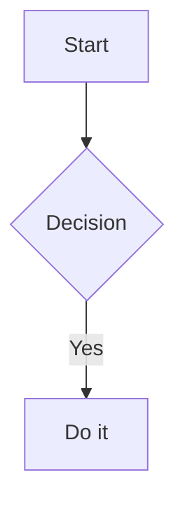

# figaro — Product & Behavior Specification

## Overview

This document is the product and behaviour contract for figaro. It describes the user-facing experience and the rules that preserve the local-first, file-portable model.

figaro is a desktop Markdown workspace with vault-based file management, quick-note capture, a hashtag-driven Kanban board, a date-aware calendar, backlinks, sticky heading hierarchy and a contextual document Outline, session-persistent tabs, local Git history, eighteen themes, sixteen bundled fonts, optional Vim mode, KaTeX math, live diagrams, editable Draw.io SVGs, and interactive browser-backed PDF export. All content lives in a folder chosen by the user: no accounts, cloud service, sync engine, or proprietary note database.

Tech stack: Go backend (Wails v2, using WebKitGTK on Linux), vanilla JavaScript frontend (CodeMirror 6, codemirror-live-markdown, KaTeX, markdown-it, Mermaid, Vega, and Vega-Lite), with browser dependencies vendored in the frontend bundle.

Markdown renderer compatibility: the printable renderer uses Markdown-It 15.0.0, and all ten bundled `@mdit` packages declare `markdown-it ^15.0.0` as their peer contract. Those packages comprise the directly selected anchor, footnote, KaTeX, mark, subscript, superscript, and task-list plugins plus their helper, inline-rule, and TeX implementation dependencies. Upgrade Markdown-It only after all ten packages support the new major and the separately vendored core runtime is regenerated and verified.

---

## 1. UI Layout

### 1.1 Shell
- Three horizontal zones: **left sidebar**, **workspace**, and an on-demand **right sidebar**. Both sidebars have independent resize handles. Each handle is a labelled vertical separator in the keyboard order while its pane is exposed: Left/Right moves the physical separator by 8px, Shift accelerates that movement to 32px, and Home/End chooses the pane's minimum/maximum width. Keyboard focus adds only a short centered marker rather than painting the complete divider.
- **Top bar**: a panel-shaped sidebar toggle and app title/Home control on the left; a clear draggable center region; a `?` Figaro-help button immediately before Settings, followed by native-style minimize/maximize/close controls on the right. Icon-only sidebar, window, and details-pane controls expose explicit action names to assistive technology. The help button and other action buttons deliberately retain the link-style pointer cursor.
- **Pure mode** applies to an active file editor whenever the left sidebar is collapsed; there is no second command or opt-out from that relationship. The workspace then starts at the physical top and reaches the physical bottom of the window; the 44px left rail and its continuously visible sidebar toggle remain. An already-open right details pane keeps its exact mode and mounted contents but becomes zero-width, inert, pointer-transparent, and absent from the accessibility tree until the sidebar expands; Pure mode never destroys or silently closes that work. A transparent 28px top-edge approach/drag strip above the document retains the native Wails drag region while tabs, help, Settings, dirty state, and window controls recede, leaving the document directly operable below it. Entering that upper band or moving keyboard focus into its tab/window controls expands and fades the existing 44px title bar back as an overlay without changing editor geometry. Breadcrumbs, sticky headings and their scroll margin, and the Document outline launcher are omitted for the complete Pure session, including during that reveal. Empty **Add properties** keeps its measured top slot but fades until the pointer enters that slot, the caret is on the first source line, or keyboard focus reaches it; populated Properties remains document content. Pointer or keyboard focus on the persistent sidebar toggle does not hold the unrelated tab rail open. The rail's secondary Quick note, Calendar, Kanban, and Graph controls similarly fade until the rail is hovered or contains focus. Expanding the sidebar restores the normal shell and any suppressed details pane; activating Home, Settings, Calendar, Kanban, Graph, Backlinks, or any other non-file workspace also leaves Pure mode. Reduced motion makes every reveal immediate.
- **Pure writing behavior** remains deliberately confined to Pure mode so the expanded editor behaves conventionally. Enabled-by-default typewriter scrolling gives the first and final lines enough measured canvas to share the same anchor as the middle of a long note, and retargets each authored typing, deletion, completion, or paste transaction toward 42% of the physical editor viewport with a cancellable 120–220ms ease. It never reacts to pointer placement or drag selection, Find, a non-empty selection, task-checkbox/widget actions, tab restoration, link or result navigation, or programmatic document replacement; a new input retargets the in-flight motion instead of queuing it, pointer/wheel input cancels it, and reduced motion writes the final offset immediately. **Settings → Appearance → Pure mode** can disable Typewriter scrolling; choose a **Focus scope** of **Off**, **Phrase**, or **Paragraph**; and opt into **Adapt text to window size**. Phrase uses the browser's locale-aware sentence-like segments inside the nearest Markdown paragraph/list item/quote/heading/code/table block and falls back to that block; Paragraph keeps that complete structural block present. Either focus scope suspends for selection, pointer dragging, and Find, and dims only visible surrounding source/widgets without changing Markdown or geometry. Adaptive typography is disabled by default and couples font size with writing-column width across compact 94%, regular 100%, and spacious 108% bands, with hysteresis so a resize boundary cannot flutter. The permanent text size, temporary per-buffer scale, and configured text width remain the base values.
- Calendar, Kanban, and Graph live in a fixed footer below the file tree as browser-style tabs attached to the workspace's left edge. Each is flat while inactive, then becomes borderless, opens on its right edge, and masks the theme rail and idle resize tint along its row so it blends into the central workspace when selected. Every border channel stays transparent during pointer press and selection; this side-connected variant transitions only its surface and text color, so no light border frame can flash between states. The upper and lower junctions at that open workspace edge use radius-matched concave corners, avoiding square notches without turning the connected tab into a pill. Hover, keyboard focus, or dragging may still reveal the resize separator. All three stay open when reselected and remain absent from the title-bar tab rail. Graph retains one all-notes canvas session. Settings retains its title-bar workspace tab and active-click exit transition. Clicking the Figaro name opens the un-tabbed workspace overview.
- **Status bar** fixed at the bottom as two aligned regions. The application-status region follows the file-tree boundary through its 225–500px expanded width and 44px collapsed rail; it shows live status text ("Ready"), startup progress, the delayed activity spinner, an optional adjacent action such as deletion **Undo**, and a persistent file-attention action only while diagnostics exist. In the collapsed rail, full live text remains available to assistive technology and through the shared tooltip, a compact activity mark replaces the visible sentence, startup retains a 20px progress track, and **Undo** remains operable. The remaining buffer-status region has two anchored groups: committed **Changes**, the contextual **Save to history** action, backlinks, Markdown/source-language or Vim mode, the active file buffer's **Scale**, and UTF-8 encoding are left-justified; cursor position, word count, character count, and reading time (words ÷ 200 wpm, minimum 1 min) are right-justified in that order. **Scale** resets temporary buffer scaling to the permanent Settings default. Backlink and Changes counts are native buttons: unavailable zero states are disabled, while actionable counts open with Enter/Space. **Save to history** appears only while the active file has a version waiting to be recorded; it safely saves pending text and records only that file, then hides again. While the editor owns focus, the application text is exactly **Ready**, and no action, delayed activity, vault progress, or file diagnostic is present, every footer item becomes transparent while the row keeps its fixed 24px layout footprint and opaque themed surfaces. Hover anywhere on the row, move into either empty margin outside the centered Markdown writing column, or move keyboard focus within the footer to restore both complete groups; pointer observation does not add an overlay or interfere with native editor scrolling and selection. Any non-ready message, action, spinner, progress panel, or file diagnostic restores its relevant control immediately. Ctrl/Cmd+mouse-wheel scaling likewise restores the complete normal-mode row for three seconds, resetting that interval on every handled wheel gesture, so the resulting **Scale** is observable before the quiet-state fade resumes. In Pure mode, ordinary footer content is permanently transparent and noninteractive: its application live region remains assistive-only, hidden actions cannot receive focus, and every buffer item is absent except the actual word count at the bottom-right. The sole visible exception is an active warning/danger file-attention button at bottom-left, because suppressing a work-at-risk condition would undermine data confidence. Reduced motion therefore has no footer transition to remove in Pure mode. The footer keeps its fixed single-row contract at narrow widths, removing extended buffer metadata and then lower-priority reading/word details instead of wrapping. Only the application text and the dedicated file-attention announcer are `aria-live`; changing buffer telemetry is not announced.

- **Calendar status exception**: while Calendar is selected, the shared footer retains its fixed 24px row so switching to Kanban, Graph, or a document cannot resize the workspace. The file-tree-aligned application-status region remains visible and live; only the meaningless main-pane buffer-status region is hidden and non-interactive.

### 1.2 Left Sidebar
- The top of the sidebar is the **global note search** combobox; its filled field has no resting or hover border, while keyboard focus retains the shared accent halo and validation retains its semantic boundary. The compact count circle is absent initially, during loading, and for zero matches; it appears only when one or more matching results are open, then hides again when the search is cleared, dismissed, or used to open a note. Its keyboard-navigable result list opens below the field, exposes the selected option through `aria-activedescendant`, and keeps focus in the field when Escape clears the popup. Above 120 matches it mounts a moving 96-row window while retaining the complete logical list, scrollbar range, accessible position/set size, and keyboard reachability.
- A compact, borderless **Quick note** action directly below search, and the application-wide **Ctrl/Cmd+N** shortcut, create and open a collision-safe timestamped Markdown file in the real `Inbox` folder. Its accent icon, tonal rest/hover surfaces, keyboard focus halo, and collapsed-rail action remain available.
- The remaining space is the **Vault** file tree. It is one page-level Tab stop whose roving focus belongs to the last focused row (falling back to the active document or first visible row), rather than to a generic container. Once inside, Up/Down traverse visible rows without opening them, Home/End jump to the boundaries, Right expands a folder or enters its first child, Left collapses a folder or returns to its parent, Enter activates the focused row, and Space toggles its operation selection without opening it. Every selected row uses the same accent-tinted surface and heavier label without a leading stripe, outline, or shadow; `aria-selected` and the independent keyboard-focus outline preserve the state contract. The active document retains `aria-current="page"` but no separate tree background because the active tab identifies the open buffer. Markdown and files recognised by CodeMirror's language registry open normally. Unsupported/binary assets use normal-opacity semantic or generic file icons, remain keyboard-navigable and selectable, expose Cut, Copy, Rename, Appearance, Pin, Reveal, and Delete, and advertise through the row tooltip that they can be double-clicked into the operating system's default application without replacing the current buffer. Above 400 visible logical rows the tree mounts a moving 160-row window; hierarchy levels, focus, current-document state, selection, context-menu focus restoration, drag behavior, scrollbar range, and distant keyboard activation remain path-based rather than DOM-position-based.
- A file that Figaro deliberately excluded from editing or indexing retains that same semantic/custom icon and row height, then adds an approved warning or danger tint and trailing alert glyph. Hover and keyboard focus expose the exact diagnosis and recovery guidance through the shared viewport-clamped tooltip; Enter/click selects the file and opens the shared diagnostic dialog instead of mounting an empty or stale editor. A collapsed ancestor shows the number of distinct affected files and the highest descendant severity. Warning means the file was safely skipped or a secondary capability is degraded; danger means the file is unreadable or current work may not persist. Color is never the only signal.
- A fixed tool footer keeps Calendar, Kanban, and Graph reachable beneath the tree. Each owns one de-duplicated, session-only, left-connected central workspace whose selected surface masks theme-specific rail and idle-resizer paint across its row; title-bar, overflow-menu, drag, and keyboard tab projections exclude all three sidebar-owned destinations. Calendar defaults to **Month** and retains a session-only **Month / Timeline** segmented choice. At normal desktop widths Month divides the central workspace into equal halves, centers the month horizontally and vertically in the left half, and scrolls selected-day results independently in the right half without a middle separator; it stacks those regions at narrow widths. Timeline uses the full Calendar surface for a horizontally scrollable centered 42-day run, stacking note pills beneath their dates and silently refreshing its outer two-week buffers. Calendar keeps the fixed status-bar row in either presentation, hides only its main-pane buffer telemetry, and releases Timeline DOM/cache state when another workspace takes over. Vertical wheel input over the month grid browses one month backward or forward, accumulating small trackpad deltas into a deliberate step; wheel input over the selected-day details retains native result scrolling, while vertical wheel input over Timeline maps to its horizontal track. Kanban keeps its board renderer while open, and Graph keeps its canvas session and deferred refresh policy.
- The sidebar can be resized from **225px to 500px**. Collapsing it leaves a **44px tool rail** rather than removing navigation; Quick note and all three workspace tabs remain directly usable there without changing the selected central workspace. Its expanded/collapsed state and expanded width, expanded folders, the active document and last focused tree row, recent files, and search filters are stored for the current webview profile. The collapse state is mirrored before the first shell paint so a restored rail never flashes at expanded width.

### 1.3 Right Sidebar
- The right sidebar is closed by default and is reserved for **History**, **Document Outline**, **Raw Text Preview**, and **PDF Preview**. Opening one replaces the others. Graph keeps its controls and interaction on the canvas rather than adding a right-pane mode. While closed, the mounted zero-width pane is `aria-hidden` and inert, so its Close control and descendants cannot remain in sequential keyboard focus.
- Clicking or pressing Enter/Space on an actionable committed-history button opens the History view for the active file.
- A compact nested-list launcher near the editor's top-right appears only for Markdown notes with headings. Its heading-tree glyph is deliberately distinct from the top bar's workspace-panel toggle. It sits below every visible sticky-heading row rather than covering that hierarchy. It opens **Document outline**, which lists typed nested H1–H6 headings, ignores frontmatter and fenced-code examples, highlights the current cursor/reading section, and focuses the editor at the selected heading. The launcher hides while this pane is open and returns when it closes.
- Its width can be resized from **240px to 480px** for the current session.

### 1.4 Workspace
- On the first shell frame, the workspace reuses webview-local mirrors of the last confirmed bundled theme, fonts, and normalized sidebar width while vault settings remain authoritative; its application status says **Starting Figaro…**, never the premature **Ready**. After the native bridge connects, the portable session and saved tab size, link style, automation, Vim, line-number, sticky-heading, block-guide, outline, diagnostic, spellcheck, and editor-navigation preferences hydrate concurrently behind one barrier. Figaro then restores inactive tabs as metadata and reads and mounts only the selected file. The editor stays concealed for two layout frames while CodeMirror settles its real line-number gutter and restored geometry, then becomes visible and interactive with one authoritative preference profile before `StartVaultLoad()` begins. The initial file tree, full-vault search/planning index, and language parsers may continue warming after that reveal. The frontend subscribes before the start request and immediately reconciles `GetVaultLoadStatus()`, so every phase is observable without a subscribe/start race. A compact accessible indicator in the file-tree-aligned application-status region progresses from **Discovering notes…** through the exact `loaded / total` Markdown-note count and finalization; it hides on success and remains visible on an index error. `window._appReady` is set only after the eager work has settled.
- File-tree note activation reads one snapshot, validates that it is editable, and hands that same content and modification time to tab mounting. The tab never performs a duplicate read for that activation; a dirty existing buffer remains authoritative over the prepared disk snapshot.
- A connected rounded **tab rail** occupies the title bar between the left application controls and right window controls. Its leading edge follows the live sidebar boundary at the expanded 225–500px width or collapsed 44px rail, with the leftmost tab flush to the buffer, while each tab's lower edge meets the workspace below. Themes with a visible file-tree rail paint that 1px rule outward on the shared buffer boundary, coincident with the leading tab outline rather than on the adjacent file-tree pixel; borderless themes remain transparent there. Divider ownership stays on the title bar in every empty or populated state; themes that expose the divider keep one continuous line and let the active tab cover only its own segment, while Figaro Dark and Figaro Light make that seam transparent. Compact tabs use a responsive 104–200px width, preserve both ends of long filenames, show a muted parent path for nested notes, keep their close controls accessible, and connect the active document to the editor surface with 8px convex top corners, inverse 8px lower junctions, and no bottom border. In the native pair, that shared editor color is the active-tab indication and inactive tabs inherit the titlebar/file-tree color without an outline. The full filename and vault path form each tab's accessible name and tooltip. Left/Right/Home/End switch tabs while retaining focus on the newly mounted active tab, so multiple arrow presses continue through the rail. Vertical mouse-wheel input over the rail and the application-wide Ctrl+PageUp/PageDown shortcuts move one buffer in either direction and stop at the first or last tab; small high-resolution wheel deltas accumulate before one switch, while horizontal or modifier-assisted wheel gestures retain native scrolling/zoom behavior. The visual scrollbar is hidden, the active tab is always scrolled fully into view, and subtle themed edge fades indicate additional tabs. Measuring the overflow-only all-tabs control preserves the current horizontal offset, so an active tab revealed at the leading edge remains flush just like a tab in a short rail. The keyboard-accessible all-tabs menu appears only while the rail genuinely overflows and lists each complete title plus parent path. Tabs and their controls are native no-drag targets; unused title-bar space remains draggable and double-clickable for native window movement/maximization. A dirty tab uses a compact warning dot. In the file tree, tab switches update only the non-visual `aria-current` marker; the selected surface belongs to tree-operation selection, while every unsaved file buffer gets a warning dot and an assistive “Unsaved changes” status. These mounted states update without rebuilding the tree. An optional, disabled-by-default breadcrumb can show the active note's vault-relative path between the title-bar rail and editor.
- The main pane's upper-left corner uses the shared 8px tab radius whenever the active title-bar tab is not the first displayed tab. Every mounted editor/panel surface inherits that curve, visible theme divider and sidebar-rail segments pause around it, and the main-layout underlay matches the sidebar surface so neither a square rule nor a differently colored square canvas remains underneath. Hovering the inactive first tab carries its hover surface through the cutout and stacks that tab above the 1px divider mask so no contrasting wedge or double-painted line appears. Selecting the first tab removes that host radius and restores the complete rules so its lower edge remains one uninterrupted surface with the editor.
- Browser and native window titles use the active document first, for example `Project brief.md — Figaro`; the un-tabbed workspace uses `Figaro`.
- Below it, **view containers** — only one is visible at a time:
  - **Editor view** — for Markdown and CodeMirror-supported code files. Shows file content immediately once loaded.
  - **Calendar workspace and Calendar/Relationships results views** — for the central month planner, date searches, and note relationships.
  - **Kanban board view** — the full kanban board.
  - **Graph view** — an interactive projection of saved Markdown notes and
    their vault-local links. One stable full-vault layout anchors filtered
    nodes; large canvases paint interruptible latest-only frames so search,
    trace selection, pan, and zoom never expose a partial replacement.
  - **Today dashboard** — a centered, un-tabbed daily launchpad with today's note, Quick note, Inbox, unfinished tasks, pinned items, recent notes, and rediscovery.
  - **Settings view** — typography, editor, automation preferences, and
    packaged application information.
  - **Draw.io view** — the embedded diagrams.net editor for `.drawio.svg` files.

### 1.5 Theming
- **Theme engine**: 18 built-in themes selectable from the Settings tab (Figaro Dark, Figaro Light, Figaro CRT Phosphor, GitHub Light/Dark, Catppuccin Mocha/Macchiato, Zenburn, Gruvbox Dark/Light, Nord, One Dark/Vivid, Night Owl, Cobalt2, Ayu Dark/Mirage/Light). All colors are defined as CSS custom properties on `:root`.
- **Figaro theme philosophy**: Figaro Dark and Figaro Light are a matched, dog-inspired pair. Each uses one quiet midnight-fur or ivory-paper navigation surface across the titlebar, file tree, and application-status region, plus one uninterrupted reading surface across the active tab, CodeMirror disclosure gutter, editor, and buffer-status region. Figaro Dark makes that reading plane subtly brighter than its navigation plane so the active buffer remains immediately distinguishable without a structural border. A writing-surface border budget removes decorative outlines from inactive rendered code, both collapsed and expanded Properties, its metadata, unused stable-footprint space, sidebar search/capture surfaces, and selected file rows. Physical boundaries remain for semantic structure such as table grids, individual fields, internal section dividers, keyboard focus, errors, and destructive states; selection keeps independent tonal, typographic, and accessible cues. Structural borders and alternate-color strips at the tab/editor and file-tree/editor seams are removed; the sidebar-tools divider and buffer-status separators remain deliberately faint. Collar red is reserved for intentional actions and focus, brass for tags and highlights, and both palettes share semantic success, information, warning, and error roles.
- **Figaro CRT Phosphor**: adapts the MIT-licensed Phosphor Design System's deep green, luminous phosphor, amber, cyan, and red roles using the locally bundled JetBrains Mono stack, with an optical treatment adapted from MIT-licensed afterglow-crt. It removes the luminous frameless-window outline and internal shell seams in favor of 3px dark overscan, 80px/140px inset glass falloff, a smoother radial vignette, 35%-strength 2px horizontal scanlines, and a 6px phosphor text bloom. A seamless 128px multi-level high-pass dither tile adds at most 3/255 luminance variation, breaking up dark-gradient contours without changing geometry or requiring a display-sized map. The glass flicker, sub-pixel overlay warp, and brightness breathing run independently over 12, 18, and 24 seconds without transforming application content. A softened 140px beam appears once in each 60-second cycle. Reduced-motion preferences suppress all four animations while retaining the vignette, dither, scanline texture, overscan, and text bloom.
- Home's small eyebrow, card kicker, metadata, source, loading, empty, and notice copy uses the semantic muted-text token rather than the lower-contrast dim token; all three Figaro themes keep that small text at or above 4.5:1 against its rendered surface.
- Built-in theme CSS is bundled under `frontend/themes/`. Every theme is a token-only `:root` override: required palette tokens plus optional semantic, art-direction, vignette, texture, dither, glass-animation, and beam values are declared by `frontend/design-system/theme-contract.json`, while stable selectors consume them in `theme-surfaces.css`. Palette-only themes inherit inert screen-effect defaults. The selected theme remains authoritative in `vault/.config/settings.json`; after a successful load, its exact bundled identifier and resolved font properties are mirrored locally only to paint the next launch's first frame, then replaced by the vault-backed values.
- Switching themes applies instantly without page reload — the theme CSS is injected into `<style id="theme-style">` via the Go backend API.
- **Style architecture**: both entry points eagerly load the order in `frontend/design-system/style-manifest.json`: `tokens.css`, responsibility-based modules under `frontend/styles/`, `primitives.css`, then `theme-surfaces.css`. `frontend/styles.css` is a synchronized compatibility aggregate only; normal startup uses explicit links and performs no interaction-time style loading.
- **Design-system catalogue**: `frontend/design-system/index.html` is a searchable inventory of the shared production primitives, intentional feature variants, states, selectors, and computed tokens. The application and catalogue both load the complete canonical style manifest; `approved-components.json` records the nineteen explicitly approved families and variants, including segmented choices, the connected title-bar and borderless side-connected document-tab variants, and graph canvas. Pickers, steppers, compact, segmented, and icon actions, badges, menu presentation, tooltips, fields, checkboxes, date pickers, notices, document tabs, source-code fold arrows, typed Markdown block guides, graph canvases, indeterminate activity, skeleton loading, and determinate progress use those common `.ui-*` foundations; feature classes retain behavior and deliberate host layout, while card layouts and switch-versus-checkbox semantics remain distinct. A small fixed set of two to four short, known choices uses the segmented-choice primitive; comboboxes are reserved for variable, extensible, or longer option lists. A new component family, primitive, or visual variant requires explicit approval before implementation. The catalogue works both from the local development server and when opened directly from a file explorer: relative CSS, theme, font, and icon paths remain inside `frontend/`, while an eagerly generated classic-script bundle avoids `file://` module and JSON-fetch restrictions. The bundle imports `frontend/themes/manifest.json` at build time, so the selector still has one canonical theme list and applies each existing theme CSS file. `catalog.css` styles only the review shell and contains otherwise positioned overlays. Select-only Settings specimens eagerly reuse the production combobox enhancer, so their button/listbox popup follows the active theme instead of exposing a host-painted native menu. Pure manifest/path/filter rules are separate from fetch and DOM effects.
- **Tooltip convention**: concise hints use the canonical `.ui-tooltip` surface derived entirely from active-theme tokens. The eager controller adopts static and dynamically mounted `title` hints into `data-ui-tooltip`, delays pointer hover briefly, opens immediately on keyboard focus, adds a non-destructive `aria-describedby` association, clamps or flips within the viewport, and dismisses on Escape, ordinary activation, scrolling, resizing, or window blur. Escape suppresses the current hint only until pointer or keyboard focus leaves its owner; a later return can expose the hint again even when focus passed through a control without its own hint. Disabled controls instead show their explanation when pressed or clicked; disabled hidden switch inputs use their visible label as the hover, activation, and geometry surface. Iframe titles remain native accessible names. Calendar activity, managed-file guidance, and Markdown link previews reuse the same surface with feature-owned rich content; CodeMirror autocomplete and diagnostic lists remain separate interactive popovers.
- **Fonts**: 16 locally bundled choices, including Inter, Figtree, Atkinson Hyperlegible, IBM Plex Sans, Fira Sans, EB Garamond, Crimson Pro, JetBrains Mono, and Work Sans. Font selection is persisted and never requires a runtime network request.

### 1.6 CSS Custom Properties (Theme Variables)
Each theme defines these properties (with theme-specific colors):

| Category | Variables |
|----------|-----------|
| **Core colors** | `--bg-color`, `--sidebar-bg`, `--panel-bg`, `--text-color`, `--text-muted`, `--text-dim` |
| **Accent** | `--accent-color`, `--accent-hover` |
| **State backgrounds** | `--active-bg`, `--hover-bg` |
| **Borders** | `--border-color`, `--border-light` |
| **Semantic** | `--danger-color`, `--danger-hover`, `--success-color`, `--warning-color` |
| **Scrollbar** | `--scrollbar-track`, `--scrollbar-thumb`, `--scrollbar-thumb-hover` |
| **Selection/Focus** | `--selection-bg`, `--focus-ring` |
| **Shadows** | `--shadow-sm`, `--shadow-md`, `--shadow-lg` |
| **Typography** | `--font-sans`, `--font-mono`, `--font-size`, `--font-size-sm`, `--line-height` |
| **Cursor** | `--cursor-color`, `--cursor-bg`, `--cursor-text` |
| **Markdown syntax** | `--heading-color`, `--bold-color`, `--italic-color`, `--link-color`, `--link-hover-color`, `--url-color`, `--hashtag-color`, `--code-bg`, `--quote-color`, `--quote-border`, `--highlight-bg` |
| **Callouts** | `--callout-note-color`, `--callout-warning-color`, `--callout-info-color`, `--callout-tip-color`, `--callout-danger-color`, `--callout-example-color` |
| **Code highlighting** | `--code-keyword-color`, `--code-string-color`, `--code-number-color`, `--code-function-color`, `--code-comment-color`, `--code-type-color`, `--code-variable-color`, `--code-operator-color`, `--code-builtin-color` |
| **Layout** | `--sidebar-width`, `--top-bar-height`, `--status-bar-height`, `--tab-height` |
| **Transitions** | `--transition-fast` (shared 140 ms timing) |
| **Shared controls** | `--ui-control-height`, `--ui-control-radius`, `--ui-control-padding-x`, `--ui-compact-height`, `--ui-menu-radius`, `--ui-item-radius`, `--ui-badge-height` |

---

## 2. Tab System

### 2.1 Tab Types

| Type | ID pattern | Purpose |
|------|-----------|---------|
| **File** | `path/to/note.md` | Opens a Markdown or CodeMirror-supported source file for editing |
| **Draw.io** | `path/to/diagram.drawio.svg` | Opens an editable Draw.io SVG diagram |
| **Calendar date results** | `calendar-YYYY-MM-DD` | Shows Markdown notes that mention a specific date |
| **Calendar workspace** | `calendar-workspace` | One sidebar-owned central Month/Timeline workspace; the persistent control reuses it without adding a title-bar tab |
| **Relationships** | `backlinks-path/to/note.md` | Shows contextual backlinks and unlinked plain-text mentions for a note |
| **Kanban** | `kanban` | One sidebar-owned Board/Gantt workspace; persistent control, hashtag, and dashboard entry points reuse it and may update its focused column without adding a title-bar tab |
| **Graph** | `graph` | One sidebar-owned session-only all-notes workspace for exploring saved note links without adding a title-bar tab |
| **Today dashboard** | No tab ID | Daily note, capture, review, tasks, pins, recent notes, and rediscovery |
| **Settings** | `settings` | Application settings for theme, fonts, editor layout, automation, and the packaged version |
| **Vault health** | `vault-health` | Read-only vault-maintenance findings opened from Settings |

### 2.2 Tab Behavior
- **Deduplication**: Opening a resource that already has a tab simply switches to it.
- **Dirty indicator**: A compact accent dot appears on unsaved file tabs as soon as any edit is made.
- **Auto-save on switch**: When the user switches away from a dirty file tab, Figaro caches its current content and queues a save. The destination can open immediately; a failed save leaves the source tab recoverable from its cache.
- **External activation**: An external tab keeps its opaque source capability and is not selected until that capability read succeeds. A failed or superseded read leaves the previous tab and editor buffer active, so the visible title and document owner cannot diverge.
- **Save conflict**: If a file's modification timestamp changed externally, Figaro asks whether to overwrite it with the local version. Cancelling preserves the dirty tab and its in-memory snapshot; Figaro never silently discards the local edit.
- **Save failure**: A native write error keeps the latest in-memory buffer dirty and presents a blocking danger dialog even in Pure mode. It names the file and concrete cause, states that the open buffer is preserved, and offers **Retry** using the latest text, **Copy unsaved text**, or **Keep editing**. Disk-capacity errors use the dedicated **Disk full — saving is blocked** title, warn that workspace-state and Git writes may also fail, and persist as one grouped danger incident until affected writes succeed. Auto-Save reports once per continuous failure episode; a successful save clears the episode, while an explicit save can surface it again. A failure waits for an already-open application modal instead of replacing it.
- **Startup file confidence**: Normal background indexing checks Markdown metadata before allocation, rejects files above 50 MB without reading them, and isolates NUL-containing binary data, invalid UTF-8, and read errors without aborting healthy-note indexing. Startup findings update the tree/status state but never open a modal. Semantically unchanged snapshots publish no state change, preserving mounted tree rows, open context menus, keyboard focus, and managed-file double-clicks while background checks repeat. Malformed `settings.json` is first renamed to a timestamped `settings.invalid-*.json` backup, then safe defaults are written and a warning explains the recovery. A Git repository that cannot be opened reports degraded local history while leaving note editing and saving available. Deeper history failures surface when the relevant history operation runs rather than through an expensive startup `fsck`.
- **Cursor memory**: Each file tab continuously remembers its latest cursor/selection. It is restored after switching back or closing a workspace view such as Settings, and is included in the portable session for restart recovery.
- **Undo ownership**: Each open file buffer owns independent Undo and Redo state. Activating another file swaps the shared CodeMirror view to that buffer's history—even when both files contain identical text—and the incoming document load is not undoable. Returning to an unchanged open buffer restores its earlier operations; if its source changed externally while inactive, Figaro discards the stale history instead of mapping old edits onto new text. No operation from another tab can replace its contents.
- **Close button (✕)**: Every tab has a close button, always visible even when tabs are narrow. Closing a dirty file tab prompts for confirmation.
- **Middle-click**: Middle-clicking any tab closes it immediately.
- **Pin tab**: Right-click a tab and choose "Pin Tab" to pin it. Pinned tabs stay at the leftmost position and use an accented file icon plus stronger title. Pinning persists across restarts.
- **Drag reorder**: Tabs follow primary-pointer movement directly after a small drag threshold instead of relying on native HTML drag-and-drop. Dragging anywhere except the close control reorders the tab, suppresses native text selection across the complete application while the gesture is active, and shows a precise before/after marker. The selection guard begins only after the threshold and is removed on drop or cancellation, so normal selection elsewhere is unaffected. Pinned and unpinned tabs remain separate groups so a drag cannot accidentally unpin or pin a tab. Cancellation leaves the order unchanged, and the resulting order persists with the session.
- **Safe empty state**: Closing the final tab keeps the centered workspace overview visible instead of leaving the workspace blank or creating a synthetic tab.
- **Session persistence**: Open tabs, active tab, cursor positions, expanded directories, pinned tabs, active document, and last focused tree row are persisted to `vault/.config/session.json`. The webview also keeps UI-only preferences such as recent files, search filters, Kanban density and flow, the editor-breadcrumb toggle, and a local tab snapshot in `localStorage`; the vault session is the portable workspace record.
- **Graph workspace**: The fixed **Graph** side tab selects one deduplicated, session-only, all-notes central workspace; pressing the selected control keeps that workspace open. The native projection reads the already-built saved-note index rather than walking the vault again. Nodes carry their vault path, display name, first-folder group, daily-note state, and incoming/outgoing degree. Directed edges include exact Markdown and Wikilink targets, case-insensitive exact paths, and only unambiguous basename targets; missing, ambiguous, duplicate, and self links are omitted. A 224px maximum name/path search, borderless zoom group, and **Orphans** `aria-pressed` choice float together at the canvas top-left; there is no toolbar row, graph filter launcher, group legend, or Graph right-pane mode. Daily notes remain ordinary graph members. Directed arrows are always clear, while deterministic layout uses fixed 45/45 spacing and link pull without exposing tuning controls. A direct note color overrides inheritance; otherwise the closest colored ancestor directory supplies the base, with deeper descendants receiving progressively brighter tints. Unstyled top-level groups consume the same accent palette used by **Customize appearance** before deterministic generated hues extend it. A note-specific valid Lucide icon replaces its generic circle. The canvas surface does not change on hover: hover traces direct links temporarily, plain click pins the same trace until another node or empty canvas is clicked, and Ctrl/Cmd-click opens that note. Dragging pans; the wheel and `+`/`-` controls zoom; `0` fits; arrow keys pan; `[`/`]` pin a trace; and Enter opens the keyboard-selected note. The existing status bar says **Hover or click to trace links, ctrl+click node to open the file** and replaces irrelevant buffer telemetry rather than drawing a second footer. An inactive Graph workspace defers graph and appearance refresh work until it is activated. Unsaved editor text does not enter this saved-note projection until the normal save/index update succeeds, and Graph is intentionally not restored across launches.
- **Exit protection**: Closing the native window with dirty file tabs offers **Save and exit**, **Exit without saving**, or cancellation. **Save and exit** closes only after every requested write succeeds and no newer edit remains dirty; a failed or conflicted save returns to the blocking save-failure flow with the window and buffers intact.
- **Overflow**: Tabs keep their compact responsive width and a hidden visual scrollbar. Opening, selecting, restoring, pinning, or choosing a tab from the overflow menu minimally scrolls the rail until that active tab is fully visible. Themed fades mark whichever edges contain more tabs, and the all-tabs button is present only while the full-width rail cannot fit every tab.

### 2.3 Opening and Switching
- Opening a tab checks if it already exists; if so, it switches to it. A `forceNew` override allows creating a duplicate.
- File clicks from the sidebar or links open in the "main" file slot (replacing the current file tab rather than stacking).
- Switching tabs hides the previous view, shows the appropriate view for the new tab, and restores state (editor cursor, scroll position, etc.).

---

## 3. File Operations

### 3.1 Vault
- A single root folder (created on first run if missing).
- All file paths are normalized to forward slashes and validated to prevent escaping the vault root.
- **Dot-files hidden**: Files and directories starting with `.` (such as `.config/`) are excluded from the file tree UI and from kanban/calendar scans.
- **Vault configuration**: Portable, vault-specific state that requires persistence (e.g., kanban column colors, theme selection, vim mode, and workspace session) is stored in `vault/.config/` as JSON files. Host-specific window state and the selected PDF-browser executable are exceptions and follow the machine-local contract in section 24.
- A new empty vault receives a welcome note; existing vault contents are never replaced.

### 3.1a External Markdown Launches

- Figaro keeps one desktop process. A later operating-system launch forwards its `.md` arguments, resolved against that launch's working directory, to the existing process and brings the existing window forward instead of opening another window.
- A `.md` document passed by the operating system at the initial or a forwarded launch asks whether to import when it is outside the selected vault. Forwarded requests use the same serialized choice flow as startup; a startup snapshot and a simultaneous runtime event claim each opaque document capability only once.
- **Import note** immediately copies the source through the normal non-overwriting path, refreshes the vault tree, and opens the returned vault destination. **Keep outside vault** opens an editable external tab and adds a process-local shortcut at the file-tree root with a distinct `FileSymlink` default icon.
- Saving an external tab writes to the exact original document with optimistic modification-time conflict detection. Its temporary root shortcut never enters the workspace session, recent-notes list, vault index, Kanban, Calendar, or Git history.
- The existing final **Delete** context-menu action is relabelled **Remove from file tree** for an external shortcut rather than adding a second action. Confirmation explicitly states that the original will not be deleted or modified; removal closes its external tab after normal dirty-tab protection and performs no backend filesystem mutation.
- Dropping native files or folders onto a file-tree folder or the empty vault-root target asks whether to import into that exact destination before any copy begins. The dialog explains that import copies into the vault while leaving every original untouched; cancelling performs no backend copy.
- Dropping external files or folders on an editor buffer asks once whether to insert their filesystem paths into the document or import the full batch. A successful file import opens its new active editor tab; folder imports are recursive, preserve their structure, and retain the current buffer. Collisions receive the normal non-overwriting copy names, while cancelling changes nothing.

### 3.2 Supported Operations

| Operation | Behavior |
|-----------|----------|
| **Read file** | Returns file content and last-modified timestamp. |
| **Save file** | Writes content to disk. Accepts expected last-modified timestamp for conflict detection, incrementally replaces only that note's search, Kanban, tag, and Calendar contributions, and projects its final Kanban cards locally instead of reloading the complete board when the native watcher acknowledges the same save. |
| **Create file** | Creates a `.md` file with a `# Title` header and incrementally adds it to discovery data. Before writing, a same-folder Markdown name that differs only by spacing, punctuation, or capitalization offers **Open existing**, **Create anyway**, or cancellation. An exact case-insensitive name offers no overwrite path. |
| **Create directory** | Creates a new folder. |
| **Delete** | After confirmation, saves dirty open files under the target, captures the exact current path in local Git history, durably registers it in `.config/recently-deleted.json`, then removes the target recursively without moving it to the system Trash. A dirty Draw.io editor, failed archive, or failed recovery-record write leaves the target untouched. Successful deletion refreshes discovery data without stale cards, search results, backlinks, or dates and shows **Deleted “name” · Undo** for ten seconds. Restore publishes a complete staged reconstruction atomically, refuses to replace an occupied path, and removes only the restored recovery record. |
| **Move** | Moves a file or folder to a target directory. The live status bar immediately names the item being moved, the file tree is marked busy, and another drag cannot start the same operation until it settles. It prevents moving a folder into itself, rewrites affected Markdown and wiki links across the vault, refreshes affected open tabs, and rolls the move back if its link rewrite cannot complete. A validated warm index limits rewrite planning and moved projections to affected paths; any stale snapshot selects the complete root-scoped scan/rebuild before correctness can be traded for speed. If a same-named destination directory exists, it warns and offers a non-destructive recursive merge; cancellation writes nothing, while confirmation keeps existing files and names collisions `name (copy).ext`, `name (copy 2).ext`, and so on. |
| **Copy** | Saves dirty open source tabs, then copies a file or complete folder tree to an existing vault directory without changing the source. Existing entries are never overwritten: collisions become `Folder copy`, `Folder copy 2`, or `note copy.md`. Relative, root-relative, and wiki links inside copied Markdown are rewritten to preserve their resolved targets; incoming links elsewhere remain attached to the original. A current warm index and file-tree projection retain unrelated entries and add only the copied subtree, while exact watcher acknowledgements prevent a second refresh; unobserved external Markdown changes select the complete rebuild fallback. Copying a folder into itself or one of its descendants is refused because it would recurse. |
| **Rename** | Opens a contextual rename dialog showing the current folder. For files it initially selects the stem but leaves the extension editable; it validates unsafe names inline and disables an unchanged rename. After dirty source buffers are safely saved, Figaro previews exact incoming Markdown references. If any other notes reference the file, a second dialog reports their count and offers **Update references**, **Keep references unchanged**, or **Cancel rename**; no incoming references means no second question. The selected policy and filesystem rename are executed together before open-tab paths and affected notes refresh. A same-folder Markdown name variant still offers **Open existing**, **Rename anyway**, or cancellation before any open tab is saved or path is moved. Folder renames retain automatic link preservation. |

Markdown name comparison removes the `.md` suffix, applies Unicode compatibility
normalization and lowercasing, then ignores characters other than letters and
numbers. Identities shorter than four characters are not compared, preserving
short names such as `C++.md` and `C#.md`. Creation and rename prompts inspect
only direct siblings; a matching name elsewhere in the vault never interrupts
those workflows, and Figaro never merges notes automatically.

### 3.3 File Tree (Sidebar)
- Pinned siblings display first; within the pinned and unpinned groups, the backend's folder-before-file alphabetical order is preserved.
- Folders expand/collapse on click; the icon toggles between open/closed states.
- The tree uses `tree`/`treeitem`/`group` semantics, row levels, expanded state, multi-selection state, and roving focus. Tab enters only the current focus row; Up/Down, Home/End, and Left/Right move or reshape focus, Enter activates, and Space toggles operation selection. `aria-selected` and the single accent-tinted row surface belong only to that selection; the active editor/Draw.io tab retains `aria-current="page"` without another tree background. Structural refreshes preserve the focused row and scroll position, and the accent outline appears only for keyboard focus.
- **F2** on a focused vault file or folder opens the same validated rename dialog as the context-menu action. External shortcuts and the vault root are not renamed.
- **Delete** on a focused vault file or folder opens the same confirmation and Git-backed recovery workflow as the context-menu action.
- Copy/import, move/merge, rename, and delete mark the tree `aria-busy` while backend and refresh work is active. Their live status text appears immediately; the shared indeterminate spinner appears only after one second and clears on success, cancellation, or failure. Concurrent activity is reference-counted so one completed operation cannot hide another, and reduced-motion mode keeps a static indicator.
- Clicking an editable file focuses/selects its row and opens it in the editor. Clicking an unsupported file focuses/selects it without opening it or replacing the current buffer; the shared themed tooltip appears on hover or keyboard focus, and its persistent assistive description explains that it is not editable in Figaro and can be double-clicked into the operating system's default application. Clicking a folder focuses/selects and expands/collapses it.
- CodeMirror-supported source files (for example CSS, HTML, JavaScript/TypeScript, JSON, Go, Python, Rust, SQL, YAML, Dockerfiles, and maintained legacy modes) open in the same editor. Figaro starts warming all bundled language parsers immediately without holding the restored Markdown buffer behind that work, and waits for the warm-up before `window._appReady`, so the first post-ready switch to a source file does not trigger feature-code loading.
- Editable Draw.io diagrams use the .drawio.svg suffix. They open in the Draw.io editor while remaining normal SVG assets when embedded in Markdown. Renaming a referenced diagram uses the same update/keep/cancel reference review as every other referenced file.
- **Ctrl/Cmd+Click** or keyboard **Space** adds/removes any internal vault file or folder from the operation selection. Every member uses the same accent-tinted background and heavier label without an inset edge, regardless of selection count. External root shortcuts do not join this selection. Right-clicking inside the selection preserves the group; right-clicking another row makes it the sole target.
- **Ctrl/Cmd+X** cuts the selected tree file/folder set; every pending top-level source receives a scissors marker and assistive “Cut; ready to paste” status. The next **Ctrl/Cmd+V** moves the complete set into the focused folder or beside the focused file through the same safe move/merge and link-rewrite workflow as drag/drop. A successful paste clears the marker, partial failure retains it only for unresolved sources, **Escape** cancels Cut while the tree is focused, and Copy replaces it. **Ctrl/Cmd+C** copies the set instead, and copied items remain available for repeated pastes during the current application session. The context menu presents **Cut, Copy, Paste** in that order and shows faded platform shortcut hints, plus **F2** for Rename and **Delete** for Delete. Open, Rename, Appearance, Pin, Reveal, and Delete remain single-target actions when a group is selected. Raw Text/PDF preview commands remain in the editor context menu and Properties rather than the file-tree menu. A copy paste first saves dirty open files inside each source so every duplicate matches the visible editor content; a dirty Draw.io SVG must finish its independent explicit save first.
- Pasting into the source's parent creates a sibling copy. Names use a descriptive suffix before a file extension: `Archive` becomes `Archive copy`, then `Archive copy 2`; `report.md` becomes `report copy.md`. Draw.io copies retain the complete `.drawio.svg` suffix.
- Links are rewritten only within copied Markdown. A link to another copied item follows that new counterpart; a relative link leaving the copied tree is recalculated so it still reaches the original external vault item. Root-relative Markdown links and wiki links receive the copied path when their target is inside the copied tree. External URLs, fragments, fenced code, source files, and incoming links elsewhere in the vault remain unchanged.
- Pasting a copied folder onto itself or any descendant shows an **Operation refused** dialog explaining that the user should select its parent folder to create a sibling copy. No filesystem write occurs.
- Folder expansion is explicit user-owned state. The exact expanded-directory set is stored in the vault session and restored on startup; restoring or switching tabs never opens additional ancestors. Active-tab changes update `aria-current` without changing selection, focus, or the folder configuration.
- Collapsed folders do not mount their descendant rows. Expanding a folder renders its existing tree data on demand, preserving the same sorting, styling, keyboard, and context-menu behavior.
- Any vault file or directory can be pinned or unpinned from the context menu. Pinned entries retain their original parent, sort ahead of unpinned siblings, and show a themed Pin marker at the row's right edge. The top-level `Inbox` is effectively pinned when no explicit preference exists, while an explicit unpin overrides that default.
- Any internal file or directory can be right-clicked and assigned a searchable Lucide icon plus a shared Kanban-palette color, including managed-only assets. The picker shows up to ten recently used icons and a **Reset** action. Without an override, common Markdown/text, PDF, image, code/config, JSON, spreadsheet, archive, audio, video, shell, and Draw.io types receive semantic Lucide glyphs; unrecognized extensions use the generic File icon. The top-level `Inbox` has a default Mail icon. An explicit custom icon always wins. Appearance is persisted in the vault and follows rename, move, copy, merge, and delete operations.
- Pin and appearance preferences share the vault-scoped path presentation record and follow rename, move, copy, merge, and delete operations without one setting resetting the other.

### 3.4 Multi-Select and Merge
- Any internal vault files and folders can be selected with Ctrl/Cmd+Click or keyboard Space; external shortcuts remain single-target items. A selection may contain managed-only assets, which ordinary click/Enter activation never opens and which are never offered as merge sources; double-click or their single-target **Open** action delegates the exact regular vault file to the operating system's default application.
- **Right-click** a Markdown file builds merge candidates from the context file, active note, and the Markdown subset of the operation selection. The option is disabled unless at least two candidates are available.
- **Merge behavior**: The active note is normally the master (destination); if the context-clicked note is not already among the active or selected notes, it becomes the master. The remaining candidates appear as source checkboxes. Checked sources are appended in that candidate order, with `---` between non-empty notes.
- A styled confirmation dialog shows the destination note, a checkbox list of source notes, and a warning about permanent deletion.
- After merging, source files are deleted (with a fade-out animation), open tabs for deleted files are closed, and the file tree refreshes.

### 3.5 Drag & Drop (File Tree)
- Any file or folder label can be dragged.
- Drop targets are folder labels or the empty area of the tree (which means vault root).
- Visual feedback: the dragged item fades, the drop target highlights.
- On an internal drop, the status bar announces the pending move immediately and the tree exposes `aria-busy="true"`; further internal drags are ignored until that operation completes. The item is moved and the tree refreshes. If any open tab referenced the moved path, its ID is updated. A same-named existing destination directory is never silently replaced: Figaro offers to merge it, preserves both trees, and applies parenthesized copy names to file collisions. A native filesystem drop first asks to import into the targeted folder or vault root; only confirmation starts a copy. Native directory conflicts then use the same warning and merge rule while every external source remains intact.

### 3.6 File-Tree Context Menu
| Menu item | Available on | Behavior |
|-----------|-------------|----------|
| Open | Managed-only internal file | Opens the exact regular vault file in the operating system's default application, matching double-click. Directories, missing paths, traversal, and symbolic links are refused. |
| Open in New Tab | Markdown or CodeMirror-supported source file | Opens file in a new tab (doesn't replace current file tab) |
| Merge Notes | Selected Markdown file (2+ selected notes) | Appends checked source notes to the active/context-selected master with an interactive checkbox list. Disabled unless the operation selection contains at least two Markdown notes; an unselected open note does not satisfy that menu requirement. |
| Cut | File or Directory | Marks the selected internal set for one deferred move; the next Paste uses the safe link-aware move/merge workflow and retains unresolved entries after a partial failure. Shortcut hint: Ctrl/Cmd+X. |
| Copy | File or Directory | Places the selected internal set on Figaro's repeatable copy clipboard without changing the sources. Shortcut hint: Ctrl/Cmd+C. |
| Paste | File, Directory, or vault root (after Cut/Copy) | Moves a cut set or copies a copied set into a focused directory, beside a focused file, or into the vault root. Copy collisions receive a `copy` suffix and never overwrite existing content; moved/copied Markdown links preserve their resolved targets. Shortcut hint: Ctrl/Cmd+V. |
| New Draw.io Diagram | File, folder, or vault root | Creates an editable .drawio.svg diagram in the selected location. |
| Reveal in File Explorer | File or Directory | Opens the containing folder with the native Linux, macOS, or Windows file manager |
| New Note | File or Directory | Prompts for name, creates `.md` file in that directory, opens it |
| New Folder | File or Directory | Prompts for name, creates folder |
| Rename | File or Directory | Opens the validated contextual rename workflow. Shortcut hint: F2. |
| Customize appearance… | File or Directory | Opens the Lucide icon and color picker, including for managed-only files; Reset restores the semantic default icon and text color. |
| Pin / Unpin | File or Directory | Changes sibling priority and the persistent right-edge Pin marker. |
| Delete / Remove from file tree | File, Directory, or external root shortcut (not root) | Uses one final menu entry. A vault target opens **Delete from vault?**, explains that removal bypasses Trash, saves its dirty open files, records its exact current contents in local Git history and the durable recovery list, then deletes only that right-clicked item. Cancellation writes nothing; a save, archive, or registry failure leaves the item intact. Shortcut hint: Delete. An external shortcut relabels the entry, warns that the original file will not be deleted or modified, and removes only the process-local shortcut after dirty-tab protection. There is no bulk-delete dialog. |

- Context menus are clamped to the visible viewport so all actions remain reachable near the bottom or edge of the file tree.
- Preview Raw Text and Preview PDF remain available from the Markdown editor's compact launcher rail and context menu; PDF Preview also remains in Properties. They are deliberately absent from this file-operation menu.
- File-tree, document-tab, and editor context menus expose `menu`/`menuitem` semantics. Right-click retains pointer operation; Shift+F10 or the Menu key opens the menu for the current keyboard target, Up/Down wrap through enabled commands, Home/End jump to the first/last command, and Escape closes the menu and restores focus to its invoker.

---

## 4. Markdown Editor

### 4.1 Capabilities
- Syntax-highlighted markdown editing powered by CodeMirror 6 with `codemirror-live-markdown`.
- Standard editing uses a thin `--cursor-color` insertion caret. Vim Insert mode uses its wider line caret, and the contrasting theme-derived block cursor is reserved for Vim Normal mode.
- The main CodeMirror textbox has a dynamic accessible name such as `Markdown editor — Project brief.md` (or the active code-language equivalent). Independently, the browser and native window use the active document-first title `Project brief.md — Figaro`.
- CodeMirror's official language registry is vendored locally. Recognised code files use their syntax parser, a monospace unwrapped layout, normal CodeMirror completion/folding behavior, theme-aware indentation guides, and no Markdown live-preview widgets. The vault-persistent global **Tab Size** setting defaults to four spaces and accepts whole values from 2 through 8. The root Markdown and code editor, Tab/Shift+Tab, Vim `>`, indentation guides, revealed and rendered fenced code, the focused Mermaid source editor, rendered GFM table source, and Raw Text Preview all consume that same value. Changing it reconfigures live editors without rewriting existing whitespace; PDF Preview and generated PDFs remain document/style controlled. Vim mode, tabs, cursor restoration, autosave, conflict handling, and history otherwise work the same way as for notes.
- **Typed block guides and folding**: gutter labels use the editor's normal monospace text size and identify only top-level headings, fenced code blocks, tables, and standalone image lines, including an image line within a multi-line Markdown Paragraph node. Headings use `h1`–`h6`; a fence uses its bounded, normalized first language token such as `yaml`, or `code` when it has no type; tables use `table`; ordinary images use `image`; editable images use `drawio`. Expanded guides are transparent and non-hit-testable at rest. A quick theme-token fade reveals a complete non-heading stack when the pointer is anywhere over its rendered block or uninterrupted approach corridor to the 42px left rail, when the caret is in that source range, or when keyboard focus reaches the control. Heading guides use only caret, focus, or narrow rail proximity so a long section does not keep its label visible. A folded guide remains visible and operable until expanded. The left rail is right-aligned just outside the centered writing column. Mermaid and Draw.io use a fold/`editor` stack, sized images use `image`/`original size`, tables use `table`/`editor`/`chart`/`delete`, and managed Vega-Lite charts use `vega-lite`/`editor`/`table`; each secondary action sits beneath its fold control with the same shared typography and remains outside the writing surface. **original size** is disabled when no authored image size exists and otherwise removes only the trailing hint. Draw.io `editor` resolves the current note's safe destination, opens the existing editable SVG without file-tree navigation, and uses the normal create/open workflow if the target is absent. Table `chart` opens the reversible Chart Editor; Vega-Lite `editor` reopens a managed chart and `table` restores its embedded original table after confirmation. The rail reserves the maximum valid 16-character guide label as overlay geometry, so folding a heading cannot recenter the note when nested labels disappear. Every guide aligns with the top of its source line or rendered block. Frontmatter, prose, lists, quotes, math, HTML, rules, and indented code have no guide. Clicking a fence, table, or image guide makes its rendered preview yield to a native CodeMirror fold row; expanding restores the code, diagram, table, or image preview according to the cursor's normal source-reveal state. Clicking a heading guide folds everything after it through the last block before the next peer or ancestor, so descendants stay inside their parent. Each pointer activation preserves the guide's exact viewport position; when collapsing content near the document end would clamp scrolling, Figaro adds only enough temporary trailing space to keep the same guide under the pointer for an immediate reverse click. Fold state changes only the editor view: saved Markdown, Raw Text Preview, and PDFs are unchanged, and heading-shaped fenced content is never promoted to a heading guide.
- **Document boundaries**: vertical movement and viewport scrolling clamp at the first and last document edges. Arrow Up/Down, Vim `j`/`k` (including visual-row mode), and wheel or trackpad input never wrap to the opposite end, and there is no setting that enables wraparound. Home, End, `gg`, and `G` remain explicit navigation commands. Home/document-start and Vim `gg` keep a leading Properties replacement rendered; a following Arrow Up / Vim `k` is the deliberate request to reveal its raw YAML.
- **Windows keyboard layouts**: Figaro delegates printable text and dead-key composition to WebView2 and CodeMirror in regular editing and Vim Insert mode. It does not infer characters from Spanish physical key codes, prevent native dead-key events, synthesize fallback accents, or rewrite composition transactions. The pinned Wails v2.14 Windows host detects AltGr's Ctrl+Right-Alt state and does not repost those keys through the native window, leaving the original event with WebView2. An ordinary backtick therefore inserts one character without a Space sequence, three ordinary backticks create a Markdown fence, and the native `AltGr+4` sequence can remain pending for a following character such as `a` → `ã`.
- **Markdown diagnostics**: after a short typing pause, Markdown notes locally mark unclosed leading frontmatter and fenced code, skipped heading levels, trailing whitespace other than the intentional two-space hard break, and Mermaid parser failures inside complete `mermaid` fences. Mermaid locations map back to the exact raw Markdown range and become visible when that source is revealed; an empty invalid body falls back to its `mermaid` language label. The persistent **Settings → Markdown diagnostics → Show Markdown lint** preference is enabled by default and removes or restores all of these local marks; it never changes source. Hovering a marker shows a themed, actionable explanation; F8 moves to the next diagnostic. Diagnostics never rewrite source, lint ordinary code-fence/frontmatter contents as prose, or replace the separate vault-wide health scan.
- **Offline spellcheck**: spellcheck is disabled by default. The persistent, themed, keyboard-accessible **Settings → Spellcheck → Language** combobox applies live without changing source: **None** disables checking across every note, while English (US), English (UK), or Spanish (Spain) enables that global fallback. A compact two-row information notice separates this **Vault default** from the **Per note** frontmatter override and is associated with the language control for assistive technology. The stored preference retains the last valid dictionary while disabled so re-enabling remains predictable. When enabled, Markdown prose is checked after a short typing pause only against Figaro's embedded Hunspell dictionaries, so note text never leaves the device. Unknown-word marks use a dotted theme-link accent distinct from Markdown diagnostics, exclude frontmatter, fenced/inline code, URLs, email, and link destinations, and retain normal hover, Arrow Up/Down, mouse placement, and drag-selection behavior. A hyphenated prose compound is correct when every component appears in the same active dictionary, preventing false markers for terms such as `faster-than-usual` while still marking a misspelled component. Right-clicking an unknown prose word offers at most five local high-confidence replacements. Every candidate is checked against the active dictionary, must look like normal prose, and is ranked by a conservative edit-distance rule; ambiguous short words deliberately show no replacement rather than obscure dictionary entries. Selecting a candidate changes just that word as a normal undoable edit, while no result is shown for masked Markdown or a correctly spelled word. A leading scalar `spellcheck` frontmatter property accepts `en-US`, `en-GB`, `es`, `false`, or an inline list such as `[en-GB, es]`; when global spellcheck is enabled, a missing or unsupported value inherits its language.
- **Frontmatter / Properties**: a complete leading YAML frontmatter block is rendered as a compact Properties row on the same borderless `--hover-bg` tonal surface, 8px corners, and zero elevation used by rendered code; its metadata has no separate pill surfaces, and keyboard focus restores an explicit accent halo. Its left-edge disclosure arrow rotates 90° when expanded, remains in the same viewport position by reserving a stable editor scrollbar gutter, and collapses the panel from that same control; there is no separate close button. The expanded structured panel persists that same surface, radius, and borderless treatment while individual fields and internal section dividers retain their structural boundaries. Independent boolean fields use the approved theme-aware checkbox with deliberate rest, checked, hover, focus, and disabled states. It offers PDF-layout controls for cover page, contents depth, physical page numbers, and a vault-relative print stylesheet; Raw Text/PDF preview commands remain in the editor context menu, with PDF Preview also available from Properties, and are deliberately absent from the file-tree menu. A Spellcheck section selects the global fallback, either bundled language, or disables checking for that note. Picker listboxes may extend beyond the card, but their full visible surface remains above the following editor lines: hovering an exposed option keeps the picker focused and expanded, and clicking it updates the property without moving the document selection. Enabling a cover also exposes title, subtitle, author, and date fields. Other YAML remains visible as quiet inline metadata and **Add property** opens the source editor with completion; **Edit YAML** always exposes the original portable frontmatter. Notes without frontmatter get a subtle **Add properties** affordance above the editor; expanding it inserts the YAML skeleton with the first H1 as `title`, the OS username as `author`, today's local date, an empty-string `subtitle`, and the PDF defaults `cover-page: false`, `toc-depth: 0`, and `page-numbers: false`, then immediately shows the structured panel without moving the cursor into raw YAML. Home/document-start navigation, Vim `gg`, programmatic selection, mouse placement, and drag selection keep Properties rendered; only deliberate upward entry with Arrow Up or Vim `k` reveals raw source automatically, and moving out collapses it again. Custom PDF CSS is opt-in: **Create starter** proposes `pdf.css` beside the active note, copies the bundled comprehensive example only after confirmation, selects it, refreshes the tree, and opens it. Once a stylesheet is selected, **Upgrade copy** proposes a separate `-v2.css` path, copies the current starter, appends every original rule as a final override, selects the new path, and leaves both the source and any existing target untouched. Startup and export never create stylesheets. The panel makes targeted scalar edits only, preserving unrelated YAML and comments. Completion in YAML suggests `title`, `subtitle`, `author`, `date`, `aliases`, `tags`, `description`, `created`, `updated`, `status`, `spellcheck`, `cover-page`, `toc-depth`, `page-numbers`, and `print-stylesheet`; it also offers status, spellcheck-language, and vault-relative CSS-path values.
- **Frontmatter source action**: expanded Properties renders **Edit YAML** with the approved quiet button variant and a 14px `FileCode2` glyph. Its resting border and surface are transparent and its label uses `--text-muted`; hover or keyboard focus uses `--active-bg`, restores normal text color, and retains the shared focus halo. Activating either the icon or label exposes the same original portable frontmatter.
- **Raw text preview**: **Preview Raw Text** opens the exact Markdown source from the editor context menu in the right pane. It refreshes from the active/dirty note snapshot and saved source updates, preserves frontmatter, HTML, fences, whitespace, and delimiters, and uses `textContent` rather than rendering source as markup. While its source note remains active, the raw pane follows the main editor's matching source offset at a shared viewport marker; scroll events are coalesced to a short bounded interval so rendered blocks and differing line wrapping do not produce jitter. Scrolling the raw pane itself does not move the editor, and the next main-editor scroll resumes following. **Copy to Clipboard** copies the complete current in-memory Markdown snapshot—not a DOM selection—and announces success or failure without moving focus. Empty documents disable the action. Closing it or opening History, Document outline, or PDF Preview releases the same right pane and its editor scroll listener.
- **PDF preview and export**: **Preview PDF** opens an isolated live preview in the right pane. It uses the same printable document structure as the export, waits briefly after Markdown or selected CSS edits to avoid flicker, and refreshes external saved CSS when the file tree updates. Each newer input invalidates active diagram/print work immediately; Figaro keeps only the latest queued snapshot and never sends a stale result into the preview bridge. Fenced code is passed through the bundled local highlighter after Markdown parsing: supported typed fences retain their language-aware token colors, untyped fences may use automatic detection, and unsupported languages remain escaped source. The resulting `.figaro-print-code` and highlight.js-compatible token classes are shared by PDF Preview and final export and remain overrideable by later custom print CSS. A code-icon helper opens **Figaro PDF style reference**, which derives the exact classes and IDs from the current preview, displays its generated body HTML, and can copy that HTML. Its splitter has a 340 px preview minimum and otherwise grows dynamically while preserving a 320 px editor floor. If the current workspace cannot fit both minima, the same right pane overlays the trailing editor edge at a bounded width: the editor keeps its complete layout width, at least 180 px remains visibly exposed at normal compact-window sizes, and widening the window docks the pane again. The pane may keep growing, but the centered paper surface is capped to the last supported `@page size` declaration. Preview geometry supports named A3/A4/A5, B5, Letter, Legal, Ledger/Tabloid, and Executive paper, portrait/landscape orientation, and one- or two-length explicit sizes, with A4 as fallback. A final preview-only geometry rule prevents user `body` width overrides from stretching the paper while leaving print colors and typography in the normal cascade. Below 560 px of remaining editor width, CodeMirror content padding contracts from 24 px to 12 px. Its **Generate PDF** action saves dirty preview buffers, then renders Markdown into an interactive PDF with a detected local browser engine. Figaro tries Chrome/Chromium-family engines before Edge, and uses Safari/WebKit on macOS if needed; Chromium candidates must complete a real isolated CDP startup and `Browser.getVersion` request. It aborts with an installable-browser error if no viable engine is present instead of generating a PDF with dead links. Export writes `<note>.pdf` beside the Markdown file, safely replacing a previous export, and opens it in the default PDF viewer. A scalar frontmatter property, `print-stylesheet: path/to/print.css`, selects a vault-local CSS file relative to the note and takes precedence over a sibling `_print.css`; omitting it keeps the built-in style. `cover-page: true` generates a title page using `title`, `subtitle`/`description`, `author`, and `date`/`created`; `toc-depth: 0` disables the table of contents, while 1–6 includes headings through that Markdown level. `page-numbers: true` requires Chromium 131 or newer, prints the physical page counter in the bottom-center margin, hides the counter on an optional cover while still counting that cover as page 1, and adds matching physical destination pages to every generated contents entry. A numbered contents export renders provisionally and finally through one already-running browser session, verifies that the inserted values did not change pagination, and replaces the prior PDF only with the verified result; a numbered document without contents and every legacy document stay single-pass. Safari and older Chromium return an explicit unsupported-engine error. Generated cover and table-of-contents sections automatically end with a page break. A body thematic-break token written specifically as a standalone `---` also gains the invisible authored-page-break class in PDF Preview and export; leading frontmatter delimiters are stripped first, Setext underlines remain headings, and `***` / `___` remain ordinary visible thematic rules. The editor continues to render all three thematic-break spellings as normal horizontal separators. The print DOM has stable cover, table-of-contents, numbered-contents, document-body, code-token, task, diagram, and footnote classes documented in `docs/PDF_STYLING.md`; body headings are separate from the cover and table-of-contents titles. Repeated running page headers and arbitrary footers are not supported beyond the opt-in page counter. Footnote references render as numbered internal links to a final Footnotes section, with return links for repeated references. Frontmatter itself is not printed.
- **PDF preview performance**: Printable Markdown parsing runs in a module worker when supported, leaving CodeMirror's input/layout path free while a preview is open. Callout/TOC decoration, fenced-code highlighting, and DOM-dependent Mermaid/Vega conversion remain in the document pipeline; webviews without module-worker support safely use the established in-thread renderer.
- **PDF preview isolation**: The right-pane preview is a fixed sandboxed frame with a validated message bridge, not a parent-controlled `srcdoc` document. The frame owns anchor interception and reports web, vault, fragment, and scroll actions to the application; the application never reads the sandboxed frame DOM. Printable block elements carry body-relative source-line ranges, and both panes compare the source position crossing a shared 30% viewport marker; whole-document progress remains only the fallback for an unmapped region. Programmatic frame reports are explicitly marked, so a real reader scroll always wins even when a preceding editor synchronization update is still settling. During splitter resizing the parent sends `set-scroll-sync-paused`, both scroll directions and frame pointer interaction remain quiet, and 80 ms after release one editor-to-preview alignment restores source-level synchronization. This preserves user `html`/`body` print styling while preventing a clicked link from replacing the preview with an external or filesystem document. See `ARCHITECTURE.md` for the protocol and security rationale.
- **Live preview**: Formatting markers (`#`, `**`, `*`, `~~`, backticks, link brackets/parens) are hidden on non-active lines while preserving layout width. Move the cursor to a line to reveal its raw markdown for editing. Bullet points render as styled bullets. Task checkboxes (`- [ ]` / `- [x]`) render as interactive HTML checkboxes that toggle on click. Links render as clickable widgets. Unaffected preview state is retained during ordinary cursor movement, and interactive decorations are limited to the visible editor region so large notes remain responsive. With the opt-in Vim rendered-block motion, Normal `j`/Down and `k`/Up deliberately place the cursor inside an adjacent block to reveal its source; the same vertical pairs always extend a Visual selection into adjacent fenced source. GFM tables use the same source-range reveal as Mermaid-style block previews, with no nested cell editor. Live content observers receive the latest typing frame, while word statistics settle after a short typing pause; save and tab-switch snapshots stay immediate.
- **Stable rendered-block footprints**: in the editor only, Mermaid, Vega, and ordinary Vega-Lite fences, ordinary fenced code, multi-line display math, and GFM tables reserve the visual height of their Markdown source, including wrapped rows at the current editor width. Entering or leaving source therefore keeps following text fixed. A Figaro-managed table-backed Vega-Lite chart instead reserves its authored chart height plus chrome: its compact JSON lines stay unwrapped while revealed and the opener receives the remaining placeholder height, so following text stays fixed without allowing JSON wrapping to enlarge the chart. Diagram SVGs and KaTeX display output scale down—but never up—to fit; managed charts fill the available width and remain vertically centered. Code retains normal readable text and scrolls within the reserved height when taller. Native code/table scrollbar presses stay inside their preview and do not move the root caret. Vertical wheel/touch scrolling is preview-first while that preview can move, then chains normally to CodeMirror at its top or bottom; a horizontal-only preview passes vertical input directly to the document. Rendered code uses a tonal, borderless surface with 8px rounded corners and line numbers without a vertical separator; its copy control fades in only while the block is hovered or keyboard-focused. Rendered tables retain their grid because it communicates row/column structure, use a slightly smaller 90% font, a compact 1.4 line height, and reduced surface/cell padding while retaining the full writing-column width; grids that remain larger than the slot scroll inside their single visual surface. Loading and recoverable diagram errors stay inside the same slot. Mermaid remounts reuse a bounded source-keyed SVG cache with safe per-mount id rebasing, while first-time renders wait for scrolling to become quiet and an idle slot. Inline math, frontmatter/Properties, links, tasks/checkboxes, and all other inline replacements deliberately retain their existing intrinsic behavior. Successfully loaded images use the separate authored-geometry and source-placeholder contract below rather than joining this generalized policy. A loading image, missing image, or missing-Draw.io Create/Open action is the narrow exception: its themed placeholder stays at one source-line height so revealing the raw image syntax does not move following content. Raw Text Preview keeps its own natural source layout and aligns through source offsets rather than inheriting footprint geometry; PDF Preview and generated PDFs retain their independent layout, with authored image and chart geometry carried through their printable representations.
- **Hex colors**: standalone CSS hex tokens in the 3-, 4-, 6-, or 8-digit forms render with a theme-aware inline swatch and native color picker in Markdown and supported source files. Picker changes replace only the token, preserving an existing alpha channel. The raw token remains plain text in Markdown, PDF preview, and export.
- **Printable diagrams**: Mermaid, Vega, and Vega-Lite fences are rendered to inline SVG before the print document reaches the native dialog. If a renderer is unavailable, a diagram is invalid, Mermaid source exceeds 50,000 characters, or Mermaid YAML frontmatter uses an ordered-map tag, the source fence stays visible rather than being dropped. The Mermaid size and ordered-map checks run before the vendored YAML parser for both live and printable rendering.
- **Editor gutters**: a persistent Settings toggle adds CodeMirror line numbers and active-line gutter highlighting to Markdown and source files. It is disabled by default. Independently, the enabled-by-default **Block guides and folding** setting controls Markdown's typed helper rail—including unfinished-task Kanban/Calendar actions—and unfolds every folded Markdown range when disabled; source-code regions keep their normal chevron folding. Bracket matching, undo/redo history, and autocompletion remain always available.
- Opening or closing Document Outline continuously remeasures CodeMirror only
  for the right pane's bounded width transition. The left block-control rail
  follows the centered writing-column edge throughout the animation, then
  measurement stops after three stable frames. Mermaid's `mermaid`/`editor`
  and table's `table`/`delete` stacks remain in that rail while its measured
  margin can contain them. If the text action would enter the sidebar, the
  table's `delete` control moves above its grid until the margin returns.
- **Sticky headings and Document outline**: the enabled-by-default sticky hierarchy shows every scrolled-out active ancestor in a flat strip spanning the full editor width and reserves exactly its height as CodeMirror scroll margin. Sticky heading titles use the same active editor size as normal text, while their compact `h1`–`h6` marker remains secondary metadata. Each ancestor enters separately when its source row crosses beneath the currently visible stack; scroll timing follows the visible editor edge rather than CodeMirror's batched virtual-viewport boundary. The passive scroll observer schedules one keyed CodeMirror read/write measurement at a time, reuses the cached heading model, and changes the sticky DOM only when the hierarchy changes. The strip is flush with the editor edges rather than a floating card; each full-width typed row navigates to its source heading. A separate enabled-by-default nested-list launcher remains near the editor's top-right beneath the complete visible hierarchy, opens the source-position-based right-pane outline, hides while that pane is open, and returns on close. Pure mode omits the launcher, breadcrumb, sticky stack, and its effective scroll margin for its complete lifetime; an outline pane that was already open is suppressed intact with the rest of the right pane and returns on exit. Both navigation surfaces otherwise support nested H1–H6 levels, ignore frontmatter and fenced-code lookalikes, and dispatch a normal CodeMirror selection when activated. The three Navigation settings—sticky headings, block guides and folding, and document outline—persist in the vault settings and may be disabled independently.
- **Rendered GFM tables**: tables expose a compact `delete` action directly beneath their left-side `table` fold helper. It stays visually quiet until hover or keyboard focus applies the theme's destructive treatment. When the measured left margin cannot contain its full label, the same action moves into a content-sized row above the grid instead of entering the sidebar or covering cells. It removes the complete table source in one normal history transaction, returns focus to the document editor, and is fully reversible with Undo. The table's measured root uses its source line count and the shared wrapped-source ruler. The denser full-width grid owns the only preview scrollbar: wheel/touch gestures over an overflowing grid move it until its boundary and then chain to the document, while presses in either scrollbar strip stop at the widget, preserve the root selection, and keep the preview mounted; a table without overflow lets wheel scrolling continue through the document immediately. Clicking actual header or data-cell content retains the normal source-reveal path.
- Inline rendering of hashtags and markdown links with distinct styling.
- **Fenced code blocks**: triple-backtick blocks with an optional language tag render as monospace, syntax-highlighted numbered code on a borderless tonal surface with 8px rounded corners. Line numbers have no separator rule, and the borderless copy control fades in on block hover or keyboard focus. The inactive preview hides its opening/closing backticks and language tag; placing the cursor inside restores the complete editable Markdown source. The opening fence, body, and closing fence still determine a fixed editor footprint, and excess preview content scrolls rather than shrinking text. Native scrollbar presses are captured before the source-reveal handler without cancelling the browser's scroll action. Normal overscroll chaining lets continued vertical wheel input resume document scrolling at the preview boundary.
- **Blockquotes**: `>` lines render with a themed left border and italic styling. Wrapped continuation rows align beneath the first quoted body character in both active raw-marker and passive live-preview states without changing source. Pressing Enter at the end of an otherwise empty quote removes one `>` level immediately; a nested quote steps outward one level and an outer quote becomes an ordinary blank line.
- **Lists**: wrapped bullet and ordered-list rows use a hanging indent so every continuation row begins beneath the item body, in both raw editing and rendered-marker states. Pressing Enter on an empty second item exits the list in one press; normal nested-list continuation and Tab/Shift+Tab indentation remain intact.
- **Horizontal rules**: `---`, `***`, or `___` render as a full-width separator line via `Decoration.line` with active-line cursor reveal. This is the editor contract; only PDF Preview/export reinterpret a standalone `---` thematic-break token as a page break.
- **Strikethrough**: `~~text~~` renders with a line-through style.
- **Conventional inline formatting**: Ctrl/Cmd+B toggles `**bold**`,
  Ctrl/Cmd+I toggles `*italic*`, Ctrl/Cmd+K wraps selected prose as a Markdown
  link and places the caret in its destination, Ctrl/Cmd+Shift+X toggles
  `~~strikethrough~~`, and Ctrl/Cmd plus backtick toggles portable inline code.
  Empty selections insert matching source delimiters, selected text remains
  selected after marker formats, an already surrounded selection unwraps, and
  each command is one undoable CodeMirror transaction. The application-level
  sidebar toggle is Ctrl/Cmd+Shift+B so it cannot intercept Bold.
- **Highlight**: `==text==` renders with a warm amber background highlight.
- **Footnotes**: `[^1]` references render as superscript accent-colored links. Clicking a reference selects its matching definition; clicking the definition returns to the exact initiating reference, falling back to the first matching reference when there is no recorded journey. Clicking an unresolved reference inserts `[^1]: ` immediately after the complete source paragraph as one undoable edit, preserves at least one blank line on each side, focuses the editor after the trailing space, and keeps all navigation inside the active note. A later click finds that new definition rather than inserting a duplicate.
- **Callouts**: `> [!note]`, `> [!warning]`, `> [!info]`, `> [!tip]`, `> [!danger]`, `> [!example]` blocks render with colored left borders and tinted backgrounds matching the callout type (via `--callout-*-color` variables).
- **Resizable images**: the Obsidian-style trailing alt-text hint in `` is an intentional Figaro extension—not CommonMark or GFM—and authors exact rendered pixel geometry while keeping `Portrait` as the HTML alt text. Figaro hides the hint with the rest of the image source until the cursor enters it, and translates the hint to standard `` geometry in PDF Preview and generated PDFs. Hover or keyboard focus exposes three themed dot controls with 28px hit areas and shared tooltips: the right control changes only width, the bottom control changes only height, and the bottom-right control preserves the current aspect ratio. Pointer capture keeps the image rendered throughout the drag; all dot tooltips stay suppressed after release until the pointer leaves and enters a control again; and a centered `W × H` readout is visible only during the gesture. Pointer moves update the mounted frame and readout without changing Markdown. Pointer release writes changed final geometry once as one `image.resize` transaction and therefore one Undo/Redo item; release without movement writes nothing; pointer cancellation restores the starting frame geometry without a transaction; a later completed drag creates a separate item. Width and proportional gestures stop at the writing surface's right edge, proportional also stops at the editor's bottom edge, and height-only resizing stops at ten times intrinsic height. Clicking the image body retains source reveal while clicking a handle never reveals it. Revealed source receives a themed placeholder matching the current rendered width and height, so following text repositions only when image geometry changes. A standalone image has an `image` fold guide and an **original size** secondary action that removes the hint and restores intrinsic geometry without revealing the source.
- **Images**: `` renders inline images via Figaro's source-preserving image field. Loading and missing-image feedback uses the current theme's panel, muted-text, border, and danger tokens rather than library palette literals, disables its spinner under reduced motion, and occupies exactly one source-line footprint. PDF Preview resolves every safe note-relative or vault-root local source to an explicit encoded `/vault/…` URL before sending the printable document into its opaque-origin sandbox; remote, data, and blob sources remain unchanged, and authored dimensions remain intact. When a local `.drawio.svg` fails to render, Figaro reads the exact vault target: valid saved SVG becomes a direct data-backed image preview so an earlier blank-file or cached failed request cannot suppress it; an absent file uses the approved accent **Create Draw.io diagram** action; and an existing empty or otherwise non-renderable file uses **Open Draw.io diagram**. Activation resolves relative destinations from the note and leading-slash destinations from the vault root, rejects remote, fragmented, malformed, or vault-escaping targets, creates an empty file without changing the Markdown, immediately activates the normal Draw.io tab, and refreshes the tree in the background so vault discovery cannot gate editing. A successful mounted Create action always becomes Open; closing a blank unchanged diagram therefore restores a ready action rather than **Creating diagram…**, while returning after a save restores the preview. Each remount uses a new local preview URL. Successful file-tree deletion announces the removed path before discovery refresh, immediately remounting the active note's images so a deleted Draw.io SVG becomes Create instead of surviving from cache. Creation failure restores Create and shows a themed error dialog; an inspection failure shows a themed error; ordinary missing images retain their source-reveal behavior. `@drawio` prompts with `diagram1`, normalizes a stem or `.svg`/`.drawio` suffix to `.drawio.svg`, creates that asset beside the active Markdown note, inserts an explicit same-directory image reference, and opens the Draw.io tab. Cancelling or creation failure leaves the token untouched; a stale token leaves the successfully created asset in the vault without inserting a reference or opening it. Pasting a raster image from the system clipboard into an open Markdown note writes `image1.<ext>`, `image2.<ext>`, and so on beside that note, inserts note-relative Markdown such as ``, refreshes the file tree, and displays the new asset immediately. The backend detects the actual PNG, JPEG, GIF, WebP, BMP, or ICO bytes, limits clipboard images to 25 MB, and never overwrites an existing numbered image. A failed write leaves the editor selection and document unchanged.
- **Smart URL paste**: pasting a URL over selected plain Markdown prose creates `[selected prose](URL)` rather than replacing the label. The same behavior applies to native keyboard paste, Vim Visual `p`/`P`, and the editor's mouse/keyboard Paste menu; existing link/code selections and named Vim registers keep their normal paste paths.
- **Smart rich paste**: ordinary paste converts demonstrably semantic external HTML into portable Markdown for headings, emphasis, strikethrough, highlights, links, lists, blockquotes, tasks, fenced code, horizontal rules, and rectangular tables. Presentation-only wrappers and existing Figaro source stay exact. Ctrl/Cmd+Shift+V always inserts the clipboard's plain-text representation. Frontmatter, code, Mermaid/source, HTML, links, URLs, images, escapes, and entities remain literal; revealed table source accepts inline rich content but rejects block conversion. Clipboard images, URL-over-selection, and high-confidence spreadsheet/table conversion keep precedence. Table conversion orders Excel/LibreOffice-style HTML tables before explicit TSV and explicit CSV; CSV dialect detection considers comma and semicolon delimiters only outside quoted cells. Untyped text must form at least three rows with the same two-or-more-column rectangular shape before it is claimed as tab, pipe, comma, or semicolon data. Keyboard paste, Vim Visual replacement, and the editor Paste menu share the same policy and one undo transaction.
- **Tables**: CodeMirror's Markdown language parser provides GFM table syntax awareness. When the cursor is outside a table, `liveMarkdownTablePlugin.js` replaces its source range with a read-only semantic `.cm-live-table` rendered by the canonical Markdown-It adapter; when the cursor enters, the exact rectangular Markdown source is revealed for ordinary CodeMirror editing. A primary click in a rendered header or data cell maps its recorded source row/column through the byte-preserving table parser, reveals the source, and places the caret at the first authored content position after that cell's leading whitespace; a drag starting there extends the normal root-editor selection. Scrollbar presses and scroll gestures remain owned by the preview while it can move, then overscroll chains to the document at its boundary. The ordinary editor right-click menu has no table-specific structural section. The table guide instead stacks **table**, **editor**, **chart**, and **delete**: fold/expand, open the focused grid editor, open the reversible Vega-Lite Chart Editor, or remove the complete table and adjacent Figaro merge metadata as one root transaction. In the modal, a normal cell click or unmodified drag retains native textarea caret/text-selection behavior and never announces a cell selection. Holding Shift while clicking or dragging across cells, or pressing Alt+Shift+Arrow, creates a contiguous rectangular range; Shift-click extends the current anchor, while Shift-drag starts at the cell under the initial press. Only a body range containing at least two unmerged cells enables **Merge**, and **Split** enables only when the focus/selection stays in one merged cell. Merging combines non-empty cell content in reading order with `<br>` markers. An in-memory cache restores exact pre-merge cell values if Split occurs before the modal closes; after reopening, Split retains the combined anchor text and clears covered cells. Header cells use a theme-derived tint. Labelled icons divide the toolbar into an editing row for History, Cells, and View and a structural row for Rows, Columns, and the adjacent theme-tinted Delete Row/Delete Column actions. Add/delete row and column commands are contextual: the header and final column stay protected, insertion before/after a span shifts its coordinates, and an operation that cuts through or deletes part of a span is disabled until the span is split, with the reason exposed through the shared tooltip system. Wrapped cell editors auto-grow before using contained scrolling. Modal Undo/Redo owns only the temporary draft, **Show Markdown** exposes a hidden-by-default read-only source snapshot, **Apply** revalidates the original range and writes the entire session as one undoable CodeMirror transaction, and **Cancel** writes nothing; Escape is Cancel and asks for confirmation when the draft is dirty. Rectangular spans serialize as immediately adjacent `<!-- figaro:table-merge A2:C3 -->` metadata using visible-grid coordinates (header row 1), and the live/PDF renderers consume that comment without displaying it. Selecting delimited source and choosing **Convert selection to table…** still opens a preview for comma- or semicolon-separated CSV, TSV, or pipe-delimited rows and offers Auto, Tab, Comma, Semicolon, and Pipe choices; invalid input keeps **Convert** disabled. The shared renderer preserves inline GFM formatting and alignment, converts bare `<br>`/`<br/>` cell markers to real line breaks, preserves the existing anchored bare `^` vertical-rowspan convention, and applies editor-authored rectangular `rowspan`/`colspan` in live preview, PDF Preview, and generated PDFs.
- **Math**: `$inline$` and `$$block$$` LaTeX math renders via KaTeX (StateField-based plugin). Only multi-line display math participates in the stable source-footprint policy; inline math keeps its normal line metrics.
- **Find and Replace**: Ctrl/Cmd+F opens CodeMirror's native search workflow in a fixed 104px three-band panel. The first band holds the query plus Previous, Next, and All; the second holds Match case, Regexp, and By word; the third holds the replacement plus Replace and Replace all. The controls use theme tokens, preserve their native labels and keyboard behavior, remain non-overlapping at narrow widths, and close with Escape.
- **Auto-save**: the active dirty file tab is saved on the configured interval (5 seconds, 10 seconds, 30 seconds, 1 minute, 5 minutes, or Off), when switching away, and when choosing **Save and exit**. Content is always written first; when the Auto-Commit toggle is on, that successful save then commits only the saved file.
- **PDF source**: exporting the active dirty Markdown tab uses its current editor content without requiring a save first. A file-tree export otherwise reads the version on disk.
- All CodeMirror 6 modules and `codemirror-live-markdown` are vendored locally.

### 4.2 Hashtags in the Editor
- Hashtags follow the rule: must start with a letter, can contain letters, digits, underscores, and hyphens. They must be preceded by a non-word, non-hash character and end at a word boundary.
- A standalone token that is also a valid CSS hex color is treated as a color, not a hashtag. For example, `#bad` opens a color picker; use a non-hex-shaped name when the intent is a Kanban tag.
- Typing a whitespace-delimited hashtag opens completion from the three system columns plus custom columns present in the saved Kanban vocabulary. This works at the end of ordinary prose, while a line-leading `#` remains Markdown heading syntax. Frontmatter, inline/fenced code, links, URLs, and HTML do not offer hashtag completion. Unsaved tags still update the live board, but a partially typed new tag is not echoed back as a completion candidate before it has been saved.
- Space after a hashtag is ordinary typing; it does not offer legacy due-link actions. Type `@date` in ordinary Markdown to open the shared themed Calendar picker. Its locale, weekends, activity fills, due outlines, and accessible hover/focus details match the Calendar workspace. Prose receives an ordinary date link; a tagged line or unfinished checklist item additionally receives metadata scheduling.
- Every syntax-backed unfinished `- [ ]`/`* [ ]`/`+ [ ]` task shows two approved small icon buttons in the left helper rail. Kanban moves the editor selection to that task's insertion point and opens CodeMirror's existing completion list with the three system columns plus saved custom columns; choosing one adds its standalone tag. Calendar opens the shared picker on the icon, preselects an existing valid due date, and supports selecting or clearing it. Both actions finish with the editor cursor at the end of the rewritten line. Checked tasks, frontmatter examples, and fenced task syntax receive no buttons.
- Task-action column insertion preserves other Markdown verbatim. Due-date actions store private metadata; they never insert, interpret, reorder, or strip due-looking links. An untagged checklist item is assigned `#todo` when first scheduled.
- Styled distinctly (accent color, pointer cursor on hover, subtle background highlight on hover).
- **Clicking the rendered hashtag glyph** opens or reuses the sidebar-owned Kanban workspace scrolled to the column matching that tag, with a brief highlight animation. Empty line space after an end-of-line tag remains ordinary editor space and places the caret instead of navigating.

### 4.3 Markdown Links
In **live preview** mode (cursor not on the link line), links render as styled widgets:
- `[` — hidden (inline formatting mark)
- `text` — visible, styled with dotted accent underline and pointer cursor
- `](url)` — hidden (inline formatting mark)

In **edit mode** (cursor on the link line or intersecting the link's range), raw markdown is revealed.

Revealing exact source can make a long destination wrap and temporarily reflow
the paragraph. This is an accepted source-first tradeoff: Figaro preserves the
real Markdown and stable typography instead of reserving speculative space or
displaying a shortened, non-source representation.

**Click behavior**:
- Clicking the **visible link text** navigates to the link target
- For a same-document fragment such as `[Jump](#section)`, clicking the rendered label or either the label or `#section` while raw source is visible moves the editor selection to that heading. Fragment destinations take precedence over hashtag routing, never open Kanban, and never enter missing-note creation; an unknown fragment reports that its heading was not found.
- A shortcut reference such as `[policy]` is clickable only when the document contains a matching definition such as `[policy]: notes/Policy.md`. Without that definition it retains ordinary prose color with no underline and a text cursor rather than presenting a false link affordance.
- Date links (`YYYY-MM-DD.md`) open the calendar search tab
- Broken conventional Markdown links first check for a same-folder note whose name differs only by spacing, punctuation, or capitalization. **Use existing note** verifies that note still exists, updates only the clicked destination while preserving its label, and follows it; **Create anyway** retains the typed destination and creates the variant; cancellation changes nothing. With no match, the normal create-note prompt appears.
- Ctrl/Cmd-clicking an `http(s)://` link opens it in the operating system's
  default browser from either its rendered label or revealed source. The same
  gesture on a vault Markdown link stays inside Figaro.

**Vault-wide link style**: Settings offers a themed **Links style** combobox with Markdown (the default) and Wikilinks. Conventional Wikilinks are target-first: `[[path/to/note.md|Readable label]]`. Changing the preference always opens a confirmation with **Rewrite vault links**, **Keep existing links**, and **Cancel**. Rewriting first saves dirty Markdown tabs, converts only destinations that resolve to existing vault Markdown files, and reloads affected open buffers. External URLs, `mailto:` links, images, code, malformed links, and unresolved targets remain byte-for-byte unchanged. Alias-free Wikilinks gain the filename without its extension as their alias.

**Link autocomplete**: Typing `[` or `[[` followed by text triggers a dropdown of matching `.md` files. A typed query uses the native search index's link profile, ranking title and path most strongly while retaining heading/body concepts, final-term prefixes, accent folding, and conservative typo matches; an empty query remains newest-first. Accepting a suggestion inserts either `[filename](encoded/path.md)` or `[[path.md|filename]]` according to the saved preference. When the typed label has no exact same-folder note, a final **Create “label”** choice creates `label.md` beside the current note and inserts the configured portable syntax while leaving the current note active. Invalid filenames are not offered. Same-folder spacing, punctuation, or capitalization variants still pass through the normal open-existing/create-anyway review; cancellation and creation failure leave the typed source unchanged. Typing `#` in a Markdown-link destination, for example `[Jump](#point`, opens a separate current-note heading list. It matches heading labels and stable slugs, excludes frontmatter and fenced-code lookalikes, and gives duplicate headings the same `-2`, `-3`, and later suffixes used by printable anchors; accepting a suggestion completes the fragment and closing `)`. A path or alias that conventional Wikilinks cannot represent safely falls back to Markdown syntax rather than creating a broken link.

### 4.4 Empty-Link Autofill
- Typing `[link text]()` and pressing `)` automatically fills the URL with `(link text.md)`, using the current file's directory as the parent path.
- Spaces in the generated filename are encoded as `%20`.

### 4.5 Link Click Behavior
| Click | Tab exists? | Action |
|-------|------------|--------|
| **Left** | Yes | Switch to it |
| **Left** | No | Save the current dirty file if necessary, then replace its tab; if that save cannot complete, preserve it and open the destination in a new tab |
| **Middle** | Yes | Switch to it |
| **Middle** | No | Open in new tab alongside |
| **Ctrl/Cmd+Left on HTTP(S)** | — | Open the URL in the operating system's default browser |

For a missing conventional Markdown target, similarity review uses the same
direct-sibling canonical rule as file creation. The rendered widget is mapped
back to its exact destination range. After the dialog, Figaro re-reads the
selected existing note and revalidates that source range before dispatching a
normal undoable editor change. A stale link or disappeared note produces an
error without rewriting source or creating a file. On a left click, the updated
dirty source is saved through the normal tab-replacement guard before the
existing note replaces it; a failed save keeps the source tab recoverable and
opens the destination alongside it. This review does not apply to a different
folder based on name alone and never merges note content.

### 4.6 Authoring Macros
Typing a whitespace-delimited `@` token in ordinary Markdown opens Figaro's authoring macros; frontmatter, code, links, URLs, and HTML stay literal. `@today`, `@tomorrow`, and `@yesterday` insert `[YYYY-MM-DD](YYYY-MM-DD.md)` Calendar links; because prefix results are combined, `@to` lists **today**, **tomorrow**, then **todo**. `@date` opens the shared localized Calendar picker at the caret. Selection inserts a plain date link in the configured Markdown/Wikilink style. A sole existing date on the current line is replaced; zero or multiple dates mean adding the selected date instead. A link counts once despite repeating its date in Markdown source; code, images and other links are protected. Plain prose receives only the link. Tasks additionally save the note through normal conflict protection and attach the deadline in private metadata; failed saves or a changed buffer attach nothing. Untagged checklist items join TODO. The source transaction is one undo step; undoing Markdown does not undo separately saved metadata. `@todo` inserts `- [ ] ` as a block with the caret immediately after its trailing space. `@table` inserts a two-column GFM table with one empty body row, adds blank-line boundaries when surrounding content requires them, and immediately opens that exact block in the Table Editor. `@mermaid` does the same for an empty `mermaid` fence and the Mermaid Editor; the existing template browser supplies its normal starting diagram inside the modal. `@drawio` leaves its token intact while a name prompt defaults to `diagram1`; confirmation creates `name.drawio.svg` beside the active note, replaces the unchanged token with ``, and opens the Draw.io Editor. It accepts a stem or `.svg`/`.drawio` suffix and normalizes the result to `.drawio.svg`. Accept a completion with Enter, Tab, or Space. Cancelling the calendar or Draw.io prompt leaves the typed token intact, while cancelling either structured editor leaves its newly inserted portable Markdown block intact and unapplied modal edits discarded. If Draw.io creation fails, the token remains; if the token changes before creation completes, the created asset remains in the vault but Figaro neither links nor opens it.

The generic `@date` picker is announced as **Choose date**, its shortcut group
as **Date shortcuts**, and its clearing action as **Clear date**. Due-date
wording is reserved for task scheduling surfaces that actually attach deadline
metadata.

---

## 5. CodeMirror 6 Extensions

### 5.1 Core Extensions
`history()`, `bracketMatching()`, and `autocompletion()` are always installed. `lineNumbers()` plus `highlightActiveLineGutter()` live in a compartment controlled by the persistent, off-by-default **Show line numbers** setting. The local Markdown linter uses its own persistent, on-by-default compartment and coordinates conservative synchronous Markdown checks with the shared asynchronous Mermaid parser; offline spellcheck uses an independent, off-by-default compartment, so either setting can remove diagnostics without changing Markdown source or other editor extensions. The spellcheck compartment resolves document frontmatter at lint time and loads only bundled local assets. `lineWrapping` and live-preview extensions are installed only for Markdown. The root editor's vertical-motion adapter classifies keyboard vertical motions without intercepting them, requests a keyed CodeMirror measure, then corrects the physical scroller from the selected cursor rectangle after paint and requests a final measure. This keeps long notes with rendered blocks synchronized during reversed Arrow Up/Down, Page Up/Page Down, and Vim `j`/`k` motion. The file-mode folding compartment installs `markdownBlockGuidesExtension` for Markdown when its enabled-by-default preference is on, installs CodeMirror's normal `foldGutter()` and keymap for recognised source files, and stays empty for plain text.

### 5.2 codemirror-live-markdown Extensions
| Extension | Purpose |
|-----------|---------|
| `livePreviewPlugin` | Hides formatting markers on non-active lines, shows rendered widgets |
| `markdownStylePlugin` | Applies markdown syntax styling classes |
| `editorTheme` | Base editor theme (overridden by custom CSS variables) |
| `linkPlugin()` | Renders `[text](url)` as clickable link widgets |
| `referenceLinkPlugin()` | Keeps unresolved `[label]` text neutral and renders defined full, collapsed, or shortcut references as clickable widgets |
| `codeBlockField({ lineNumbers: true })` | Fenced code blocks with syntax highlighting, line numbers, copy button, and fold-aware preview yielding |
| `imageField({})` | Renders `` as inline images |
| `liveMarkdownTablePlugin.js` | Source-preserving GFM table block previews backed by CodeMirror's `Table` syntax nodes; selecting a range reveals raw Markdown while the shared renderer supplies live/PDF parity |
| `collapseOnSelectionFacet` | Collapses live-preview widgets when cursor enters the line |
| `mouseSelectingField` | Tracks mouse-drag state so live preview doesn't collapse during selection |
| `createMarkdownBlockGuidesExtension()` | Maps pure typed block-guide plans onto source-preserving CodeMirror fold effects and an injected Mermaid Editor action; source-code modes retain the native fold gutter |

### 5.3 Custom Extensions
| Extension | Type | Purpose |
|-----------|------|---------|
| `hexColorExtension` | ViewPlugin | Adds strict standalone CSS-hex swatches and native pickers, using `@uiw/codemirror-extensions-color` theming |
| `hashtagPlugin` | ViewPlugin | Decorates standalone whitespace-delimited `#tag` tokens, excluding markdown anchors |
| `widgetPlugin` | ViewPlugin | Bullet list markers → Unicode glyphs; `[ ]`/`[x]` → interactive checkboxes |
| `extrasPlugin` | ViewPlugin | `==highlight==`, `[^footnote]`, HRs (`cm-hr-passive`/`cm-hr-active`), callouts |
| `dateShortcutCompletions` | Completion source | `@today`/`@tomorrow`/`@yesterday` date-link suggestions |
| `authoringMacroCompletions` | Completion source | Pure-plan-backed `@date`, `@table`, `@todo`, `@mermaid`, and `@drawio` insertion plus handoff to existing pickers, creators, and editors |
| `taskDueDateCompletions` + `hashtagCompletionActivator` | Completion source + ViewPlugin | Suggests saved Kanban hashtags while typing; Space after a completed hashtag remains ordinary text input |
| `taskItemActionModel` + `taskItemActionCompletions` | Pure transformation + completion adapter | Plans canonical unfinished-task tag/due writes and opens the existing column suggestions from the left action |
| `headingLinkCompletions` + `headingLinkCompletionActivator` | Completion source + ViewPlugin | Starts and supplies current-note heading targets after `](#`, including stable duplicate slugs |
| `emptyLinkAutofillPlugin` | ViewPlugin | Fills `[]()` links from their visible text |
| `hrPlugin` | ViewPlugin (extrasPlugin) | Horizontal rules with active-line toggle via `Decoration.line` |
| `mathField` | StateField | `$inline$` and `$$block$$` LaTeX rendering via KaTeX |
| `vimCompartment` | Compartment | Dynamic vim mode (on/off via `reconfigure`) |
| `@codemirror/lint` | CodeMirror extension | Persistent, on-by-default idle Markdown diagnostics with themed hover explanations and F8 navigation |
| `spellcheckCompartment` | Compartment + `@codemirror/lint` | Offline Hunspell marks for bundled US English, UK English, and Spanish dictionaries, with a global **None** option plus language and frontmatter selection |
| `@codemirror/search` | CodeMirror extension | Native in-document find panel, match navigation, and match decorations |

### 5.4 Custom EditorView.theme() Overrides
The custom `EditorView.theme()` block overrides the library's hardcoded colors with theme CSS variables for: cursor, headings, bold, italic, strikethrough, links (source + widgets), code, horizontal rules, quotes, highlights, footnotes, callouts (6 types), code block syntax highlighting (hljs classes), rendered table previews, codeblock widgets, formatting marks.

---

## 6. Kanban Board

### 6.1 Column System
- Three **system columns** always present and shown last: `todo`, `wip`, `done`.
- Custom columns discovered from standalone whitespace-delimited `#tag` tokens in vault files, sorted alphabetically. Markdown anchors such as `[guide](#section)` are ignored.
- Saved note, create, and per-card tag changes update the shared vault index incrementally; vault-wide tag rewrite, move, merge, and delete operations rebuild one coherent snapshot.
- The Kanban board reads its current columns and cards from that shared index when it is rendered.
- The Today dashboard reads a bounded six-card unfinished projection from the same index instead of loading the complete board, after applying the same persisted per-column card order.
- A custom column disappears as soon as its final matching hashtag is removed; the three system columns remain.
- Hashtag completion reads the stable saved-column vocabulary, while the board separately includes columns projected from unsaved dirty buffers. This prevents a partial new tag from suggesting itself without delaying live board updates.

### 6.2 Task Discovery
- The initial shared vault index scans each `.md` file once, deriving tags, cards, dates, and backlinks in one line-oriented walk; board reads use its precomputed cards.
- **Any line** that contains a standalone hashtag matching a known column name has its task placed in that column.
- Display text: line with checkbox markers, list markers, and matching tag stripped in order.
- Task deadlines are resolved from ignored `.config/task-schedules.json` metadata. **End** in Gantt is the due date used by Board, Calendar, Today, and reminders. Old due-looking Markdown links have no scheduling semantics and are not automatically migrated. Explicit date-picker replacement follows the same single-date rule for ordinary date links.
- Card text is limited to 120 characters and ends in an ellipsis when more source text exists; hovering exposes the complete text.
- The same line can appear in multiple columns if it contains multiple known hashtags.
- The active Markdown editor contributes its in-memory buffer on the next animation frame, so typing or removing a hashtag updates an open Kanban board before the file is saved without a backend request. A Figaro save folds that same final buffer into the local board snapshot; only external Markdown changes request a complete board refresh.

### 6.3 Board Layout
- **Header**: A left-aligned **Board / Gantt** segmented choice and Board keyboard instructions on its right, without a redundant workspace title. Board density and flow stay in Settings. The view choice is remembered for this application session and creates no document-title tab.
- **Board area**: a horizontally scrollable row of columns by default; Settings can switch it to a vertically scrolling stacked flow.
- Each column has a header showing `#column-name`, color picker, and (for non-system) rename/delete buttons. The picker control uses the neutral palette icon when no color is selected and replaces it with a small swatch of the persisted color after selection; its accessible label exposes the same state.
- Each card is one labelled keyboard stop and shows cleaned task text, source file name with icon, due-date chip or calendar action, and remove-tag action. Due today uses the warning treatment; overdue uses danger; later dates stay quiet. Card-level D and Delete shortcuts expose the two nested actions without inserting them between cards in the Tab sequence.
- The themed date picker offers Today, Tomorrow, Next week, month navigation, direct date selection, and Clear. Its month grid mirrors the Calendar workspace's locale, current-day selection, theme coloring, note activity, due outlines, and tooltips; adding a date starts on Today, while editing an existing date selects that date. Escape closes it, Arrow keys move by day/week, focus returns to the invoking control, and no host-painted date input is exposed.
- The first board request synchronously shows a theme-aware three-column shimmer skeleton before awaiting indexed cards. Its shared skeleton surface becomes static when reduced motion is requested; feature-owned column and card dimensions preserve the expected board geometry. Reprojection keeps the board's horizontal position and each mounted column's vertical reading position.
- A column above 120 cards mounts a moving 96-card window. Its complete logical order remains available to Tab/Shift+Tab, arrows, reordering, cross-column moves, drag/drop, counts, scrollbar navigation, and focus restoration; newly revealed cards replace the window rather than truncating the board.
- **Focus highlight**: when board is opened by clicking a hashtag in the editor, the matching column gets a brief highlight animation (~2.5s) and is scrolled into view.

### 6.4 Drag & Drop (Kanban)
- Cards are draggable between columns.
- Dropping onto a different column triggers tag replacement in the source file.
- The board re-renders immediately; the editor reloads if the modified file is currently open.
- Tab and Shift+Tab traverse cards in DOM/column order, moving directly from the final card in one column to the first card in the next. At the board boundaries, normal Tab navigation may leave the board.
- On a focused card, Up/Down moves it one vertical position and persists the resulting column order in `vault/.config/kanban-order.json`. Reconciliation uses file, line, and text, falls back to file/text after line shifts, and always appends newly discovered cards rather than hiding them.
- Left/Right replaces the task's hashtag with the immediately adjacent column and restores focus to the moved card. Boundary arrows are non-destructive.

### 6.5 Column Management
- **Add column**: Not available via UI (columns auto-discovered from hashtags).
- **Set color**: 12-color palette picker + "no color" option; persisted to `vault/.config/kanban-colors.json`. Choosing a color replaces the header's neutral palette icon with that color's swatch, while choosing "no color" restores the neutral icon.
- **Rename column**: Prompts for new name; all occurrences of old `#tag` replaced across vault.
- **Delete column**: Confirms, then removes `#tag` from every line in vault. System columns protected.

### 6.6 Task Actions
- **Click a card**: opens the source file in the editor, scrolled to the line containing the tag.
- **Click ✕ (remove tag)**: strips that specific `#tag` from the line in the file.
- **Click the calendar/date control** or press **D** on a focused card to set or clear its metadata deadline. This preserves its start date, source text, and column. Escape returns focus to the card without a write. Repeated D and modified shortcuts do not mutate tasks; only Delete removes a tag. Dirty board sources must be saved before scheduling.
- Unfinished tasks due today recolor the persistent sidebar Kanban icon and label and add a warning count. The state is recomputed from the in-memory board on changes and at the next local midnight; Figaro does not use operating-system or background notifications.

### 6.7 Gantt Presentation
- **Board / Gantt** projects the same discovered task lines. A multi-tag line appears once; `done` wins its column/color and completion presentation. Bars reuse configured column colors (theme accent when unset), with a softer tint for done tasks and readable labels.
- Gantt and Calendar Timeline consume the same range/viewport widget: a centered window of at least 42 days, with two-week side buffers, three-day minimum wheel movement, pointer panning, keyboard horizontal navigation, and position-preserving automatic week paging. Gantt widens the buffered date count for its narrower day cells on large viewports. Week arrows browse seven days, Today recenters the track, task names stay sticky, and locale weekends share Calendar's `Intl.Locale` week information. Wheel input over task names retains vertical row scrolling; its row-window projection coalesces to one update per animation frame. Empty-track dragging pans without selecting text; Escape cancels. Up/Down and Home/End navigate task rows synchronously, including the bounded 80-row moving window.
- A Gantt board with no tasks keeps its timeline geometry and shows a centered,
  noninteractive **No tasks yet** status with guidance for adding a column tag.
  The status sits outside the horizontally translated track, so scrolling
  cannot move it off screen. Drag/resize guidance stays hidden until a task is
  present.
- Clicking a task name or bar opens a themed schedule editor, not the note. Choosing or clearing Start/End in the shared date picker persists immediately, with no Save/Cancel buttons. The editor stays open for the other date. Clicking outside the editor and its nested calendar closes both without swallowing the clicked action or taking its focus. Escape closes the nested calendar first and returns focus to its date button; a second Escape closes the editor and returns focus to the task. Editor dismissal also works if a pending write has blurred its disabled controls. Closing never cancels submitted writes, undoes earlier choices, or lets completion revive the prompt or steal outside-click focus. Failed edits keep the last saved fields and allow a picker retry. Open note reuses a document tab at its source line. Start without End shows ongoing work through today; End without Start is a one-day bar. A deadline earlier than the actual start remains valid overdue work. Unscheduled clears both dates immediately. Reconnecting ambiguous metadata remains a separate explicit Reconnect action, not an implicit attachment to a default task.
- Bar-body dragging shifts both endpoints; either edge changes that endpoint without crossing the other. Pointer moves change only the preview; release writes once. Escape, lost capture, cancellation, or a refreshed task snapshot cancels without writing. Dates can also be edited entirely by keyboard through the pickers.
- Gantt replaces main-pane buffer telemetry inside the existing application status bar with scheduled, unscheduled, done, and unresolved counts. It never adds a footer. Application activity stays in its original region; Board/documents/Graph restore their own status content and workspace geometry stays fixed.
- Versioned `.config/task-schedules.json` contains IDs and date ranges separate from the Markdown. The existing `.config/` Git exclusion applies. Board/Gantt scheduling refuses dirty/stale tasks, performs a root-scoped atomic private write, and never inserts dates or IDs into notes. Editor `@date` and checklist Calendar actions explicitly author ordinary date links before scheduling. Malformed metadata or failed writes remain intact and surface an error; the Board still works.
- Exact unique task text (ignoring checkbox and column tags only) follows line shifts and column changes. Duplicates match only while their source task sequence and positions are unchanged. Ambiguous edits retain dates for explicit **Reconnect**; existing target schedules cannot be overwritten. Figaro renames remap metadata paths. Known saves refresh metadata references and persistent reminder badges without refetching the board. Uniquely matched date-only source edits rebind the existing schedule without resetting its start/end; collisions are refused and a failed note write restores the original metadata.
- No legacy due-link fallback or migration exists. Clearing End clears the deadline everywhere, while keeping Start unless explicitly cleared. Board cards show the recorded start alongside their due-date control. The Gantt DOM, picker, pointer state, and task projection are released when another workspace opens.
- A first actual move into any non-TODO column records an unset start date using the local day, both through Board moves and saved source-tag changes. Initial indexing does not start tasks. Subsequent moves and returns to TODO preserve an existing start. Overdue deadlines are never postponed automatically; a due date may precede the actual start.
- Calendar Month/Timeline and Kanban Board/Gantt switches share a 24px left and 14px top inset with Graph's floating controls. Segmented choices throughout Figaro Dark, Light, and CRT Phosphor use Calendar's existing quiet borderless treatment and an explicit keyboard focus outline; other themes retain outlined defaults through optional choice tokens.
- Both timelines commit buffered content and the latest visible-date offset synchronously before paint. Overlapping days, pills, task names, and bars keep their DOM identity across paging; the shared widget suppresses browser scroll anchoring, carries unfinished wheel travel into the rebased coordinates, and honors reduced motion. Silent Calendar prefetch permits further scrolling, never restores a stale pre-request position, and cannot repaint after disposal.

---


## 7. Discovery Views

### 7.1 Relationships Panel
- Reads incrementally maintained reverse Markdown links for a given note (by path or basename), case-insensitive, without rescanning unrelated note text.
- Returns each backlink with source file path, line number, nearby context, and modification time, sorted newest first.
- The same tab separately finds plain-text uses of the target note's filename title from cached Markdown source. It ignores fenced code and already-linked text.
- Each unlinked result has **Link this mention**. The frontend saves dirty Markdown tabs first; the backend revalidates the exact source line and writes only one unambiguous mention as the active Markdown or conventional Wikilink preference. A stale, fenced, or already-linked occurrence is refused without changing the source note.
- Status bar shows backlink count as a native button; the zero state is disabled,
  while a nonzero link-styled button keeps the pointer cursor and opens
  Relationships with click, Enter, or Space.
- A backlink set above 120 results mounts a moving 96-card window with logical accessible position/set size and complete Tab reachability. Unlinked-mention action cards remain fully mounted so each result's source and **Link this mention** controls keep their established two-stop order.

### 7.2 Vault Health
- **Settings → Vault care → Review…** opens a user-triggered, read-only health tab.
- The scan reports missing vault-local Markdown/attachment links, unreferenced common image/media/PDF attachments, repeated filenames, possible duplicate notes, and Markdown frontmatter that opens with `---` without a closing `---` or `...` delimiter.
- **Repeated filenames** is a neutral, muted inventory of exact case-insensitive basenames in different locations. It is excluded from the maintenance-finding count, so ordinary structures such as `monday/shopping-list.md` and `tuesday/shopping-list.md` are not treated as merge suggestions. **Possible duplicate notes** includes punctuation/spacing/case variants in one folder; variants in different folders appear only when their meaningful vocabulary is sufficiently large and overlaps by at least 80 percent.
- External URLs, `mailto:` links, fenced code, dot-directories, and symlinks are excluded. The scan never edits, moves, or deletes files.
- Each finding carries a vault-relative source path and, where applicable, line number. Selecting a normal finding opens that source note at the finding; selecting a possible duplicate opens both notes for manual comparison. The existing merge command remains separate and retains its explicit permanent-deletion warning.

### 7.3 Global Search
- The left-sidebar search field searches Markdown note titles, headings, tags, paths, and bodies. It waits briefly while the user types, treats whitespace as natural query-term boundaries, and ignores stale responses from earlier queries.
- Case-insensitive search folds accents without changing the saved Markdown. Exact terms lead prefix matches on the final in-progress term; conservative edit-distance matches are added for misspelled terms, while short ambiguous terms do not receive typo expansion. Case-sensitive search filters the original spelling at query time. A low-result query with a confident vocabulary correction shows a keyboard-focusable **Did you mean…?** action that replaces and reruns the query.
- The native index ranks candidates with BM25F: titles receive the strongest field weight, followed by headings, tags, paths, and bodies, with exact matches weighted above prefix and fuzzy variants. Complete multi-term matches receive a coverage advantage while useful partial matches remain available below them. Results show a filename, the parent vault path on its own line, the strongest matching source line, its line number, and the exact number of matching lines. Shallow parent paths remain complete; deep paths preserve the root and final three folders around an ellipsis so their distinguishing tail remains visible. The complete path remains in the row's accessible name and tooltip. The compact summary remains muted, while every result-row filename, path, excerpt, and line/count detail keeps the normal text color at its smaller size. Match marks use a restrained opaque accent/panel tint so their foreground remains at least 4.5:1 across every bundled theme. The backend transfers only that compact best-match preview and count rather than every matching source line.
- **Titles** limits results to filenames, **Recent** limits them to the eight recently opened notes, and **Aa** enables case-sensitive matching. Activating any filter keeps the popup and its current list mounted while the query reruns, then resizes that list in place for the new result count; the activated filter retains focus, and a click outside still dismisses the popup. Filters persist locally in the webview.
- Use ↑/↓ to select a result, Enter to open the selected result, or Escape to clear and close search without moving focus out of the search field. The combobox retains DOM focus while `aria-activedescendant` and the matching option's `aria-selected` state expose each keyboard selection. Opening a result positions the editor at its displayed best-match line.
- Broad results retain the complete logical collection but mount at most the active 96-row window. Arrow selection patches mounted option state, reveals a new window only when necessary, and preserves mouse/scrollbar access to the final logical result.
- Markdown/Wikilink autocomplete reuses the same native index and scorer with a link-specific profile that emphasizes target titles and paths. An empty completion remains ordered by recency; a typed prefix, typo, heading, or body concept receives the backend's bounded relevance order before the existing same-folder **Create note** action.

### 7.4 Calendar and Daily Notes
- The Calendar control in the fixed left-sidebar footer selects a central monthly workspace with month navigation, due-task results, and linked-note results; reselecting it keeps that workspace open. The main surface is a borderless 50/50 split: the complete month unit is centered on both axes in the left pane, while the independently scrolling selected-day results occupy the right pane. Calendar preserves the shared footer's 24px layout row and file-tree-aligned application status, but hides the main-pane buffer telemetry as non-applicable. Its month label, weekday labels, first weekday, and weekend set follow the operating-system locale through `Intl`; both the current `getWeekInfo()` method and older `weekInfo` property are supported, with the CLDR world convention of Monday-first and Saturday/Sunday weekends as the safe fallback. Figaro does not infer, download, or request access to public holidays.
- **Timeline** is an alternative presentation inside that same workspace, not another tab. Month remains the launch default; the choice lasts only for the current app session. Timeline materializes 42 consecutive local dates in a centered six-week window while the backend returns only populated dates from the shared Calendar index. The initial anchor is the selected Calendar date or Today. **Today** resets it and Earlier/Later page it by 14 days. Either wheel axis maps onto the horizontal track and advances by at least three measured day-column widths per event; larger deltas retain their magnitude. A focused track supports Left/Right by one measured day plus Home/End. Pressing the primary pointer on empty Timeline space enters a grab state, captures movement into a bounded horizontal pan, suppresses native text selection, and returns to rest on release/cancel; note pills remain ordinary click targets and never arm panning. When the viewport enters the outer 14 loaded day-columns on either side, Timeline silently shifts the anchor by seven days without replacing the current track with a loading surface, then restores the first visible shared date to the same viewport coordinate. Each day follows the operating-system locale for weekday, day, and month labels; Today retains the accent selection treatment. Ordinary columns and the track share the main workspace surface. Timeline reserves its former subtle track color for the same locale-defined weekend set supplied through `Intl.Locale.getWeekInfo()` or its legacy `weekInfo` property, including Friday/Saturday regions and non-contiguous weekend sets. `Intl` does not expose public-holiday dates, so Timeline does not label or guess national or religious holidays.
- Every Timeline date stacks its distinct linked/daily notes vertically as 8px-radius buttons. A direct note color from **Customize appearance** supplies the pill's tonal surface/text, and a direct valid Lucide icon appears before the name; unstyled notes retain the neutral accent treatment, and folder appearance is not substituted for a missing note-specific choice. Clicking a pill opens a new file tab or activates the existing one, then scrolls the editor to the indexed first occurrence of that exact date (daily notes use line 1). Dirty open buffers replace that file's saved Timeline associations immediately, matching Month and selected-day results. Initial loading and failure remain inside the Timeline surface; range/appearance responses stay cached while Calendar owns the workspace, and switching to another workspace disposes the controller, rendered dates, pending range state, and those caches.
- The editor and Kanban due-date picker consume this same month presentation and visible month data rather than maintaining a second calendar style. They share weekday order, weekend detection, selected/current-day treatment, note-density levels, due outlines, accessible labels, and activity tooltips; only the picker's shortcut/footer controls and all-day date-selection behavior differ.
- An uncached month request synchronously replaces the grid with a theme-aware shimmer skeleton shaped to that locale's seven weekday headings and the month's five or six week rows. The grid remains labelled and `aria-busy` until the latest response replaces it; reduced motion leaves a static placeholder. Same-month date selection reuses the cached month without flashing the skeleton.
- Ordinary weekdays remain fully legible. Weekend days without notes use a muted neutral surface. A daily note named `YYYY-MM-DD.md` and each distinct Markdown file with a Markdown link or wikilink to that date contribute once to the day's note count; repeated links in one file do not inflate it; metadata deadlines remain a separate task signal. Counts map to five contribution-style levels—1, 2–3, 4–6, 7–9, and 10+—whose full rounded background is mixed from the active theme's success color. That note surface overrides weekend muting.
- One full rounded surface derived from the active theme's accent color represents the effective selection. The first Calendar selection of each app session selects Today and its local month. It then moves to a selected note/link/due day; switching away and reselecting Calendar in the same session restores that day and month, while a new app launch starts from the new local Today rather than a persisted selection. The day it leaves immediately recovers its underlying weekend or note-intensity surface; selecting Today moves the same treatment back. Selection has no persistent accent border, while the standard focus ring appears only for keyboard focus. A due outline remains visible over the selected surface.
- An unfinished Kanban task due that day adds an independent one-pixel outline derived from the active theme's danger color. Hovering or keyboard-focusing the day opens a themed tooltip with the note count and every due-task title; the accessible day label carries the same information. Due tasks appear before linked notes when the day is selected, and the same due source line is not duplicated in both lists.
- In Month, Today and days with notes, ordinary date links, or due items are selectable; other empty days remain non-interactive. The Calendar workspace keeps its centered grid position while the equal-width selected-day pane scrolls independently beside it; the shared surface has no middle rule. At narrow widths the details stack below without moving the month when a selection changes. The file tree keeps its own scrollbar and no longer competes with either Calendar presentation for vertical space.
- A selected date with no due tasks or linked notes shows compact muted guidance below the grid, using the same UI font and scale as the Calendar.
- The index groups marked days by `YYYY-MM` and maintains distinct note-path reference counts plus due tasks incrementally. Moving between months reads only the selected month's compact day summaries, including note counts and due titles; it never scans the vault or requests each day's details separately.
- Collapsing the sidebar keeps the selected Calendar workspace open and leaves its connected control in the 44px rail. History, Document outline, Raw Text Preview, and PDF Preview remain independent on the right.
- Selecting a day lists the daily note itself plus every distinct Markdown note with an ordinary link to that date, exactly matching the files counted by its activity level; selecting a listed note opens it in a file tab. Due-only source lines stay in the task list rather than appearing as notes.
- `@today`, `@tomorrow`, and `@yesterday` offer date-link completions. `@date` opens the shared Calendar picker and inserts a date link in the configured style, also storing a deadline in metadata when used on a task. Once accepted into an ordinary Markdown date link or wikilink, the current unsaved editor buffer immediately replaces that file's saved Calendar associations: adding, changing, or removing a link updates the open month and selected-day list on the next display frame without waiting for autosave or rescanning the vault. Clicking `[YYYY-MM-DD](YYYY-MM-DD.md)` or a date-form empty link opens a workspace results tab listing every Markdown note that mentions that date.
- The selected date remains only in frontend memory for the current app session; Calendar reads the shared Markdown index, which ignores dot-directories and symlinks like the rest of the vault scanner.

### 7.5 Today Dashboard
- The un-tabbed workspace overview is headed **Today** and uses the operating system's local calendar date. **Open/Create today’s note** prefers an existing `Inbox/YYYY-MM-DD.md`, then an existing legacy root `YYYY-MM-DD.md`; otherwise it creates the real `Inbox` directory when needed, creates the dated note there once with a date heading, refreshes the tree, and opens it. A concurrent same-name file is treated as the existing daily note and is never overwritten. Directory or note creation errors remain inline on Home with focus returned to the action.
- **Quick note** reuses the normal guarded Inbox capture workflow. **Inbox** lists up to five newest Markdown captures and can reveal the real folder in the file tree.
- **Open tasks** is a bounded six-card projection outside the `done` column, deduplicated by source line and ordered overdue, due today, upcoming, then undated. Due-state chips stay visible, and a warning notice summarizes all due-today and overdue tasks. Clicking a task returns to its source note and line; **Open board** opens or reuses the left-connected Kanban workspace.
- **Pinned** lists up to five files or folders using the same vault appearance preferences and default/explicit Inbox pin semantics as the tree. Selecting a pinned folder expands its ancestors and focuses the real tree entry. **Recent notes** remains the last eight locally recorded file tabs.
- **Rediscover** chooses one Markdown note outside Today and Inbox. The choice is stable for the local date, avoids recent notes when alternatives exist, and never changes vault data.

### 7.6 Quick Note and Inbox
- **Quick note** creates an empty `Inbox/YYYY-MM-DD-HHMMSS.md` and opens it with editor focus. If that timestamp already exists, `-2`, `-3`, and later suffixes are tried without overwriting anything.
- `Inbox` is an ordinary vault folder: its notes participate in links, search, Kanban, Git history, file-tree styling, pinning, and external editing. Quick Note's borderless rest surface mixes 3% of the theme's primary text into its sidebar, while hover and keyboard focus use the theme's standard hover surface instead of a red accent wash. Its accent action icon, muted `INBOX` destination label, and Inbox's ordinary Mail icon retain their established colors. The folder's built-in icon and initial pinned position remain overridable defaults; an explicit custom icon or unpin persists.
- Both the full-width action above the tree and the collapsed-rail icon share one guarded workflow. While creation is running they are disabled and busy; an error opens a styled dialog and never creates a phantom tab.

### 7.7 Document Outline
- The compact top-right Outline launcher is hidden for non-Markdown files, Markdown notes without headings, and while Document outline owns the right pane. While sticky headings are visible, its grid row follows the complete hierarchy so the control never overlaps a heading.
- Every mounted Markdown buffer also shows compact **Raw Markdown** and **PDF** icon launchers directly beneath Outline. They reuse the approved icon button, remain available when a note has no headings, toggle their shared right-pane mode, expose `aria-expanded`, and disappear with the complete launcher rail in Pure mode or when the shared editor does not own the active tab.
- Its nested-list glyph communicates heading hierarchy and remains visually distinct from the panel-shaped workspace-sidebar toggle.
- Opening it renders typed heading buttons indented relative to the shallowest heading. The active button has `aria-current="location"`.
- Clicking or pressing Enter on an outline or sticky-hierarchy heading moves focus and the normal CodeMirror cursor to that source heading. A later tab switch, History opening, Raw Text Preview opening, PDF Preview opening, or × close releases the pane without changing note content.

---

## 8. Vim Mode

### 8.1 Activation
- Toggle via the Settings tab's **Enable Vim** checkbox.
- Uses `@replit/codemirror-vim` (vendored at `frontend/vendored/@replit/codemirror-vim/`).
- Enabled or disabled at runtime through a preloaded CodeMirror `Compartment`
  — no module loading or page reload is required.
- Preference persisted to `vault/.config/settings.json` (`"vim": true/false`).
- The persisted preference is loaded once inside the pre-editor startup
  hydration barrier and is the single source of truth for both the Settings
  switch and live editor. A restored buffer's first visible and interactive
  frame therefore already has its requested Vim mode; no Standard-mode
  keystroke window precedes it. If
  startup opens on the workspace overview before an editor exists, the requested mode is applied
  when the first file creates the editor. Reopening Settings never re-applies
  a stale value. A persistence failure restores the last confirmed setting in
  both the switch and editor.
- Standard mode keeps the normal thin theme-colour insertion caret. Vim Insert
  mode uses a 4 px accent-colour line caret so the character at the
  insertion point remains visible. Normal mode uses the active theme's
  `--cursor-bg` and `--cursor-text` values for its contrasting block cursor
  rather than the Vim adapter's fixed fallback red. Rendered table previews
  reveal their source before receiving text input, so no nested Vim cursor is
  required.
- The custom `:w`, `:q`, `:wq`, and `:x` commands are registered before the
  newly enabled Vim editor can receive input.
- Outside Vim Insert mode, Left/Down/Up/Right use the same adapter motions as
  `h`/`j`/`k`/`l` in Normal and Visual modes. Figaro's ordinary Arrow Up/Down
  safety keymap defers to Vim in those modes, so physical arrows retain Vim
  selection, operator, document-edge, Properties, and rendered-block behavior.

### 8.2 Visual-row motions
- **Move by visual rows** is a portable `settings.json` preference
  (`"vim_visual_rows": true/false`), disabled by default and unavailable while
  Vim itself is off.
- When enabled, Vim Normal and Visual mode use guarded equivalents of the
  wrapped-display motions `gj` and `gk` for `j`, `k`, Up, and Down. A stale
  desktop height map that returns the same position or skips source lines falls
  back to the adjacent source line without changing healthy wrapped-row motion;
  a result that points backwards from the first or last visual row is rejected
  without moving the cursor. Operator-pending mappings are not changed, so
  `dj`, `yj`, and similar commands retain their source-line behavior. Both the
  default source-line and optional display-row motions stop at the exact first
  and last document positions.
- Normal Arrow Up/Down, Page Up/Page Down, and Vim `j`/`k` share a
  viewport-reconciliation pass after keyboard motion. In long wrapped notes,
  including notes with rendered blocks, moving down, reversing upward, and
  moving down again keeps the selected line visible and mounted in CodeMirror;
  this does not change source text or pointer/wheel scrolling.

### 8.3 Rendered GFM tables
- CodeMirror parses GFM tables as `Table` syntax nodes and Figaro renders an
  unfocused range as a read-only semantic preview. Selecting or moving the
  cursor into that range reveals the exact rectangular Markdown source.
- The preview has no nested editor, table-specific keymap, automatic
  reformatting, or cell-local Vim state. Normal and Visual motions, `:`, `/`,
  `?`, history, Arrow Up/Down, mouse placement, and drag selection remain
  owned by the root CodeMirror editor. The guide-launched grid is a separate
  modal draft, not a focus bridge inside the preview.
- The preview uses compact theme-aware typography and cell spacing at the full
  editor width. Its surface alone owns overflow: wheel/touch gestures and
  native scrollbar presses or drags scroll without moving the CodeMirror
  selection or revealing source, while a deliberate cell click still enters
  the raw table.
- The table guide stacks fold, editor, chart conversion, and one-step undoable
  delete actions.
  The modal owns guarded row/column editing and rectangular Merge/Split; the
  ordinary right-click menu stays editor-wide. Applying the draft is one root
  source transaction. Preview rendering, folding, Vim motions, and PDF
  generation never change the saved source themselves.

### 8.4 Rendered-block motions
- **Enter rendered blocks** is a portable `settings.json` preference
  (`"vim_reveal_blocks": true/false`), disabled by default and unavailable
  while Vim itself is off.
- Vim `gg` leaves a leading Properties card rendered, while `k` or Up at that top
  boundary deliberately reveals its raw frontmatter even when **Enter rendered
  blocks** is off.
- When enabled, Vim Normal `j`/Down and `k`/Up additionally stop at adjacent rendered
  fences and reveal their raw Markdown source. Tables use the same source-range
  reveal instead of receiving a nested cell focus. Operator-pending motions
  are unchanged.
- Visual `j`/Down and `k`/Up always preserve and extend the current selection through an
  adjacent rendered fenced block, revealing its source even when **Enter
  rendered blocks** is off. The preference therefore controls deliberate
  Normal-mode entry; it never makes a Visual selection terminate at a preview.

### 8.5 Custom Ex Commands
| Command | Action |
|---------|--------|
| `:w` / `:write` | Save current file |
| `:e <file>` / `:edit` | Open/create file relative to current file's directory |
| `:q` / `:quit` | Close current tab |
| `:wq` | Save the current buffer, wait for confirmed success, then close |
| `:x` / `:xit` | Save the current buffer, wait for confirmed success, then close |

`:wq` and `:x` never close ahead of their asynchronous save. If the save fails,
or if the buffer changes while that save is in flight, the file tab remains
open so newer or unsaved text cannot be discarded. A failed save also keeps the
tab dirty, publishes `Save failed — <cause>` through the polite, atomic live
status text, and opens the shared blocking recovery dialog; the complete status
message remains available as its tooltip when narrow layout truncation is
necessary.

### 8.6 Built-in Vim Features
- `/pattern` — open the Vim search prompt and search forward from the cursor
- `?pattern` — search backward
- `:s/old/new/g` — substitute
- `n` / `N` — next/previous match after a search
- `p` / `P` — paste OS-clipboard text after/before the cursor, preserving Vim
  linewise/blockwise metadata when it matches the unnamed register and falling
  back to that register if system clipboard access fails or is empty; in Visual
  mode, an OS URL over plain Markdown prose uses Smart URL paste
- All standard vim motions, operators, and visual mode

Ordinary unnamed-register yanks, deletes, and changes are also written to the
OS clipboard. Named and numbered Vim registers remain available normally.

---

## 9. Math Plugin (KaTeX)

### 9.1 Architecture
- `StateField`-based plugin at `frontend/js/mathPlugin.js` (safe for block decorations).
- KaTeX v0.18.4 is generated as a slim browser runtime at `frontend/vendored/katex/` by the `make bootstrap` / `make vendor` workflow; `index.html` loads its global minified script and CSS. The generated directory contains only the license, manifest, minified JS/CSS, and their required fonts—no KaTeX source, CLI, tests, or Python build helpers.

### 9.2 Syntax
| Type | Syntax | Rendering |
|------|--------|-----------|
| Inline | `$x^2$` | Renders inline via KaTeX |
| Block | `$$...$$` | Renders as display math via KaTeX |

### 9.3 Behavior
- Cursor on math = raw LaTeX shown for editing.
- Falls back to raw text if KaTeX unavailable.
- `block: true` decoration for multi-line block math.
- Cursor moves and edits outside known math ranges preserve or map the existing
  field state instead of rescanning the complete note.

---

## 10. Markdown, Macros & Shortcuts Help

- Click or keyboard-activate the `?` button immediately left of Settings, or press unmodified F1 anywhere, to open **Figaro help**. F1 toggles the same surface without invoking browser help. The closed popup is `hidden` and contributes no controls to the Tab order; opening focuses its labelled search field. Escape clears a non-empty query first; Escape with an empty query, Close, or a second F1 restores focus to the control or editor that invoked it.
- Search indexes the static Markdown, Macros, and Shortcuts reference plus curated Settings destinations. Matching is local and does not execute application commands. Arrow Up/Down changes the active result and Enter activates it. A Help result selects its topic, scrolls to and briefly highlights the exact row; a Settings result closes Help, opens or de-duplicates the Settings tab, scrolls to the exact section, and moves a quiet focus/highlight to the target control. Results show their Help or Settings breadcrumb so syntax and configuration remain distinguishable.
- The popup uses a spacious 620 × 540 px target size, bounded by the available application viewport. Its outer geometry is independent of the selected topic; only the fixed topic viewport scrolls, with a stable scrollbar gutter so Markdown, Macros, and Shortcuts never resize or shift the help surface when switched.
- The sticky header contains an accessible three-topic tablist. **Markdown** is selected initially; **Macros** or **Shortcuts** becomes the sole selected and tabbable topic when activated. Click, Left/Right, and Home/End switch the visible labelled tabpanel, with arrow-key activation moving focus to the new topic. Closing and reopening preserves the last selected topic for that application session.
- **Markdown** contains only supported Markdown and Markdown-extension syntax: headings, emphasis, strikethrough/highlight, Markdown links, conventional `[[wikilink.md|wikilink]]` syntax immediately afterward, images, lists, tasks, blockquotes, the complete quoted syntax for all six admonitions/callouts, code blocks, Mermaid, Vega/Vega-Lite, Draw.io SVGs, math, horizontal rules, footnotes, and tables. It contains no Calendar, Kanban, or due-date semantic rows.
- **Macros** inventories every Figaro-specific authoring macro currently supported: `@today`, `@tomorrow`, and `@yesterday`; `@date`, `@table`, `@todo`, `@mermaid`, and `@drawio` with their picker/editor/caret/create outcomes; preferred-style `[YYYY-MM-DD](YYYY-MM-DD.md)` / `[[YYYY-MM-DD]]` Calendar-link output; the `#todo`, `#wip`, `#done`, and `#custom-column` Kanban forms; the `Task #todo @date` date-link-plus-deadline command; the unfinished-task left Kanban/Calendar actions; and the **D** due-date shortcut on a focused board card.
- **Shortcuts** inventories the supported application and editor keys for help, daily notes, global search, sidebar visibility, buffer switching/closing, saving, Find and Replace navigation, exact plain paste, diagnostics, context menus, file-tree rename/delete, block folding, and the sequential Escape-then-Tab/Shift+Tab route that temporarily yields Tab indentation so keyboard focus can leave the editor.
- PDF-specific controls remain discoverable in the frontmatter Properties panel rather than crowding the authoring-help topics.
- Close button (✕) at top-right; closes on outside click.

---

## 11. Dialogs

### 11.1 Shared Modal Contract
- Every application-owned modal is created by `frontend/js/dialogs.js`; feature modules do not use browser `alert`, `confirm`, or `prompt` boxes and do not create independent overlays.
- The shared responsive card provides a labelled `role="dialog"`, `aria-modal="true"`, consistent icon/tone variants, a content region, and one action footer. It is visually checked in both Figaro Light and Figaro Dark and disables animation under `prefers-reduced-motion`.
- While open, the application surface is inert, Tab and Shift+Tab remain inside the modal, Escape follows the dialog's cancel path, and closing restores focus to the invoking control. Opening another modal cleanly cancels the previous one.
- Acknowledgement and confirmation dialogs may treat backdrop activation as dismiss/cancel. Text-entry and merge dialogs do not close on backdrop activation, preventing accidental loss of input or selection.

### 11.2 Confirm Dialog
- Shows a concise consequence and action-specific labels rather than generic OK text. Ordinary confirmations focus the primary action; destructive confirmations use the danger treatment and focus Cancel first.
- Supports a third action for the application-exit flow: **Save and exit**, **Keep editing**, or the danger-styled **Exit without saving**.
- The save-failure specialization uses the same modal shell and danger tone with **Retry**, **Keep editing**, and **Copy unsaved text**. It cannot be visually suppressed by Pure mode and explicitly distinguishes a failed disk write from loss of the still-open buffer.
- Delete, overwrite, merge, unsaved-tab, and replace-existing flows explicitly state what data will be removed or overwritten. File-tree deletion distinguishes direct removal from the system Trash from both the immediate status-bar Undo and durable Git-backed **Recently deleted** recovery route.
- File diagnostics use the same modal shell but never appear unsolicited during startup. The dialog groups repeated disk-full paths into one root incident, states which files Figaro left unchanged, gives exact per-item recovery guidance, and offers only applicable actions: **Show in file tree** for visible paths, **Open externally** for rejected text/binary files, **Reveal in folder**, and **Check again** for native findings. Runtime save/history incidents remain until a real successful write clears them; the recheck action never pretends to retry an editor save.

### 11.3 Text Entry and Rename
- Generic prompts use a real labelled form, optional location context and helper text, inline validation, Cancel, and a purpose-specific submit label. Enter submits and Escape cancels.
- File/folder rename uses its own composition: current parent folder, new-name label, reference-review guidance, and inline errors for empty names, paths, dots, or control characters. An unchanged value cannot be submitted. A file opens with its stem selected while its extension remains visible and editable. After a referenced file name is accepted, a backdrop-stable three-action confirmation reports how many other Markdown notes contain exact links that would change and offers update, keep unchanged, or cancel.
- New-file, new-folder, Draw.io, PDF-stylesheet, and Kanban-column prompts use the same field and validation language.

### 11.4 Message, Error, Merge, and Recovery Dialogs
- Informational and warning messages have one acknowledgement action. Operational failures use the danger-styled in-app error dialog; no native browser alerts remain.
- Closing a dialog returns focus to its invoker unless the user has already moved into a newer menu or dialog; a deferred restoration never steals focus from that newer interaction.
- Merge Notes identifies the destination, lists ordered checkbox sources, disables submission when none are selected, warns that selected sources are deleted, and uses **Merge and delete sources** as its final action.
- PDF export recovery distinguishes a successfully saved PDF from export failure. Missing-browser recovery makes **Choose browser…** the primary action and **Not now** the cancel action, retaining inline chooser errors without closing the dialog.

---

## 12. State & Data Flow

### 12.1 Reactive State
The frontend holds a shared state object that tracks:
- The active file path.
- The calendar's current month, selected date, and session-only Month/Timeline presentation.
- All open tabs and which one is active.
- Context menu target (type, path, and an opaque external-file ID only for a process-local external shortcut).
- Kanban board data and columns.
- Theme state, pinned tabs, recent files, and the local editor-breadcrumb preference.
- Search query, filters, ranked result set, and optional low-result correction.
- The exact set of expanded file-tree directories.
- Process-local external launch shortcuts; these are deliberately excluded from both persistence layers.
- Left and right sidebar width plus collapsed/open state.

The application uses two persistence layers deliberately:
- `vault/.config/session.json` carries the portable workspace session (tabs, active tab/document, current per-file cursor selections, expanded folders, pinned tabs, and last focused tree row). Cursor updates are coalesced before writing and installed before the restored active file is mounted.
- Browser `localStorage` keeps webview-local presentation state (sidebar widths, recent files, search filters, the permanent default editor text size, text width, the disabled-by-default editor-breadcrumb preference, the Pure Typewriter/focus/adaptive preferences, and a recovery copy of tabs). The normalized 225–500px left-sidebar width joins the theme/font appearance mirror in the first shell frame, preventing a startup resize animation; vault-backed settings remain authoritative for portable preferences. Calendar selection and its Month/Timeline choice remain memory-only for the current app session. Temporary editor scale belongs only to the corresponding in-memory open file buffer: it survives tab switches, is excluded from both persistence layers, and disappears when that buffer closes. A missing or malformed session is ignored safely.

Async file-tree, search, calendar, backlink, history, and diagram requests carry request IDs or connected-DOM checks so an older response cannot overwrite a newer view.

The backend maintains two independent vault projections under the vault lock.
The Markdown index uses compact sorted search postings and shares immutable
folded/trigram representations for byte-identical content during a cold build;
known saves replace one file contribution. The file tree publishes an immutable
hierarchy plus flat path metadata, reuses it across no-change refreshes, updates
known files, adds known copied subtrees, and remaps known moves in memory.
Internal copies validate the pre-existing warm Markdown index after the copy,
parse only the new subtree when it is current, and acknowledge the exact
created paths so the native watcher does not request the same refresh. Broad or ambiguous filesystem
changes invalidate the relevant projection and retain a complete root-scoped
rebuild. The active-note Git-status query compares only that path across HEAD,
the Git index, and the confined worktree; unmerged entries remain dirty and
submodules retain the complete-status fallback.

### 12.2 Initialization Sequence
1. Paint the shell with the last confirmed local theme/font mirror, the normalized saved sidebar width, and **Starting Figaro…** status; begin bundled language-parser warming, restore other webview-local UI state, and initialize backend-independent navigation and window controls.
2. Wait for Wails to publish the native `window.go.desktop.App` binding, then read and apply the authoritative vault-backed theme/font appearance and subscribe to vault notifications.
3. Start the portable session, tab-size, link-style, automation, and complete interaction/layout preference reads together. Do not initialize or expose CodeMirror until this hydration barrier settles.
4. Initialize CodeMirror, the tab manager, breadcrumb coordinator, and file-tree handlers; recreate inactive tabs as metadata only, then read and mount the one selected file with its saved cursor state. A very large Markdown source is installed in two line-boundary chunks without entering Undo history, followed by image, frontmatter, diagram, table, and math presentation in separate guarded animation frames; switching files cancels unfinished stages. Resolve operating-system launch documents through the import/keep-outside choice before starting full-vault work.
5. Initialize Calendar, Kanban, Graph, global search, backlinks, History, Document outline, PDF preview, and Raw Text Preview. Keep the editor concealed through two animation frames so CodeMirror can settle its document-dependent measurements, then reveal the authoritative buffer and call `StartVaultLoad()`.
6. Start the initial file-tree read and any remaining language warm-up concurrently with the index. Native debounced vault notifications replace polling; content-only changes do not reload the tree, and Figaro's own saved snapshots do not request an already-known Kanban board again.
7. Show the un-tabbed workspace overview only when no session or launch document restored a tab. Publish `window._appReady` and hide successful index progress after the index reaches a terminal phase and all other eager startup promises settle.
8. Install the native-window close guard and `beforeunload` handler, which preserve dirty content and save the session; load the Auto-Save interval and run its active-tab timer after readiness. The Auto-Commit toggle remains event-driven and records only a file that successfully saved.

Frontend code accesses Go only through `frontend/js/backend.js`. It calls the
native `window.go.desktop.App` methods with their generated PascalCase names; the
browser debugging fallback is installed explicitly with the same method shape.

---

## 13. Data Formats & Conventions

### 13.1 Markdown Links
- Standard: `[Display Text](relative/path/to/file.md)`
- Conventional Wikilink: `[[relative/path/to/file.md|Display Text]]` (target first, alias second).
- Date links: `[YYYY-MM-DD](YYYY-MM-DD.md)` — treated specially by the calendar system.
- Links are relative to the vault root.
- The selected Links style governs new autocomplete insertions, not which syntax can be opened or rendered; both remain supported throughout the vault.

### 13.2 Hashtags
- Format: `#tagname` (letters + optional digits/underscores/hyphens).
- Placement: anywhere in a line (end of a task, inline in prose, etc.).
- Case-insensitive: normalized to lowercase.
- Kanban mapping: each `#tagname` found in vault files becomes a kanban column.
- Completion: after a whitespace boundary, suggest system and saved custom columns in normal Markdown prose; keep heading markers and masked syntax contexts quiet.

### 13.3 Tasks
- Common format: `- [ ] Task description #tag` (incomplete) or `- [x] Task description #tag` (complete).
- Any line with a recognized `#tag` becomes a kanban card, even without a checkbox.
- A single line can carry multiple tags and will appear in multiple kanban columns.
- Optional deadline: type `@date` on `Follow up #todo` and choose a date. The token becomes an ordinary preferred-style date link; the note is safely saved and its deadline is attached to private metadata. The checklist Calendar action uses the same rule. Exactly one existing date on the current line is replaced; zero or multiple dates mean adding the selection. Clearing a deadline leaves authored links intact.
- Hashtag completion suggests column names; Space is ordinary text. Due-date entry uses `@date`, the task rail Calendar action, or the Board picker. The task rail Kanban choice replaces a sole existing hashtag, or adds its tag when there are zero or multiple hashtags, without duplicating an existing tag.

---

## 14. Keyboard & Mouse Shortcuts

| Input | Context | Action |
|-------|---------|--------|
| `@today` / `@tomorrow` / `@yesterday` | Editor | Show date-link completions |
| `@date` | Markdown editor | Insert a preferred-style date link; on tasks, also set a private metadata deadline |
| `@todo` | Markdown editor | Insert the first unchecked task-list item and place the caret after its marker |
| `@table` / `@mermaid` | Markdown editor | Insert the portable block and open its focused editor |
| `@drawio` | Markdown editor | Name, create, link, and open a Draw.io diagram beside the active note |
| `#` + text after whitespace | Markdown editor | Suggest saved Kanban columns while typing |
| `[` + text | Editor | Suggest existing notes and, without an exact same-folder target, an explicit new-note action |
| `](#` + text | Markdown-link destination | Suggest current-note heading fragments |
| ↑ / ↓ / Tab | Autocomplete | Navigate suggestions |
| Enter | Autocomplete | Accept suggestion |
| Escape | Autocomplete / Search / Dialog | Close / cancel |
| Enter / Shift+Enter | In-note search | Next / Previous match |
| F1 | App | Toggle Figaro help, focus its Help/Settings search, and restore focus to its invoker when closed |
| Click hashtag glyph | Editor | Open kanban board, focus column; adjacent line space keeps editing |
| Click `[label](#fragment)` label or raw fragment | Markdown editor | Move to the matching heading in the current note |
| Click `[^label]` | Markdown editor | Jump to its definition and back, or create a spaced definition after the paragraph when missing |
| Left-click link | Editor | Switch to existing tab or replace current file tab |
| Middle-click link | Editor | Open in new tab |
| Ctrl/Cmd+click HTTP(S) link | Markdown editor | Open in the operating system's default browser |
| Click broken conventional Markdown link | Editor | Offer a verified same-folder name variant when available; otherwise prompt to create the missing note |
| Type `[text]()` | Editor | Auto-fill URL with `text.md` in current directory |
| Drag card | Kanban | Move task to another column (rewrites tag) |
| Tab / Shift+Tab | Kanban card | Move to the next / previous card across column boundaries |
| ↑ / ↓ | Focused Kanban card | Persistently move the card one position within its column |
| ← / → | Focused Kanban card | Move the task to the adjacent hashtag column |
| Enter / Space | Focused Kanban card | Open the source file at the task line |
| D / Delete | Focused Kanban card | Change due date / remove that column tag |
| Click card | Kanban | Open source file at task line |
| Click ✕ on card | Kanban | Remove tag from that line |
| Drag file/folder | File tree | Move to target directory |
| Tab / Shift+Tab | File tree | Enter or leave the tree through its current row |
| ↑ / ↓ / Home / End | Focused file-tree row | Traverse visible rows or jump to the first/last row |
| ← / → | Focused file-tree row | Collapse/return to parent or expand/enter first child |
| Enter | Focused file-tree row | Toggle a folder or open an editable file; a managed-only file remains selected without replacing the current buffer |
| Space | Focused file-tree row | Add/remove an internal entry from the operation selection without opening it |
| Right-click or Shift+F10/Menu | File tree, document tab, or editor | Open the contextual menu for the pointer or keyboard target |
| Pin / Unpin | File-tree context menu | Prioritize or restore one vault file/folder among its siblings |
| Ctrl/Cmd+Click file/folder | File tree | Add/remove an internal entry from the operation selection |
| F2 | Focused vault file-tree row | Open the validated Rename dialog |
| Delete | Focused vault file-tree row | Confirm deletion with Git-backed Undo/recovery |
| Ctrl/Cmd+X | Focused file tree | Cut the selected file/folder set for the next internal Paste move |
| Ctrl/Cmd+C | Focused file tree | Copy the selected file/folder set to the internal clipboard |
| Ctrl/Cmd+V | Focused file tree | Move a cut set or duplicate a copied set into the focused folder, beside the focused file, or at vault root |
| Ctrl/Cmd+V | Markdown editor | Convert semantic rich text to Markdown, retain specialized URL/table/image handling, or paste plain content unchanged |
| Ctrl/Cmd+Shift+V | Markdown editor | Paste the exact plain-text clipboard representation without rich conversion |
| Click Quick note | Sidebar or collapsed rail | Create and focus a collision-safe timestamped note in `Inbox` |
| Ctrl/Cmd+N | App | Create and focus a Quick Note in `Inbox` |
| Middle-click tab | Tab bar | Close tab |
| Right-click tab | Tab bar | Pin/Unpin tab |
| Right-click editor | Editor | Context menu (Cut, Copy, Paste, Select All, Preview Raw Text, Preview PDF); table structure stays in the table guide's dedicated editor |
| Tab / Shift-Tab | Editor source or list | Indent / dedent by the global Tab Size; rendered tables reveal source for ordinary editing |
| Escape, then Tab / Shift+Tab | Editor | Temporarily yield Tab indentation and move keyboard focus to the next / previous application control |
| Ctrl/Cmd+B | Markdown editor | Toggle bold source markers around the selection |
| Ctrl/Cmd+I | Markdown editor | Toggle italic source markers around the selection |
| Ctrl/Cmd+K | Markdown editor | Create a Markdown link from the selection and place the caret in its destination |
| Ctrl/Cmd+Shift+X | Markdown editor | Toggle strikethrough source markers around the selection |
| Ctrl/Cmd+backtick | Markdown editor | Toggle portable inline-code markers around the selection |
| Ctrl+Shift+[ / Ctrl+Shift+] | Editor heading or code region | Collapse / expand the current foldable section (Cmd+Alt+[ / Cmd+Alt+] on macOS) |
| Ctrl+Alt+[ / Ctrl+Alt+] | Editor | Collapse / expand all foldable sections |
| Ctrl+S / Cmd+S | Editor | Save file |
| Ctrl+F / Cmd+F | Editor / active file | Open and focus in-document find |
| F3 / Ctrl+G / Cmd+G | In-document find | Next match |
| Shift+F3 / Shift+Ctrl+G / Shift+Cmd+G | In-document find | Previous match |
| Ctrl/Cmd+Shift+N | App | New daily note |
| Ctrl/Cmd+Shift+B | App | Toggle sidebar |
| Ctrl/Cmd+Shift+F | App | Focus global search (distinct from in-document Find) |
| Ctrl+PageUp / Ctrl+PageDown | App | Switch to the previous / next open buffer, stopping at the first / last tab |
| Ctrl+W / Cmd+W | App | Close current tab |
| Drag resizer | Sidebar edge | Resize sidebar width |

---

## 15. Known Limitations

1. No plugin system.
2. Desktop-only (no mobile/responsive layout).
3. No real-time multi-user collaboration.
4. No encryption or password protection.
5. No sync or cloud backup.
6. Single vault only.
7. PDF export requires a supported browser engine already installed on the machine. Chrome/Chromium discovery includes Ungoogled Chromium, Flatpak launchers, and supported Linux Snap commands exported under `/snap/bin`; a specific executable can be selected in Settings and is stored machine-locally. Chromium candidates must successfully start an isolated headless DevTools session rather than merely answer a version probe. Snap validation and export workspaces live under that browser's user-common directory so confinement can access the profile, printable HTML, assets, and generated PDF. This is intentional: annotated links and footnote destinations are more valuable than a degraded native-print fallback.
8. Clipboard image paste supports raster images up to 25 MB; there is no separate image-upload UI.
9. No formatting toolbar (keyboard-only).
10. No split editor / multiple panes.
11. No vim/emacs keybindings (except optional vim mode).
13. Session persistence uses `vault/.config/session.json`.
14. Frameless/custom window decorations use Wails native `--wails-draggable` CSS regions and custom titlebar controls (minimize/maximize/close).
15. Block math (`$$...$$`) may cause cursor navigation issues within the containing document.
16. Draw.io editing uses the hosted diagrams.net editor, so opening an editable diagram requires network access; saved .drawio.svg files still render offline.

---

## 16. Behavioral Contract (Cross-Cutting Rules)

### 16.1 Data Integrity
- File saves carry an expected last-modified version. If the file changed externally between read and save, the save is rejected; the user may overwrite explicitly or cancel while retaining the dirty in-memory copy.
- All file paths are validated to stay within the vault root. Path traversal and symlink escapes are rejected, and vault walks omit symlinks.
- Writes use root-scoped, atomic file helpers. A move and a file rename with **Update references** collect link rewrites before changing paths, apply them after the move, and attempt rollback if the rewrite phase fails. File rename preview uses the same exact collector without writing; **Keep references unchanged** performs only the validated path move.

### 16.2 Kanban Column Consistency
- Columns are always derived from actual hashtags in vault files. No separate column registry.
- When a column is renamed, every file in the vault that uses the old tag is rewritten.
- When a column is deleted, every occurrence of that tag is stripped from every file.
- Moving a card between columns rewrites the tag in the source file.
- Custom columns disappear when no indexed vault note contains their hashtag; `todo`, `wip`, and `done` remain available.

### 16.3 Tag Rewrite on Drag
- Dragging a card from column A to column B causes the underlying file to be modified: `#A` on that line is replaced with `#B`.
- The editor showing that file reloads to reflect the change.

### 16.4 Editor-Kanban Bidirectional Sync
- Editor → Kanban: typing a new `#tag` updates the open board immediately from the unsaved active buffer without a backend request; saving persists it for later indexed reads. Clicking a `#tag` opens kanban focused on that column.
- Kanban → Editor: moving a card rewrites the tag in the file; the editor reloads from disk.
- **Important tradeoff**: Editor reloads after kanban mutations replace the active source from disk, so any unsaved local edits can be lost.

---

## 17. Sidebar Resizer

### 17.1 Implementation
- A **6px-wide pointer/keyboard separator** is nested inside `<aside id="sidebar">` as its last child (`#sidebar-resizer`).
- The handle uses `position: absolute; right: -3px` to project past the right edge of the sidebar.
- WebKitGTK hit-test fix: `background-color: rgba(0,0,0,0.01)` — invisible to the eye but registers mouse events.
- `cursor: col-resize` and `z-index: 999999` to outrank CodeMirror's stacking context.
- `-webkit-app-region: no-drag` prevents the Wails window drag region from swallowing the cursor.

### 17.2 Drag Behavior
- **mousedown** on the handle starts the drag.
- **mousemove** uses `clientX` directly as the sidebar width (sidebar is flush-left, so `clientX == width`).
- **mouseup** cleans up the drag listeners and restores normal cursor/text-selection behavior.
- Drag range: **225px minimum**, **500px maximum**.
- During drag: `document.body.style.cursor = 'col-resize'` and `userSelect = 'none'`.
- `--sidebar-width` CSS variable is updated live on `documentElement`.
- The exposed separator is tabbable and reports its orientation, 225–500px range, current width, and human-readable pixel value. Left/Right moves the physical edge by 8px, Shift+Left/Right by 32px, and Home/End selects the minimum/maximum pane width. A short centered marker is the only keyboard-focus paint.

### 17.3 Collapse Handling
- The toggle-sidebar button adds `.collapsed` to the sidebar and sets its width and minimum width to `--sidebar-rail-width` (**44px**).
- `.sidebar-content` becomes visually hidden and non-interactive, while `.sidebar-tools` remains visible outside that wrapper as a compact icon rail. Quick note remains actionable in the rail, and Kanban count badges reduce to colored status dots at rail width.
- Collapsing preserves the active Calendar, Kanban, or Graph workspace and keeps its borderless connected tab selected in the compact rail.
- The resizer becomes transparent, non-interactive, and untabbable while collapsed, then returns to the keyboard order when the sidebar expands.
- The sidebar contains a `.sidebar-content` wrapper that clips internal overflow; the file tree scrolls there independently from the central Calendar workspace.
- `.sidebar` itself uses `overflow: visible` to allow the resizer to project past the edge.

### 17.4 Sidebar Content Scrolling
- `.sidebar-content` is an internal content wrapper that clips overflow locally.
- The global search remains at the top while the file tree consumes the remaining vertical space.
- The file tree scrolls independently enough to keep its lower items reachable without clipping. Calendar no longer consumes that sidebar height: `.calendar-workspace-view` uses a separator-free 50/50 central workspace, centers the month in `.calendar-main-pane`, and gives longer `.cal-linked-notes` results their own scroll region.

---

## 18. Window Appearance

### 18.1 Rounded Corners
- `html, body` have `background: transparent !important` — the webview itself is transparent.
- `#app` carries the visual surface: `border-radius: 10px; overflow: hidden; background: var(--bg-color)`.
- The native window canvas (Wails `BackgroundColour`) is set to `RGB(21,21,21,255)` — matches `--sidebar-bg` (#151515).
- Corner bleed artifacts are eliminated because the native canvas color matches the webview background, and `#app` clips all content to rounded corners.

### 18.2 Frameless Window Edge
- `#app::after` draws a pointer-transparent one-pixel outline inside all four rounded edges. The top color uses `--window-border-highlight`; the quieter sides and bottom use `--window-border-color`.
- The top edge has slightly more contrast plus a restrained inset highlight, matching the way overhead light catches a physical window frame. It is not a top-only border.
- The outline lives in the eager `styles/base.css` module, rather than Wails-only injected CSS, so debug Chromium and packaged webviews share the same testable rendering.

### 18.3 Anti-Flash Layers
Multiple layers prevent a white flash before CSS loads:
1. **Native canvas**: `BackgroundColour: RGB(21,21,21,255)` in `internal/desktop/run.go`
2. **Inline `<style>`**: `html, body { background: #151515 !important }` in `index.html`
3. **Go domReady CSS**: injects only `html, body { background: #151515 }` via `runtime.WindowExecJS`; it does not add a second window border
4. **External base module**: `styles/base.css` overrides with `transparent !important` for the rounded corner effect

---

## 19. Typography & Editor Layout

### 19.1 Font Variables
- `--font-size: 16px` — sidebar and UI element base (120% scaled from original 13px).
- `--font-size-editor: 16.2px` — the editor's displayed 100% baseline after the ten-percent reduction from the former 18px value.
- `--line-height-editor: 1.65` — comfortable reading line height.

### 19.2 Editor Column Constraints
- Content is centered with `max-width: 700px` via standard block `margin: 0 auto` on `.cm-content` and `.cm-line`.
- `.cm-scroller` lets CodeMirror handle scrolling natively — no flexbox interference.
- `.cm-content` has `padding: 1em 24px 40px 24px` for comfortable vertical breathing room.
- Flexbox is used for the container chain (not the scroller): `flex: 1; min-height: 0` throughout.

### 19.3 Header Styling
- Headers use **asymmetric margins**: larger top, tighter bottom — headers visually belong to the content below.
- H1: `1.85em`, `margin-top: 36px`, `margin-bottom: 14px`
- H2: `1.45em`, `margin-top: 28px`, `margin-bottom: 12px`
- H3: `1.25em`, `margin-top: 22px`, `margin-bottom: 10px`
- H4: `1.1em`, `margin-top: 18px`, `margin-bottom: 8px`

### 19.4 Code Blocks
- Fenced code blocks: source-footprint-sized padding, no border, an 8px corner radius, `font-size: 13.5px`, and `line-height: 1.5`; the copy control is quiet until hover or keyboard focus.
- Inline code: `padding: 0.15em 0.4em`, `border-radius: 4px`, `background: var(--hover-bg)`.
- Tables: `margin: 20px 0`.

---

## 20. Tab Bar & Tabs

### 20.1 Tab Bar
- The rail occupies the 44px title-bar center rather than adding a second header. Its lower edge aligns with the top of the sidebar/file-tree workspace, and its leading boundary shares the sidebar's pure width plan so 225–500px resize and the 44px collapsed rail remain geometrically synchronized.
- `.tab-strip` bottom-aligns its 38px tabs, begins flush with the buffer edge, hides its visual scrollbar while retaining horizontal overflow, and leaves narrow title-bar gaps between tabs. The active tab and both of its inverse lower junctions are minimally scrolled into view after every render or resize; temporary full-width overflow measurement restores the prior offset before that reveal, so the leading alignment does not change when the all-tabs control appears. Theme-token fades appear only on edges with hidden tabs. The compact all-tabs control reserves space at the right edge only while the rail overflows.
- The rail itself owns no baseline. Divider ownership stays with the title bar at startup, while tabs are open, and after the final tab closes. Themes that expose it therefore keep one full-width line, while a selected connected tab is opaque, bottom-aligned, and stacked above it to remove only its own segment. Figaro Dark and Figaro Light set the divider transparent and use the active tab's editor-matched fill alone, so no tab/editor border appears in the native pair.
- The title bar remains the native drag surface outside controls and tabs. Every tab, close action, and all-tabs action is explicitly `--wails-draggable: no-drag`, and double-clicking a tab does not maximize the window.

### 20.2 Tab Styling
- Width: `clamp(104px, 18vw, 200px)` and height: `38px`; connected tabs use the approved theme-token `8px 8px 0 0` top-corner radius.
- Inactive tabs are intentionally quiet. Hover and active states use theme variables; the active tab uses the editor surface, inverse radius-matched radial junctions beside its square lower corners, and no bottom border so it visibly connects to the workspace without becoming a pill. Figaro Dark and Figaro Light also remove its side/top outline and let inactive tabs inherit the titlebar/file-tree surface; other themes may retain a theme-derived outline.
- The workspace below retains an 8px top-left corner when a later tab is active, and removes that corner only while the first displayed tab is active and connected there.
- Long titles use a middle ellipsis so both their opening and differentiating filename ending remain visible. Nested files also show a muted, end-preserving parent path; under width pressure that path shrinks before the filename does. The icon and close target remain fixed-width, and every close control stays visible at a quiet opacity before hover or focus.
- Dirty tabs display a warning-colored dot. Keyboard focus has a visible focus ring.
- During a drag, the source tab fades and the destination displays a precise before/after accent indicator. After the movement threshold, native selection is disabled across the complete application until drop or cancellation, preventing a pointer beyond the rail from selecting file-tree or document text.

### 20.3 Tab Behavior
- Deduplication: opening an existing resource switches to its tab.
- Auto-save on switch, continuously updated cursor memory (including Settings detours and restart recovery), bounded vertical-wheel and Ctrl+PageUp/PageDown tab switching, middle-click close, right-click or Shift+F10 context menu, and selection-safe pointer-driven drag reorder that does not depend on native HTML drag events. A newly opened Markdown buffer with complete leading Properties and no saved or requested position places its initial selection at the start of the first line after frontmatter; remembered selections and explicit search, task, calendar, or health-result line targets retain priority. Wheel and Page shortcuts stop at the first and last buffers. Context-menu Up/Down navigation wraps, Home/End jump to the boundary, and Escape returns focus to the tab.
- Pin tab: right-click → "Pin Tab". Pinned tabs stay leftmost with an accented icon and stronger title.
- Reordering persists with the session and is restricted to the current pin group.
- Opening, selecting, restoring, or pinning a tab keeps the active tab fully visible without reordering it.
- Closing the final tab returns the user to the un-tabbed workspace overview.
- Session persistence: tabs, cursor positions, expanded dirs saved to `vault/.config/session.json`.

### 20.4 All-Tabs Dropdown
- Compact chevron button (`#all-tabs-btn`) at the right edge of the title-bar rail, hidden whenever every tab fits.
- Clicking opens a responsive scrollable dropdown (up to `360px` wide and `320px` tall) listing every open tab with its complete title and parent vault path.
- Active tab highlighted with accent color, dirty tabs marked with a warning dot.
- Menu items are native buttons using the approved menu primitive. Click or keyboard activation calls `switchTab()`, closes the dropdown, and scrolls that tab into view; Arrow Up/Down and Home/End move within the menu, while Escape closes it and restores focus to the chevron.
- Outside click dismisses the dropdown and keeps its expanded state synchronized.
- Live-updates if the dropdown is open and tabs change.

---

## 21. Settings Tab

- **Vault care**: a themed **Review…** action opens the read-only Vault-health
  report. It is a deliberate maintenance surface rather than an automatic
  startup check, so large vault walks occur only when the user asks for them.
  The adjacent durable **Recently deleted** list reads the vault-local,
  Git-backed recovery registry and offers a themed **Restore** button per item;
  an occupied original path is reported without replacement or record loss.
- **About**: a read-only, themed value shows the exact packaged Figaro version
  from the embedded Wails product metadata. It displays **Unavailable** if that
  metadata cannot be supplied and never adds static information to the
  document-focused status bar.

### 21.1 Layout
- Wide Settings views use two independent intrinsic-height card stacks:
  Appearance and Editor form the writing stack, while Kanban, Automation, PDF
  Export, Vault care, and About form the workspace stack. Cards never stretch
  to match an unrelated neighbor; below 960px the groups become one logical
  column in the same keyboard order, with no accordion or hidden category.
- Activating Settings moves focus to its semantic **Settings** heading without
  scrolling the view. Closing Settings restores the remembered editor
  selection when returning to a file.
- Compact steppers, toggles, and selects expose explicit labels or labelled groups rather than relying on nearby visual text. Specialized Pure, navigation, Vim, diagnostics, link-style, Auto-Save, and PDF-browser options also use the shared hover/focus tooltip for concise behavioral explanations; the tooltip supplements rather than replaces each control's accessible name. A visible tooltip is dismissed as soon as its owner is removed or a layout change moves that owner away from the stationary pointer, so detached or reflowed controls cannot leave stale hints behind.
- Section headers with **icons** and descriptive text.
- **Theme picker**: a select-only combo box showing the current theme, with a scrollable menu of all 18 themes.
- **Font picker**: select-only combo box with 16 available fonts (Inter, Figtree, Atkinson Hyperlegible, IBM Plex Sans, Fira Sans, EB Garamond, Crimson Pro, Exo 2, Dancing Script, Overpass, Alegreya, Alegreya Sans, JetBrains Mono, Work Sans, ETbb, Reforma 1918). Font files are vendored locally as woff2. The prose font is persisted to `settings.json` and applied in real time.
- **Code Font**: a separate font-family preference for supported source-code files. It is stored as `code_font`; Markdown prose and rendered Markdown code blocks retain their normal typography.
- **Pure mode**: one compact Appearance section owns enabled-by-default **Typewriter scrolling**, **Focus scope** (`Off`, `Phrase`, or `Paragraph`, default `Off`), and disabled-by-default **Adapt text to window size**. A profile without a stored Typewriter value uses it; focus and adaptive behavior remain explicit opt-ins. With an active file and collapsed sidebar Figaro always applies the edge-to-edge shell and writing contract from §1.1 regardless of an open details pane. These behavior preferences and the expanded/collapsed sidebar state persist independently, while the vault session remembers the active buffer; when they restore, Figaro reveals that buffer directly in Pure mode without an intermediate expanded-shell frame.
- The Theme, Font, and Code Font controls keep focus on their labelled combo-box
  trigger, expose the active/selected option, use arrows and Home/End to
  browse, Enter/Space to open or choose, Escape to close, and Tab to close
  before advancing normally.
- **Default Text Size**: −/+ buttons adjusting the permanent editor baseline from 70% to 150% in 10% steps. The displayed 100% baseline is 16.2px, the buttons and value share one continuous themed background, and changing it clears temporary scale overrides from currently open buffers. Ctrl/Cmd+mouse-wheel over the main editor changes only its active open buffer, reveals its status row for three seconds, and the status-bar **Scale** button returns it to this Settings value.
- **Tab Size**: an approved stepper with a decrement button, editable number box, and increment button controls one whole-space indentation width from 2 through 8, defaulting to 4. Native number spinners are suppressed; the buttons disable at their bounds, keyboard entry remains available, and a failed vault-settings write restores the last confirmed value in both the control and every live editor surface.
- **Text Width**: −/+ buttons adjusting editor max-width from 50% (350px) to 200% (1400px) in 10% steps. Base is 700px and persisted to localStorage; the buttons and value share the same continuous themed background as the font-size stepper.
- **Show document path**: disabled-by-default toggle for a compact breadcrumb between the tab rail and editor. When enabled it shows the active file or Draw.io document's vault-relative folders and filename, updates after tab switches and moves, and stays hidden for workspace views and external launch documents.
- **Auto-Save**: content-only save interval for the active dirty file (Off / 5s / 10s / 30s / 1min / 5min). Persisted as `auto_save_seconds` and styled as a themed keyboard-accessible combobox.
- **Show line numbers**: persistent iOS-style toggle for the CodeMirror gutter, disabled by default and applied live to the current editor.
- **Show Markdown lint**: persistent, enabled-by-default toggle for local Markdown diagnostics. It applies live, removes or restores only lint markers, and never changes note text.
- **Spellcheck**: persistent, disabled-by-default local checker with one themed, keyboard-accessible **Language** selector. **None** disables checking across all notes; English (US), English (UK), and Spanish (Spain) enable the selected global fallback. It uses only bundled dictionaries; while globally enabled, per-note `spellcheck` frontmatter can override the fallback or disable that note, and right-clicking an unknown prose word offers conservative, dictionary-verified local replacements only when the correction is high confidence.
- **Move by visual rows**: Vim-only persistent toggle. It remains disabled until Vim mode is enabled; when active, `j`, `k`, and Up/Down traverse wrapped display rows with a one-source-line fallback for stalled or skipped engine results and an exact-position clamp for backwards edge results, while operator-pending motions stay source-line based.
- **Enter rendered blocks**: Vim-only persistent toggle. It remains disabled until Vim mode is enabled; when active, Normal `j`/Down and `k`/Up enter adjacent rendered fences or reveal an adjacent table's raw source instead of skipping the block. Leading frontmatter has a narrower invariant independent of this setting: `gg` preserves Properties and `k`/Up deliberately reveals its raw YAML. Visual selection through fenced blocks and tables reveals their source regardless of this toggle so Visual mode cannot collapse at a preview boundary.
- **Links style**: themed, keyboard-accessible combobox for Markdown or conventional target-first Wikilinks. A change always requires a rewrite/keep/cancel decision.
- **Auto-Commit**: themed on/off toggle, persisted as `auto_commit_enabled` and enabled by default. When on, each successful save records only that file; it has no interval or whole-vault commit mode. Legacy `auto_commit_seconds` values migrate once: zero becomes off and every enabled legacy value becomes on.
- **Vim toggle**: an iOS-style toggle switch with smooth sliding animation and a linked, keyboard-accessible visual-row motion toggle.
- **Figaro version**: read-only value in the About card, announced after its
  embedded product metadata is loaded.
- Sections separated by a subtle `1px divider`.

### 21.2 Theme Engine
- 18 built-in themes bundled in `frontend/themes/` as CSS files.
- The native Figaro pair keeps the same semantic roles and accessible text/link contrast in both light and dark modes. Titlebar, file tree, and the file-tree-width application-status region form one solid navigation plane; active tab, CodeMirror disclosure gutter, editor, and the remaining buffer-status region form one solid reading plane. In Figaro Dark the reading plane is subtly brighter than the navigation plane, and even its dim secondary text retains at least 4.5:1 contrast on the darker interactive surface. The seam between those planes, the tab outline, and the status-bar rule are absent, while the sidebar-tools rule and buffer-status separators remain subtle but visible. Selected tree entries and Settings cards keep their purposeful component states without reintroducing structural gradients or borders.
- Selected theme persisted to `vault/.config/settings.json`; a local mirror
  paints the next shell frame immediately, then the authoritative setting is
  applied before the selected buffer is read or vault indexing starts.
- Themes apply instantly via injected `<style id="theme-style">` without page reload.
- Theme list fetched via backend API, dropdown populated dynamically.

### 21.3 Vim Mode
- Toggle via the Settings tab switch.
- Uses `@replit/codemirror-vim` (vendored).
- Enabled or disabled at runtime through a preloaded CodeMirror `Compartment`
  — no module loading or page reload is required.
- Custom Ex commands: `:w`, `:e`, `:q`, `:wq`, `:x`.

---

## 22. File Tree Density
- Row height: `24px` for a compact, VS Code/Obsidian-like density.
- Node padding: `padding: 0 9px; margin: 1px 6px`.
- Node name: `font-size: 13px; line-height: 1.25` — text stays centered with its 16px icon, without clipping.
- Folders before files, both sorted alphabetically.
- Dot-files remain hidden. Unsupported/binary files use normal row opacity plus a semantic or generic file icon, remain selectable and operable, and expose the viewport-clamped shared tooltip on hover or keyboard focus without opening or replacing the CodeMirror buffer.
- Files excluded by the 50 MB editor admission limit, binary/NUL detection, invalid UTF-8, or a read failure preserve that normal icon and 24px geometry while adding the approved `file-issue--warning` or `file-issue--danger` tint and alert marker. Collapsed folders count distinct affected descendants. Activating an affected row opens diagnostics instead of the editor; hover/focus announces the diagnosis, recovery, unchanged-file guarantee, and Enter action.
- Every operation-selected row uses one accent-tinted background and heavier label without an inset edge or shadow. The active document has only a non-visual `aria-current` marker in the tree; any unsaved file buffer uses a warning dot with assistive “Unsaved changes” text. Keyboard focus remains a separate outline, and Cut adds a compact scissors marker rather than another background.
- Custom entry colors apply to both the icon and name through `--file-tree-entry-color`; a custom Lucide icon replaces the semantic default glyph without changing row geometry.

---

## 23. Dev / Debug Mode

### 23.1 Browser DevTools
- Run `./scripts/debug.sh` to start the Go file server (`cmd/devserver`) on `:34115` and `wails dev` simultaneously.
- Open `http://localhost:34115` in a regular browser for full DevTools (Elements, Console, Styles, Computed).
- When no Wails backend is detected (after ~2 seconds), the UI boots in debug mode with **mock API responses**:
  - Returns a sample `Welcome.md` file and empty planning data, while loading
    the actual bundled theme manifest and requested theme CSS so visual and
    accessibility inspection uses the production palette.
  - All API methods return sensible defaults so the full UI renders for CSS inspection.
- `go run ./cmd/devserver` starts a Go `http.FileServer` from the project root.
- `wails.json` `frontend:dev:url` points to `http://localhost:34115`.

### 23.2 WebKit Inspector
- Disabled by default in normal builds. Set `FIGARO_WEBKIT_INSPECTOR=1` before launch to opt into the loopback-only inspector at `http://127.0.0.1:29222`.
- `./scripts/debug.sh` enables that development-only flag automatically.
- Note: WebKitGTK 2.52 may use WebSocket protocol — browser DevTools via `./scripts/debug.sh` is more reliable.
- Set `window.__figaroDrawioDebug = true` in the development console before a
  diagram Save to emit a metadata-only Draw.io message trace. It records event
  names, actions, byte counts, timeout, and persistence outcome, but never
  XML or SVG contents. Read `window.__figaroDrawioProtocolTrace` to copy the
  last 100 entries. `localStorage.setItem('figaro.drawio.debug', 'true')`
  retains the opt-in across reloads; remove the key to disable it.

---

## 24. Window and Machine-Local State Management
- Frameless window with native `--wails-draggable` CSS on the top bar for OS-level drag.
- Window controls (minimize, maximize, close) in the top bar, routed through the native Wails `App` binding.
- Resize grip in the status bar corner: drag to resize, calls `WindowSetSize` via the Go backend.
- `WindowStartResize(direction)` for programmatic edge resizing (N/S/E/W/NE/NW/SE/SW).

### 24.1 Persisted State Contract
- Persist only schema version `1`, the last normal width, the last normal height, and whether the window was maximized.
- Never persist `x`/`y` coordinates. The native Wails backend centers the window on every launch so a disconnected or rearranged monitor cannot strand the frameless title bar off-screen.
- Never persist or restore minimized state. A minimize action first captures the preceding normal or maximized presentation; shutdown while minimized therefore reuses that last meaningful state.
- Ignore fullscreen and incomplete/transitional observations rather than treating their dimensions as normal restore geometry.
- A normal observation updates width/height and clears the maximized flag. A maximized observation changes only the flag, preserving the normal dimensions as native restore bounds.
- Do not query native window state eagerly during startup: Linux GTK may not have realised the window yet. Capture before Figaro's minimize/maximize controls act, during shutdown, and 250 ms after native browser resize events settle. The debounced resize path covers native edge resizing, snapping, and window-manager shortcuts that bypass custom controls.

### 24.2 Startup and Recovery
- Default normal dimensions are `1280 × 800`; minimum dimensions are `800 × 500`.
- Load normal dimensions into the Wails application options, allow Wails to center the initial window, then apply the saved maximized start state when present.
- Clamp saved dimensions below the minimum. Treat malformed JSON, unsupported schema versions, non-positive dimensions, and either dimension above `32768` as invalid and use the safe default.
- A missing record is a normal first-launch condition and uses the default. A valid later capture creates or repairs the record.
- Failure to locate the platform directory is logged and disables persistence for that launch. A write failure is logged and may be retried by a later capture. Neither failure prevents the application from starting or operating.

### 24.3 Machine-Local Storage
- Window state and installed browser paths are host-specific and must never be stored in `vault/.config/settings.json` or `session.json`.
- Linux: `$XDG_CONFIG_HOME/figaro/window-state.json`, or `$HOME/.config/figaro/window-state.json` when `XDG_CONFIG_HOME` is unset.
- macOS: `$HOME/Library/Application Support/figaro/window-state.json`.
- Windows: `%LocalAppData%\figaro\window-state.json`; do not use roaming `%AppData%` for display-dependent state.
- Request `0700` for the application directory and `0600` for the record where the platform supports Unix permission bits.

### 24.4 PDF Browser Preference
- Store schema version `1` and optional `pdf_browser_path` in `machine-settings.json`, beside `window-state.json` in each platform directory above. Clearing the preference omits the path and restores automatic discovery.
- A manual selection is persisted only after Figaro launches it with an isolated temporary profile, discovers its DevTools endpoint, connects over WebSocket, and completes `Browser.getVersion`. Do not restore a separate `--headless --version` probe or force `--disable-extensions`.
- At export time, validate the configured executable again. If it has moved or fails startup, log the exact rejection and continue with automatic Chrome/Chromium, Brave, Edge, and supported platform fallback discovery. On Linux, scan `/snap/bin` for conservatively named Chromium-family commands and subject every result to the same DevTools validation. A selected or discovered `/snap/bin/<snap>[.<app>]` command must use `$HOME/snap/<snap>/common/figaro` for its ephemeral validation and export workspaces; remove each leaf workspace after the operation.
- Migrate a legacy `pdf_browser_path` from vault settings once. Preserve an existing machine-local preference; remove the vault key only after local storage succeeds or already contains a value.

---

## 25. Git-Based File History

### 25.1 Overview
Figaro initializes a local Git repository in the vault. **Auto-Save** writes the active dirty file; the enabled **Auto-Commit** toggle then records that same file after each successful save. There is no background interval or whole-vault auto-commit path, preserving note-local history with no network service. File-tree deletion is an explicit safety operation independent of the Auto-Commit toggle: it records the current target contents before direct filesystem removal.

### 25.2 Repository
- Initialized automatically on first launch in the vault root directory.
- A `.gitignore` is created excluding `.config/` from versioning.
- All commits use author "figaro <figaro@local>".
- `auto_commit_enabled` defaults to `true`. Legacy `auto_commit_seconds` settings migrate once: `0` becomes off, while every previously enabled interval or **On Save** setting becomes the safe per-save mode.

### 25.3 Commit Sources
| Source | Trigger | Behavior |
|--------|---------|----------|
| **Explicit save** | Ctrl+S / Cmd+S | Writes the active file after its optimistic timestamp check; when Auto-Commit is enabled, that successful write then commits only that file. |
| **Auto-Save timer** | Configurable interval (default 5 min, 5s–5min, or Off) | Writes the active dirty file; when Auto-Commit is enabled, that successful write then commits only that file. |
| **Save to history** | Click the status-bar action shown only for a file with unrecorded changes | Saves pending active-editor text and commits only that file, preserving unrelated staged changes; the action hides again after success and returns with the next edit. |
| **History restore** | Click **Revert to this version** beside a selected history entry, then confirm | Saves and commits the current file version first, restores and commits the selected contents, then reloads History with the restored snapshot as latest. |
| **Pre-delete archive** | Confirm **Delete from vault?** in the file tree | Saves affected open file tabs, then stages the exact target state: current regular files/symlinks plus removal of previously tracked children no longer present. When current content differs from history, one `archive before delete` commit records it; already recorded unchanged content reuses the existing commit, and empty folders need no content object. Before removal, Figaro atomically adds an opaque record to the ignored vault-local recovery registry. Unrelated staged changes, save/archive failure, or registry-write failure leaves the target on disk. |
| **Deletion Undo / recovery** | Activate status-bar **Undo** within ten seconds, or **Settings → Vault care → Recently deleted → Restore** later | Reads the exact recorded commit, reconstructs the complete path under a root-scoped sibling staging name, refuses an occupied destination or missing parent, publishes with one rename, then removes that record. The Git archive remains local history. |
| **Backend commit API** | `CommitCurrentFile` | Powers enabled per-save history, the status action, and history restore through the native Wails `App` binding. |

### 25.4 API Methods (Go Backend → Frontend)
| Method | Returns | Purpose |
|--------|---------|---------|
| `GetFileHistory(path)` | `[{hash, timestamp, message}]` | List all commits touching a file |
| `GetFileVersion(path, hash)` | file content as string | Retrieve file content at a specific commit |
| `GetRecentlyDeleted()` | `[{id, path, kind, snapshot, deleted_at}]` | List durable recovery records newest first |
| `RestoreRecentlyDeleted(id)` | `{success, path, error}` | Collision-safe atomic restore of one archived path |
| `GetCommitCount(path)` | `int` | Number of commits for a file |
| `GetVaultHealth()` | grouped issue arrays | Read-only local-link, attachment, filename, and frontmatter findings |
| `GetVaultFileIssues()` | file issue array | Return current bounded-read, configuration, and history findings without starting another scan |
| `RecheckVaultFileIssues()` | file issue array | Reinspect only current native findings and restore recovered Markdown to the warm index |
| `AutoSaveLoad()` | `int` (seconds) | Read auto-save interval from `settings.json` |
| `AutoSaveSave(seconds)` | — | Persist auto-save interval to `settings.json` |
| `AutoCommitLoad()` | `bool` | Read the enabled per-save, single-file history toggle from `settings.json` |
| `AutoCommitSave(enabled)` | — | Persist the per-save, single-file history toggle |
| `VimVisualRowsLoad()` | `{enabled: bool}` | Read the Vim wrapped-display-row motion preference from `settings.json` |
| `VimVisualRowsSave(enabled)` | — | Persist the Vim wrapped-display-row motion preference |
| `VimRevealBlocksLoad()` | `{enabled: bool}` | Read the Vim rendered-block entry preference from `settings.json` |
| `VimRevealBlocksSave(enabled)` | — | Persist the Vim rendered-block entry preference |
| `FileHasUncommittedChanges(path)` | `bool` | Report the active file's working-tree state without including unrelated paths |
| `CommitCurrentFile(path)` | — | Commit one file while preserving unrelated staged changes |

### 25.5 Status Bar
- The active-buffer region anchors history, relationships, and editor state to the left in this order: committed **Changes**, contextual **Save to history** when present, backlinks, Markdown/source-language or Vim mode, **Scale**, and UTF-8. It anchors document metrics to the right in this order: line/column, words, characters, and reading time.
- Shows the committed-history count for the active file as a native button: "0 changes" is dimmed/disabled, while "12 changes" is bright, uses the link cursor, and is keyboard-operable. Unsaved and uncommitted disk changes are not counted.
- Click, Enter, or Space opens the right sidebar History panel.
- The status bar does not show a clean Git state. **Save to history** appears only for an active file with unrecorded changes; activation saves pending editor content, commits only that file, and exposes saving/error states without losing the buffer. The action reappears on the next dirty transition.
- `#status-text` is a polite, atomic live status. Save failures include the native error cause, retain dirty in-memory content, and also invoke the blocking save-failure dialog described in §2.2/§11.2 so Pure mode cannot conceal them. An optional adjacent native action button supports messages such as `Deleted “Draft.md” · Undo` without putting the action inside the live region. At widths up to 720px the bar removes extended character/encoding/type details; at 520px it also removes reading time and word count, while the 24px bar itself never wraps or grows.
- `#status-file-issues` is a separate persistent semantic button and polite announcer. It stays absent when no attention is needed, with `display: none` and zero geometry so the fixed 24px row cannot grow, uses warning for safely isolated/degraded behavior and danger for unreadable or persistence-risk conditions, prefers concrete summaries such as **Disk full — saving blocked**, and opens the complete diagnostic list on click, Enter, or Space. Repeated identical failures neither republish state nor repeat the same live announcement. The button becomes icon-only with an accessible name in the collapsed rail and remains reachable as Pure mode's only bottom-left data-confidence exception.

### 25.6 Right Sidebar — History Panel
- Toggleable panel on the right side of the workspace (resizable via pointer or the same physical-direction separator keys, normally 240–480px; PDF preview retains its wider dynamic range).
- Header: "History" title + × close button.
- Lists commits for the active file by date/time, with a **Latest committed** marker for the current version. Commit hashes remain an internal lookup detail and are not displayed.
- The version container is a labelled selection list. Its native option buttons use roving focus: Arrow Up/Down selects and previews an adjacent version, Home/End jumps to a boundary, and Enter/Space activates the focused version.
- Sorted by modification time, most recent first.
- **Click a version** → loads historical content into the editor in **read-only mode**:
  - Editor gets amber tint (`.history-mode` CSS class).
  - Banner at top identifies the read-only historical version; the selected entry in the right pane exposes **Compare to current** and **Revert to this version**.
  - **Compare to current** opens a full-width, in-place source diff below the controls. It shows only added/removed heading/list/code/frontmatter lines plus two surrounding context lines; long unchanged stretches collapse to one separator so History remains responsive.
  - Clipboard works (text can be selected and copied).
- **Revert to this version** opens a styled warning dialog focused on preserving the current file. Confirming saves and commits the live version, restores and commits the selected contents, then refreshes the panel with a notice and a **Latest committed** marker. Cancellation changes nothing, and a preservation failure leaves the historical view open with the current version intact.
- **Click the latest version** (top entry) → exits history mode (no need for read-only on current version).
- Closing the panel (× button, History count click, or tab switch) restores the live editor content instantly.
- Panel auto-closes when switching to a different file tab.

### 25.7 Conflict Detection
- Each save carries the modification version returned when the file was read.
- If the file changed externally before the write, the backend rejects the compare-and-swap save and returns the current version.
- The editor offers to overwrite with the local content. Cancelling leaves the tab dirty and preserves its in-memory snapshot; it does not reload or discard content automatically.
- The backend keeps a monotonic per-file version when filesystem timestamps are too coarse to distinguish rapid successive writes.

---

## 26. Image Serving

### 26.1 Vault Image Serving
- Images referenced in markdown (``) are served from the vault directory via a Wails `AssetServer.Handler`.
- `imageField` plugin is configured with `basePath: '/vault/'` — all local image paths are prefixed with `/vault/`.
- The Go `vaultFileHandler` opens the vault with `os.OpenRoot` and serves its scoped filesystem through `http.FileServerFS`, behind `http.StripPrefix("/vault/", ...)`.
- The open root keeps served paths contained within the vault; path traversal and symlink escapes are not exposed through the handler.

### 26.2 Image Path Resolution
- **Relative paths** (`../attachments/photo.png`) — combined with basePath, browser normalizes `..`.
- **Absolute paths** (`/attachments/photo.png`) — served from vault root via `/vault/attachments/photo.png`.
- **Same-directory** (`photo.png`) — resolved relative to the current note's directory via CodeMirror `Compartment` that dynamically reconfigures `imageField`'s `basePath` when switching files.
- External URLs (`http://`/`https://`) and data URIs pass through unchanged.
- PDF Preview applies the same containment rules before sandboxing, replacing
  local image sources with explicit encoded `/vault/…` URLs instead of relying
  on the opaque-origin frame to resolve a relative base URL.

### 26.3 Image Autocomplete
- Typing ``
  - Otherwise → relative path from current note's directory: ``
- The `[` completion is for `.md` files; `](#` separately completes headings in the current Markdown note.

### 26.4 Clipboard Image Paste
- A native image paste is intercepted before the webview can insert an object-replacement character or local filesystem URL.
- The image is base64-encoded and passed through the native Wails binding to `SaveClipboardImage`; the backend validates the detected raster format and writes it through the root-scoped vault filesystem.
- Names are allocated across supported raster extensions as `image1`, `image2`, and so on, so an existing image is never replaced. The returned Markdown uses the matching capitalized alt text (`Image1`, `Image2`) and a same-directory filename.
- The link replaces the current selection only after persistence succeeds. If the user changes notes while the asynchronous write is running, the asset remains safely saved but is not inserted into the wrong document.
- Keyboard paste events and the editor context-menu Paste action share this behavior. Plain-text clipboard content continues through the normal CodeMirror paste path.

### 26.5 Smart Rich Paste
- Rich conversion is automatic only when inertly parsed clipboard HTML contains semantic elements or whitelisted inline emphasis styles. A presentation-only `<div>`/`<span>` wrapper falls through to its exact `text/plain` representation.
- The converter emits ordinary Markdown for headings, bold/italic/strikethrough, highlight, links, lists, blockquotes, task checkboxes, fenced code, rules, and rectangular tables. Link destinations containing spaces or parentheses use portable angle-bracket destinations. Remote HTML images reduce to their alt text and are never loaded; executable elements, event attributes, and unsafe link schemes are discarded.
- Structure-preserving AI compatibility recognizes shape-based code wrappers and language headers, restores `<br>` line breaks within code, removes only positively identified duplicate language labels, expands collapsed one-line fences, and translates `\(...\)` / `\[...\]` math delimiters outside inline and fenced code. It does not remove emoji, mutate URLs, downgrade headings, infer structure from plain text, or broadly reformat prose.
- Paste priority is internal Figaro Markdown, explicit plain-text bypass, image, URL-over-selection, protected source context, high-confidence table, semantic rich HTML, then native/plain fallback. Native paste uses CodeMirror's Markdown extension; the pure URL plan and editor syntax adapter provide the identical one-transaction result for Vim `p`/`P` and Async Clipboard menu paste. Block conversion adds safe blank-line boundaries; inline paste into revealed table source never injects a block.
- HTML is capped at 1,000,000 characters and 20,000 parsed elements. Parsing and conversion failures always fall back to clipboard plain text without a partial edit. A handled paste dispatches one `input.paste` transaction, so one Undo restores the exact prior source.
- The editor copy handler writes exact selected source plus a best-effort `application/x-figaro-markdown` marker. Both keyboard and Async Clipboard context-menu paths honor that provenance when the webview exposes it.

---

## 27. Editor Width & Text Scaling

### 27.1 Text Width
- CSS variable `--editor-width` (default 700px) supplies the configured base for `.cm-content` and `.cm-line`; `--editor-active-width` normally aliases it and may carry the coupled 94/100/108% Pure adaptive band.
- Settings tab buttons adjust from 50% (350px) to 200% (1400px) in 10% steps.
- Persisted to `localStorage` key `editor-text-width`.
- CodeMirror `requestMeasure()` called on change for live reflow.
- Pure **Adapt text to window size** uses the available editor viewport rather than outer-window width, applies three hysteretic bands instead of continuous resizing, and scales `--editor-active-width` with `--editor-active-font-size` so the authored line measure remains stable. It is omitted from normal mode and printable output.

### 27.2 Default and Temporary Text Scale
- CSS variable `--font-size-editor` (default 16.2px at the displayed 100% setting).
- Settings **Default Text Size** buttons adjust the permanent baseline from 70% to 150% in 10% steps and persist it to `localStorage` key `editor-font-size`.
- Ctrl/Cmd+mouse-wheel uses the same range and steps but stores the result only on the active open file buffer. Every handled gesture reveals the complete normal-mode status row for three seconds and restarts that interval. Tab switches restore each buffer's value; closing it discards the override; neither portable sessions nor recovery snapshots serialize it.
- The active file's status-bar **Scale** button exposes the effective percentage and resets it to the current Settings default. Calendar keeps the complete status-bar row but hides its main-pane buffer region; Settings, Kanban, and other non-file views keep the shared bar while hiding only file-specific actions as applicable.
- `--line-height-editor` remains the unitless `1.65` ratio at every scale; the changed font size supplies the proportional physical line height without double scaling.
- Each reflow remeasures CodeMirror, stable source footprints, and sticky headings while retaining the source position beneath the wheel. Text width remains an independent maximum capped by the available editor viewport.
- The UI and printable/PDF surfaces do not inherit temporary editor scaling.
- All 18 theme CSS files share the UI base sizes (`--font-size: 16px`, `--font-size-sm: 14px`).

### 27.3 Tab Size
- `tab_size` in vault `.config/settings.json` is a whole number from 2 through 8 and defaults to 4; invalid legacy or hand-edited values normalize back to 4.
- One root CodeMirror compartment supplies both `EditorState.tabSize` and an equal spaces-only `indentUnit`. Markdown/code file-mode switches do not replace it.
- Mermaid copies the root state into its temporary CodeMirror editor; rendered table previews keep source editing in the root editor and therefore require no nested profile.
- `--editor-tab-size` keeps literal-tab display in rendered code, source-code CSS, and Raw Text Preview aligned with the editing commands. The setting is visual/editorial and does not alter printable output.

---

## 28. Link Hover Preview

### 28.1 Overview
Hovering over a markdown link shows link information on the shared themed tooltip surface: external links show the URL plus **Ctrl/Cmd-click to open in your browser**, while internal file links show the file path and an existence check (✓ Exists / ✗ Not found).

### 28.2 Implementation
- Custom `ViewPlugin` with `mouseover`/`mouseout` on `view.contentDOM` — bypasses `Decoration.replace` widget conflicts from `codemirror-live-markdown`'s `linkPlugin`.
- Uses `view.posAtCoords` → `syntaxTree.resolveInner` → parent walk to find the link node.
- Supports standard `[text](url)`, `URL` autolinks, `Image` links, `Autolink` nodes, and `[[WikiLink]]` patterns.
- Tooltip DOM combines `.ui-tooltip` with the `.link-hover-preview` content hook, is appended to `document.body`, and uses fixed positioning near the mouse cursor.
- File links call the native Wails `ReadFile` binding to check existence.
- Relative paths (`../../Archive/x.md`) are resolved against the current file's directory before backend lookup.
- Percent-encoded URLs (`%20`) are decoded before display and backend calls.

### 28.3 CSS Classes
- `.ui-tooltip` — the canonical tooltip surface
- `.link-hover-preview` — structured link-preview content hook
- `.lh-type` — "External link" or "File link" label
- `.lh-url`, `.lh-path` — the URL/path display
- `.lh-hint` — the external browser modifier-click hint
- `.lh-status` — existence indicator: `.lh-checking` (…), `.lh-exists` (✓), `.lh-missing` (✗)

---

## 29. Content Preservation (In-Memory Cache)

### 29.1 Problem
The editor uses a single shared CodeMirror instance for all file tabs. When switching tabs, content was auto-saved to disk — but if the save failed (permission error, network issue), the unsaved content was permanently lost.

### 29.2 Fix
- **Cache on switch-away**: Before switching tabs, the current editor content is cached as `tab._content`.
- **Restore from cache**: When switching back to a dirty tab, cached content is restored directly to the editor — no disk read needed.
- **Isolate undo on switch**: Mounting a different file serializes the outgoing open buffer's CodeMirror history, removes that field while installing the target source, then restores only the target buffer's matching snapshot. A first mount or externally changed source receives empty history, so no target can undo or redo another buffer's document replacement.
- **Cache cleared on save**: `tab._content` is set to `null` when `save_file` succeeds.
- Both `tabManager.js` (auto-save on switch) and `app.js` (Ctrl+S save) clear the cache on success.
- **Failure feedback**: The dirty cache remains intact and the live status bar
  announces the concrete native cause as `Save failed — <cause>`.

### 29.3 Data Flow
```
User types in file A → tab.dirty=true
User switches to file B → cache A's content → auto-save A to disk
  (if save fails, cache survives in memory)
User switches back to A → check tab._content
  (if dirty && cached → restore from cache, skip disk read)
```

---

## 30. Diagram Support (Mermaid, Vega, and Vega-Lite)

### 30.1 Overview
Fenced code blocks tagged `mermaid`, `vega`, or `vega-lite` are automatically rendered as live diagrams in the editor.

### 30.2 Libraries
- **Mermaid.js** v11 — `frontend/vendored/mermaid/mermaid.min.js` (3.4MB)
- **Mermaid examples** v1.3.0 — `frontend/vendored/mermaid-examples/index.js`
  (the versioned Mermaid Live Editor chart/template catalogue)
- **Vega** v5 — `frontend/vendored/vega/vega.min.js` (504KB)
- **Vega-Lite** v5 — `frontend/vendored/vega/vega-lite.min.js` (247KB)
- **Vega-Embed** v6 — `frontend/vendored/vega/vega-embed.min.js` (60KB)

### 30.3 Implementation
- A `StateField` scans diagram fences directly from the document. Block replacement decorations come from the field so CodeMirror can safely include their height in layout.
- Each diagram widget carries the fence's logical line count into the measured
  editor root. SVG output is centered and fitted down within that fixed source
  slot; loading, underflow outline, and error states cannot change its height.
- Language tag extracted from the info string (e.g., `mermaid`, `vega`, `vega-lite`).
- Code block replaced with a `DiagramWidget` — renders SVG via `mermaid.render()` or `vegaEmbed()`. Mermaid output is source-key cached with in-flight deduplication and per-mount id rebasing; the live widget queues first-time renders until scrolling is quiet and the browser has an idle opportunity.
- Mermaid widgets use the same full-width, bottom-center vertical resize affordance
  as managed Vega-Lite charts. The 28px target is centered directly on the
  visible canvas's lower edge, so crossing from the canvas into the control
  cannot dismiss it. They start at 300px, clamp between 180px and 900px, show
  only the live height while dragging, and write one portable
  `%% figaro:height N` directive plus one undo item on release. Source reveal
  keeps that authored footprint, and PDF Preview/export honor the same height.
- The regular fenced-code renderer skips these three languages, so it cannot compete with the diagram replacement decoration.
- Mermaid is initialized during application startup with
  `securityLevel: 'loose'`; Vega and Vega-Lite availability is registered at
  the same boundary.
- The shared renderer applies Mermaid's 50,000-character ceiling before any
  frontmatter parsing and refuses `!!omap` or the equivalent full YAML tag.
  Rejected live diagrams show the existing recoverable error state and reveal
  their source when entered; preview and PDF output keep the source fence.
- Vega specs parsed as JSON, rendered via `vegaEmbed`, SVG extracted via `view.toSVG()`.
- A diagram-only recovery path tolerates an accidental longer opening fence followed by a normal closing fence, so one malformed diagram cannot swallow later diagrams.
- The editor and PDF pipeline share the same SVG renderer. Exports use the rendered SVG while preserving a failed source fence for recovery.
- Diagram source ranges are retained between transactions; edits and cursor
  movement outside them map or preserve existing decorations rather than
  rescanning every fence.
- Each Mermaid fence exposes a keyboard-operable `editor` control directly
  beneath its left-side `mermaid` fold guide in source and rendered-widget
  states. Both buttons inherit the same editor-sized monospace helper primitive,
  are right-aligned toward the centered writing column, and remain outside the
  writing surface. The action follows the optional Markdown block-guide
  preference with the stack and never reserves space inside the diagram. A
  folded fence shows only its one-row expand control; expanding restores the
  `editor` action with the block.
- A rendered Markdown table adds a `chart` action after its grid editor. The
  Chart Editor derives typed state from the exact portable table, rejects
  merged or nonnumeric inputs without changing source, and emits a compact
  `vega-lite` fence only on **Create chart**. Cartesian mode has one chart-wide
  vertical/horizontal orientation plus per-number-column visibility,
  Bar/Stacked Bar/Line/Area/Points marks, primary/opposite axis placement,
  automatic theme-palette or explicit colors, and linear regression for every
  non-stacked numeric series with at least two rows. Regression uses a
  collision-safe hidden authored-row index as its predictor and looks the
  generated endpoints back up against the first-column labels; the visible
  category axis and tooltips therefore keep the original text.
  Every nominal category encoding explicitly disables Vega-Lite sorting, so
  Cartesian axes, regression lookups, Pie legends, and slices preserve the
  table's authored row order rather than silently switching to lexical order.
  The first table column always owns the Cartesian category axis and is excluded
  from the visible series, so Cartesian mode does not show a redundant Category
  selector. Pie and Waterfall retain independent table-column category pickers.
  Eye/eye-off icon buttons expose each column's visibility without clearing its
  retained mark, axis, color, or trendline mapping. Every visible Cartesian
  series participates in one color legend, including series drawn with different
  marks or axes; one Top/Right/Bottom/Left segmented choice positions that legend
  for the complete chart. Pie uses the same shared legend-position choice, while
  Waterfall hides the inapplicable control. Managed charts authored before the
  complete-legend field remain reversible and acquire the new canonical legend
  on their next Apply.
  Category rows replace inapplicable mark/axis/color controls with one explicit
  labels-on-bottom/left-axis description. Numeric rows use a wide, non-wrapping
  mark combobox and a square color button that opens the same theme-aware palette
  as Kanban; automatic color remains an explicit palette choice. A disabled
  linear-trendline checkbox label remains focusable and exposes its actionable
  two-row or non-stacked-mark requirement through the shared
  tooltip. Hovering, focusing, or clicking anywhere on that complete disabled
  label opens the explanation above the modal surface; no dotted underline or
  separate help icon is shown. Hidden columns
  retain those choices. All stacked columns share the primary stack. X/Y
  gridlines and a labelled colorable threshold are chart-wide; the threshold
  visibility, value, segmented axis, and square color control occupy one row;
  the value uses the approved editable minus/value/plus stepper, the label input
  spans the available row, and thresholds share the selected axis scale without
  defining or suppressing its visible axis. Mode
  and Orientation share one compact row. Each numeric series uses segmented
  Left/Right or Bottom/Top axis choices, while threshold axis placement uses
  segmented Primary/Opposite choices; these fixed pairs are not comboboxes.
  Series color and trendline controls share the second mapping row, the compact
  threshold stepper matches Settings' width, only individual column mappings
  retain separator rules, and the configuration pane never scrolls horizontally.
  Redundant mode/orientation, resize, and Apply hints are omitted. Pie
  mode can use any table column as its category, independently selects any
  numeric values column, and uses
  Vega-Lite normalization with optional percentage labels. Waterfall mode can
  likewise use any table column as its category and independently derives
  running totals from any numeric changes column, a starting value,
  positive/negative colors, and an optional final total. Both mappings persist
  in the reversible metadata.
- The Chart Editor gives its borderless live preview the larger side of the modal and
  centers the fitted SVG vertically. Its surface and runtime Vega axis, label,
  legend, title, and text defaults use the current Figaro tokens; every select
  uses the approved select-only combobox rather than a host-native popup.
  The applied managed chart uses the identical themed backing surface, so
  transparent and opaque data paints preserve their preview appearance.
  Configuration-pane container rules stack mode controls and split dense
  column mappings into multiple rows before they can overlap. Combobox menus
  use measured fixed positioning, flip above their trigger when needed, and
  clamp their width and height to the visible viewport rather than being
  clipped by the scrolling configuration pane.
  Vega renders on a temporarily connected, off-screen measured target so
  WebKitGTK cannot collapse `width: "container"` to zero; the adapter removes
  that target after SVG extraction and rejects zero-geometry SVGs. Invalid
  mappings, JSON, engine errors, and empty output replace the loading state
  with a themed `role="alert"`, update the modal status, and keep Create/Apply
  disabled until a later render succeeds. Preview calls are strictly
  serialized; while one is active, repeated changes replace the single pending
  specification, and only that newest result may update the dialog. Escape closes an open combobox
  before it can close the modal. The generated chart uses the full writing
  width and a single themed vertical handle centered on the lower canvas edge,
  clamped from 180 to 900 pixels. Pointer movement changes only the displayed height; release
  writes the top-level and embedded managed height together as one
  `chart.resize` transaction, while cancellation or a press without movement
  writes nothing. Compact source stays unwrapped and retains an equal-height
  placeholder while revealed, preserving Arrow Up/Down, mouse placement, and
  drag selection.
- Figaro embeds the exact original table and normalized editor configuration in
  `usermeta.figaro`. Managed Vega-Lite blocks expose `editor` and `table` guide
  actions. Reopening regenerates the canonical spec and permits editing or exact
  table restoration only when it still matches; JSON changes outside this
  reversible subset produce a warning and remain untouched. Create, Apply, and
  confirmed table restoration each recheck the source and use one undoable root
  transaction. Cancel never dispatches.
- The Mermaid Editor uses a temporary CodeMirror document. Side-by-side,
  keyboard-operable **Diagram** and **Template** comboboxes cover all 32 types
  and 76 examples from the bundled, version-matched Live Editor catalogue;
  choosing a diagram selects its first template. Empty or template-backed
  buffers—and fences containing only whitespace—replace their temporary source
  and preview immediately as either chooser changes. The two compact choosers
  are 4 px apart and left-aligned except at the narrow stacked breakpoint. A
  meaningful nonempty block is protected when opened, and any manual source
  edit restores that protection; only the explicit **Replace with template**
  action discards protected temporary source. Its ordinary disabled state uses
  a default cursor rather than the loading cursor. The left pane switches
  between **Source** and **Style** without destroying the temporary CodeMirror
  state. Style waits for a successful inspection of the current source: every type receives
  Document, Neutral, and Accent theme choices, and a per-type descriptor exposes
  only supported color targets. Sequence participant/message/note/activation,
  Class, State, ER, Requirement, Gantt, Architecture, Event Modeling, quadrant,
  series/section/branch palettes, and element/connection families map to the
  variables consumed by the bundled renderer. Class/ER relationships use
  `lineColor`, Requirement boxes use `mainBkg`, Architecture exposes group
  outlines and edges (not service fills), and Railroad distinguishes terminal
  and nonterminal fills. Wardley links and Cynefin transitions use their nested
  theme variables. Unsupported C4, Kanban, Tree View, Sankey, and Packet
  element-color controls are omitted; the panel explains that source styling
  and theme support vary by renderer. Palette slots follow actual parsed
  sections/groups/branches/series up to eight, with Mindmap slots assigned to
  branches rather than depth. XY instead exposes each parsed bar/line plot,
  edits `xyChart.plotColorPalette`, expands repeating palettes without changing
  other plots, and offers a clearly named whole-palette reset.
  Color and curve changes do not switch the theme to Base. Dark/custom source
  themes are identified; Accent is selected only for the exact preset settings.
- Flowcharts additionally expose TB/LR/BT/RL direction, straight/smooth/stepped
  curves, authoritative parsed nodes, and per-node color and original/rounded/pill
  shape. A node may be selected from the accessible list or by clicking its
  rendered SVG group; movement beyond the click tolerance remains preview pan.
  The panel calls the global colors **Default node color** and **Connection
  color**, keeps the connection curve in that same defaults section, and places
  the current node's fill/shape editor first, before the node chooser and all
  diagram-wide defaults. The chooser is
  height-bounded and independently scrollable so a long flowchart cannot push
  the active controls below it. Solid circular swatches communicate color
  rather than checkbox state. Arrow Up/Down and Home/End select and focus nodes,
  while either list or preview selection reveals the active editor and names
  the node being edited.
  Individual colors use the shared Kanban palette and derive a readable text
  color plus border. The pure transform writes ordinary Mermaid frontmatter,
  `style ID ...`, and `ID@{ shape: ... }` statements inside one replaceable
  Figaro-commented section. Only exact parsed node ids can be written: chained
  and standalone nodes are included, while icon/label text never creates a node.
  Inspection reads original native `style` and `classDef` fills as well as the
  managed override; resetting removes only the override. `TD` is displayed as
  the equivalent `TB` direction. Reopening reconstructs controls from source.
  Style edits preserve the focused control; phase-only preview updates retain
  controls and open palettes, with color swatches synchronized in place after
  inspection. Palette Escape restores its anchor without closing the editor,
  and editor closure cleans up the palette.
  Unrelated frontmatter is retained; compact or advanced YAML mappings that
  cannot be merged safely, and init directives that override frontmatter,
  are not changed and announce that Source mode is
  required. Parser errors keep the last valid preview but replace Style controls
  with an instruction to fix the source.
- On wider windows the controls and preview grow until the dialog reaches its
  1260 × 780 px cap; the preview receives the larger share. Below 820 px they
  stack vertically in available-height tracks; neither pane may extend behind
  the footer, and an empty diagnostic strip consumes no space.
  Each generated SVG initially
  fits within both preview dimensions. Wheel input zooms around the pointer
  between 25% and 400%, primary-pointer drag pans, `+`/`-` zoom around the pane
  center, arrows pan by 24 pixels, and `0` restores the fitted state. Zoom
  updates explicit SVG width and height so the browser repaints vector content
  instead of magnifying a cached layer; pan uses translation only. The initial
  “valid diagram” notice is removed on the first successful render. Preview
  navigation never edits source. Vim Normal, Insert, Visual, and Replace modes
  plus the visual-row preference match the root editor and survive asynchronous
  lint/preview state updates, with modal `:w`, `:wq`, and `:x` applying and `:q`
  cancelling.
- Source validation starts 400 ms after the most recent edit and uses
  `mermaid.parse()` through the shared source-security adapter. The editor also
  snapshots Mermaid's parsed node/class/plot data and effective theme; inspection,
  ordinary validation, and rendering serialize around the engine's mutable
  configuration. Parser
  locations become CodeMirror error ranges with hover tooltips plus a live text
  summary. A valid result enters one serialized render queue; stale parse and
  SVG results cannot publish. Renders that previously took over 150 ms wait one
  second before the next render, and renders over 750 ms wait two seconds.
- An invalid edit never erases the preview's last valid SVG. The preview is
  visibly marked stale, Apply remains available for users who intentionally
  want to keep incomplete Markdown, and Cancel is always non-destructive.
  Apply replaces only the original fence body in one root-editor transaction,
  making the complete change undoable; every exit returns focus to the note.

### 30.4 CSS
- `.cm-live-diagram` — bordered container with rounded corners and a portable
  white diagram canvas; managed table-backed Vega-Lite charts override that
  canvas with `--editor-surface` to match their Chart Editor preview
- `.cm-live-diagram-label` — subtle uppercase language tag header
- `.cm-live-diagram-view` — centered, source-height-constrained SVG container
- `.cm-editor-block-guide-stack` — left-side Mermaid fold/editor control stack
- `.mermaid-editor-modal` — responsive source/style-and-preview dialog using the
  shared Figaro modal, button, segmented-control, field, palette, notice,
  spinner, and focus-state primitives
- `.vega-lite-chart-editor-modal` — reversible chart configuration plus a
  larger vertically centered preview, built from the same approved primitives
- `.cm-vega-lite-chart-resize-handle` — lower-canvas-edge, bottom-center
  vertical-only chart handle
- `.cm-mermaid-diagram-resize-handle` — the same approved lower-edge,
  vertical-only handle for Mermaid diagrams

### 30.5 Example Usage
````markdown

```mermaid
graph TD
    A[Start] --> B{Decision}
    B -->|Yes| C[Do it]
```

```vega-lite
{"data": {"values": [{"x":1,"y":3}]}, "mark": "line", "encoding": {"x":{"field":"x"},"y":{"field":"y"}}}
```
````

---

### 30.6 Draw.io SVG diagrams

- A File Tree context action creates an editable .drawio.svg diagram.
- `@drawio` creates the normalized `.drawio.svg` target beside the active Markdown note, inserts an explicit `./` image reference only after creation succeeds, and opens that same Draw.io tab. The prompt defaults to `diagram1`; cancellation and creation failure do not mutate the source.
- A failed local `.drawio.svg` Markdown image is resolved against its exact vault target. Valid saved SVG is rendered directly, restoring the normal preview even after an earlier blank-file image request failed; an absent target offers **Create Draw.io diagram**; and an existing empty or otherwise non-renderable file offers **Open Draw.io diagram**. Create resolves the vault-contained destination from the current note, activates the new blank diagram before a background tree refresh, changes the still-mounted action to Open, and leaves the authored image reference unchanged. A standalone image line has a `drawio` fold control and an `editor` action that opens or safely creates that exact target. Closing without changing or saving the diagram therefore returns to a ready Open action, while returning after save shows the rendered diagram. Deleting the target in the file tree immediately invalidates the active buffer's versioned preview and returns it to Create. Ordinary missing images remain errors, and unsafe or remote destinations never become diagram actions.
- Selecting the file opens the lightweight embedded diagrams.net editor and saves its exported, self-contained SVG back into the vault. A Figaro-themed, accessible indeterminate loading panel remains above the cross-origin canvas until diagrams.net confirms that it has loaded, so opening never flashes a white buffer.
- The double extension keeps editable Draw.io files distinct from ordinary SVG assets while allowing normal Markdown image rendering.
- Editing requires the hosted diagrams.net editor; already-saved SVG diagrams remain renderable offline. Figaro derives diagrams.net's editing appearance from the current rendered surface, enabling its dark editor on dark themes, but always requests Draw.io's light SVG export theme on save so normal Markdown and PDF output remain portable and predictable.
- Saving asks the hosted editor to export its current SVG state, then waits up to 30 seconds for the result. An export error or timeout clears its spinner, keeps the editor open, explains the failure, and leaves **Save** available for a retry; no partial file is written.

### 30.7 Print output

- PDF Preview exposes preparation feedback only until its first printable
  snapshot is visible. Later Markdown or stylesheet edits retain the settled
  page and status without showing the loading badge or transient updating copy;
  a refresh failure still replaces the status with its error message.
- Mermaid, Vega, and Vega-Lite blocks are rendered as inline SVG in printable HTML. An authored Mermaid `%% figaro:height N` directive supplies the printable figure height without exposing editor controls.
- The printable document keeps a source fence when a diagram renderer is unavailable, the diagram source is invalid, or Mermaid's pre-parse security policy rejects it.
- The browser integration suite exercises actual vendored Mermaid, Vega, and Vega-Lite libraries before Chromium generates a PDF with link annotations.
- Frontend unit tests cover the PDF splitter's dynamic width, compact editor padding state, source-anchor mapping, synchronization pause, suppressed resize-originated frame reports, and one post-resize alignment. Go tests cover the injected one-/two-pass pagination coordinator, non-destructive stylesheet migration, PDF destination resolution, browser validators, and an opt-in real Chromium PDF with a visually unnumbered cover, numbered following pages, and internal-link annotations.

## 31. Cross-Platform Build System

### 31.1 Makefile Targets

| Target | Output | Requirements |
|--------|--------|-------------|
| `make bootstrap` | Prepared checkout | Go modules, locked npm dependencies, vendored browser assets, icons |
| `make doctor` | Prerequisite report | Prints package-manager install hints |
| `make linux` | `build/bin/figaro` (amd64) | Linux host, GCC, pkg-config, GTK3, WebKitGTK 4.1 or 4.0 |
| `make windows` | `build/bin/figaro.exe` (amd64) | Go + Wails CLI |
| `make darwin` | `build/bin/figaro-darwin` (amd64+arm64) | macOS host |
| `make dev` | Dev server | — |
| `make icons` | Regenerate application icon assets | ImageMagick 7 |
| `make clean` | Remove artifacts | — |

### 31.2 Windows Cross-Compilation from Linux
- Uses `wails build -platform windows/amd64` with Wails' pure-Go WebView2 path; the current project does not require MinGW-w64.
- Wails' `go-winres` (pure Go) reads `build/appicon.png` (1024×1024) and embeds it as the Windows `.exe` icon resource.
- The build produces a native Windows `.exe` with embedded WebView2 loader — no Edge installation required.
- Output includes `build/bin/figaro.exe` (single binary, ~30MB).

### 31.3 Application Icon
- Source artwork: `figaro.appicon.png`. Run `make icons` to derive the square 1024px master at `appicon.png`, `build/appicon.png`, and `assets/branding/figaro.fullsize.png`.
- Generated sizes: `frontend/icon-{16,22,24,32,48,64,128,256}.png`, `frontend/favicon.ico` (multi-res), and `build/windows/icon.ico` (multi-res).
- Wails reads `build/appicon.png` for platform packaging during `wails build`.
- Linux desktop integration refreshes XDG launcher metadata and hicolor icons on startup via direct FS copy + `gtk-update-icon-cache`.
- Windows/macOS: Wails embeds automatically from `build/appicon.png` → `.ico`/`.icns`.

---

## 32. Desktop Integration (Linux)

### 32.1 Startup Setup
`ensureDesktopIntegration()` runs in a goroutine on startup:
1. Refreshes `~/.local/share/applications/figaro.desktop` so upgrades correct stale launcher metadata.
2. Copies icon PNGs to `~/.local/share/icons/hicolor/{size}x{size}/apps/io.github.figaro.Figaro.png` for sizes 16–256.
3. Copies a scalable icon to `hicolor/scalable/apps/io.github.figaro.Figaro.png`.
4. Runs `gtk-update-icon-cache -f -t` on the hicolor directory.
5. Writes `.desktop` file with absolute executable path, `StartupWMClass=figaro`, and proper categories.
6. Runs `update-desktop-database`.

### 32.2 .desktop File
```ini
[Desktop Entry]
Type=Application
Name=figaro
Exec=/absolute/path/to/figaro %U
Icon=/absolute/path/to/io.github.figaro.Figaro.png
Terminal=false
Categories=Office;TextEditor;Utility;
StartupWMClass=figaro
```

### 32.3 Platform Notes
- **Linux**: `.desktop` + hicolor icons required for GNOME dash/dock visibility.
- **Windows**: Icon embedded via Wails `go-winres` during build.
- **macOS**: Icon embedded via Wails `.icns` generation in `.app` bundle.

---

## 33. Welcome Note (Auto-Creation)

### 33.1 Behavior
If the vault directory contains no `.md` files on startup, `ensureWelcomeNote()` creates `Welcome.md` with:
- A short introduction to Figaro's local-first, portable vault model
- Repository link: `github.com/grilo/figaro`
- Feature showcase: headings, formatting, links, wikilinks, code blocks, a Mermaid flowchart, tables, lists, blockquotes, callouts, horizontal rules, math (KaTeX), footnotes, hashtags
- "Getting Started" quickstart guide with the current Quick Note, sidebar, and PDF-export workflows

### 33.2 Implementation
- `ensureWelcomeNote()` called in `startup()` (not `NewApp()` — avoids interfering with tests).
- Reads vault directory, checks for any `*.md` files, creates only if empty.
- Content stored as a Go `const welcomeContent` compiled into the binary.

---

## 34. Embedded Filesystem (go:embed)

### 34.1 Assets Embedded at Build Time
All frontend assets present at package time are embedded into the Go binary via `//go:embed`:
```
all:frontend
```

Generated browser modules and icon derivatives are intentionally absent from a
clean checkout. `make dev` and package targets regenerate them before Wails
builds the embedded filesystem.

### 34.2 Embedded FS vs Disk Reads
- **Asset server**: Serves embedded files via Wails `AssetServer` — all CSS/JS/images loaded by the frontend come from the embedded FS.
- **Backend methods**: `GetThemes()` and `GetThemeCSS()` read from `assets.ReadFile` first, falling back to `os.ReadFile` for dev mode.
- **Dev mode**: `go run ./cmd/devserver` serves from `frontend/` directory on disk for browser DevTools access and sends `Cache-Control: no-store`, so a normal reload cannot retain stale catalogue or application assets.
- **UI inventory**: the same dev server exposes `/design-system/` for reviewing shared primitives and intentional feature variants across every manifest theme.

---

## 35. Development, Testing, and Releases

Development setup, supported build targets, generated-asset maintenance, and
the complete versioned release process—including Keep a Changelog categories
and their exact GitHub release-note publication—are maintained in
[CONTRIBUTING.md](../CONTRIBUTING.md). The test-layer contract and focused
verification commands are maintained in [docs/TESTING.md](TESTING.md).
